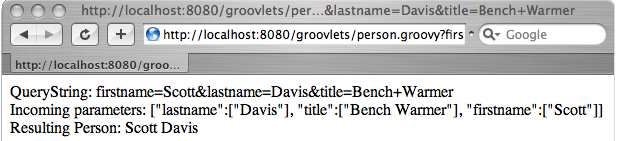

# 第9章 Web Services {#Web服务}

Web服务如今无处不在。作为一个行业，一旦我们发现XML可以通过HTTP和HTML传递，我们就进入了面向服务的体系结构(SOA)的新时代。这种从远程数据源获取数据的新方法意味着开发人员必须理解底层TCP/IP和HTTP的机制，以及各种更高层的XML方言:SOAP、REST和XML-RPC。幸运的是，Groovy在所有方面都帮助了我们。

在本章中，我们将从如何确定本地`TCP/IP`地址和域名以及远程系统的域名的底层基础知识开始。我们将向上移动到HTTP—学习如何以编程方式获取、发布、放置和删除。我们将以如何发送和接收SOAP消息、XML-RPC消息和RESTful请求的示例结束本章。我们甚至还将解析一些逗号分隔值(CSV)数据，这只是为了满足以前的需要。

## 9.1 Finding Your Local IP Address and Name {#查找您的本地IP地址和名称}
```groovy
InetAddress.localHost.hostAddress
===> 63.246.7.76

InetAddress.localHost.hostName
===> myServer

InetAddress.localHost.canonicalHostName
===> www.aboutgroovy.com
```
在你能和别人交流之前，了解自己总是有帮助的。在这个示例中，您将发现您的IP地址、您的本地主机名和供其他用户使用的DNS名称。

InetAddress类来自`java.net`包。 您不能直接实例化InetAddress类`def addr=new InetAddress()`，因为构造函数是私有的。 但是，您可以使用几种不同的静态方法来返回格式正确的InetAddress。 这里讨论了获取本地信息的`getLocalHost()`方法； 下一页中的第9.2节“查找远程IP地址和域名”中讨论了用于获取远程信息的`getByName()`和`getAllByName()`。

`getLocalHost()`方法返回一个InetAddress，它表示本地主机或运行其的硬件。 如第72页的第4.2节“ Getter和Setter快捷方式语法”中所述，`getLocalHost()`可在Groovy中缩短为`localHost`。 一旦有了`localHost`的句柄，就可以调用`getHostAddress()`来获取IP地址，或者可以调用`getHostName()`来获取本地计算机名称。 该名称是系统的专用名称，与在DNS中注册的名称相对，世界其他地方都可以看到。 调用`getCanonicalHostName()`执行DNS查找。

当然，正如在第89页的5.4节，运行Shell命令中所讨论的，操作系统附带的常用命令行工具仅需`execute()`就可使用。 它们可能不像InetAddress方法那样容易解析，但是如您所见，它们公开了更多细节。
```groovy
// available on all operating systems
"hostname".execute().text
===> myServer

// on Unix/Linux/Mac OS X
println "ifconfig".execute().text
===>
en2: flags=8963<UP,BROADCAST,SMART,RUNNING,PROMISC,SIMPLEX,MULTICAST> mtu 1500
    inet6 fe80::21c:42ff:fe00:0%en2 prefixlen 64 scopeid 0x8
    inet 10.37.129.3 netmask 0xffffff00 broadcast 10.37.129.255
    ether 00:1c:42:00:00:00
    media: autoselect status: active
    supported media: autoselect

// on Windows
println "ipconfig /all".execute().text
===>
Windows IP Configuration
    Host Name . . . . . . . . . . . . : scottdavis1079
    Primary Dns Suffix . . . . . . . :
    Node Type . . . . . . . . . . . . : Unknown
    IP Routing Enabled. . . . . . . . : No
    WINS Proxy Enabled. . . . . . . . : No

Ethernet adapter Local Area Connection:
    Connection-specific DNS Suffix . :
    Description . . . . . . . . . . . : Parallels Network Adapter
    Physical Address. . . . . . . . . : 00-61-20-5C-3B-B9
    Dhcp Enabled. . . . . . . . . . . : Yes
    Autoconfiguration Enabled . . . . : Yes
    IP Address. . . . . . . . . . . . : 10.211.55.3
    Subnet Mask . . . . . . . . . . . : 255.255.255.0
    Default Gateway . . . . . . . . . : 10.211.55.1
    DHCP Server . . . . . . . . . . . : 10.211.55.1
    DNS Servers . . . . . . . . . . . : 10.211.55.1
    Lease Obtained. . . . . . . . . . : Tuesday, October 09, 2007 2:53:02 PM
    Lease Expires . . . . . . . . . . : Tuesday, October 16, 2007 2:53:02 PM
```

## 9.2 Finding a Remote IP Address and Domain Name {#查找远程IP地址和域名}
```groovy
InetAddress.getByName("www.aboutgroovy.com")
===> www.aboutgroovy.com/63.246.7.76

InetAddress.getAllByName("www.google.com").each{println it}
===>
www.google.com/64.233.167.99
www.google.com/64.233.167.104
www.google.com/64.233.167.147

InetAddress.getByName("www.google.com").hostAddress
===> 64.233.167.99

InetAddress.getByName("64.233.167.99").canonicalHostName
===> py-in-f99.google.com
```

除了返回有关本地计算机的信息外，您还可以使用InetAddress查找有关远程`systems.getByName()`的信息，该格式返回格式良好的InetAddress对象，该对象代表远程`systems.getByName()`接受任一域名 （例如`www.aboutgroovy.com`）或IP位址（例如`64.233.167.99`）。 一旦拥有了系统的句柄，就可以要求其`hostAddress`和`canonicalHostName`。

有时，DNS名称可以解析为许多不同的IP地址。 对于繁忙的网站尤其如此，这些网站在许多物理服务器之间实现了负载平衡。 如果DNS名称解析为多个IP地址，则`getByName()`将返回列表中的第一个IP地址，而`getAllByName()`将返回所有这些IP地址。

当然，您也可以使用通常的命令行工具来查询远程系统：
```groovy
// on Unix/Linux/Mac OS X
println "dig www.aboutgroovy.com".execute().text
===>
; <<>> DiG 9.3.4 <<>> www.aboutgroovy.com
;; global options: printcmd
;; Got answer:
;; ->>HEADER<<- opcode: QUERY, status: NOERROR, id: 55649
;; flags: qr rd ra; QUERY: 1, ANSWER: 1, AUTHORITY: 2, ADDITIONAL: 2

;; QUESTION SECTION:
;www.aboutgroovy.com. IN A

;; ANSWER SECTION:
www.aboutgroovy.com. 300 IN A 63.246.7.76

;; AUTHORITY SECTION:
aboutgroovy.com. 82368 IN NS ns1.contegix.com.
aboutgroovy.com. 82368 IN NS ns2.contegix.com.
;; ADDITIONAL SECTION:
ns1.contegix.com. 11655 IN A 63.246.7.200
ns2.contegix.com. 11655 IN A 63.246.22.100

;; Query time: 204 msec
;; SERVER: 66.174.92.14#53(66.174.92.14)
;; WHEN: Tue Oct 9 15:16:16 2007
;; MSG SIZE rcvd: 130

// on Windows
println "nslookup www.aboutgroovy.com".execute().text
===>
Server: UnKnown
Address: 10.211.55.1

Name: www.aboutgroovy.com
Address: 63.246.7.76
```

## 9.3 Making an HTTP GET Request {#发出HTTP GET请求}
```groovy
def page = new URL("http://www.aboutgroovy.com").text
===>
<html><head><title>...

new URL("http://www.aboutgroovy.com").eachLine{line ->
  println line
}

===>
<html>
<head>
<title>
...
```

获取HTML页面内容的最简单方法是在URL上调用`getText()`。 这使您可以将整个响应存储在String变量中。 如果页面太大而不能舒适地执行此操作，则还可以使用`eachLine()`逐行遍历响应。

Groovy在`java.lang.String`中添加了一个`toURL()`方法，使您可以使用稍微简化一些的语法来发出相同的请求：
```javascript
"http://www.aboutgroovy.com".toURL().text
"http://www.aboutgroovy.com".toURL().eachLine{...}
```

我们将讨论如何简化此过程，以使您可以简单地在第198页上的第10.11节“将方法动态添加到类（ExpandoMetaClass）”中调用`"http://www.aboutgroovy.com".get()`。

**根据HTTP响应代码处理请求**
```groovy
def url = new URL("http://www.aboutgroovy.com")
def connection = url.openConnection()
if(connection.responseCode == 200){
  println connection.content.text
} else{
  println "An error occurred:"
  println connection.responseCode
  println connection.responseMessage
}
```

直接在URL对象上调用`getText()`意味着您希望一切顺利—没有连接超时，没有404，等等。 尽管您的乐观态度值得称赞，但是如果您想编写稍微更多的容错代码，则应该在URL上调用`openConnection()`。

这将返回一个`java.net.URLConnection`对象，该对象使您可以对URL对象进行更详细的工作。 `connection.content.text`返回与`url.text`相同的信息，同时使您可以对200或404的响应进行更多的自省-`connection.responseCode`； `connection.responseMessage`用于OK或找不到文件。

**获取HTTP响应元数据**
```groovy
def url = new URL("http://www.aboutgroovy.com")
def connection = url.openConnection()
connection.responseCode
===> 200
connection.responseMessage
===> OK
connection.contentLength
===> 4216
connection.contentType
===> text/html
connection.date
===> 1191250061000
connection.expiration
===> 0
connection.lastModified
===> 0

connection.headerFields.each{println it}
===>
Content-Length=[4216]
Set-Cookie=[JSESSIONID=3B2DE7CBDAE3D58EC46D5A8DF5AF89D1; Path=/]
Date=[Mon, 01 Oct 2007 14:47:41 GMT]
null=[HTTP/1.1 200 OK]
Server=[Apache-Coyote/1.1]
Content-Type=[text/html]
```
一旦拥有`URLConnection`的句柄，就可以完全访问随附的响应元数据。 除了`responseCode`和`responseMessage`之外，您还可以请求诸如`contentLength`和`contentType`之类的东西，甚至可以逐个迭代每个响应头。

**创建便捷的GET类**
```groovy
class Get{
  String url
  String queryString
  URLConnection connection
  String text
  
  String getText(){
    def thisUrl = new URL(this.toString())
    connection = thisUrl.openConnection()
    if(connection.responseCode == 200){
      return connection.content.text
    } else{
      return "Something bad happened\n" +
      "URL: " + this.toString() + "\n" +
      connection.responseCode + ": " +
      connection.responseMessage
    }
  }

  String toString(){
    return url + "?" + queryString
  }
}

def get = new Get(url:"http://search.yahoo.com/search")
get.queryString = "p=groovy"
println get
===> http://search.yahoo.com/search?p=groovy

println get.text
===> <html><head>...

get.url = "http://www.yahoo.com/no.such.page"
println get.text
===>
Something bad happened
URL: http://www.yahoo.com/no.such.page?p=groovy
404: Not Found
```

到目前为止，您已经编写了一些非常程序化的代码[^901]。它确实完成了工作，但是在缺乏可重用性方面，它只受到一点点影响。(你敢说“复制粘贴”是一种有效的重用吗?你是一个优秀的面向对象程序员——你怎么能想到这样的事情呢?)这个自定义Get类将您到目前为止学到的所有东西包装成可重用的东西。它有一个很好的简单接口，并隐藏了足够多的HttpConnection复杂性，因此值得您花时间去使用它。

现在，没有什么比`"http://www.aboutgroovy.com".toURL().text`更简单的了。与之相对的是`Jakarta Commons HttpClient`[^902]，这是一个非常完整的库，比我自己一个人的库要完整得多。当然，缺点是向项目添加了另一个依赖项。自定义Get类很好地分割了这种差异。它比`"". tourl().text`稍微健壮一些，但它是在纯Groovy中实现的，因此不必担心类路径中的JAR膨胀。

还有一件事：Get类增加了对查询字符串的支持。 这是名称/值对的集合，可以将其附加到URL的末尾以进一步对其进行自定义。 有关更多信息，请参见第9.4节，使用查询字符串。

**RESTful GET请求**
```groovy
"http://search.yahooapis.com/WebSearchService/V1/webSearch?
appid=YahooDemo&query=groovy&results=10".toURL().text

//alternately, using our Get class
def get = new Get()
get.url = "http://search.yahooapis.com/WebSearchService/V1/webSearch"
get.queryString = "appid=YahooDemo&query=groovy&results=10"
def results = get.text
```

RESTful Web服务是一种Web服务。 REST代表代表性状态转移[^903]。 尽管对于真正意义上的RESTful的含义有多种不同的解释，但通常公认的是，返回XML结果（与HTML或其他数据格式相对）的HTTP GET请求构成了RESTful Web服务的最简单形式。

Yahoo提供了一个RESTful API [^904]，该API以XML返回查询结果。 此查询返回搜索词groovy的前十个匹配。 有关此查询的结果及其解析方法，请参阅第9.1页的第9.12节“将Yahoo Search结果解析为XML”。

## 9.4 Working with Query Strings {#使用查询字符串}
```javascript
"http://search.yahoo.com/search?p=groovy".toURL().text
```

查询字符串允许您通过在地址末尾添加名称/值对来发出更复杂的HTTP GET请求。 现在，您不仅可以在`http://search.yahoo.com`上请求一个静态页面，还可以对包含groovy一词的所有页面进行动态查询。

Web从简单的分布式文件系统转换为完全可编程的Web [^905]。 以编程方式发出HTTP GET请求的机制没有改变，这没有比我们在第155页的9.3节“发出HTTP GET请求”中讨论的复杂。

但是，使用查询字符串的语义为编程可能性开辟了一个全新的世界。

例如，可以在单个URL中捕获复杂的网页，例如显示丹佛国际机场的Google地图。 这意味着我们只需单击页面右上角的“链接到此页面”，就可以对其进行超链接，添加书签或将其通过电子邮件发送给朋友。 查询字符串中的每个元素代表地图的不同方面：ll代表地图的纬度/经度中心点（39.87075，-104.694214），z代表缩放级别（11），t代表类型（h或混合） ），依此类推。
```javascript
"http://maps.google.com/maps?f=q&hl=en&geocode=&time=&date=&ttype=
&q=dia&sll=37.0625,-95.677068&sspn=34.038806,73.125&ie=UTF8
&ll=39.87075,-104.694214&spn=0.2577,0.571289&z=11&iwloc=addr&om=1&t=h"
.toURL().text
```

**从列表构建查询字符串**
```groovy
def queryString = []
queryString << "n=" + URLEncoder.encode("20")
queryString << "vd=" + URLEncoder.encode("m3")
queryString << "vl=" + URLEncoder.encode("lang_en")
queryString << "vf=" + URLEncoder.encode("pdf")
queryString << "p=" + URLEncoder.encode("groovy grails")

def address = "http://search.yahoo.com/search"
def url = new URL(address + "?" + queryString.join("&"))
println url
===>
http://search.yahoo.com/search?n=20&vd=m3&vl=lang_en&vf=pdf&p=groovy+grails

println url.text
```

通常，您需要负责从任意数据值集合中组装格式正确的查询字符串。 秘诀是确保值是经过URL编码的[^906]（"foo bar baz" ==> "foo+bar+baz"），而名称部分（nonsense =）仍为纯文本。 如果尝试将名称和值URL编码为单个字符串（“unsense=foo bar baz”），则等号（=）将转换为`%3D`，并且您的Web服务器很可能会拒绝该请求。

本示例创建一个`名称/值对`列表，确保仅使用`java.net.URLEncoder`对值进行URL编码。 稍后，当您需要格式正确的查询字符串时，请调用`queryString.join("&")`。 正如我们在第3.14节“连接”（第60页）中讨论的那样，它以单个字符串的形式返回列表，每个元素都与您作为参数传入的字符串连接在一起。

通过执行高级Yahoo搜索并从结果URL中挑选有趣的名称/值对来构建此特定的查询字符串。 n返回二十个结果，而不是默认的十个结果。 vd将结果限制为过去三个月中发布的结果。 vl仅返回英文页面。 vf仅过滤PDF文档的结果。 最后，p寻找提到异常或粗糙的结果。

**从Map构建查询字符串**
```groovy
def map = [n:20, vf:"pdf", p:"groovy grails"]
def list = []
map.each{name,value->
  list << "$name=" + URLEncoder.encode(value.toString())
}
println list.join("&")
===> n=20&vf=pdf&p=groovy+grails
```

Groovy Maps是表示查询字符串的一种很好的方法，因为两者自然都有名称/值对。 此示例仍然使用临时List存储URL编码的值，并使用`join("&")`在最后一分钟将它们放在一起。

有一种极端的情况使它不能成为100％的解决方案。 查询字符串允许具有重复的命名元素，而Map强制使用唯一的名称。
```javascript
http://localhost/order?book=Groovy+Recipes&book=Groovy+In+Action
```
如果您可以忍受此限制，那么Maps是完美的解决方案。 如果需要支持重复的命名元素，请参见部分9.4，创建便捷QueryString类以获取更多信息。

**创建一个便捷的QueryString类**
```groovy
class QueryString{
  Map params = [:]
  
  //this constructor allows you to pass in a Map
  QueryString(Map params){
    if(params){
      this.params.putAll(params)
    }
  }
  
  //this method allows you to add name/value pairs
  void add(String name, Object value){
    params.put(name, value)
  }
  
  //this method returns a well-formed QueryString
  String toString(){
    def list = []
    params.each{name,value->
      list << "$name=" + URLEncoder.encode(value.toString())
    }
    return list.join("&")
  }
}

def qs = new QueryString(n:20, vf:"pdf", p:"groovy grails")
println qs
===> n=20&vf=pdf&p=groovy+grails

def qs2 = new QueryString()
qs2.params.put("firstname", "Scott")
qs2.add("id", 99)
qs2.add "updated", new Date()
println qs2
===> firstname=Scott&id=99&updated=Wed+Oct+10+20%3A17%3A34+MDT+2007
```

创建便捷类可以使您将构建格式正确的查询字符串的机制封装到可重用的组件中。

qs对象在构造函数中接受名称/值对，这些名称/值对被强制转换成映射。(您也可以将现有的映射传递给构造函数。)qs2对象演示了三种不同的方法来传递名称/值对——通过使用方便的带括号的`add()`方法直接访问params映射，最后通过调用相同的`add()`方法，同时利用Groovy的可选括号。

注意，`add()`方法接受值的对象。这允许您存储整数和类等值，而不是简单的字符串。调用`URLEncoder.encode(value.toString())`确保正确地将值插入查询字符串。

将查询字符串与第9.3节中创建的Get类组合在一起，创建一个方便的Get类，在第157页开始展示用很少的代码就可以组装的能力——Get和QueryString之间的代码不到50行。
```groovy
class Get{
  String url
  QueryString queryString = new QueryString()
  URLConnection connection
  String text
  
  String getText(){
    def thisUrl = new URL(this.toString())
    connection = thisUrl.openConnection()
    if(connection.responseCode == 200){
      return connection.content.text
    } else{
      return "Something bad happened\n" +
             "URL: " + this.toString() + "\n" +
             connection.responseCode + ": " +
             connection.responseMessage
    }
  }
  
  String toString(){
    return url + "?" + queryString.toString()
  }
}
def get = new Get(url:"http://search.yahoo.com/search")
get.queryString.add("n", 20)
get.queryString.add("vf", "pdf")
get.queryString.add("p", "groovy grails")

println get
===> http://search.yahoo.com/search?n=20&vf=pdf&p=groovy+grails

println get.text
===> <html><head>...
```

请注意，将您的queryString字段从String升级到完整的QueryString对象仅需要在两个位置接触Get类。 现在，该字段声明将创建一个新的`QueryString()`，并使用`toString()`方法调用`queryString.toString()`。 现在，此升级使您可以让Get类创建格式正确的QueryString，而不是强迫您自己创建一个。 诸如`get.queryString.add("p","groovy grails")`之类的调用在幕后做了正确的事情，确保值正确地进行了URL编码。

还记得我们在第161页的第9.4节“从映射中构建查询字符串”中讨论的查询字符串/哈希映射不匹配吗？ 因为QueryString类当前已实现，所以对`qs.add()`的每次调用都会替换名称/值对。 为了支持重复的命名元素，如果名称存在，则需要重构QueryString类以将值追加到List。 有关如何添加此功能的想法，请参阅第193页，第10.8节“调用不存在的方法（invokeMethod）”。

## 9.5 Making an HTTP POST Request {#发出HTTP POST请求}
```groovy
def url = new URL("http://search.yahoo.com/search")
def connection = url.openConnection()

//switch the method to POST (GET is the default)
connection.setRequestMethod("POST")

//write the data
def queryString = "n=20&vf=pdf&p=groovy+grails"
connection.doOutput = true
Writer writer = new OutputStreamWriter(connection.outputStream)
writer.write(queryString)
writer.flush()
writer.close()
connection.connect()

//print the results
println connection.content.text
===> <html><head>...
```

发出HTTP POST请求时，不能在URL类上使用与进行GET请求时相同的`getText()`快捷方式。 您必须获取URLConnection，以便可以将请求方法设置为POST（默认为GET）。 对于GET请求，查询字符串将附加到URL对象的末尾。 相反，POST的查询字符串嵌入在请求的主体中。 为此，您必须做三件事：将URLConnection的doOutput值设置为true，获取outputStream，并在调用`connect()`之前向其中写入查询字符串。

**从列表构建查询字符串**
```groovy
def queryString = []
queryString << "n=" + URLEncoder.encode("20")
queryString << "vf=" + URLEncoder.encode("pdf")
queryString << "p=" + URLEncoder.encode("groovy grails")

def url = new URL("http://search.yahoo.com/search")
def connection = url.openConnection()
connection.setRequestMethod("POST")
connection.doOutput = true
Writer writer = new OutputStreamWriter(connection.outputStream)
writer.write(queryString.join("&"))
writer.flush()
writer.close()
connection.connect()

def results = conn.content.text
```

正如在第160页的第9.4节“从列表中构建查询字符串”中所讨论的那样，从列表中构建查询字符串的秘诀是确保值经过URL编码，然后将元素与`&`连在一起。

**创建一个便利的Post类**
```groovy
class Post{
  String url
  QueryString queryString = new QueryString()
  URLConnection connection
  String text
  
  String getText(){
    def thisUrl = new URL(url)
    connection = thisUrl.openConnection()
    connection.setRequestMethod("POST")
    connection.doOutput = true
    Writer writer = new OutputStreamWriter(connection.outputStream)
    writer.write(queryString.toString())
    writer.flush()
    writer.close()
    connection.connect()
    return connection.content.text
  }
  
  String toString(){
    return "POST:\n" +
           url + "\n" +
    queryString.toString()
  }
}

def post = new Post(url:"http://search.yahoo.com/search")
post.queryString.add("n", 20)
post.queryString.add("vf", "pdf")
post.queryString.add("p", "groovy grails")

println post
===>
POST:
http://search.yahoo.com/search
n=20&vf=pdf&p=groovy+grails

println post.text
===> <html><head>...
```
将所有复杂的连接逻辑放到Post类中（与您在9.4节，创建便捷QueryString类，在第161页中创建的QueryString类相结合），可以提供非常引人注目的开发经验。

**模拟HTML表单进行测试**
```xml
<form method="post" action="http://localhost:8888/jaw/controller">
  <input type="hidden" name="action" value="saveCar" />
  Make: <input type="text" name="make" value="" /></td>
  Model: <input type="text" name="model" value="" /></td>
  Year: <input type="text" name="modelYear" value="" /></td>
  <input type="submit" name="save" value="Save" />
</form>
```

现在您有了Post类，您可以轻松地使用代码来模拟HTML表单提交。 使用此HTML表单，您可以使用以下代码模拟用户填写表单并单击Submit按钮：
```groovy
def post = new Post(url:"http://localhost:8888/jaw/controller")
post.queryString.add("action", "saveCar")
post.queryString.add("make", "Toyota")
post.queryString.add("model", "Prius")
post.queryString.add("modelYear", 2012)
println post.text
```
此时剩下要做的就是在`post.text`上写断言，以验证表单提交是否正确执行。

**使用XML的RESTful POST请求**
```groovy
def xml = """<car>
  <make>Toyota</make>
  <model-year>2012</model-year>
  <model>Prius</model>
</car>"""

def url = new URL("http://localhost:8888/jaw/car")
def connection = url.openConnection()

//set the metadata
connection.setRequestMethod("POST")
connection.setRequestProperty("Content-Type","application/xml")

//write the data
connection.doOutput = true
Writer writer = new OutputStreamWriter(connection.outputStream)
writer.write(xml)
writer.flush()
writer.close()
connection.connect()
def results = connection.content.text
```

在RESTful Web服务中，用于请求的HTTP动词具有深层的语义。 常见的数据库隐喻-创建，检索，更新，删除（CRUD）-同样适用于RESTful应用程序[^907]， 尽管SQL语句中使用的动词并不相同。 您对数据库执行的SELECT类似于HTTP GET。 您将记录插入表中，类似于将表单数据POST到网站中。 HTTP PUT等效于数据库UPDATE。 DELETE是最令人惊讶的，它在SQL和HTTP中具有相同的含义。

RESTful Web服务通常期望POST主体中包含XML，而不是到目前为止展示的查询字符串。 要传递XML，您需要对代码进行两个小的更改。 首先，您很可能需要将`Content-Type`从`application/www-form-urlencoded`（POST的默认设置）更改为`application/xml`。 （确切的Content-Type取决于您正在调用的RESTful服务。）您需要做的另一件事不是对数据进行URL编码, XML有效负载应以其本机格式传输。 有关POST XML的另一个示例，请参见第9.10节，发出SOAP请求，第172页。

## 9.6 Making an HTTP PUT Request {#发出HTTP PUT请求}
```groovy
def xml = """<car id="142">
  <make>Toyota</make>
  <model-year>2012</model-year>
  <model>Prius, Luxury Edition</model>
</car>"""

def url = new URL("http://localhost:8888/jaw/car/142")
def connection = url.openConnection()
connection.setRequestMethod("PUT")
connection.setRequestProperty("Content-Type","application/xml")
connection.doOutput = true
Writer writer = new OutputStreamWriter(connection.outputStream)
writer.write(xml)
writer.flush()
writer.close()
connection.connect()

def result = connection.content.text
```

执行HTTP PUT在语法上与执行POST相同，但有一个例外-`connection.setRequestMethod("PUT")`。 如上一节中的第9.5节“使用XML进行RESTful POST请求”中所述，PUT在语义上是UPDATE，而POST等效于SQL INSERT。 本示例将模型描述更新为包括“豪华版”。

**创建一个方便的Put类**
```groovy
class Put{
  String url
  String body
  String contentType = "application/xml"
  URLConnection connection
  String text

  String getText(){
    def thisUrl = new URL(url)
    connection = thisUrl.openConnection()
    connection.setRequestMethod("PUT")
    connection.setRequestProperty("Content-Type", contentType)
    connection.doOutput = true
    Writer writer = new OutputStreamWriter(connection.outputStream)
    writer.write(body)
    writer.flush()
    writer.close()
    connection.connect()
    return connection.content.text
  }
  
  String toString(){
    return "PUT:\n" +
            contentType + "\n" +
            url + "\n" +
            body
  }
}

def xml = """<car id="142">
  <make>Toyota</make>
  <model-year>2012</model-year>
  <model>Prius, Luxury Edition</model>
</car>"""

def put = new Put(url:"http://localhost:8888/jaw/car/142")
put.body = xml
println put
===>
PUT:
application/xml
http://localhost:8888/jaw/car/142
<car id="142">
  <make>Toyota</make>
  <model-year>2012</model-year>
  <model>Prius, Luxury Edition</model>
</car>
def result = put.text
```
Put类与Post类几乎相同，但具有三个区别。 将queryString字段交换为普通的String字段。 另外，您公开一个contentType字段，以便您可以根据需要进行更改。 最后，将requestMethod设置为PUT。

## 9.7 Making an HTTP DELETE Request {#发出HTTP DELETE请求}
```
def url = new URL("http://localhost:8888/jaw/car/142")
def connection = url.openConnection()
connection.setRequestMethod("DELETE")
connection.connect()
def result = connection.content.text
```
执行HTTP DELETE在语法上与执行GET相同，但有一个例外-`connection.setRequestMethod("DELETE")`。 POST和PUT请求的正文中有数据，而GET和DELETE（以及HEAD，OPTION和其他HTTP动词）只有一个URL。 如第166页的第9.5节“使用XML进行RESTful POST请求”中所讨论的，DELETE完全按照您的期望执行操作-有效地从id=142的汽车中删除。

**创建一个方便的Delete类**
```groovy
class Delete{
  String url
  QueryString queryString = new QueryString()
  URLConnection connection
  String text
  
  String getText(){
    def thisUrl = new URL(this.toString())
    connection = thisUrl.openConnection()
    connection.setRequestMethod("DELETE")
    if(connection.responseCode == 200){
      return connection.content.text
    } else{
      return "Something bad happened\n" +
             "URL: " + this.toString() + "\n" +
             connection.responseCode + ": " +
             connection.responseMessage
    }
  }
  
  String toString(){
    return "DELETE:\n" +
    url + "?" + queryString.toString()
  }
}

def delete = new Delete(url:"http://localhost:8888/jaw/car/142")
println delete
===>
DELETE:
http://localhost:8888/jaw/car/142
def results = delete.text
```
Delete类与Get类几乎相同，但有一个区别:requestMethod设置为DELETE。

## 9.8 Making a RESTful Request {#发出RESTful请求}
```groovy
def partialRestRequest = "http://geocoder.us/service/rest/geocode?address="
def address = "1600 Pennsylvania Ave, Washington DC"
def restUrl = new URL(partialRestRequest + URLEncoder.encode(address))
def restResponse = restUrl.text
```
此请求以XML格式返回白宫的纬度/经度。 随意替换您自己的地址。 您可以通过访问`http://geocoder.us`或在任何主要地图网站的搜索框中键入坐标对来查看地图上的返回点。

**解析RESTful响应**
```groovy
//Response:
<rdf:RDF
  xmlns:dc="http://purl.org/dc/elements/1.1/"
  xmlns:geo="http://www.w3.org/2003/01/geo/wgs84_pos#"
  xmlns:rdf="http://www.w3.org/1999/02/22-rdf-syntax-ns#">
  <geo:Point rdf:nodeID="aid76408515">
    <dc:description>
      1600 Pennsylvania Ave NW, Washington DC 20502
    </dc:description>
    <geo:long>-77.037684</geo:long>
    <geo:lat>38.898748</geo:lat>
  </geo:Point>
</rdf:RDF>

def restResponse = restUrl.text
def RDF = new XmlSlurper().parseText(restResponse)
println RDF.Point.description
println RDF.Point.long
println RDF.Point.lat
```

XmlSlurper允许您避免处理名称空间并提取相关字段。 有关更多信息，请参见第7.9节“使用命名空间解析XML文档”。

::: alert-info
**Web服务案例研究：Geocoder.us**
如果您曾经使用过Google Maps*， Yahoo! 地图†，MapQuest‡，Microsoft LiveSearch§或任何其他地图网站，您一直在使用Web服务，甚至没有意识到它。 您键入站点的地址（例如，123 Main St.）本身并不是可映射的。 要在地图上绘制地址，必须将街道地址转换为纬度/经度点。 进行这种转换的Web服务类型称为地址解析器。

所有主要的地图网站都提供地理编码API，但是有一个独立的地理编码网站在本章的一些示例中起着重要作用。Geocoder.us¶可以很好地用作上一页第9.8节“发出RESTful请求”的草料； 第9.9节“发出CSV请求”； 下一页上的第9.10节，发出SOAP请求； 以及第9.1页的发出XML-RPC请求，第174页。这是因为它使您可以使用各种不同的Web服务方言进行相同的基本查询。 Geocoder.us是一项基于美国人口普查局提供的免费数据的非商业性免费服务。

在撰写本文时，Geocoder.us还不支持其他几种格式-RSS和Atom。 您可以访问AboutGroovy.com，以获取有关它们的真实示例，但是如果Geocoder.us有时将这些格式添加到组合中，请不要感到惊讶。 GeoRSS和GeoAtom都存在并且越来越流行。 例如，Flickr，k在每个搜索结果页面的底部都提供了GeoRSS提要。

∗. http://maps.google.com
†. http://maps.yahoo.com
‡. http://www.mapquest.com
§. http://maps.live.com/
¶. http://geocoder.us
k. http://flickr.com
:::

## 9.9 Making a CSV Request {#发出CSV请求}
```groovy
def partialCsvRequest = "http://geocoder.us/service/csv/geocode?address="
def address = "1600 Pennsylvania Ave, Washington DC"
def csvUrl = new URL(partialCsvRequest + URLEncoder.encode(address))
def csvResponse = csvUrl.text
```
此请求以CSV格式返回白宫的纬度/经度。 随意替换您自己的地址。 您可以通过访问`http://geocoder.us`或在任何主要地图网站的搜索框中键入坐标对来查看地图上的返回点。

**解析CSV响应**
```groovy
//Response:
38.898748,-77.037684,1600 Pennsylvania Ave NW,Washington,DC,20502
39.
def csvResponse = csvUrl.text
def tokens = csvResponse.split(",")
println "Latitude: [${tokens[0]}]"
println "Longitude: [${tokens[1]}]"
println "Address: [${tokens[2]}]"
println "City: [${tokens[3]}]"
println "State: [${tokens[4]}]"
println "Zip: [${tokens[5]}]"
```
在结果字符串上调用`split(",")`可让您轻松访问各个字段。 有关解析CSV的更多信息，请参阅第148页，第8.14节“将CSV转换为XML”。

## 9.10 Making a SOAP Request {#发出SOAP请求}
```groovy
def address = "1600 Pennsylvania Av, Washington, DC"
def soapRequest = """<SOAP-ENV:Envelope
  xmlns:SOAP-ENV="http://schemas.xmlsoap.org/soap/envelope/"
  xmlns:xsi="http://www.w3.org/1999/XMLSchema-instance"
  xmlns:xsd="http://www.w3.org/1999/XMLSchema"
  xmlns:tns="http://rpc.geocoder.us/Geo/Coder/US/">
  <SOAP-ENV:Body>
    <tns:geocode
      SOAP-ENV:encodingStyle="http://schemas.xmlsoap.org/soap/encoding/">
        <location xsi:type="xsd:string">${address}</location>
    </tns:geocode>
  </SOAP-ENV:Body>
</SOAP-ENV:Envelope>"""

def soapUrl = new URL("http://geocoder.us/service/soap")
def connection = soapUrl.openConnection()

connection.setRequestMethod("POST")
connection.setRequestProperty("Content-Type","application/xml")
connection.doOutput = true
Writer writer = new OutputStreamWriter(connection.outputStream)
writer.write(soapRequest)
writer.flush()
writer.close()
connection.connect()
def soapResponse = connection.content.text
```
这将白宫的纬度/经度作为SOAP返回。 随意替换您自己的地址。 您可以通过访问`http://geocoder.us`或在任何主要地图网站的搜索框中键入坐标对来查看地图上的返回点。

您在这里看到的是通过直接发布SOAP信封来发出原始SOAP请求的方法。 您可以在`http://geocoder.us/dist/eg/clients/GeoCoder.wsdl`中找到此服务的WSDL文档。 拥有WSDL之后，您始终可以使用大多数SOAP框架附带的任何标准`wsdl2java/java2wsdl`实用程序。

**解析SOAP响应**
```groovy
//Response:
<?xml version="1.0" encoding="utf-8"?>
<SOAP-ENV:Envelope xmlns:xsi="http://www.w3.org/1999/XMLSchema-instance" xmlns:SOAP-ENC="http://schemas.xmlsoap.org/soap/encoding/" xmlns:SOAP-ENV="http://schemas.xmlsoap.org/soap/envelope/" xmlns:xsd="http://www.w3.org/1999/XMLSchema" SOAP-ENV:encodingStyle="http://schemas.xmlsoap.org/soap/encoding/">
  <SOAP-ENV:Body>
    <namesp9:geocodeResponse xmlns:namesp9="http://rpc.geocoder.us/Geo/Coder/US/">
      <geo:s-gensym111 xsi:type="SOAP-ENC:Array" xmlns:geo="http://rpc.geocoder.us/Geo/Coder/US/" SOAP-ENC:arrayType="geo:GeocoderAddressResult[1]">
        <item xsi:type="geo:GeocoderAddressResult">
          <number xsi:type="xsd:int">1600</number>
          <lat xsi:type="xsd:float">38.898748</lat>
          <street xsi:type="xsd:string">Pennsylvania</street>
          <state xsi:type="xsd:string">DC</state>
          <city xsi:type="xsd:string">Washington</city>
          <zip xsi:type="xsd:int">20502</zip>
          <suffix xsi:type="xsd:string">NW</suffix>
          <long xsi:type="xsd:float">-77.037684</long>
          <type xsi:type="xsd:string">Ave</type>
          <prefix xsi:type="xsd:string"/>
        </item>
      </geo:s-gensym111>
    </namesp9:geocodeResponse>
  </SOAP-ENV:Body>
</SOAP-ENV:Envelope>

def soapResponse = connection.content.text
def Envelope = new XmlSlurper().parseText(soapResponse)
println Envelope.Body.geocodeResponse.'s-gensym111'.item.long
println Envelope.Body.geocodeResponse.'s-gensym111'.item.lat

//since the array's name ('s-gensym111') changes with each request
// we can deal with it generically as such:
def itor = Envelope.Body.geocodeResponse.breadthFirst()
while(itor.hasNext()){
  def fragment = itor.next()
  if(fragment.name() == "item"){
    println fragment.lat
    println fragment.long
  }
}
```

XmlSlurper允许您避免处理名称空间并提取相关字段。 有关更多信息，请参见第7.9节“使用命名空间解析XML文档”。

Geocoder.us的SOAP接口有点不典型。 geocodeResponse的名称空间和其中的array元素的元素名称因响应而异。 这样就不可能将GPath硬编码到lat和long的深层元素上。 在我处理过的所有其他基于SOAP的Web服务中，元素名称和名称空间都很稳定，很少更改。

尽管有这些bug，我还是决定继续使用这个站点作为SOAP示例。能够用四种不同的方言对相同的服务提出相同的请求，再加上能够展示如何灵活地处理响应异常，这是一个意想不到的“好处”，这让人难以拒绝。因为我试图向您展示的是客户端代码，而不是规范的服务器端SOAP示例，所以我认为您可以忽略一两个障碍。

## 9.11 Making an XML-RPC Request {#发出XML-RPC请求}
```groovy
def address = "1600 Pennsylvania Av, Washington, DC"
def xmlrpcRequest = """<methodCall>
<methodName>geocode</methodName>
<params>
<param>
<value><string>${address}</string></value>
</param>
</params>
</methodCall>"""

def xmlrpcUrl = new URL("http://geocoder.us/service/xmlrpc")
def connection = xmlrpcUrl.openConnection()
connection.setRequestMethod("POST")
connection.setRequestProperty("Content-Type","application/xml")
connection.doOutput = true
Writer writer = new OutputStreamWriter(connection.outputStream)
writer.write(xmlrpcRequest)
writer.flush()
writer.close()
connection.connect()

def xmlrpcResponse = connection.content.text
```
该请求以XML-RPC的形式返回白宫的纬度/经度。 随意替换您自己的地址。 您可以通过访问`http://geocoder.us`或在任何主要地图网站的搜索框中键入坐标对来查看地图上的返回点。

**Parsing an XML-RPC Response**
```groovy
//Response:
<?xml version="1.0" encoding="UTF-8"?>
<methodResponse>
  <params>
    <param>
      <value>
        <array>
          <data>
            <value>
              <struct>
                <member>
                  <name>number</name>
                  <value>
                    <int>1600</int>
                  </value>
                </member>
                <member>
                  <name>lat</name>
                  <value>
                    <double>38.898748</double>
                  </value>
                </member>
                <member>
                  <name>street</name>
                  <value>
                    <string>Pennsylvania</string>
                  </value>
                </member>
                <member>
                  <name>state</name>
                  <value>
                    <string>DC</string>
                  </value>
                </member>
                <member>
                  <name>city</name>
                  <value>
                    <string>Washington</string>
                  </value>
                </member>
                <member>
                  <name>zip</name>
                  <value>
                    <int>20502</int>
                  </value>
                </member>
                <member>
                  <name>suffix</name>
                  <value>
                    <string>NW</string>
                  </value>
                </member>
                <member>
                  <name>long</name>
                  <value>
                    <double>-77.037684</double>
                  </value>
                </member>
                <member>
                  <name>type</name>
                  <value>
                    <string>Ave</string>
                  </value>
                </member>
                <member>
                  <name>prefix</name>
                  <value>
                    <string/>
                  </value>
                </member>
              </struct>
            </value>
          </data>
        </array>
      </value>
    </param>
  </params>
</methodResponse>


def xmlrpcResponse = connection.content.text
def methodResponse = new XmlSlurper().parseText(xmlrpcResponse)
methodResponse.params.param.value.array.data.value.struct.member.each{member ->
  if(member.name == "lat" || member.name == "long"){
    println "${member.name}: ${member.value.double}"
  }
}
```
XmlSlurper允许您避免处理名称空间并提取相关字段。 有关更多信息，请参见第7.9节“使用命名空间解析XML文档”。 尽管嵌套响应的深度几乎是可笑的（您的目标经纬度和长元素深度为11个级别），但您仍可以轻松地找到它们并打印结果。

## 9.12 Parsing Yahoo Search Results as XML {#将Yahoo搜索结果解析为XML}
```groovy
def yahooAddress = "http://search.yahooapis.com/WebSearchService/V1/webSearch?"
def queryString = "appid=YahooDemo&query=groovy&results=10"
def xmlResponse = "${yahooAddress}${queryString}".toURL().text
```
如第159页的第9.3节“ RESTful GET请求”中所述，Yahoo提供了一个RESTful API，该API以XML而不是通常的HTML格式返回搜索结果。 您可以通过简单地调整查询字符串上的名称/值对，以多种方式调整查询。

**解析XML Yahoo搜索结果**
```groovy
//Response:
<ResultSet xmlns:xsi="http://www.w3.org/2001/XMLSchema-instance" xmlns="urn:yahoo:srch" xsi:schemaLocation="urn:yahoo:srch
http://api.search.yahoo.com/WebSearchService/V1/WebSearchResponse.xsd" type="web" totalResultsAvailable="20700000" totalResultsReturned="10" firstResultPosition="1" moreSearch="/WebSearchService/V1/webSearch?query=groovy&amp;appid=YahooDemo">
  <Result>
    <Title>Groovy - Home</Title>
    <Summary>Groovy ... </Summary>
    <Url>http://groovy.codehaus.org/</Url>
    <ClickUrl>http://uk.wrs.yahoo.com/</ClickUrl>
    <DisplayUrl>groovy.codehaus.org/</DisplayUrl>
    <ModificationDate>1191394800</ModificationDate>
    <MimeType>text/html</MimeType>
    <Cache>
      <Url>http://uk.wrs.yahoo.com/</Url>
      <Size>39661</Size>
    </Cache>
  </Result>
</ResultSet>

def ResultSet = new XmlSlurper().parseText(xmlResponse)
ResultSet.Result.each{
  println it.Title
  println it.Url
  println "-----"
}
===>
Groovy - Home
http://groovy.codehaus.org/
-----
Groovy - Wikipedia, the free encyclopedia
http://en.wikipedia.org/wiki/Groovy
-----
...
```
XmlSlurper允许您避免处理名称空间并提取相关字段。 有关更多信息，请参见第7.9页的第7.9节“使用命名空间解析XML文档”。

##9.13 Parsing an Atom Feed {#解析Atom Feed}
```
def atom = "http://aboutgroovy.com/item/atom".toURL().text
```
为`AboutGroovy.com`获取Atom[^908]联合feed是很简单的。由于它是一个简单的HTTP GET，甚至不需要查询字符串，与我们必须经历的发布SOAP请求的英勇步骤相比，它似乎有点虎头蛇尾。
```groovy
//Response:
<feed xmlns="http://www.w3.org/2005/Atom">
  <title type="text">aboutGroovy.com</title>
  <link rel="alternate" type="text/html" href="http://aboutGroovy.com"/>
  <link rel="self" type="application/atom+xml" href="http://aboutGroovy.com/item/atom"/>
  <updated>2007-10-10T13:15:23-07:00</updated>
  <author>
    <name>Scott Davis</name>
  </author>
  <id>tag:aboutgroovy.com,2006-12-18:thisIsUnique</id>
  <generator uri="http://aboutGroovy.com" version="0.0.2">
Hand-rolled Grails code</generator>
  <entry xmlns='http://www.w3.org/2005/Atom'>
    <author>
      <name>Scott Davis</name>
    </author>
    <published>2007-10-10T10:44:48-07:00</published>
    <updated>2007-10-10T10:44:48-07:00</updated>
    <link href='http://aboutGroovy.com/item/show/258' rel='alternate' title='G2One, Inc. -- Professional Support for Groovy and Grails' type='text/html'/>
    <id>tag:aboutgroovy.com,2006:/item/show/258</id>
    <title type='text'>
G2One, Inc. -- Professional Support for Groovy and Grails
</title>
    <content type='xhtml'>
      <div xmlns='http://www.w3.org/1999/xhtml'>
        <p>Category: news</p>
        <p>
          <a href='http://www.g2one.com/'>Original Source</a>
        </p>
        <p>Groovy and Grails now have a corporate home -- G2One. The project
leads for both Groovy and Grails (Guillaume Laforge and Graeme
Rocher) have joined forces with Alex Tkachman (until recently
with JetBrains) to form a new company.</p>
      </div>
    </content>
  </entry>
</feed>


def feed = new XmlSlurper().parseText(atom)
feed.entry.each{
  println it.title
  println it.published
  println "-----"
}

===>
SAP Adds Groovy/Grails Support
2007-10-10T10:52:21-07:00
-----
G2One, Inc. -- Professional Support for Groovy and Grails
2007-10-10T10:44:48-07:00
-----
...
```
XmlSlurper允许您避免处理名称空间并提取相关字段。有关更多信息，请参见第132页第7.9节“使用名称空间解析XML文档”。

Atom是REST的一种实现，它已经超越了简单的Blogsphere联合组织而受到欢迎。 Google于2006年12月正式弃用了其SOAP API。根据GData [^909]的倡议，它将所有Web服务迁移到Atom。 有关完全RESTful API（包含使用HTTP GET，POST，PUT和DELETE进行身份验证和完整CRUD的示例）的充分记录的示例，请参阅Google Calendar API。

有关如何创建Atom提要的信息，请参见第12.4节，设置Atom提要，见第239页。

## 9.14 Parsing an RSS Feed {#解析RSS Feed}
```groovy
def rssFeed = "http://aboutgroovy.com/podcast/rss".toURL().text
```
获取RSS feed就像发出普通的旧的HTTP GET请求一样简单。
```groovy
//Response:
<rss xmlns:itunes="http://www.itunes.com/dtds/podcast-1.0.dtd" version="2.0">
  <channel>
    <title>About Groovy Podcasts</title>
    <link>http://aboutGroovy.com</link>
    <language>en-us</language>
    <copyright>2007 AboutGroovy.com</copyright>
    <itunes:subtitle>
Your source for the very latest Groovy and Grails news
</itunes:subtitle>
    <itunes:author>Scott Davis</itunes:author>
    <itunes:summary>About Groovy interviews</itunes:summary>
    <description>About Groovy interviews</description>
    <itunes:owner>
      <itunes:name>Scott Davis</itunes:name>
      <itunes:email>scott@aboutGroovy.com</itunes:email>
    </itunes:owner>
    <itunes:image href="http://aboutgroovy.com/images/aboutGroovy3.png"/>
    <itunes:category text="Technology"/>
    <itunes:category text="Java"/>
    <itunes:category text="Groovy"/>
    <itunes:category text="Grails"/>
    <item>
      <title>AboutGroovy Interviews Neal Ford</title>
      <itunes:author>Scott Davis</itunes:author>
      <itunes:subtitle></itunes:subtitle>
      <itunes:summary>Neal Ford of ThoughtWorks is truly a polyglot programmer.
In this exclusive interview, Neal opines on Groovy, Ruby, Java, DSLs, and the future of programming languages. Opinionated and entertaining, Neal
doesn't pull any punches. Enjoy.
</itunes:summary>
      <enclosure url="http://aboutgroovy.com/podcasts/NealFord.mp3" length="33720522" type="audio/mpeg"/>
      <guid>http://aboutgroovy.com/podcasts/NealFord.mp3</guid>
      <pubDate>2007-04-17T01:15:00-07:00</pubDate>
      <itunes:duration>44:19</itunes:duration>
      <itunes:keywords>java,groovy,grails</itunes:keywords>
    </item>
  </channel>
</rss>

def rss = new XmlSlurper().parseText(rssFeed)
rss.channel.item.each{
  println it.title
  println it.pubDate
  println it.enclosure.@url
  println it.duration
  println "-----"
}

===>
AboutGroovy Interviews Neal Ford
2007-04-17T01:15:00-07:00
http://aboutgroovy.com/podcasts/NealFord.mp3
44:19
-----
AboutGroovy Interviews Jeremy Rayner
2007-03-13T01:18:00-07:00
http://aboutgroovy.com/podcasts/JeremyRayner.mp3
50:54
-----
...
```

XmlSlurper允许您避免处理名称空间并提取相关字段。 有关更多信息，请参见第7.9节“使用命名空间解析XML文档”。

雅虎有许多RSS源，它们提供的不仅是简单的博客联合组织。 有关通过有线发送真实数据的RSS供稿的几个示例，请参见`http://developer.yahoo.com/weather/`以及`http://developer.yahoo.com/traffic/`。

# 第10章 Metaprogramming {#元编程}
Metaprogramming[^1001] is writing code that has the ability to dynamically change its behavior at runtime. (I’d like this class to have that method on it right now.) It gives a fluidity and flexibility to your code that can seem positively alien if you are steeped in static programming languages such as C or Java. Dynamic languages such as Smalltalk and Ruby have this capability, and now Groovy allows you to do the same type of thing within a Java environment.

No self-respecting dynamic language would be complete without the complementary idea of reflection[^1002]—the ability to programmatically ask itself about itself at runtime. (What fields does this class have? What methods will it respond to?) Although this is possible in Java by using the Reflection API, in practice it is rarely used. Some might argue that the concepts are less relevant in a statically typed language than a dynamically typed one—after all, once you define an interface in Java, why programmatically ask the interface which methods it defines? You already know the answer to the question a priori, and in Java the interface will never change. (Polymorphism is based on this concept.)

In Chapter 3, New to Groovy, on page 41, we discussed interesting add-ons to the Java language. Most developers already know what a java.util.ArrayList is, so pointing out the additional cool new methods is an exercise in working with a familiar class in a new way. Unless you’ve already been working with the Reflection API in Java or habitually instantiating all of your classes via Class.forName(), the ideas in this chapter might be a bit of a stretch in a new direction. (Why should you programmatically ask this class if it has a field or responds to a specific method—isn’t that what your compiler does for you?)

This chapter shows you ways to programmatically ask your class what fields and methods it has. We’ll also look at how to dynamically add new fields and methods at runtime via the MetaClass class. We’ll talk about calling methods that don’t exist using invokeMethod(). There are even objects called Expandos that are wholly created at runtime. Enjoy Groovy-style metaprogramming at its finest.

## 10.1 Discovering the Class
```groovy
def s = "Hello"
println s.class
===> java.lang.String
```
Every object in Java has a getClass() method. In Groovy, you can shorten the call to class. (See Section 4.2, Getter and Setter Shortcut Syntax, on page 72 for more on this.)

Notice in this example that you use duck typing to declare the variable s—def instead of String. Even so, the variable correctly identifies itself as a String when asked. (For more information, see Section 3.5, Optional Datatype Declaration (Duck Typing), on page 47.)

Once you have the class, you can ask it all sorts of interesting questions. For the record, all this is available to you via the boring old java.lang.Class class. Groovy just adds the each() syntactic sugar for iteration, as well as the default it variable. (For more information, see Section 3.14, List Shortcuts, on page 58.)
```groovy
String.constructors.each{println it}
===>
public java.lang.String()
public java.lang.String(char[])
public java.lang.String(byte[])
public java.lang.String(java.lang.StringBuffer)
public java.lang.String(java.lang.StringBuilder)
public java.lang.String(java.lang.String)
...

String.interfaces.each{println it}
===>
interface java.io.Serializable
interface java.lang.Comparable
interface java.lang.CharSequence
```

## 10.2 Discovering the Fields of a Class
```groovy
def d = new Date()
println d.properties
===> {month=8, day=6, calendarDate=2007-09-01T08:38:55.348-0600,
time=1188657535348, timeImpl=1188657535348, class=class java.util.Date,
timezoneOffset=360, date=1, hours=8, minutes=38, year=107,
julianCalendar=sun.util.calendar.JulianCalendar@d085f8, seconds=55}
```
Calling getProperties() on a class returns a java.util.HashMap of all the fields. For slightly prettier output, you can call each() on the HashMap. (Recall that it is the default iterator variable, as we discussed in Section 3.14, Iterating, on page 59.)
```groovy
d.properties.each{println it}
===>
month=8
day=6
calendarDate=2007-09-01T08:38:55.348-0600
time=1188657535348
timeImpl=1188657535348
class=class java.util.Date
timezoneOffset=360
date=1
hours=8
minutes=38
year=107
julianCalendar=sun.util.calendar.JulianCalendar@d085f8
seconds=55
```
Java offers you a way to do almost the same thing. Every java.lang.Class offers a getDeclaredFields() method that returns an array of java.lang.reflect.Field objects.
```groovy
d.class.declaredFields.each{println it}
===>
private static final sun.util.calendar.BaseCalendar java.util.Date.gcal
private static sun.util.calendar.BaseCalendar java.util.Date.jcal
private transient long java.util.Date.fastTime
private transient sun.util.calendar.BaseCalendar$Date java.util.Date.cdate
private static int java.util.Date.defaultCenturyStart
private static final long java.util.Date.serialVersionUID
private static final java.lang.String[] java.util.Date.wtb
private static final int[] java.util.Date.ttb
```
Wait a second...how come the getProperties call doesn’t match the getDeclaredFields call? Perhaps the Javadocs[^1003] on the latter method can shed some light on the issue: “getDeclaredFields() returns an array of Field objects reflecting all the fields declared by the class or interface represented by this Class object. This includes public, protected, default (package) access, and private fields, but excludes inherited fields.”

Although the Java method is technically more correct—the fields month, day, and year are technically part of an internal class—the Groovy method getProperties simply picks up the getters and setters on the class. Even though they aren’t really fields of the Date object, the API designer seems to want you to treat the object as if it did have those fields. Both methods are presented here so that you can choose the method that best suits your needs.

**Groovy’s MetaClass Field**
```groovy
class Person{
  String firstname
  String lastname
}

def p = new Person(firstname:"John", lastname:"Smith")
p.properties.each{println it}
===>
firstname=John
lastname=Smith
class=class Person
metaClass=groovy.lang.MetaClassImpl@ebd7c4[class Person]
```
Calling getProperties() on a Java class returns exactly the number of fields you would expect. In Groovy, one more interesting field of note appears: metaClass.

You shouldn’t be surprised in the least to see firstname and lastname appear in the list. You might not expect to see class in the list, but recall from the previous section that getProperties() returns all inherited fields on an object, not just the ones you define. Since Person extends java.lang.Object, you see the getClass() method appear here as if it were a field on the Person class.

It is the last unexpected field—the MetaClass—that makes Groovy special. All Groovy classes implement the groovy.lang.GroovyObject interface. It is the getMetaClass() method on this interface that is responsible for bringing your last unexpected field to the party.

MetaClass is what makes Groovy a dynamic language. It is what allows new fields and methods to be added to classes at runtime instead of compile time. It is what allows you to add methods like execute() and toURL() to a java.lang.String, even though it is a Final class.

Starting with the next section—Section 10.3, Checking for the Existence of a Field—and continuing through the rest of this chapter, the power of the MetaClass will slowly unfold. You’ll see how to get it here. We’ll discuss what you can do with it throughout the rest of the chapter.

**MetaClasses for Java Classes**
```groovy
// in Groovy 1.0
GroovySystem.metaClassRegistry.getMetaClass(Date)
// in Groovy 1.5
Date.metaClass
```

Java objects in Groovy 1.0 don’t expose a MetaClass easily, but they all still have one. To find it, you have to query the MetaClassRegistry for the JDK class. In Groovy 1.5, this process has been greatly simplified—you simply ask the class, Groovy or Java, directly for its MetaClass.

## 10.3 Checking for the Existence of a Field
```groovy
class Person{
  String firstname
  String lastname
}

def p = new Person()
if(p.metaClass.hasProperty(p, "firstname")){
  p.firstname = "Jane"
}
println p.firstname
===> Jane

p.last = "Doe"
ERROR: groovy.lang.MissingPropertyException: No such property:
last for class: Person
```
Every java.lang.Class has a getField() method that returns the field if it exists. If the call fails, it throws a java.lang.NoSuchFieldException. Groovy allows you to be a bit more fail-safe by querying the class before making the call. Calling the hasProperty() method on the MetaClass returns the field if it exists and returns null if it does not.

As discussed in Section 3.10, Groovy Truth, on page 54, a null response evaluates to false, allowing you to be both cautious and dynamic. This technique is exactly what JavaScript developers have done for years to ensure that their code works across different browsers.

**Groovy 1.0 Workaround**
```groovy
if(p.properties.containsKey("firstname")){
  p.firstname = "Jane"
}
```
The hasProperty() method came along in Groovy 1.5. In Groovy 1.0, you can effectively do the same check using the containsKey() method on the HashMap returned by the getProperties() method.

**When Would You Use This?**
```groovy
// url to test this code:
http://localhost:8080/groovlets/person.groovy?
firstname=Scott&lastname=Davis&title=Bench+Warmer
// person.groovy
class Person{
String firstname
String lastname
String toString(){"${firstname} ${lastname}"}
}
def person = new Person()
request.parameterMap.each{name, value->
if(person.metaClass.hasProperty(person, name)){
person.setProperty(name, value[0])
}
}
println "QueryString: ${request.queryString}"
println "<br/>"
println "Incoming parameters: ${request.parameterMap}"
println "<br/>"
println "Resulting Person: ${person}"
```

Dynamically determining which fields a class has helps tremendously when you are populating it on the fly. For example, here is a simple Groovlet that fills in a class based on name/value pairs passed in via the query string. (In Figure 10.1, on the following page, you can see the rendered results in a browser.)

This is a problem that every web framework in existence has to solve. But even if you’re not doing web development, this technique is equally handy. Anytime you dynamically populate a POGO—be it from XML, CSV, a hashmap, or anything else—you should politely ask the POGO whether it can handle the data stream rather than brusquely ramming it down its throat.
**Figure 10.1: A Groovlet demonstrating the value of hasProperty()**


To begin, you define the Person class and instantiate it. Next, you walk through the QueryString value by value. Based on the URL in the example, you should find firstname, lastname, and title entries in the query string. If you simply walked the key list and blithely called setProperty() on the person, bad things would happen by the time you reached title since person doesn’t have a title field. (Specifically, Groovy would complain with a groovy.lang.MissingPropertyException.) Wrapping the setProperty() call in a hasProperty() check ensures that only the fields that person knows how to deal with are injected. All unmatched fields are simply discarded.  

If you want to make the code a wee bit prettier, you can add a hasProperty() convenience method right on the person class:
```groovy
// person.groovy
class Person{
  String firstname
  String lastname
  
  String toString(){"${firstname} ${lastname}" }
  
  MetaProperty hasProperty(String property){
    return this.metaClass.hasProperty(this, property)
  }
}

def person = new Person()

request.parameterMap.each{name, value->
  if(person.hasProperty(name)){
    person.setProperty(name, value[0])
  }
}

println "QueryString: ${request.queryString}"
println "<br/>"
println "Incoming parameters: ${request.parameterMap}"
println "<br/>"
println "Resulting Person: ${person}"
```

For more information on Groovlets, see Section 2.6, Running Groovy on a Web Server (Groovlets), on page 33. For more on query strings, see Section 9.4, Working with Query Strings, on page 159.

## 10.4 Discovering the Methods of a Class
```groovy
def d = new Date()
d.class.methods.each{println it}
===>
...
public void java.util.Date.setTime(long)
public long java.util.Date.getTime()
public int java.util.Date.getYear()
public int java.util.Date.getMonth()
public int java.util.Date.getDate()
public int java.util.Date.getHours()
public int java.util.Date.getMinutes()
public int java.util.Date.getSeconds()
...
```

Every Class has a getMethods() method. Iterating through this list is no different from iterating through the fields like we discussed in Section 10.2, Discovering the Fields of a Class, on page 183.

You can simplify your list a bit if you just show the method names:
```groovy
d.class.methods.name

===>
[hashCode, compareTo, compareTo, equals, toString, clone, parse,
after, before, setTime, getTime, getYear, getMonth, getDate, getHours,
getMinutes, getSeconds, UTC, setYear, setMonth, setDate, getDay, setHours,
setMinutes, setSeconds, toLocaleString, toGMTString, getTimezoneOffset,
getClass, wait, wait, wait, notify, notifyAll]
```

**Dynamically Calling Methods on a Class Using Evaluate**
```groovy
def d = new Date()

d.class.methods.each{method ->
  if(method.name.startsWith("get")){
    print "${method.name}: "
    evaluate("dd = new Date(); println dd.${method.name}()" )
  }
}
===>
getTime: 1188665901916
getYear: 107
getMonth: 8
getDate: 1
getHours: 10
getMinutes: 58
getSeconds: 21
getDay: 6
getTimezoneOffset: 360
getClass: class java.util.Date
```

In Section 5.10, Evaluating a String, on page 95, we talked about running Groovy code by evaluating an arbitrary String. What if you want to walk through all the methods on your Date object and dynamically execute all the getters? This example does the trick.

Although this code works as expected, did you notice the fast one I pulled on you in the evaluate statement? You have multiple Date instances in play here: the d instance whose methods you iterate through and a separate dd that gets instantiated each time in the loop. You had to do this because each evaluate creates its own groovy.lang.GroovyShell, and unfortunately it can’t see the d variable. If you try to call d.${method.name}(), you’ll get an error message:
```groovy
Caught: groovy.lang.MissingPropertyException:
No such property: d for class: Script1
```

Script1 is the anonymous script created by the evaluate call.

There’s a second way to solve this issue—one that reuses the same Date instance. In the sidebar on page 30, we talked about the groovy.lang.Binding class. This is essentially a hashmap of values that you can pass into the constructor of a GroovyShell. With just a few more lines of code, you can ensure that d is visible to the evaluate method call:
```groovy
def d = new Date()
def binding = new Binding()
binding.setVariable("d", d)
def gs = new GroovyShell(binding)

d.class.methods.each{method ->
  if(method.name.startsWith("get")){
    print "${method.name}: "
    gs.evaluate("println d.${method.name}()" )
  }
}
```

**Dynamically Calling Methods on a Class Using a GString**
```groovy
def d = new Date()
d.class.methods.each{method ->
  if(method.name.startsWith("get")){
    print "${method.name}: "
    println d."${method.name}"()
  }
}
```

It’s important to understand the subtle points around evaluate, GroovyShell, and Binding, but it’s also important never to forget the power of the GString. This is the easiest, most concise way to dynamically call a method on a class—put it into a GString, and let the runtime evaluation of the statement do the rest.

**Additional Methods of a Groovy Class**
```groovy
class Person{
String firstname
String lastname
}
def p = new Person()
p.class.methods.name
===> [getMetaClass, setMetaClass, invokeMethod, getFirstname,
setFirstname, getLastname, setLastname, setProperty, getProperty,
hashCode, getClass, equals, toString, wait, wait, wait, notify, notifyAll]
```
Let’s evaluate this list of methods found on a Groovy object. The getters and setters for the fields are no surprise:
```groovy
getFirstname, setFirstname, getLastname, setLastname
```

The methods from java.lang.Object and java.lang.Class are present and accounted for:
```groovy
hashCode, getClass, equals, toString, wait, wait, wait, notify, notifyAll
```

What is left are the additions from groovy.lang.GroovyObject:
```groovy
getMetaClass, setMetaClass, invokeMethod, setProperty, getProperty
```

## 10.5 Checking for the Existence of a Method
```groovy
class Person{
  String firstname
  String lastname
}

def p = new Person()
if(p.metaClass.respondsTo(p, "getFirstname")){
  println p.getFirstname()
}

p.foo()
ERROR: groovy.lang.MissingMethodException: No signature of method:
  Person.foo() is applicable for argument types: () values: {}
```

As we did in Section 10.3, Checking for the Existence of a Field, on page 185, you can use the MetaClass to dynamically verify the existence of a method before you call it by using the respondsTo method. This method was added in Groovy 1.5.

**Groovy 1.0**
```groovy
def list = p.class.methods as List
if(list.contains("getFirstname")){
  p.getFirstname()
}
```
For Groovy 1.0 users, you can accomplish the same thing by querying the list of methods on the class. Since getMethods() technically returns an array, you return it as a list so that you can use the convenient contains() method.

**When Would You Use This?**
We discussed duck typing in Section 3.5, Optional Datatype Declaration (Duck Typing), on page 47. Java is a statically typed language, which means that all the behavior of a class is defined at compile time. Groovy is a dynamically typed language, which means that behavior can be added at runtime that didn’t exist when the classes were compiled. (See Section 10.8, Calling Methods That Don’t Exist (invokeMethod), on page 193 for an example of this.) In simple terms, this means it is not necessary for you to be a duck (Duck d = new Duck()) as long as you walk and quack like a duck (respondsTo("walk") && respondsTo("quack")) at runtime

**Checking for Overloaded Methods**
```groovy
class Greeting{
  def sayHello(){
    println "Hello, Stranger"
  }
  
  def sayHello(String name){
    println "Hello, ${name}"
  }
}

def g = new Greeting()
if(g.metaClass.respondsTo(g, "sayHello", null)){
  g.sayHello()
}
===> Hello, Stranger

if(g.metaClass.respondsTo(g, "sayHello", String)){
  g.sayHello("Jane")
}
===> Hello, Jane

println "Number of sayHello() methods: " +
g.metaClass.respondsTo(g, "sayHello").size()
===> Number of sayHello() methods: 2

g.metaClass.respondsTo(g, "sayHello").each{m ->
  println "${m.name} ${m.nativeParameterTypes}"
}
===>
sayHello {class java.lang.String}
sayHello {}
```
If your class has several overloaded methods, you can pass additional parameters to the respondsTo method—one for each parameter’s unique datatype. If the method doesn’t accept any parameters (such as sayHello()), you pass in null for the parameter check.

If you want to see whether Greeting has a sayHello(String name1, String name2) method before you call it, try this:
```groovy
if(g.metaClass.respondsTo(g, "sayHello", String, String)){
  g.sayHello("Jane", "Doe")
}
```
This technique is exactly what JavaScript developers have done for years to ensure that their code works across different browsers.

## 10.6 Creating a Field Pointer
```groovy
class Person{
  String name

  String getName(){
    "My name is ${name}"
  }
}

def p = new Person()
p.name = "Jane"
println p.name
===> My name is Jane
println p.@name
===> Jane
```
When you write p.name, you are calling p.getName(). If you want to bypass encapsulation and access the field directly (even if it is private!), simply prefix the name of the field with an @. For example: p.@name. You should exercise great caution in using this—breaking encapsulation is nothing that should be done on a whim. It can yield unpredictable results if the getter or setter is doing anything other than directly setting the value of the attribute.

## 10.7 Creating a Method Pointer
```groovy
def list = []
def insert = list.&add
insert "Java"
insert "Groovy"
println list
===> ["Java", "Groovy"]
```
Groovy allows you to create a pointer to a method by using an & prefix. In this example, insert is an alias for list.&add(). This allows you to create your own domain-specific language. The fact that Groovy allows optional parentheses (see Section 3.3, Optional Parentheses, on page 44) and optional semicolons (see Section 3.2, Optional Semicolons, on page 42) makes this seem less like a programming language and more like plain English.

One of my favorite features of Groovy—println "Hello"—wouldn’t exist if Groovy couldn’t alias calls to System.out.println(). For more on DSLs, see the sidebar on page 43.

## 10.8 Calling Methods That Don’t Exist (invokeMethod)
```groovy
class Person{
  String name
  Map relationships = [:]
  
  Object invokeMethod(String what, Object who){
    if(relationships.containsKey(what)){
      who.each{thisPerson ->
        relationships.get(what).add(thisPerson)
      }
    } else{
      relationships.put(what,who as List)
    }
  }
}

def scott = new Person(name:"Scott")
scott.married "Kim"
scott.knows "Neal"
scott.workedWith "Brian"
scott.knows "Venkat"
scott.workedWith "Jared"
scott.knows "Ted", "Ben", "David"

println scott.relationships
===>
["married":["Kim"],
  "knows":["Neal", "Venkat", "Ted", "Ben", "David"],
  "workedWith":["Brian", "Jared"]]
```
With invokeMethod(), you can begin to see the power of dynamic languages. In this example, you want complete flexibility in how you define relationships with Person. If you want to say scott.likesToEatSushiWith "Chris", you don’t want to have to create a likesToEatSushiWith() method and statically compile it into the class. You want to be able to create new types of relationships on the fly.

While the relationshipsMap gives you the flexibility to store arbitrary name/value pairs, having to write scott.put("onceWentRollerSkatingWith", "Megan") isn’t as elegant as scott.onceWentRollerSkatingWith "Megan". 

invokeMethod(String name, Object args) is at the heart of Groovy metaprogramming. Every method call on an object is intercepted by invokeMethod. The name parameter is the method call (married, knows, and workedWith). The args parameter is an Object array that catches all subsequent parameters (Kim, Neal, and Brian).

Without invokeMethod(), none of the parsers or slurpers discussed in Chapter 7, Parsing XML, on page 116 would work as elegantly as they do, allowing you to call the child XML elements as if they were method calls on the parent node.

## 10.9 Creating an Expando
```groovy
def e = new Expando()
e.class
===> class groovy.util.Expando
e.properties
===> {}
e.class.methods.name
===> [invokeMethod, getMetaPropertyValues, hashCode, equals,
toString, setProperty, getProperty, getProperties, getMetaClass,
setMetaClass, getClass, wait, wait, wait, notify, notifyAll]
```
Expandos are curious little creatures. They are blank slates—objects that are just waiting for you to attach new fields and methods to them. You can see that after you create them, they have no fields to speak of and only the basic methods that they inherit from java.lang.Object and groovy.lang.GroovyObject.

So then, what are they good for?
```groovy
e.latitude = 70
e.longitude = 30
println e
===> {longitude=30, latitude=70}
```
Expandos will magically expand to support any fields you need. You simply attach the field to the object, and your expando begins to take shape. (Dynamic languages such as JavaScript use this to great effect.)

And what about methods? Simply add a new closure to the expando. (See Section 3.17, Closures and Blocks, on page 67 for more information.)
```groovy
e.areWeLost = {->
return (e.longitude != 30) || (e.latitude != 70)
}

e.areWeLost()
===> false

e.latitude = 12
e.areWeLost()
===> true
```
In this example, the areWeLost closure accepts no arguments. Here is an example of a closure that takes a single parameter:
```groovy
e.goNorth = { howMuch ->
  e.latitude += howMuch
}

println e.latitude
===> 12

e.goNorth(20)
===> 32
```

## 10.10 Adding Methods to a Class Dynamically (Categories)
```groovy
use(RandomHelper){
  15.times{ println 10.rand() }
}

class RandomHelper{
  static int rand(Integer self){
    def r = new Random()
    return r.nextInt(self.intValue())
  }
}
===> 5 2 7 0 7 8 2 3 5 1 7 8 9 8 1
```
Categories allow you to add new functionality to any class at runtime. This means you can add those missing methods that the original author forgot—even if you don’t have access to the original source code.

In this example, we add a rand() method to the Integer class. Calling 10.rand() returns a random number from 0 to 9. Calling 100.rand() does the same from 0 to 99. You get the idea. Any Integer inside the use block gets this method automatically. Anything outside the use block is unaffected.

Notice that there is nothing special about the RandomHelper class—it doesn’t extend any magical parent class or implement a special interface. The only requirement is that the methods all must accept an instance of themselves (self) as the first argument. This type of class is called a category in Groovy.

Using pure Java, you’d be blocked from adding new behavior directly to the java.lang.Integer class for a couple of reasons. First, your chances of adding the rand() method to the source code of Integer, compiling it, and getting widespread distribution is pretty slim. (“Hey, which version of Java does your application require?” “Uh, 1.5. Scott...how many servers do you have with that version in production?”)

OK, so modifying the source code is ruled out. The next logical step is to extend Integer, right? Well, it would be if Integer weren’t declared final. (D’oh!) So, using a pure Java solution, you are left to create your own com.mycompany.Integer class that wraps a java.lang.Integer with your  custom behavior. The problem with this solution is that because of Java’s strong typing, you cannot polymorphically swap Sun’s Integer out for your own. This six-line solution is looking better all the time, isn’t it?

**A Slightly More Advanced Category Example**
```groovy
use(InternetUtils){
  println "http://localhost:8080/".get()
  println "http://search.yahoo.com/search".get("p=groovy")
  
  def params = [:]
  params.n = "10"
  params.vl = "lang_eng"
  params.p = "groovy"
  println "http://search.yahoo.com/search".get(params)
}

class InternetUtils{
  static String get(String self){
    return self.toURL().text
  }
  
  static String get(String self, String queryString){
    def url = self + "?" + queryString
    return url.get()
  }
  
  static String get(String self, Map params){
    def list = []
    params.each{k,v->
      list << "$k=" + URLEncoder.encode(v)
    }
  
    def url = self + "?" + list.join("&")
    return url.get()
  }
}
```

In this example, you define an InternetUtils class that offers a couple of new methods: a no-argument get method that converts any String to a URL object and performs an HTTP GET request, an overloaded get method that accepts a String as a query string, and finally an overloaded get method that constructs a well-formed query string out of the params hashmap. (For more on using Groovy to streamline HTTP GET requests, see Section 9.3, Making an HTTP GET Request, on page 155.)

The use block keeps the new functionality narrowly scoped. You don’t have to worry about your new methods sneaking out to all Strings across your entire application. >Of course, if you do want to globally apply these new methods to all Strings, see Section 10.11, Adding Methods to a Class Dynamically (ExpandoMetaClass), on the next page.

You can use as many categories as you want in a single use block. Simply pass a comma-separated list to the use block:
```groovy
use(RandomHelper, InternetUtils, SomeOtherCategory) { ... }
```
Categories are just as useful in Java as they are in Groovy. (Sorry, I couldn’t resist the pun.) InternetUtils is a pretty handy class to have around in either language. There is nothing that explicitly ties it to Groovy. The use block, of course, is pure Groovy syntactic sugar, but the Category class can be used anywhere you need it in either language.

Mixing in new functionality to any class is now at your fingertips. Once you get hooked on this new programming paradigm, you’ll wonder how you ever lived without it. (See Section 8.14, Parsing Complex CSV, on page 149 for another example of categories in action.)

## 10.11 Adding Methods to a Class Dynamically (ExpandoMetaClass)
```groovy
Integer.metaClass.rand = {->
  def r = new Random()
  return r.nextInt(delegate.intValue())
}

15.times{ println 10.rand() }
===> 2 5 5 5 8 7 2 9 1 4 0 9 9 0 8
```
In Section 10.2, Groovy’s MetaClass Field, on page 184, we learned that every class in Groovy has a MetaClass. In Section 10.9, Creating an Expando, on page 194, we learned about malleable objects that can have new methods added to them on the fly. The ExpandoMetaClass class combines these two concepts—every class’s MetaClass can be extended at runtime like an expando. In this example, we add the rand() method directly to Integer’s MetaClass. This means that all Integers in the running application now have a rand() method.

When using categories (as discussed in Section 10.10, Adding Methods to a Class Dynamically (Categories), on page 196), each method must have a self parameter. When using ExpandoMetaClass, the delegate serves this role. The this keyword gives you the MetaClass—delegate gives you one class up in the chain. In this particular case, the call to delegate gives you 10.

**A Slightly More Advanced ExpandoMetaClass Example**
```groovy
String.metaClass.get = {->
  return delegate.toURL().text
}

String.metaClass.get = {String queryString ->
  def url = delegate + "?" + queryString
  return url.get()
}

String.metaClass.get = {Map params ->
  def list = []
  params.each{k,v->
  list << "$k=" + URLEncoder.encode(v)
}

def url = delegate + "?" + list.join("&")
  return url.get()
}

println "http://localhost:8080/".get()
println "http://search.yahoo.com/search".get("p=groovy")

def params = [:]
params.n = "10"
params.vl = "lang_eng"
params.p = "groovy"
println "http://search.yahoo.com/search".get(params)
```
In terms of functionality, the three methods here are identical to the examples found in Section 10.10, Adding Methods to a Class Dynamically (Categories), on page 196. In terms of implementation, you’re faced with code that is firmly grounded in Groovy syntax and idioms. The self references have all been changed to delegate. Closures are used as opposed to static methods grouped together in a category class.

So, which should you use—a category or ExpandoMetaClass? The answer is “It depends.” (Isn’t that always the answer?) A category is perfect if you want to limit the scope of your new methods to a well-defined block of code. An ExpandoMetaClass is better if you want to have your new methods applied to all instances across the entire running application. If you want your new functionality to be easily shared by both Java and Groovy code, categories leave you with a plain old Java class with static methods. ExpandoMetaClasses are more closely tied to Groovy, but they are significantly more performant as well.


[^901]: http://en.wikipedia.org/wiki/Procedural_programming
[^902]: http://jakarta.apache.org/httpcomponents/httpcomponents-client
[^903]: http://en.wikipedia.org/wiki/Representational_State_Transfer
[^904]: http://developer.yahoo.com/search/web/V1/webSearch.html
[^905]: http://www.programmableweb.com/
[^906]: http://en.wikipedia.org/wiki/Urlencode
[^907]: http://en.wikipedia.org/wiki/Create%2C_read%2C_update_and_delete
[^908]: http://en.wikipedia.org/wiki/Atom_%28standard%29
[^909]: http://code.google.com/apis/gdata/
[^1001]: http://en.wikipedia.org/wiki/Metaprogramming
[^1002]: http://en.wikipedia.org/wiki/Reflection_%28computer_science%29
[^1003]: http://java.sun.com/javase/6/docs/api/java/lang/Class.html#getDeclaredFields()