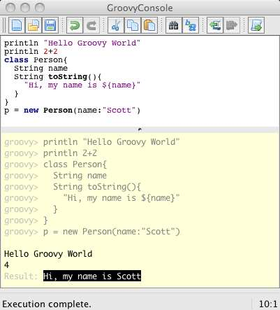
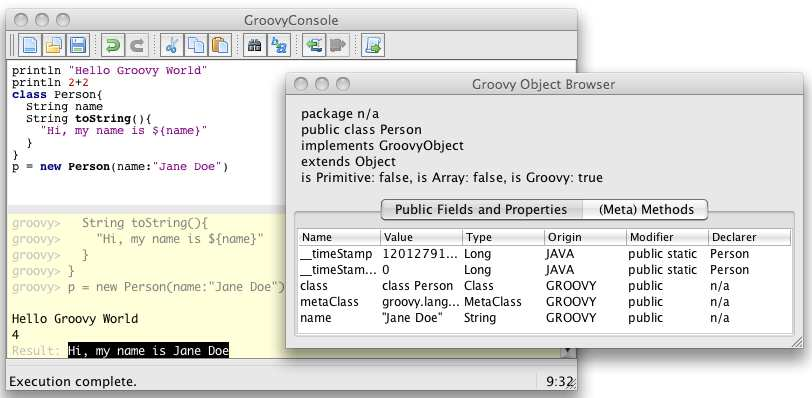
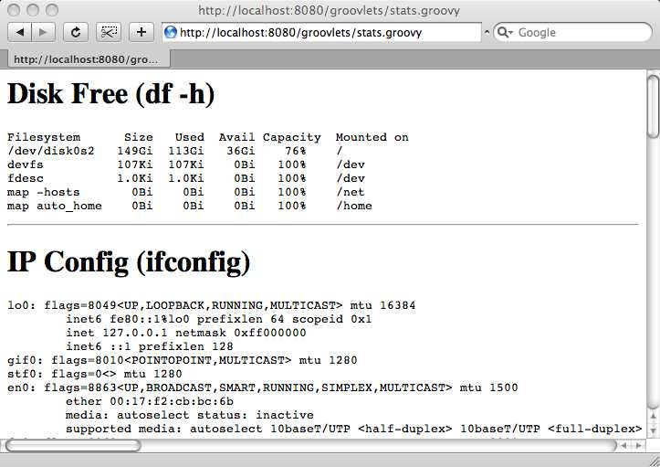
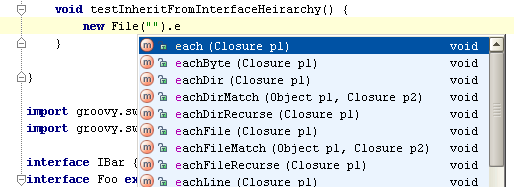
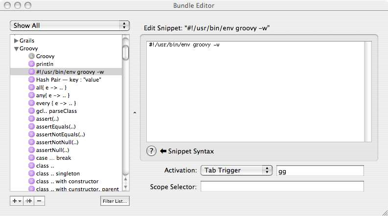
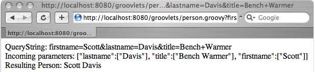

# Groovy_Recipes(Groovy食谱)

## 写在前面 {#Preface}
Groovy是一种成功的、强大的、成熟的语言，所有优秀的Java开发人员都应该在他们的工具箱中拥有它。它可以用于使单元测试更富有表现力,脚本任务,比如XML解析或倒入数据,提供扩展点在您的应用程序中,最终用户可以自定义行为与自己的脚本,用于定义特定于域的语言表达可读的和简洁的业务规则,甚至作为一个成熟的通用语言编写应用程序的端到端基于groovy的Grails web框架。

Groovy的主要目标一直是通过提供一种优雅的语言来简化开发人员的工作，这种语言由于其类似java的语法而易于学习，但是它也为所有常见的编程任务提供了有用的特性和API。 Groovy还试图通过将Java推进到21世纪来解决Java的缺点。您现在就可以使用Groovy—无需等待Java 7、8或9—并且可以从闭包中获益;属性;列表、映射和正则表达式的本机语法;和更多。

关于Groovy的书籍已经有好几本了-这是Groovy受欢迎和成熟的又一个很好的标志-但Groovy Recipes的独特之处在于，它是最快掌握语言并在任何时间查找特定语言功能信息的最快方法 ，由于其结构清晰。 但它不仅仅是一堆技巧，因为如果你真的想学习Groovy，有一个故事可以读，一个引导之手，通过以一种非常自然和友好的方式逐步地教授你更多关于这门语言的知识，从而引导你获得启迪。说实话，我甚至发现了一些我自己都不知道的技巧!

我，Groovy项目经理！

我相信您会像我一样喜欢这本书，并且将其放在桌子上，以帮助您解决日常的开发工作。 借助Groovy Recipes，您将立即完成工作。

Guillaume Laforge (Groovy项目经理)
January 3, 2008

## 第1章 介绍 {#1_Introduction}
曾几何时，Java是您编写过一次并在任何地方运行的语言。能够在一个操作系统(比如OS X)上编写代码，然后不加修改地将代码放到另一个操作系统(Windows、Solaris或Linux)上，对于习惯于等待在自己机器上运行的版本的用户来说，这是一个巨大的胜利。在使用Java之前，您的操作系统似乎总是最不受支持的，不是吗?

随着我们对Java的进一步了解，平台(Java虚拟机，或JVM)提供了WORA的魔力，而不是语言。因此, 我们正处于第二次Java革命中——Java语言与150多种其他语言共享平台[^11]。 矛盾的是，随着Java语言失去其垄断地位，Java平台变得比以往任何时候都更加重要。

作为开发人员，我们有如此多的选择，是什么让Groovy从人群中脱颖而出呢?就这一点而言，为什么首先要超越古老的Java语言呢?我可以用一句话来概括:如果Java是在21世纪编写的，Groovy就是它的样子。

Groovy是一种新的语言。与其说它取代了旧技术，不如说它加强了旧技术。它是由Java开发人员创建的，他们希望代码编写的日常体验更简单。您不再需要费力地阅读所有这些样板代码。

然而，更重要的是，这不是“嘿，伙计们，让我们从头开始重写整个应用程序，以利用这种新的语言”的软件开发方法。不，这是一种“让我们使用一种与现有代码库无缝集成的语言”的方法。

Groovy在已经安装的JVM(1.4、1.5或1.6)上运行。您可以在用于Java开发的IDE中编写Groovy。您将其部署到生产中已有的相同应用程序服务器上。实际上，在类路径中放入一个groovy.jar，就可以“启用groovy”整个应用程序。

在本书中，我希望向经验丰富的Java资深人士展示将Groovy集成到现有代码库中有多么容易。 我希望通过展示一些可以立即解决日常问题的快速Groovy代码片段来吸引繁忙的Java开发人员。(“如何解析带有名称空间的XML文档？”) 但是最重要的是，我希望吸引希望将新生命注入一个拥有十几年历史的平台的Java开发人员。 闭包，特定于领域的语言和元编程等功能现在都可以在一个平台上使用，酷炫的孩子们似乎已经抛弃了那些落后于时代的平台。

一些技术书籍仅被阅读一次。 然后，在您学习了这些材料之后，这本书就坐在架子上，集尘。 如果我的预感是正确的，那么这将是您收藏中阅读的众多书籍之一， 在您成为Groovy大师之后，对您也还是很有帮助，就像您第一次阅读它一样。

我认为您会继续读这本书的原因是，为顺序访问而编写的书中，大多数人都会阅读，也就是说，除非您已阅读第1-6章，否则第7章没有意义。 本书针对随机访问进行了优化。 我试图以一种可以一遍又一遍地达到目的的方式来进行布局，因为您知道可以快速扫描目录以找到所需的代码片段。 每个部分都是一个独立的实体，包含大量面包屑，可为您指明相关主题。

在我写这本书的过程中，在我的笔记本电脑上保存一份PDF文档已经不止一次地证明了它的价值。如果一个PDF文件可以折角，那么我的文档就几乎是破旧不堪了。能够以电子方式搜索代码片段或短语(就在文本编辑器旁边的窗口中)绝对是无价的。它改变了我编写Groovy的方式，在我开始写这本书之前，我已经有多年的Groovy经验了!

### 1.1 Groovy, Java应该是这样的 {#1_1_Groovy__the_Way_Java_Should_Be}
Groovy的设计旨在吸引Java开发人员。 Groovy最终是Java。 在JVM上运行的其他语言就是其他语言。 JRuby [^12]的重点是使现有的Ruby代码在JVM上运行。 Jython [^13]的重点是使现有的Python代码在JVM上运行。 Groovy的重点是与您现有的Java代码集成。

我并不是要减少其他语言的价值。 如果您已经有使用另一种语言实现的现有代码库，那么好处是无可否认的。 但是，它们如何使现有Java代码库的Java开发人员受益呢？ Groovy和Java非常兼容，因此在大多数情况下，您可以获取Java文件`foo.java`，并将其重命名为`foo.groovy`。 您将拥有一个完全有效（和可执行）的Groovy文件。 该技巧不适用于JVM上的任何其他邻居。

但是，除了语言级别的兼容性之外，Groovy还使您可以大大减少通常用Java编写的代码量。 例如，让我们从一个名为`Person.java`的简单Java类开始，它具有两个属性firstName和lastName。 作为Java开发人员，我们从小就受过培训，可以创建具有私有属性的公共类。 所有对属性的外部访问都通过公共获取程序和设置程序进行路由。

```java
/** Java Code */
public class Person {
  private String firstName;
  private String lastName;

  public String getFirstName() {
    return firstName;
  }

  public void setFirstName(String firstName) {
    this.firstName = firstName;
  }

  public String getLastName() {
    return lastName;
  }

  public void setLastName(String lastName) {
    this.lastName = lastName;
  }
}
```

我并不反对现有的Java实践。封装提供了许多好处。不幸的是，它带来了沉重的啰嗦税。

我们花费了二十多行代码来定义一个具有两个属性的类。 每个新属性将使我们花六行代码来获取样板获取器和设置器。 现代IDE将为我们生成必需的getter和setter的事实并不能解决问题。 它使症状仅略微减轻痛苦。

相应的Groovy类是什么样的？ 您可以将`Person.java`重命名为`Person.groovy`，然后该文件将被编译，但是这并不是Groovy的习惯用法。

Java开发人员首先注意到Groovy是它的简洁。 好的Groovy代码是Java的精髓。 您可以在Person类的Groovy版本中立即看到以下内容：
```groovy
/** Groovy Code */
class Person {
  String firstName
  String lastName
}
```

是的，仅此而已。 更好的是，它是Java类的直接替代。 将其编译为字节码，并且Groovy版本与Java版本没有区别。 您需要具有常规知识。 jar放在您的类路径中，但是就这样，您的Java代码可以无缝调用任何普通的旧Groovy对象（POGO）来代替具有相同名称和字段的POJO。

默认情况下，所有POGO都是公开的。 所有属性都是私有的。 每个字段都有getter和setter，但是这些方法是在字节码而不是源代码中自动生成的。 这会将新字段的6：1编码比率降低到正好1：1。 与Java类相比，看一下这个POGO，没有什么可以忽略的了。 它是POJO的核心，消除了所有语法噪声。

::: alert-info
**翻译者-白石-加注**
**下面代码是用Groovy编译前生成的中间java源代码**
```java
public class Person extends java.lang.Object implements groovy.lang.GroovyObject {

    private java.lang.String firstName
    private java.lang.String lastName
    private static org.codehaus.groovy.reflection.ClassInfo $staticClassInfo
    public static transient boolean __$stMC
    private transient groovy.lang.MetaClass metaClass

    @groovy.transform.Generated
    public Person() {
        metaClass = /*BytecodeExpression*/
    }

    protected groovy.lang.MetaClass $getStaticMetaClass() {
    }

    @groovy.transform.Generated
    @groovy.transform.Internal
    public groovy.lang.MetaClass getMetaClass() {
    }

    @groovy.transform.Generated
    @groovy.transform.Internal
    public void setMetaClass(groovy.lang.MetaClass mc) {
    }

    @groovy.transform.Generated
    @groovy.transform.Internal
    public java.lang.Object invokeMethod(java.lang.String method, java.lang.Object arguments) {
    }

    @groovy.transform.Generated
    @groovy.transform.Internal
    public java.lang.Object getProperty(java.lang.String property) {
    }

    @groovy.transform.Generated
    @groovy.transform.Internal
    public void setProperty(java.lang.String property, java.lang.Object value) {
    }

    @groovy.transform.Generated
    public java.lang.String getFirstName() {
    }

    @groovy.transform.Generated
    public void setFirstName(java.lang.String value) {
    }

    @groovy.transform.Generated
    public java.lang.String getLastName() {
    }

    @groovy.transform.Generated
    public void setLastName(java.lang.String value) {
    }

}
```
:::

当然，您可以慢慢地开始一个接一个地添加Java语言特性。

如果您愿意，当然可以使用分号。您可以显式地说公共类Person和私有字符串firstName。没有什么可以阻止您在源代码中使用`getter`和`setter`。

回想一下，您可以将`Person.java`从字面上重命名为`Person.groovy`，并且在语法上仍然可以正确使用Groovy。 但是，当您看到Groovy版本的简单优雅之后，为什么还要增加所有这些复杂性呢？

### 1.2 避免冗长 {#1_2_Stripping_Away_the_Verbosity}
让我们进一步探讨这个冗长的问题。考虑Java中规范的“Hello World”示例:
```java
public class HelloWorld {
  public static void main(String[] args) {
    System.out.println("Hello World");
  }
}
```

Groovy脚本隐式创建了`公共类行`以及公共静态`void main()`行，剩下的就是用于替换的代码：
```groovy
println "Hello World"
```
同样，两者都是字节码兼容和完全可互换的。Groovy示例所做的工作与Java代码完全相同，只是使用了一小部分代码行。

最后一个例子是，打开一个简单的文本文件，逐行遍历它，然后打印结果，需要多少行Java代码?根据我的计算，大约有35行代码:
```java
import java.io.BufferedReader;
import java.io.FileNotFoundException;
import java.io.FileReader;
import java.io.IOException;

public class WalkFile {
  public static void main(String[] args) {
    BufferedReader br = null;
    try {
      br = new BufferedReader(new FileReader("../simpleFile.txt"));
      String line = null;
      while ((line = br.readLine()) != null) {
        System.out.println(line);
      }
    } catch (FileNotFoundException e) {
      e.printStackTrace();
    } catch (IOException e) {
      e.printStackTrace();
    }

    finally {
      if (br != null) {
        try {
          br.close();
        } catch (IOException e) {
          e.printStackTrace();
        }
      }
    }
  }
}
```

我并不是在建议您仅考虑行数。 如果仅是您所关心的问题，则可以通过导入`java.io.*`而不是显式地导入每个类来简化此示例。 为了简洁起见，您可以将一些较短的捕获块上移到一行。 不，您对此代码应有的关注是固有的冗长性。 这是相应的Groovy代码：
```groovy
new File("../simpleFile.txt" ).eachLine{ line ->
  println line
}
```

如果您想轻松快速地处理样式规则，您可以使用一个单行程序来替代Java示例中的35行。行数只是我喜欢Groovy的一个例子—我可以看到森林就是树木，这是一个真正的好处。 我编写的Groovy代码可以直接替代Java，这是另一个事实。 由于这些原因，我喜欢将Groovy视为“可执行伪代码”。

### 1.3 Groovy:蓝色药丸还是红色药丸? {#1_3_Groovy__The_Blue_Pill_or_the_Red_Pill_}
在科幻电影《黑客帝国》中，主角neo有两种选择。如果他吃了蓝色药丸，他将回到他的日常生活。没有什么变化。然而，如果他选择了红色药丸，他将获得一个全新的世界观。他会得到超级英雄的能力。(当然，他选择了红色药丸。如果他不这么做，那就算不上一部电影。)

Groovy同时提供了两个选择。

Groovy的“蓝色药丸”使Java更容易使用。正如所示的Person类示例，Groovy可以作为Java的替代，而不需要更改Java语言的任何语义。这应该会吸引保守组织。

在“红色药丸”下，Groovy引入了与Java不同的新语言构造。 `File.eachLine`是一个闭包-这是一种无需使用`java.util.Iterator`即可迭代文件的全新方法。 考虑将闭包包含在Java 1.8中，但是现在就在这里。 这应该使那些羡慕其他语言的炫酷功能的人们所希望，他们希望Java可以做类似的事情。

也许James Strachan在2003年8月29日说得最好，当时他向全世界介绍了他一直在做的一个小型开源项目。在一篇名为“Groovy: Java平台新动态语言的诞生”的博客中，他这样写道:

像Ruby和Python这样的动态类型语言似乎越来越受欢迎。我仍然不相信我们应该在不久的将来都转向动态类型语言——但是，我认为没有理由不能同时使用动态和静态类型语言，并选择最适合这项工作的工具。

“我一直想使用一种很酷的动态类型脚本语言，专门针对Java平台。有很多选择，但是没有一个是完全正确的，特别是从一个顽固的Java程序员的角度来看。Python和Ruby都很酷——尽管它们本身就是平台。我更喜欢一种动态语言，它构建在所有groovy Java代码和JVM之上。

因此，我一直在思考，Java平台是否应该从头开始设计自己的动态语言，以便更好地处理现有代码，创建/扩展普通Java可以使用的对象，反之亦然。Python/Jython[是]一个非常好的基础——添加Ruby中的一些好东西，可能还会添加一些AOP特性，这样我们就可以有一种真正groovy的新语言来编写Java对象脚本、编写测试用例，谁知道呢，甚至可以用它进行真正的开发。”

这就是Groovy的名字和世界观的由来。Groovy是一种具有您希望它具有的特性的语言。传统的Java开发变得更容易了，还是一种将其他语言的所有这些令人兴奋的新特性都放到JVM上的方法?答案是两者皆有。

### 1.4 路线图 {#1_4_Road_Map}
您可以通过多种方式阅读这本书。 每章都专注于特定主题，例如`XML`，`文件I/O`，`Web服务`或`元编程`。 要全面了解该主题以及Groovy如何为您提供帮助，只需像阅读其他任何书籍一样，从头至尾阅读本章即可。

但是，如果您急着需要解决某个特定问题，那么目录就是您的朋友。 每章分为解决特定问题或描述特定语言功能的部分：“列出目录中的所有文件”，“读取文件的内容”，“将文本写入文件”等等。 每个部分都以一个代码块开头，您可以键入它来开始您的业务。 如果您需要更多说明，请继续阅读。 我试图使每个部分尽可能独立。 如果它使用其他地方描述的功能，则应以合理的方式明智地交叉引用各节
无论您在哪里潜水，都感到舒适。

第2章，入门，第24页，介绍了如何安装Groovy，如何编译Groovy代码以及如何启用Groovy启用文本编辑器或IDE。

第3章，Groovy的新知识，第41页是“红色药丸”一章，向有经验的Java开发人员展示Groovy带给聚会的所有有趣的新功能：鸭子类型，Groovy真值和闭包。

第4章Java和Groovy集成是一个“蓝色药丸”章节，第69页演示了如何将Groovy与现有Java基础结构集成。

第5章，从命令行获取Groovy。在第86页上，您将看到一个您可能认为Java不适合的地方：命令行。 Groovy对shell脚本进行了替换，使您可以利用所有熟悉的Java习惯用法和库来执行系统管理任务。

第6章，文件技巧。第100页，展示了使用Groovy处理文件系统的不同方法：列出目录中的文件，读取文件，进行复制等等。

第7章，XML解析。第116页，展示了在Groovy中使用XML是多么容易。您可以解析XML文档，轻松获取元素和属性。

第8章，编写XML。 第136页上的“显示XML硬币的另一面：写出XML文档”。 您将学到所有内容，从简单的XML封送处理到创建带有声明，处理指令，CDATA块等的复杂XML文档。

第9章，Web服务，第152页，使用远程系统。我们将探讨如何进行SOAP调用、RESTful调用、XML-RPC调用等等。

第10章，元编程，181页，探索了在JVM上编程的一种新思路。动态地发现现有类、字段和方法可以快速地动态地创建新类和方法，并在运行时向现有类添加新功能。

第11章，Grails的使用，第200页介绍了一个功能全面的web框架，它构建在熟悉的Java库(如Spring和Hibernate)之上，但是它使用Groovy作为动态粘合剂将所有东西粘在一起。

Chapter 12, Grails and Web Services, on page 233 shows how to use Grails for more than returning simple HTML. We'll look at RESTful web services, JSON web services, Atom feeds, podcast feeds, and more.

### 1.5 致谢 {#1_5_Acknowledgments}
再次感谢Dave Thomas和Andy Hunt创建了实用书架。 这是我第二本与他们在一起的书，作为作者和书名的狂热读者，我对他们将开发者与出版公司友好的组合在一起感到惊喜。

这也是我第二次与Daniel Steinberg担任编辑。 他采用了我半透明的观点，即编写代码优先的Groovy书，并且千方百计地哄骗了您现在所掌握的东西。 他用一句话对“嗯？”，“为什么？”和“真的？”的评论温和地推动了我，在我太简洁的地方上扩大想法，在太过临床的地方给散文加热，并提供了理由和我的真实观点。 大括号和分号还不够的世界经验。 和他一起工作真是一种快乐，我真的很期待我们的下一个项目。

衷心感谢您对我的技术评审无所畏惧。 他们敏锐的眼睛和敏锐的舌头使我保持谦卑，我的代码紧绷。 Groovy项目负责人Guillaume Laforge和Grails项目负责人Graeme Rocher的评论如您所期望的那样精明和及时。 项目提交者Jeff Brown，Dierk Koenig和Jason Rudolph慷慨地分享了他们的内部知识，而David Geary，Ken Kousen，Joe McTee和Greg Ostravich确保我的示例对于那些不懂该语言的人来说是可理解的。 特别要感谢我的好朋友Venkat Subramaniam，我们开始一起编写这本书，然后很快意识到两本书比一本书要好。 他在《学习Groovy》中对语言的战略理解是对我在这里采取的战术方法的完美补充。

非常感谢No Fluff，Just Stuff研讨会研讨会的创始人Jay Zimmerman。 他很早就意识到Groovy对Java开发社区是什么，并且从那时起就一直积极支持它。 在Graeme，Guillaume和Alex Tkachman接管G2One之前，他为该语言的专业开发付费。 Groovy和Grails的演讲在NFJS阵容中得到了突出体现，而2G体验（第一个专门针对Groovy和Grails的北美会议）则继续表明他坚定地致力于扩大该语言的吸引力。 自2003年以来，我一直与杰伊密切合作，从来没有一个沉闷的时刻。

最后，我的家人应该得到我最深的谢意。 尽管他们常常首当其冲地受到我奇怪的写作时间表和永远存在的截止日期的困扰，但他们却很少抱怨它-至少对我来说不是。 我的妻子金（Kim）付出了看似毫无底线的耐心和鼓励，但也并没有引起人们的注意。 在《 Groovy Recipes》写作期间，她最常问的两个问题是“您是否已经完成这本书了？”和“您什么时候打算写一些我想阅读的东西？”我可以对一个人回答“是……最终”。 对方则表示“很快...我希望”。 年轻的克里斯托弗（Christopher）十分支持写作过程，只要它不妨碍我们诺曼·洛克威尔（Norman Rockwellian）往返幼儿园或我们在任天堂Wii上的时间。 （我确定没有这样做。）年轻的伊丽莎白现在步步高大，够到家里爸爸的门把手，要确保我走得太久没有灿烂的笑容和一两个传染性的傻笑。。 你们每个人都很爱。

## 第2章 开始 {#2_Getting_Started}
安装Groovy与安装Ant、Tomcat或Java本身一样简单——解压缩发行版，创建环境变量，并确保二进制文件位于您的路径中。Groovy就绪后，您可以以任何方式运行它——编译或未编译，从shell或GUI控制台，或从命令行或web服务器。如果您有两分钟(或者更少)的时间，那么您就有足够的时间开始尝试Groovy。在您说“下一代Java开发”之前，本章将让您启动并运行。

### 2.1 安装Groovy {#2_1_Installing_Groovy}
1. 从`http://groovy.codehaus.org`下载并解压groovy.zip。
2. 创建`GROOVY_HOME`环境变量。
3. 将`$GROOVY_HOME/bin`添加到`PATH`中。

运行Groovy所需的所有东西都包含在一个ZIP文件中—好吧，除了JDK之外的所有东西。Groovy 1.x运行在java 1.4、1.5和1.6的所有现代版本上。如果您正在运行较老版本的Java，可以通过`http://java.sun.com`获得更新。如果不知道安装了哪个版本的Java，请在命令提示符中键入`java -version`:
```bash
$ java -version
===>
java version "1.5.0_13"
Java(TM) 2 Runtime Environment, Standard Edition (build 1.5.0_13-b05-237)
Java HotSpot(TM) Client VM (build 1.5.0_13-119, mixed mode, sharing)
```

要利用Java 1.5语言的特性，比如Groovy中的注释和泛型，可能不需要说，您至少需要一个1.5 JDK。

Groovy在每一代JVM上运行的速度都明显更快，因此，除非有其他原因阻碍您，否则我建议您尽可能在最新的、最好的Java版本上运行Groovy。

同样，我建议您尽可能运行Groovy的最新版本。Groovy 1.0于2007年1月发布。下一个主要版本Groovy 1.5于2007年12月发布。稍后您将看到如何确定正在运行的Groovy版本。

Groovy开发团队煞费苦心地确保基本语法和接口在Groovy 1.0和1.5之间保持一致。版本号的增加意味着两件事:Java 5语言特性的增加，以及稳定性和原始性能的巨大飞跃。如果您仍然在运行Groovy 1.0，那么本书中的大多数示例将保持不变。`ExpandoMetaClass`类是在Groovy 1.5中添加的，但是元编程从一开始就是该语言不可或缺的一部分。在第10章元编程(第181页)中，没有特别使用`ExpandoMetaClass`类的例子在Groovy的任何一个版本中都将以相同的方式运行。底线是所有的Groovy1.x的版本应该可以合理地互换。打破语法的更改保留给Groovy 2.x。

我已经包含了关于如何安装Groovy的信息，其中有一节是关于Windows的细节，另一节是关于Unix、Linux、Mac OS X家族的细节。

**检查Groovy版本**
```bash
$ groovy -version
Groovy Version: 1.5.0 JVM: 1.5.0_13-119
```
您可以通过在命令提示符中键入`groovy -version`来判断已经安装了哪个版本的Groovy。如这里所示，这个命令还显示了Java版本。

**在Unix、Linux和Mac OS X上安装Groovy**
从`http://groovy.codehaus.org`下载最新的Groovy ZIP文件。 将其解压缩到您选择的目录。 我更喜欢`/opt`。 您将最终得到一个groovy目录，该目录的末尾带有版本号，例如`groovy-1.5`。 我喜欢创建一个不包含特定版本号的符号链接：`ln -s groovy-1.5 groovy`。 这使我可以轻松便捷地在Groovy的版本之间切换。

由于ZIP文件无法保留Unix文件的权限，因此请确保在bin目录中切换并使其可执行：
```bash
$ chmod a+x *
```
目录到位后，下一步需要创建GROOVY_HOME环境变量。 这样做的步骤因SHELL而异。 对于Bash，您可以在主目录中编辑`.bash_profile`或`.bash_rc`文件。 添加以下内容：
```bash
### Groovy
GROOVY_HOME=/opt/groovy
PATH=$PATH:$GROOVY_HOME/bin
export GROOVY_HOME PATH
```

为了使这些更改生效，您需要重新启动终端会话。 或者，您可以键入`source .bash_profile`以将更改加载到当前会话中。 您可以键入`echo $GROOVY_HOME`确认您的更改已生效：
```bash
$ echo $GROOVY_HOME
/opt/groovy
```

要验证Groovy命令是否在路径中，请键入`groovy -version`。 如果看到类似的消息，则说明您已经成功安装了Groovy：
```bash
Groovy Version: 1.5.0 JVM: 1.5.0_13-119
```
**在Windows上安装Groovy**
从`http://groovy.codehaus.org`下载最新的Groovy ZIP文件。 将其解压缩到您选择的目录。 我更喜欢`c:\opt`。 您将最终得到一个groovy目录，该目录的末尾带有版本号，例如`groovy-1.5`。 尽管您可以将其重命名为更简单的名称，例如groovy，但我发现将版本号保留在目录名称上有助于减少将来的升级。

目录到位后，下一步需要创建`GROOVY_HOM`E环境变量。 对于Windows XP，请转到“控制面板”，然后双击“系统”。 单击高级选项卡，然后单击窗口底部的环境变量。 在新窗口中，单击“系统变量”下的“新建”。 使用`GROOVY_HOME`作为变量名称，并使用`c:\opt\groovy-1.5`作为变量值。

要将Groovy添加到路径，请找到`PATH`变量，然后双击它。 将`;%GROOVY_HOME%\bin`添加到变量的末尾。 （不要忘记前导的分号。）单击“确定”以退出所有对话框。 为了使这些更改生效，您需要退出或重新启动已打开的所有命令提示符。 打开一个新的命令提示符，然后键入set以显示所有环境变量的列表。 确保出现`GROOVY_HOME`。

要验证Groovy命令是否在路径中，请键入`groovy -version`。 如果看到类似的消息，则说明您已经成功安装了Groovy：
```bash
Groovy Version: 1.5.0 JVM: 1.5.0_13-119
```

### 2.2 运行Groovy脚本 {#2_2_Running_a_Groovy_Script}
```bash
// hello.groovy
println "Hello Groovy World"
$ groovy hello.groovy
$ groovy hello
===> Hello Groovy World
```

有经验的Java开发人员注意到Groovy的第一件事就是他们可以运行代码而无需先编译。 您只需键入即可—与Java类相比，更像是编写JSP页面。 这可能会使您相信Groovy是一种解释语言。 实际上，Groovy就像Java一样被编译成字节码。 groovy命令既编译又运行您的代码。 但是，您不会在任何地方找到生成的.class文件。 该字节码在内存中创建，并在运行结束时被丢弃。 （如果要保留这些类文件，请参阅下一页的2.3节，编译Groovy（groovyc）。）

动态字节码编译意味着Groovy可以提供交互式shell。 键入命令并立即执行命令是尝试该语言的最快方法。 有关更多信息，请参见下一页第2.4节，运行Groovy Shell（groovysh）。 缺点当然是shell关闭后代码就消失了。 该shell非常适合进行实验，但是如果您想做些除`quick-and-dirty快速和肮脏`的操作以外的其他方法，则需要创建Groovy脚本。

要创建Groovy脚本，请创建一个名为`hello.groovy`的新文本文件。 添加以下行：

保存文件，然后在命令提示符下键入`groovy hello.groovy`。 由于给了它一个`.groovy`文件扩展名，因此您也可以只键入`groovy hello`。恭喜！ 您现在正式是Groovy开发人员。 欢迎来到俱乐部。

有关运行未编译Groovy的更多信息，请参见第5章，第86页命令行中的Groovy。

### 2.3 编译Groovy {#2_3_Compiling_Groovy}

```bash
$ groovyc hello.groovy

// on Unix, Linux, and Mac OS X
$ java -cp $GROOVY_HOME/embeddable/groovy-all-1.5.0.jar:. hello
===> Hello Groovy World

// on Windows
$ java -cp %GROOVY_HOME%/embeddable/groovy-all-1.5.0.jar;. hello
===> Hello Groovy World
```

如果您只想运行一个快速脚本，让groovy命令动态地编译您的代码是很有意义的。 但是，如果您试图将Groovy类与旧版Java类混合在一起，则groovyc编译器是唯一的选择。 只要Groovy JAR位于类路径上，您的Java类就可以像Groovy类可以调用Java一样容易地调用Groovy。

有关编译Groovy和与Java类集成的更多信息，请参阅第69页第4章，Java和Groovy集成。

### 2.4 运行Groovy Shell (groovysh) {#2_4_Running_the_Groovy_Shell}

```bash
$ groovysh
Groovy Shell (1.5.0, JVM: 1.5.0_13-119)
Type 'help' or '\h' for help.
----------------------------------------
groovy:000> println "Hello Groovy World"
Hello Groovy World
===> null
```

Groovy shell允许您交互式地使用Groovy。不需要创建文件或编译任何东西—只需在命令提示符中键入`groovysh`，并开始键入诸如`println "Hello Groovy World"`之类的Groovy语句。每次按回车键，结果都会出现。要退出Groovy shell，键入`exit`。

`null(空)`消息没有什么好担心的。这只是意味着您键入的最后一个命令没有返回值。如果您键入类似于`2+2`的内容，则消息将是语句4的结果。Groovy中的方法的最后一行是一个隐式的返回语句，Groovy shell的行为也是一样的:
```bash
groovy:000> 2+2
===> 4
groovy:000> s = "John"
===> John
groovy:000> s.toUpperCase()
===> JOHN
groovy:000> s.each{println it}
J o h n
===> John
```

`toUpperCase()`方法直接来自`java.lang.String`类。有关每个闭包的更多信息，请参见第59页第3.14节“迭代”。

Groovy shell存储您键入的所有内容的历史记录—即使在您退出shell之后也是如此。您可以使用向上和向下箭头键快速地重新输入命令或纠正胖手指语法错误。

提示符处的`:000`表示在不运行的情况下输入了多少行Groovy代码。例如，您可以在Groovy shell中动态定义一个类并立即使用它。(当然，一旦您退出shell，类就会消失。)
```bash
groovy:000> class Person{
groovy:001> String name
groovy:002> String toString(){
groovy:003> "Hi! My name is ${name}"
groovy:004> }
groovy:005> }
===> true
groovy:000> p = new Person(name:"John")
===> Hi! My name is John
```

你注意到两次都没有看到null吗?第一次得到true时——这是Groovy shell的一种说法，“好的，我可以为您定义这个类。第二次看到类的toString输出。冒着听起来有点厚颜无耻的风险，您将很快学会只在关心Groovy shell必须要说什么的时候才关注它的结果……

::: alert-info
**问题:为什么Groovy Shell会忘记变量?**
```bash
groovy:000> String s = "Jane"
groovy:000> println s
===>
ERROR groovy.lang.MissingPropertyException:
No such property: s for class: groovysh_evaluate
groovy:000> s = "Jane"
groovy:000> println s
===> Jane
```

Groovy shell在类型变量方面有一个奇怪的失忆案例。使用数据类型或def声明的变量会立即被忘记。在shell会话期间，将记住一个非类型化变量。当将代码从脚本复制到shell时，这可能会引起很大的混淆——在脚本中代码是正常的，而在shell中代码是错误的。

要理解这种明显的差异，您需要更好地理解Groovy shell是如何实现的。(如果您觉得您的眼睛开始变得呆滞，请将类型声明从shell变量中去掉，然后继续……)

Groovy shell是`groovy.lang.Groovyshell`的一个交互式实例。这个类还支持第5.10节中讨论的`evaluate`命令，即第95页上的求值字符串。每个GroovyShell都在`groovy.lang.Binding`中存储本地声明的变量(比如s="Jane")。

这个绑定对象本质上是“天空中的大hashmap”。当您键入`println s`时，shell会在后台调用`binding.getVariable("s")`。使用数据类型声明的变量(String s ="Jane")不会存储在绑定中，因此在您下一次请求它们时将无法找到它们。

有关GroovyShell和绑定对象的更多信息，请参见第188页第10.4节，发现类的方法。
:::
**图2.1: Groovy控制台**


**动态查找类方法**
```groovy
groovy:000> String.methods.each{println it}
public int java.lang.String.hashCode()
public volatile int java.lang.String.compareTo(java.lang.Object)
public int java.lang.String.compareTo(java.lang.String)
public boolean java.lang.String.equals(java.lang.Object)
public int java.lang.String.length()
```

您可以使用Groovy shell快速发现给定类上的所有方法。例如，假设您想查看所有的String方法。前面的例子很有用。

直接向类询问方法的好处是它始终是最新的-另一方面，Javadocs可能与实时代码不同步。 有关类自省的更多信息，请参阅第181页第10章，元编程。

在本节的开头，我们讨论了null消息，如果命令没有输出，则可以安全地忽略该null消息。 不幸的是，这是shell输出的另一个例子，它的噪声大于信息。

成功显示类中的所有方法后，命令`String.methods.each{println it}`返回错误：
```groovy
groovy:000> String.methods.each{println it}
...
public final native void java.lang.Object.notify()
public final native void java.lang.Object.notifyAll()
ERROR groovy.lang.MissingMethodException:
No signature of method:
org.codehaus.groovy.tools.shell.Groovysh$_closure1.call()
is applicable for argument types:
...
```

还记得我说过的，只有当您关心Groovy shell的内容时，您才会很快学会关注它的结果吗？ 在显示所有方法之后，shell尝试执行`String.methods`调用的结果（并且可能会失败，我可能会添加）。 由于我已经习惯了，所以这个错误不会让我感到困扰。 我无视它，因为我知道它将要发生，而且毕竟这是临时代码。 如果错误消息使您感到困扰，则可以在调用末尾添加一条语句，该语句可以正确求值，例如`String.methods.each{println it}; "DONE"`。 您将输入一些额外的字符，但同时也避免了shel的一些杂音。

**获取帮助**
```bash
groovy:000> help
For information about Groovy, visit:
http://groovy.codehaus.org
Available commands:
help (\h) Display this help message
? (\?) Alias to: help
exit (\x) Exit the shell
quit (\q) Alias to: exit
import (\i) Import a class into the namespace
display (\d) Display the current buffer
clear (\c) Clear the buffer
show (\S) Show variables, classes or imports
inspect (\n) Inspect a variable or the last result
with the GUI object browser
purge (\p) Purge variables, classes, imports or preferences
edit (\e) Edit the current buffer
load (\l) Load a file or URL into the buffer
. (\.) Alias to: load
save (\s) Save the current buffer to a file
record (\r) Record the current session to a file
history (\H) Display, manage and recall edit-line history
alias (\a) Create an alias
set (\=) Set (or list) preferences
For help on a specific command type:
help command
```
在Groovy shell中键入`help`时，会显示一些隐藏的好东西。`import`的行为与它在Java源代码中的行为一样，允许您使用其他包中的类。如果您正在定义一个很长的类，并且搞砸了，`clear`将返回到一个:000状态。要清除整个会话，输入`purge`可以使您回到最初启动shell时的状态。`record`将您键入的所有内容保存到一个文件中，允许您稍后“回放”。`history`显示了shell记住您输入的内容。

### 2.5 运行Groovy控制台（groovyConsole） {#2_5_Running_the_Groovy_Console}
```bash
$ groovyConsole
```

除了基于文本的Groovy Shell，Groovy还提供了图形控制台。 （请参阅第31页的图2.1。）在窗口的上半部分键入命令。 选择`Script > Run`，然后在下半部分查找结果。 （选择`Script > Run Selection`，可以将焦点缩小到突出显示的代码行。）

在第28页运行Groovy Shell (groovysh)的第2.4节中讨论的Groovy Shell吸引了命令行牛仔。 Groovy控制台旨在吸引更精细的GUI用户——那些已经习惯了`剪切/复制/粘贴`,`撤消/重做`等细节的用户。 控制台不能替代真正的文本编辑器，但是它比shell提供了更多的便利。例如，如果您有一个现有的Groovy脚本，您可以在控制台中通过选择`File > Open`来打开它。您还可以通过选择`File > Save`保存Shell会话。

您甚至有一个图形对象浏览器来更深入地查看给定类上可用的字段和方法。控制台运行的最后一个对象是Person的实例。在下面的页面中，选择`Script > Inspect Last to snoop`，如图2.2所示。

### 2.6 在Web服务器上运行Groovy (groovlet) {#2_6_Running_Groovy_on_a_Web_Server}
```bash
1. Copy $GROOVY_HOME/embeddable/groovy.jar to WEB-INF/lib.
2. Add groovy.servlet.GroovyServlet to WEB-INF/web.xml.
3. Place your Groovy scripts wherever you'd normally place your JSP files.
4. Create hyperlinks to your Groovy scripts.
```

在web应用程序中添加一个Groovy servlet可以让您在服务器上运行未编译的Groovy脚本。

**图2.2: Groovy对象浏览器**


Groovy servlet的行为类似于命令行上的groovy命令-它可以动态编译您的`.groovy`脚本。

首先，将groovy.jar从`$GROOVY_HOME/embedded`复制到JEE应用程序的`WEB-INF/lib`目录中。 Groovy启用了整个Web应用程序。 要动态运行Groovlets，请将`groovy.servlet.GroovyServlet`条目添加到`WEB-INF/web.xml`部署描述符中。 您可以映射所需的任何URL模式，但是通常使用`*.groovy`进行映射。
```xml
<web-app version="2.4"
         xmlns="http://java.sun.com/xml/ns/j2ee"
         xmlns:xsi="http://www.w3.org/2001/XMLSchema-instance"
         xsi:schemaLocation="http://java.sun.com/xml/ns/j2ee web-app_2_4.xsd">
  <servlet>
    <servlet-name>Groovy</servlet-name>
    <servlet-class>groovy.servlet.GroovyServlet</servlet-class>
  </servlet>
  <servlet-mapping>
    <servlet-name>Groovy</servlet-name>
    <url-pattern>*.groovy</url-pattern>
  </servlet-mapping>
  <!-- The Welcome File List -->
  <welcome-file-list>
    <welcome-file>index.jsp</welcome-file>
  </welcome-file-list>
</web-app>
```

**图2.3：友好的Groovlet**


现在，您可以将任何未编译的Groovy脚本拖放到您的Web目录中，它将运行。 例如，在Web应用程序目录的根目录中创建一个名为`hello.groovy`的文件。 添加以下行：
```groovy
println "Hello ${request.getParameter('name')}"
```

这个Groovlet回显了您通过name参数传递的任何内容。 要进行测试，请在网络浏览器中访问`http://localhost:8080/g2/hello.groovy?name=Scott`。 友好的Groovlet应该以个性化的方式说“Hello”。(参见图2.3。)

您可以像创建任何其他文件类型一样轻松地创建指向Groovlets的超链接：
```xml
<a href="http://localhost:8080/g2/hello.groovy?name=Scott" >Say Hello</a>
```

Groovlet还可以处理表单提交。注意，表单方法是GET，字段名是name。这将创建您手动输入并在前面放入超链接的相同URL。对于稍微高级一点的Groovlet，请参阅第185页的第10.3节，检查字段是否存在。
```xml
<html>
  <body>
    <form method="get" action="hello.groovy">
      Name: <input type="text" name="name" />
      <input type="submit" value="Say Hi" />
    </form>
  </body>
</html>
```

**Web服务器状态检查Groovlet**
```groovy
// stats.groovy
html.h1("Disk Free (df -h)")
html.pre('df -h'.execute().text)
html.hr()
html.h1("IP Config (ifconfig)" )
html.pre('ifconfig'.execute().text)
html.hr()
html.h1("Top (top -l 1)")
html.pre('top -l 1'.execute().text)
```

这是我已部署到许多Web服务器的常见Groovlet。 它使我一眼就能看到一些关键统计数据，这些统计数据可帮助我判断服务器的运行状况-可用磁盘空间量，网络设置，服务器上正在运行的当前进程等。

通常我会ssh到机器中，并在命令提示符中输入这些不同的命令。相反，我可以访问`http://localhost:8080/stats`。然后得到相同的结果。 任何通常手工输入的命令都可以用引号括起来，并由Groovy代表我执行。(有关这方面的更多信息，请参见第89页第5.4节，运行Shell命令。)接下来，我可以使用每个Groovlet都可用的名为`html `的MarkupBuilder将这些结果封装到HTML片段中。(有关这方面的更多信息，请参见第146页第8.13节，动态创建HTML)。

下面是生成的HTML的样子……

```xml
<h1>Disk Free (df -h)</h1>
<pre>Filesystem Size Used Avail Capacity Mounted on
/dev/disk0s2 149Gi 113Gi 36Gi 76% /
devfs 107Ki 107Ki 0Bi 100% /dev
fdesc 1.0Ki 1.0Ki 0Bi 100% /dev
map -hosts 0Bi 0Bi 0Bi 100% /net
map auto_home 0Bi 0Bi 0Bi 100% /home
</pre>
<hr />
<h1>IP Config (ifconfig)</h1>
<pre>lo0: flags=8049&lt;UP,LOOPBACK,RUNNING,MULTICAST&gt; mtu 16384
inet6 fe80::1%lo0 prefixlen 64 scopeid 0x1
inet 127.0.0.1 netmask 0xff000000
inet6 ::1 prefixlen 128
gif0: flags=8010&lt;POINTOPOINT,MULTICAST&gt; mtu 1280
stf0: flags=0&lt;&gt; mtu 1280
en0: flags=8863&lt;UP,BROADCAST,SMART,RUNNING,SIMPLEX,MULTICAST&gt; mtu 1500
```

…但是，更重要的是，在下一页的图2.4中，您可以看到它在浏览器中是什么样子的。

groovlet并不意味着可以替代功能齐全的web框架。它们只是一些脚本，您可以通过命令行在web服务器上轻松地运行它们。有关在web框架中使用Groovy的示例，请参阅Grails和Gorm两章。

**图2.4：显示服务器统计信息的Groovlet**


### 2.7 Groovy结合Eclipse {#2_7_Groovy___Eclipse}
```
http://groovy.codehaus.org/Eclipse+Plugin
```
如果您使用的是Eclipse 3.2或更高版本，则有一个Groovy插件提供与Java相同的IDE支持（代码完成，语法突出显示，调试）。

**安装插件**

要安装`Groovy/Eclipse`插件，请遵循以下步骤：

1. 选择 `Help > Software Updates > Find and Install > Search for New Features`.
2. 点击 `New Remote Site`.
3. 在名称字段中输入`Groovy`。
4. 在URL字段中输入`http://dist.codehaus.org/groovy/distributions/update/`，然后单击“确定”。
5. 检查Groovy存储库，然后单击Finish。
6. 在“选择要安装的功能”下选择Groovy，然后单击“Next”。
7. 阅读协议，然后单击“Next”。
8. 设置默认位置，然后单击完成。
9. 如果您收到有关该插件未签名的警告，请不要担心。 单击安装。

重新启动Eclipse，您应该已经准备好使用Groovy。

**开始一个新的Groovy项目**
要开始一个新的Groovy项目，请按照下列步骤操作：

1. 选择 `File > New > Project`.
2. 选择 `Java Project`, 然后点击 `Next`.
3. 在项目名称字段中输入您选择的名称。
4. 选择“Create Separate Source and Output Folders”，然后单击“Finish”。
5. 在包资源管理器中，右键单击您的项目，然后选择 `Groovy > Add Groovy Nature`.

最后，您将需要更改已编译的Groovy代码的输出文件夹：

1. 在包资源管理器中，右键单击您的项目，然后选择 `Build Path > Configure Build Path`.
2. 将默认输出文件夹从`bin`更改为`bin-groovy`。

### 2.8 Groovy结合IntelliJ IDEA {#2_8_Groovy___IntelliJ-IDEA}
```
http://www.jetbrains.com/idea/
```
"IntelliJ IDEA 7.x"提供了对Groovy和Grails的本机支持。代码完成、语法突出显示、重构支持等等都是标准特性。(参见下面页面的图2.5)。如果默认情况下没有安装JetGroovy插件，请查找它。

如果你有“IntelliJ IDEA 6.x”。GroovyJ插件至少会给您提供基本的语法高亮显示。要安装它，打开`Preferences`屏幕，然后单击`Plugins`按钮。从列表中选择`GroovyJ`，然后单击OK。

**图2.5：IntelliJ IDEA 7.x中的代码完成**


### 2.9 Groovy结合TextMate {#2_9_Groovy___TextMate}
```
http://macromates.com/
http://macromates.com/wiki/Main/SubversionCheckout
http://groovy.codehaus.org/TextMate
http://www.e-texteditor.com/
```

TextMate是Mac上流行的文本编辑器。 它通过其插件系统提供可插拔语言支持。

从Macromates Subversion存储库中检出Groovy包(Groovy.tmbundle)。将文件复制到`~/Library/Application Support/TextMate/bundle`。重启TextMate, Groovy应该出现在Bundles菜单下。

Groovy TextMate wiki页面列出了其他与Groovy相关的包，包括Grails和GANT (Ant的Groovy实现)的包。

您还可以使用Bundle Editor从零开始创建自己的包。选择`Bundle > Bundle Editor > Show Bundle Editor`。(参见下一页的图2.6)。

Windows用户可能想要签出` E Text Editor`。它承诺“TextMate在Windows上的强大功能”。TextMate捆绑包也应该在` E Text Editor`中工作。

**图2.6：TextMate的套件编辑器**


### 2.10 Groovy在此处插入您的IDE或文本编辑器 {#2_10_Groovy____Insert_Your_IDE_or_Text_Editor_Here_}

```
http://groovy.codehaus.org/Other+Plugins
```

几乎所有现代IDE和文本编辑器都具有Groovy支持。 有关NetBeans，XCode，TextPad，SubEthaEdit，Vim，Emacs等的详细信息，请查看Groovy Wiki上的Other Plugins页面。

另一个很好的信息来源是您友好的社区搜索引擎。 例如，在搜索引擎中输入`groovy xcode`，`groovy vi`或`groovy [您的IDE]`会产生很多来自成功博客（当然，也包括失败）的人们的点击量。

## 第3章 Groovy新手 {#3_New_to_Groovy}

Groovy是对Java的补充、扩充，在某些情况下，它还提供了非常必要的改进。(毕竟，Java早在1995年就发布了。那是软件时代的前寒武纪，不是吗?) 例如，Java中需要的一些东西在Groovy中是可选的:分号、数据类型，甚至异常处理。默认情况下，Groovy自动包含的包比Java多得多。 Groovy向现有类(如String、List和Map)添加了新的方便方法。所有这些操作都是为了消除历史上减慢Java开发过程的一些减速带。

Groovy最有趣的地方是，您一直在编写它，甚至没有意识到它。Java在99%的情况下都是有效的Groovy—只需将`.java`文件重命名为`.groovy`，就可以运行了。(参见第69页的第4章，Java和Groovy集成，了解少数几种使Java不能成为100%有效的Groovy的边缘情况。)Groovy是Java的一个超集。它绝不意味着要取代Java。事实上，如果没有Java, Groovy就不会存在。Groovy旨在成**为比Java更好的Java**，同时始终支持您的遗留代码库。

但是Groovy不仅仅改进了现有的语言。Groovy引入了新的类，如`Closure`、`Range`和`GString`。Groovy引入了安全解引用的概念，以避免冗长的空检查块。Groovy提供了一个新的特殊的多行字符串变量。总的来说，Groovy以一种积极的方式“拥抱和扩展”Java。继续读下去，看看如果Java是在21世纪编写的，它会是什么样子。

### 3.1 自动导入 {#3_1_Automatic_Imports}
```groovy
import java.lang.*;
import java.util.*;
import java.net.*;
import java.io.*;
import java.math.BigInteger;
import java.math.BigDecimal;
import groovy.lang.*;
import groovy.util.*;
```
Java自动为您导入`java.lang`包。 这意味着您可以使用诸如String和Integer之类，并调用`System.out.println()`，而不必在每个Java文件的顶部键入` import java.lang.*`。

在Groovy中，您可以获得许多附加包。换句话说，您可以使用这些包中的类，而不必在文件的顶部显式地导入它们。这些自动导入的净效果是，在默认情况下，您可以使用更多的JDK和GDK。Java类及其Groovy增强功能，如`List`(第3.14节，第58页上的List快捷方式)、`Map`(第3.15节，第62页上的Map快捷方式)、`File`(第6章，第100页上的File Tricks)和`URL`(第9章，第152页上的Web服务)，在您需要它们的时候就会出现。此外,常见的Groovy类,如`XmlParse`和`XmlSlurper`(7.2节,理解XmlSlurper XmlParse和之间的区别,117页),`Expando`(10.9节,创建一个Expando, 194页),和`ExpandoMetaClass`(添加一个类的方法动态(ExpandoMetaClass), 190页)准备好了,等待你由于自动导入,Groovy并代表你。

### 3.2 可选的分号 {#3_2_Optional_Semicolons}
```groovy
msg = "Hello"
msg += " World"; msg += "!";
println msg;
===> "Hello World!"
```

在Groovy中，分号是完全可选的。如果同一行有许多语句，则必须使用它们。否则，在一个语句的行尾使用它们现在是一种风格上的决定，而不是编译器的要求。

当然，这意味着我们应该为下一场大规模的技术圣战做好准备。“呵,分号,分号!你为什么是分号?”
::: alert-info
**偷偷走向DSL**
```groovy
def list = []
list.add("Groovy")
list.add "Groovy"
list << "Groovy"
```

这三个语句都是等效的。 每个都将Groovy一词添加到列表中。 第一种使用传统的Java的`add()`方法。 第二个调用相同的方法，只是不带括号。 第三种方法使用运算符重载(如第50页第3.7节“运算符重载”中讨论的那样)。 `<<`操作符在幕后调用`add()`方法。您是否喜欢一种语法而不喜欢其他语法，这是个人喜好的问题。在每种情况下，Groovy都试图使您的代码尽可能具有表现力和易于阅读，同时仍然保留一些实际执行的代码。

使用动态语言(如Groovy)的一个好处是，它使创建特定于领域的语言`(DSLs).∗`变得很容易。特性，比如可选圆括号(第3.3节，后面一页是可选圆括号)和可选分号(第3.2节，前面一页是可选分号)，为开发人员提供了工具，使编程变得不那么像编程。DSL可以看作是“可执行伪代码”。你也可以把它看作是一种允许非程序员做简单编程任务的方式。

```groovy
def shoppingList = []
def add = shoppingList.&add
def remove = shoppingList.&remove
add "Milk"
add "Bread"
add "Beer"
remove "Beer"
add "Apple Juice"
print shoppingList
```

除了省略圆括号和分号之外，这个简单的例子还使用了方法指针(第10.7节，在第193页创建一个方法指针)来进一步简化语法。很快，您就有了一些与编写源代码完全不同的东西。添加“牛奶”、删除“啤酒”和打印购物清单都感觉非常自然，即使对于非程序员也是如此。下一页继续。

- - - - - -
 (DSLs).∗ :  http://en.wikipedia.org/wiki/Domain-specific_programming_language
:::

::: alert-info
**偷偷走向DSL(续)**

将此与Java替代方法进行比较：“不要忘记在每一行的末尾都包括分号。分号。 就像“ 3:00”中小时和分钟之间的内容一样，只在逗号顶部加一个点，而不是两个点。 您找到了它，它位于键盘上的L键旁边。 好，现在让我们继续
公共静态void main（String [] args）....”

DSL的最好之处在于，它们不仅为初学者和非程序员带来好处-简化源代码对于所有相关人员而言都是轻松的胜利。
:::

我讨厌争论花括号应该放在哪里—如果对Kernighan和Ritchie足够好[^31]，那么对我来说也足够好。 就我而言，文本编辑器之战[^32]的胜利者已经决定了。您可以使用emac—我有一个可行的替代方案。(虽然有人在我背后说我是旧恶习的受害者，但我不会用回应来美化那些恶毒的谣言。)

那么，当涉及到可选分号时，我们该怎么办呢?我个人不使用它们，坦白地说，我也不想念它们。我认为，如果它们不是真正必需的，那么它们只不过是视觉上的杂乱-一个残留的尾巴，它反映了Groovy的过去，而不是决定了它的未来。一旦您被DSL的bug所困扰(请参阅前一页的侧栏)，就有机会去掉无法发音的符号，转而使用更像英语的编程风格，这是一个可喜的改变。(当然，我总是愿意你请我喝杯啤酒，试着让我明白我的错误。事先警告一下-可能要喝上几品脱才能说服我……)

### 3.3 可选的括号 {#3_3_Optional_Parentheses}
```groovy
println("Hello World!")
println "Hello World!"
===> "Hello World!"
```
在Groovy中，方法参数周围的括号是可选的。这通常用于简单的方法，如println。但是，如果方法没有参数，则必须仍然使用圆括号。例如:

```groovy
def s = "Hello"
println s.toUpperCase()
===> HELLO
```

无参数方法需要圆括号，因为否则编译器将无法区分方法调用和第4.2节(第72页的getter和setter快捷语法)中讨论的简短`getter/setter`调用之间的区别。在使用Groovy一段时间之后，当您在代码中看到`person.name`时，您将知道它是调用`person.getName()`的Groovy快捷方式。

**如何使无参数方法括号可选**
当然，如果整个“无参数括号”要求确实让您彻夜难眠，那么有几种巧妙的方法可以解决此问题。 （不，我不建议“切换到Ruby”。）

第一个解决方案是创建一个看起来像getter的方法，即使它根本不是真正的getter。我不是一个骄傲的人——我已经知道在我的Pizza类上编写getDeliver()这样的方法，以便稍后调用Pizza .deliver。当然，这违反了神圣的“getter/setter”契约，这是所有新手Java开发人员都必须签署的契约，但是如果不偶尔违反这些规则，为什么还要制定规则呢?

另一个绕过这些讨厌的空括号的选项是创建一个方法指针，如第10.7节中讨论的，在第193页创建一个方法指针:
```groovy
def pizza = new Pizza()
def deliver = pizza.&deliver()
deliver
```

**何时使用括号，何时省略括号**
既然您已经决定是否要使用分号，那么您将面临何时使用括号的难题。

我给你的建议和最高法院法官波特·斯图尔特的建议是一样的:当你看到它的时候你就会知道了。`println "Hello"`看起来不是比`System.out.println("Hello")`更好吗?我不能告诉你为什么——它就是这样。

但这并不意味着我总是避免括号。我可能用的比不用的多。如果我正在编写DSL(如第43页边栏中讨论的那样)，我倾向于使用更少的括号。如果我正在编写更传统的Java/Groovy代码，我将更经常地使用它们。但是在一天结束的时候，我没有一个艰难而快速的决策过程，除了“在这个时候，去掉括号似乎是正确的做法。”

### 3.4 可选的返回语句 {#3_4_Optional_Return_Statements}
```groovy
String getFullName(){
  return "${firstName} ${lastName}"
}

//equivalent code
String getFullName(){
  "${firstName} ${lastName}"
}
```

Groovy中方法的最后一行是一个隐式返回语句。我们可以显式地使用return语句，也可以安全地关闭它。

那么，为什么return语句是可选的呢?因为艾尔·戈尔说所有那些多余的不必要的打字是全球警告的第623个主要原因。“拯救按键，拯救地球”不仅仅是我当场想出的一个朗朗上口的口号。(事实上是这样，但你不同意它看起来像你会在《难以忽视的真相》中看到的东西吗?)

就像本章中所有其他可选内容一样，允许您省略return语句是为了减少编程语言的视觉噪音。在我看来，创建`add(x,y){x + y}`这样的方法是在简洁和可读性之间取得了恰当的平衡。如果你觉得它太简洁，那就不要用它。真的。没关系。

如果我需要过早地退出一个方法，我就会使用return语句。例如，我非常相信快速失败，所以在我的withdraw()方法中，会尽快返回“资金不足——稍后再试”。如果我在方法的早期使用return，我可能也会在最后一行使用它来实现视觉对称。另一方面，return并没有为快速的单行方法(如前一段中的add方法)增加多少清晰度。Groovy允许我有目的地编程，而不是让我屈服于编译器的同行压力。当我准备好时，我将使用return，而不是因为编译器让我这么做。

### 3.5 可选数据类型声明(鸭子类型) {#3_5_Optional_Datatype_Declaration__Duck_Typing_}
```groovy
//In scripts:
w = "Hello"
String x = "Hello"
println w.class
===> java.lang.String
println w.class == x.class
===> true
//In compiled classes:
def y = "Hello"
String z = "Hello"
println y.class
===> java.lang.String
println y.class == z.class
===> true
```

Groovy不会强制您显式地定义变量的类型。`def name = "Jane"`等价于`String name = "Jane"`——两者都是字符串。关键字`def`的意思是，“我不太关心这个变量是什么类型的，您也不应该太关心。请注意，在脚本和Groovy Shell中(与编译类相反)，您可以更加随意，完全不使用`def`。实际上，在`Groovy Shell`中，应该去掉数据类型声明。(更多信息请参见第30页的侧栏。)

另一方面，Java是一种静态类型语言。这意味着当你声明每个变量时，你必须给它一个数据类型:
```groovy
Duck mallard = new Mallard();
```

在这段代码中，您不能分辨Duck是类还是接口。(考虑 `List List = new ArrayList()` 和 `ArrayList List = new ArrayList()`。)鸭子可能是野鸭的父类。也许它是一个定义鸭子行为的接口。如果编译器允许您将绿头鸭填充到鸭子形状的变量中，那么绿头鸭必须提供与鸭子相同的所有方法。无论绿头鸭是如何实现的，您都可以安全地说(至少可以说)绿头鸭是Duck类型的。

这个概念称为多态性-希腊语为“许多形状”。多态性是运行流行的依赖项注入（DI）框架（例如Spring，HiveMind和Google Guice）的动力。 这些DI引擎允许开发人员保持其类之间的松散耦合。 例如，如果您在整个代码中对对MySQL JDBC驱动程序的引用进行硬编码，则如果您以后决定切换到PostgreSQL，则必须执行广泛的搜索和替换任务。 另一方面，`java.sql.Driver`是一个接口。 您可以简单地对Driver接口进行编码，并允许Spring在运行时注入适当的JDBC驱动程序实现。

Groovy用Java编写，因此通过扩展，所有变量都具有特定的数据类型。 Groovy的不同之处在于，您不必在使用变量之前就明确声明它的数据类型。 在快捷脚本中，这意味着您只需编写`w =“ Hello”`。 您可以确定w确实是java.lang.String类型，不是吗？ 使用groovyc编译Groovy时，如果要声明变量而不显式声明类型，则必须使用`def`关键字。

为什么这很重要？ 这不仅是为您节省了一些宝贵的按键。 这很重要，因为它将Groovy从一种静态类型的语言转移到了一种动态类型的语言。 动态类型语言的对象在编译时不必满足接口的“合同”要求； 他们只需要在运行时正确响应方法调用即可。 （有关此示例，请参见第185页的第10.3节“检查字段的存在”和第190页的第10.5节“检查方法的存在”。）
```groovy
def d = new Duck()
```
几本畅销Python书籍的作者Alex Martelli创造了duck typing[^35] 这个短语来描述动态类型语言。只要变量像鸭子一样“走路”和像鸭子一样“嘎嘎叫”，它就不必被正式声明为Duck类型——换句话说，它必须在运行时响应那些方法调用。

### 3.6 可选的异常处理 {#3_6_Optional_Exception_Handling}
```groovy
//in Groovy:
def reader = new FileReader("/foo.txt")

//in Java:
try{
  Reader reader = new FileReader("/foo.txt")
} catch(FileNotFoundException e){
  e.printStackTrace()
}
```

在Java中，有两种类型的异常:检查的和未检查的。已检查异常扩展`java.lang.Exception`。我们必须封装可能在`try/catch`块中抛出异常的方法。例如，如果传入不存在的文件名，FileReader构造函数将抛出FileNotFoundException。未检查异常扩展`java.lang.Error`或`java.lang.RuntimeException`。 方法可能会引发NullPointerException，ClassCastException和IndexOutOfBoundsException之类的异常，但是编译器不需要您将它们包装在`try/catch`块中。 针对`java.lang.Error`的Javadoc说，我们不需要捕获此类异常，因为这些错误是不应该发生的异常情况。

尽管Java允许在已检查和未检查的异常之间进行微妙的区分是很不错的做法，但不幸的是，我们开发人员无法自行确定严重性级别。 如果FileReader构造函数引发了一个已检查的异常，并且您认为该异常不够重要，则编译器将尊重您的意见并拒绝编译您的代码。
```bash
$ javac TestFile.java
TestFile.java:6: unreported exception java.io.FileNotFoundException;
must be caught or declared to be thrown
Reader reader = new FileReader("/foo.txt");
1 error
```

但是，如果您只是在上一行中显式创建了文件，该怎么办？ 上一次文件创建失败是什么时候？ 是否有95％的可能性发生？5％？0.0005％？ 它类似于SunSetException（每天发生的事情）还是SunJustExplodedException？ 换句话说，是您期望发生的事情还是可能发生的事情（“永远不应该发生的异常情况”）？

如果您一直在写该文件，而现在只想读回内容怎么办？ FileNotFoundException在这里是否有意义？ 如果您试图获取操作系统上始终存在的目录的句柄，例如`/etc/hosts`或`c:\windows`，该怎么办？ 即使编译器具有最佳意图，一个简单的单行命令现在也需要六行代码。

更阴险的是，您认为catch块现在包含什么?如果您回答“什么都没有”、“我的IDE生成了什么”或“关闭那个愚蠢的编译器的最低限度”，那么您是正确的。

格伦·范德堡（Glenn Vanderburg）说：“错误的开发人员会把天堂和地球转移到错误的地方。”但是，良性疏忽呢？只接受您的IDE自动生成的代码（这很可能是带有todo标签的空块）？

如果我踢到你最喜欢的圣牛的小腿，我道歉。我很欣赏检查异常的意图， 但是一想到现在有多少空的catch块在生产环境中运行，有多少开发人员在常规实践中捕获异常，我就不寒而栗， 以及有多少异常被吃掉了，并且永远不会被重新抛出，因为它们的目的是为了让应用程序保持正常运行。

现在考虑有多少代码专门用于可怕的(但未选中)NullPointerException。我经常得到null值，但是编译器将其归类为“不应该发生的异常情况”。“显然，在已检查和未检查异常的意图和现实之间存在差距。

Groovy通过将所有已检查的异常转换为未检查的异常来解决这个问题。这一小步将返回异常严重程度的判断给开发人员。如果您运行的web服务经常从最终用户获得格式不正确的请求，您可能会选择显式地捕获NullPointerException，即使Java编译器不需要它。 如果您指的是一个不可能丢失的文件(例如: `WEB-INF/web.xml`)。您可以选择不捕获FileNotFoundException。 多亏了Groovy，“不应该发生的异常条件”的定义现在完全回到了您的控制之中。就像使用可选的逗号和括号一样，您的编程也是有目的的。捕获异常是因为您希望这样做，而不是编译器希望您这样做。

### 3.7 操作符重载 {#3_7_Operator_Overloading}
```groovy
def d = new Date()
===> Sat Sep 01 13:14:20 MDT 2007

d.next()
===> Sun Sep 02 13:14:20 MDT 2007

(1..3).each{ println d++ }
===>
Sat Sep 01 13:14:20 MDT 2007
Sun Sep 02 13:14:20 MDT 2007
Mon Sep 03 13:14:20 MDT 2007
```
在离开Java语言很长一段时间之后，操作符重载在Groovy中仍然很活跃。正如您在本例中所看到的，`++`操作符在幕后调用`next()`方法。下面的列表显示了操作符和相应的方法调用:
| 操作符    | 方法    |
| :-- | :-- |
|a == b or a != b     | a.equals(b)    |
| a + b  | a.plus(b) |
| a - b  | a.minus(b) |
| a * b  | a.multiply(b) |
| a / b  | a.div(b) |
| a % b  | a.mod(b) |
| a++ or ++a  | a.next() |
| a- - or - -a  | a.previous() |
| a & b  | a.and(b) |
| a | b  | a.or(b) |
| a[b]  | a.getAt(b) |
| a[b] = c  | a.putAt(b,c) |
| a << b  | a.leftShift(b) |
| a >> b  | a.rightShift(b) |
| a < b or a > b or a <= b or a >= b  | a.compareTo(b) |

这种语法糖出现在GDK[^37] (JDK的Groovy增强)中。例如，第58页的第3.14节“列表快捷方式”演示了添加到`java.util.List`中的一些方便操作符。您可以使用传统的Java方法(`List.add("foo")`)或新的Groovy方法(`List << "foo"`)向列表添加项。

当然，您也可以将这些方法添加到您自己的类中。 在Groovy中 `order.leftShift(item)` 变成  `order << item` .

是否使用运算符重载取决于您，但是我必须承认，`date + 7`的感觉比`date.roll(Calendar.DATE,7)`更加自然。

### 3.8 安全解除引用(?) {#3_8_Safe_Dereferencing____}
```groovy
def s = "Jane"
s.size()
===> 5
s = null
s.size()
Caught: java.lang.NullPointerException: Cannot invoke method size()
        on null object at CommandLine.run(CommandLine.groovy:2)
//notice that we can call size()
//without throwing a NullPointerException
//thanks to the safe dereferencing ? operator
s?.size()
===> null
```

Null引用可能会意外出现。 由于它们既常见又昂贵（在Java中引发异常会中止操作），因此许多Java程序员习惯于围绕潜在的空情况进行防御性编程，例如：
```groovy
if(s != null){
  s.doSomething();
}
```

如果接收到Null引用并不像编译器希望的那样灾难性，那么这将很繁琐（且冗长）。 如果您想忽略NullPointerException并以静默方式进行操作，Groovy提供了一种快捷方式。 在任何可能为空的对象引用的末尾添加一个问号，Groovy会在后台为您将调用包装在`try/catch`块中。

```groovy
s?.doSomething()
```

此安全解除引用可以链接到任何深度。 假设您有一个Person类，它有Address类和PhoneNumber类。 您可以安全地一直追溯到电话号码，而不必担心为每个单独的潜在NullPointerException捕获信息。

```groovy
//in Java:
if(person != null && person.getAddress() != null
          && person.getAddress().getPhoneNumber() != null ){
  System.out.println(person.getAddress().getPhoneNumber());
}
else{
  System.out.println("");
}

//in Groovy:
println person?.address?.phoneNumber
```

### 3.9 自动装箱 {#3_9_Autoboxing}
```groovy
def i = 2
println i.class
===> java.lang.Integer

def d = 2.2
println d.class
===> java.math.BigDecimal
```

自动装箱有助于克服Java语言的特殊性：Java是面向对象的。 Java提供原始数据类型（int，float，double）以及对象（Integer，Float，Double）。 在1995年，这是一个合理的让步。 使用基本类型提高速度； 使用对象是为了方便开发人员。 在发布Java 5时，Sun添加了自动装箱(透明地将原语提升为大写字母对象中)，以帮助消除这种历史上的奇怪现象。Sun并没有消除原始/对象的划分;它只是让它不那么容易显现。

Groovy使Java 5自动装箱又迈出了一步-它可以快速自动装箱所有东西。 这意味着您可以执行有趣的任务，例如在Java开发人员看来像原始的对象上调用方法：
```groovy
2.class
===> class java.lang.Integer

2.toFloat()
===> 2.0

3.times{println "Hi"}
Hi
Hi
Hi
```
即使显式地将变量转换为原始类型，仍然会得到一个对象。在Groovy中，一切都是对象。一切。就Groovy而言，原始类型已经不存在了。
```groovy
float f = (float) 2.2F
f.class
===> class java.lang.Float
```

如果调用一个Java方法，而该方法需要的是原始类型而不是对象，情况又会如何呢?无需担心—groovy根据需要解箱(unboxes)这些值。如果你想要更精确的控制，你可以使用`as`关键字:
```groovy
javaClass.javaMethod(totalCost as double)
```

如果显式地将数字转换为浮点数或双精度浮点数，它将自动装箱为浮点数或双精度浮点数。如果你只输入一个小数点后的数字，它会自动装箱为BigDecimal。这是为什么呢?它主要是为了避免Java中可怕的“浮点算术”问题:
```groovy
//In Java:
public class PiggyBank{
public static void main(String[] args){
  double sum = 0.0d;
  for(int i = 0; i < 10; i++){
    sum += 0.1d;
  }
  System.out.println(sum);
  }
}

$ java PiggyBank
===> 0.9999999999999999
```

假设你连续十天把一枚10美分的硬币放在你的储蓄罐里。根据Java的说法，你最终得到的是一美元，还是一种渐进地接近一美元的东西，却从来没有真正得到它?

约书亚•布洛赫(Joshua Bloch)在他的开创性著作《有效的Java》(Effective Java)中有整整一节专门讨论了这一点。在149页，项目31的标题说明了一切:“如果需要确切的答案，避免浮点数和双精度数。Groovy如何处理相同的问题?
```groovy
//In Groovy:
def sum = 0
10.times{ sum += 0.1}
println sum
===> 1.0
```

用于`java.math`的Javadoc。BigDecimal指出，它最适合用于“不可变的、任意精度带符号的小数”。BigDecimal类让用户完全控制舍入行为。“最小意外原则表明`1.1 + 1.1应该返回2.2`,`10 * 0.1应该等于1.0`。BigDecimal(和Groovy)提供了您期望的结果。

### 3.10 Groovy的True {#3_10_Groovy_Truth}
```groovy
//true
if(1) // any non-zero value is true
if(-1)
if(!null) // any non-null value is true
if("John") // any non-empty string is true

Map family = [dad:"John", mom:"Jane"]
if(family) // true since the map is populated

String[] sa = new String[1]
if(sa) // true since the array length is greater than 0

StringBuffer sb = new StringBuffer()
sb.append("Hi")
if(sb) // true since the StringBuffer is populated

//false
if(0) // zero is false
if(null) // null is false
if("") // empty strings are false

Map family = [:]
if(family) // false since the map is empty

String[] sa = new String[0]
if(sa) // false since the array is zero length

StringBuffer sb = new StringBuffer()
if(sb) // false since the StringBuffer is empty
```

"Groovy truth"是Groovy语言中评估为true的简写。 在Java中，唯一评估为true的东西就是true。 这会导致很多无关的输入。 例如，如果您尝试引入Java中的命令行参数，则必须执行以下操作：
```groovy
//in Java:
if(args != null && args.length > 0){
  File dir = new File(args[0]);
} else{
  System.out.println("Usage: ListDir /some/dir/name" );
}
```

当然，您只需编写`File dir = new File(args [0])`并希望取得最佳效果。 但是，如果您的用户提供的参数数量不正确怎么办？ 如果他们键入`java ListDir`而不是`java ListDir /tmp`，该怎么办？ 您希望他们看到哪个错误？
```groovy
//default message:
Exception in thread "main" java.lang.ArrayIndexOutOfBoundsException: 0
at ListDir.main(ListDir.java:6)
//your custom error message:
Usage: ListDir /some/dir/name
```

多亏了`Groovy truth`，同样的错误捕获代码块可以被缩短为:
```groovy
//in Groovy:
if(args){
  dir = new File(args[0])
}
else{
  println "Usage: ListDir /some/dir/name"
}
```
`0、NULL和""(空字符串)`的值都为false。这意味着在处理来自用户的输入时，简单的if(args)捕获了所有最可能要避免的事情。

### 3.11 嵌入引号 {#3_11_Embedded_Quotes}
```groovy
def s1 = 'My name is "Jane"'
def s2 = "My name is 'Jane'"
def s3 = "My name is \"Jane\""
```
Groovy向Java字符串添加了一些不错的新技巧。在Java中，一个单引号用于表示一个char基元。在Groovy中，我们可以使用单引号来包围字符串。这意味着我们可以使用单引号来保存包含双引号的字符串，而不必转义它们。当然，包含嵌入单引号的双引号字符串也是如此。使用退格转义字符在两种语言中是相同的。

### 3.12 heredoc(三重引号) {#3_12_Heredocs__Triple_Quotes_}
```groovy
String s = """This is a
multi-line String.
"You don't need to escape internal quotes" , he said.
"""

def ss = '''This
That, The Other'''

def xml = """
<book id="987">
  <title>Groovy Recipes</title>
  <author>Scott Davis</author>
</book>"""

def html = """<body onload="init()">...</body>"""
```

Heredocs [^312]支持多种动态语言，从Python到Perl到Ruby。 Heredoc允许您将多行字符串存储在单个变量中。 Groovy使用三引号（三个单引号或三个双引号）来定义Heredocs。

即使您的字符串是单行的，heredocs仍然非常有价值。 将XML，HTML或JSON片段放入变量中是进行单元测试的好方法。 不必转义内部引号可以轻松地将输出复制到变量中并立即开始针对该变量编写断言。

有关heredocs实际应用的示例，请参阅第239页第12.4节，设置Atom提要。


### 3.13 Groovy的String {#3_13_GStrings}
```groovy
def name = "John"
println "Hello ${name}. Today is ${new Date()}"
===> Hello John. Today is Fri Dec 28 15:16:32 MDT 2007
```

对于任何使用Ant构建文件或Java服务器页面(jsp)的人来说，字符串中嵌入的美元符号和大括号都是一个熟悉的场景。它使字符串连接比传统Java容易得多: `"Hello " + name + "."`。 Groovy以GString(当然是“Groovy字符串”的缩写)的形式将这种语法引入到语言中。任何包含表达式的字符串都是GString:
```groovy
println "Hello John".class
===> class java.lang.String

println "Hello ${name}".class
===> class org.codehaus.groovy.runtime.GStringImpl
```

混合GString和heredocs(上一页的第3.12节，heredocs(三重引号))构成了一个特别强大的组合:
```groovy
def name = "John"
def date = new Date()
def amount = 987.65
def template = """
Dear ${name},
  This is a friendly notice that ${amount} was
  deposited in your checking account on ${date}.
"""
```

### 3.14 列表快捷方式 {#3_14_List_Shortcuts}
```groovy
def languages = ["Java", "Groovy", "JRuby"]
println languages.class
===> java.util.ArrayList
```

Groovy为创建ArrayLists提供了一种简洁的语法。

将以逗号分隔的值列表放在等号右边的方括号中，就得到了一个列表。(Maps也提供了类似的简单构造—参见第62页3.15节，Map快捷方式)。

虽然在默认情况下，方括号将提供一个ArrayList，但您可以在行尾加上as子句，以转换成其他各种数据类型。例如:
```groovy
def languages = ["Java", "Groovy", "JRuby"] as String[]
def languages = ["Java", "Groovy", "JRuby"] as Set
```

**创建一个空列表**
```groovy
def empty = []
println empty.size()
===> 0
```

要创建空列表，只需使用空集符号。

**添加一个元素**
```groovy
def languages = ["Java", "Groovy", "JRuby"]
languages << "Jython"
===> [Java, Groovy, JRuby, Jython]
```

向列表中添加项很容易。Groovy将`<<`操作符重载到`leftShift()`方法，以完成此任务。(有关操作符重载的更多信息，请参见第50页第3.7节，操作符重载。)

**得到一个元素**
```groovy
def languages = ["Java", "Groovy", "JRuby"]
println languages[1]
println languages.getAt(1)
==> Groovy
```

即使从技术上讲是列表，您也可以对其进行类似数组的调用。 Groovy模糊了列表和数组之间的语法区别，使您可以使用最喜欢的样式。

**Iterating(迭代)**
```groovy
def languages = ["Java", "Groovy", "JRuby"]

//使用默认的“it”变量:
languages.each{println it}
===>
Java
Groovy
JRuby

//使用您选择的指定变量:
languages.each{ lang ->
  println lang
}
===>
Java
Groovy
JRuby
```

遍历列表是一种常见的活动，因此Groovy为您提供了一种方便的方法。在第一个示例中，使用迭代器变量的默认名称`it`。在第二个示例中，您显式地将变量命名为`lang`。

当然，您仍然可以使用所有传统的Java方法来遍历列表。如果你喜欢Java 5 的 `for..in`语法或 `java.util.Iterator`迭代器，您可以继续使用它。请记住Groovy增强了Java;它不会取代它。

**使用索引进行迭代**
```groovy
def languages = ["Java", "Groovy", "JRuby"]
languages.eachWithIndex{lang, i ->
  println "${i}: ${lang}"
}
===>
0: Java
1: Groovy
2: JRuby
```

"eachWithIndex()"为您提供当前元素和计数器变量。

**Sort(排序)**
```groovy
def languages = ["Java", "Groovy", "JRuby"]
languages.sort()
===> [Groovy, JRuby, Java]
println languages
===> [Groovy, JRuby, Java]
```
您可以轻松地对列表进行排序。请注意，这是一个永久性的更改。`sort()`修改原始列表的内部排序顺序。

**Reverse(反转)**
```groovy
def languages = ["Java", "Groovy", "JRuby"]
languages.reverse()
===> [JRuby, Groovy, Java]
println languages
===> [Java, Groovy, JRuby]
```
您可以轻松地反转列表。注意`reverse()`不会修改列表的原始排序顺序。它返回一个新列表。

**Pop(弹出)**
```groovy
def languages = ["Java", "Groovy", "JRuby"]
languages.pop()
===> "JRuby"
println languages
===> [Java, Groovy]
```
您可以从列表中弹出内容。 pop方法使用LIFO，表示后进先出。 请注意，这是永久更改。 `pop()`从列表中删除最后一项。

**Concatenating(级联)**
```groovy
def languages = ["Java", "Groovy", "JRuby"]
def others = ["Jython", "JavaScript"]
languages += others
===> [Java, Groovy, JRuby, Jython, JavaScript]
languages -= others
===> [Java, Groovy, JRuby]
```
您可以轻松地将两个列表添加在一起。你可以很容易地再减去它们。

**Join(连接)**
```groovy
def languages = ["Java", "Groovy", "JRuby"]
groovy> languages.join()
===> JavaGroovyJRuby
groovy> languages.join(",")
===> Java,Groovy,JRuby
```
便捷方法`join()`返回一个字符串，其中包含List中的每个元素。 如果将字符串参数传递给`join()`，则每个元素将由字符串分隔。

**Find All(找到所有)**
```groovy
def languages = ["Java", "Groovy", "JRuby"]
languages.findAll{ it.startsWith("G") }
===> [Groovy]
```

`findAll()`允许查询列表。它返回一个新列表，其中包含与您的条件匹配的所有元素。

**Max, Min, Sum(最大,最小,总和)**
```groovy
def scores = [80, 90, 70]
println scores.max()
===> 90
println scores.min()
===> 70
println scores.sum()
===> 240
```

`max()`返回列表中的最大值。 `min()`返回最小值。 `sum()`汇总列表中的所有元素。

**Collect(收集)**
```groovy
def languages = ["Java", "Groovy", "JRuby"]
languages.collect{ it += " is cool"}
===> [Java is cool, Groovy is cool, JRuby is cool]
```
如果要修改列表中的每个元素，则可以使用`collect()`方法。 请注意，`collect()`不会修改原始列表。 它返回一个新的列表。


**Flatten(展平)**
```groovy
def languages = ["Java", "Groovy", "JRuby"]
def others = ["Jython", "JavaScript"]
languages << others
===> [Java, Groovy, JRuby, [Jython, JavaScript]]
languages = languages.flatten()
===> [Java, Groovy, JRuby, Jython, JavaScript]
```
如果您具有多维列表，则`flatten()`返回一维数组。 请注意，`flatten()`不会修改原始列表。 它返回一个新的列表。

**`Spread Operator (*)` (点差算子)**
```groovy
def params = []
params << "jdbc:mysql://localhost:3306/bookstore_dev?autoreconnect=true"
params << "com.mysql.jdbc.Driver"
params << "username"
params << "password"
def sql = groovy.sql.Sql.newInstance(*params)
```

顾名思义，spread运算符将List的元素展开。 在此示例中，newInstance方法需要四个字符串参数。 `*params`接受List并将元素散布到方法参数的每个插槽中。

`spread-dot(扩展点)`运算符的工作方向相反。 它允许您简洁地遍历列表，在每个元素上调用相同的方法：
```groovy
def languages = ["Java", "Groovy", "JRuby"]
println languages*.toUpperCase()
===> [JAVA, GROOVY, JRUBY]
```

### 3.15 映射快捷方式 {#3_15_Map_Shortcuts}
```groovy
def family = [dad:"John", mom:"Jane"]
println family.getClass()
===> java.util.LinkedHashMap
```

Groovy为创建映射提供了简洁的语法。您只需在等号右边的方括号中放入`逗号限制的名称/值对列表`，就得到了一个映射。列表提供了一个类似的简单构造—参见第3.14节，列表快捷方式，在第58页。

**创建一个空映射**
```groovy
def empty = [:]
println empty.size()
===> 0
```
要创建空映射，只需使用带冒号的空集表示法。

**得到一个元素**
```groovy
def family = [dad:"John", mom:"Jane"]
family.get("dad")
family.dad
===> John
```

您可以使用传统的Java `get()`方法从Map中返回一个元素。 但是，Groovy缩短了此语法，使其看起来就像您在直接调用该键一样。

如果您想使用类似数组的语法，那么family ['dad']是从Map中获取元素的另一种方法。

::: alert-info
**陷阱：`.class`为什么在除Map之外的所有类上都能工作？**
```groovy
def family = [dad:"John", mom:"Jane"]
println family.class
===> null
println family.getClass()
===> java.util.LinkedHashMap
```

由于使用点表示法将元素从Map中取出，因此调用`map.class`返回null而不是类类型。 为什么？ 因为您的Map不包含名为class的元素。 对于Map，必须使用方法调用的长Java形式:`map.getClass()`。 当然，`getClass()`可在所有类中使用，因此，如果您希望100％的时间使用它，则这可能是最安全的调用形式。

需要更多信息，请参阅第73页上的侧栏。
:::

**添加元素**
```groovy
def family = [dad:"John", mom:"Jane"]
family.put("kid", "Timmy")
family.kid2 = "Susie"
===> {dad=John, mom=Jane, kid=Timmy, kid2=Susie}
```
您可以使用传统的Java `put()`方法将元素添加到Map中。 Groovy将其缩短为用于获取元素的相同的点号。

如果您希望使用类似数组的语法，`family[’kid2’] = "Susie"`也是有效的。

**Iterating(迭代)**
```groovy
def family = [dad:"John", mom:"Jane"]

//using the default 'it' variable:
family.each{println it}
===>
dad=John
mom=Jane

//getting the key and value from 'it'
family.each{println "${it.value} is the ${it.key}" }
===>
John is the dad
Jane is the mom

//using named variables for the key and value
family.each{k,v ->
  println "${v} is the ${k}"
}
===>
John is the dad
Jane is the mom
```

遍历映射是一种常见的活动，因此Groovy为您提供了一种方便的方法。第一个示例使用迭代器变量的默认名称it。下一个示例将使用`it.key` 和 `it.value`获取`名称/值对`的单独部分。最后一个示例显式地分别命名键和值变量`k和v`。

**Concatenating(连接)**
```groovy
def family = [dad:"John", mom:"Jane"]
def kids = [kid:"Timmy", kid2:"Susie"]
family += kids
===> {dad=John, kid=Timmy, kid2=Susie, mom=Jane}

kids.each{k,v->
  family.remove("${k}")
}
===> {dad=John, mom=Jane}
```

您可以轻松地将两个Map添加在一起。 Groovy没有提供从另一个Map中减去一个Map的捷径，但是语法太短了，至多只是一个小小的疏忽。

**Finding Keys(查找键)**
```groovy
def family = [dad:"John", mom:"Jane"]
family.keySet()
===> [dad, mom]
family.containsKey("dad")
===> true
```

您可以使用与Java的`keySet()`中相同的策略来查找映射的键，该策略返回所有键的列表，`containsKey()`让您知道键是否存在。

**Finding Values(查找值)**
```groovy
def family = [dad:"John", mom:"Jane"]
family.values()
===> [John, Jane]
family.containsValue("John")
===> true
```

您可以使用与Java的`values()`中相同的策略来查找Groovy中的Map值，它返回所有值的列表，`containsValue()`让您知道某个值是否存在。

### 3.16 范围 {#3_16_Ranges}
```groovy
def r = 1..3
println r.class
===> groovy.lang.IntRange
r.each{println it}
===>
1 2 3
r.each{ println "Hi" }
===>
Hi
Hi
Hi
(1..3).each{println "Bye"}
===>
Bye
Bye
Bye
```

Groovy为范围提供了一种本机数据类型。您可以在变量中存储一个范围，也可以动态地创建和使用它们。

为了简单起见，这里的所有示例都使用整数。但范围要灵活得多。它们可以包含实现`Comparable`接口并具有`next()`和`previous()`方法的任何类。考虑一下这个日期范围的快速示例:
```groovy
def today = new Date()
===> Sat Dec 29 23:59:28 MST 2007
def nextWeek = today + 7
===> Sat Jan 05 23:59:28 MST 2008
(today..nextWeek).each{println it}
===>
Sat Dec 29 23:59:28 MST 2007
Sun Dec 30 23:59:28 MST 2007
Mon Dec 31 23:59:28 MST 2007
Tue Jan 01 23:59:28 MST 2008
Wed Jan 02 23:59:28 MST 2008
Thu Jan 03 23:59:28 MST 2008
Fri Jan 04 23:59:28 MST 2008
Sat Jan 05 23:59:28 MST 2008
```


**Size, From, To(大小，从，到)**
```groovy
def r = 1..3
r.size()
===> 3
r.from
===> 1
r.to
===> 3
```

我们可以询问范围的大小，起点和终点

**For(for循环)**
```groovy
for(i in 1..3){ println "Attempt ${i}" }
===>
Attempt 1
Attempt 2
Attempt 3
(1..3).each{ println "Attempt ${it}" }
===>
Attempt 1
Attempt 2
Attempt 3
```

范围通常用于for循环，尽管直接在范围上调用`each`更为简洁。


**Contains(包含)**
```groovy
def r = 1..3
r.contains(1) && r.contains(3)
===> true
r.contains(2)
===> true
r.contains(12)
===> false
```
范围可以告诉您任意值是否落在该范围内。 起点和终点都包括在范围内。

**Reverse(反转)**
```groovy
r.reverse()
===> [3, 2, 1]
```
如果您需要向后遍历Range，则有一个方便的`reverse()`方法。

### 3.17 闭包和块 {#3_17_Closures_and_Blocks}
```groovy
def hi = { println "Hi"}
hi()
===> Hi
```

`groovy.lang.Closure`最简单的形式是一个独立的，命名的代码块。 它是没有周围类的行为。

实际上，闭包并不是一个完全陌生的概念。我们在Java中有代码块(if、for、while、try、catch等)，只是没有命名的代码块。Groovy增加了这种微小的语义差异，并在很大程度上利用了它。(有关闭包的实际应用示例，请参见219页11.8节“理解控制器和视图”。)

如果您不认为这是严格意义上的学术意义[^317]，那么我很谦虚地表示歉意。 我还将有意识地避免使用诸如“ lambda样式的函数式编程”之类的短语[^318]。我并不是很讨厌-事情的简单事实是实现类名为Closure。


**接受参数**
```groovy
def hello = { println "Hi ${it}" }
hello("John")
hello "John"
===> Hi John
```

熟悉的匿名it参数在第3.14节中讨论过，列表快捷方式在第58页，第3.15节中讨论过映射快捷方式在第62页。请注意，在调用闭包时可以省略括号，就像在调用方法时一样。(更多信息见第44页3.3节，可选括号。)

下面是一个更高级的闭包实例。注意如何在each和convertToCelsius闭包中使用it参数。

```groovy
def convertToCelsius = {
  return (5.0/9.0) * (it.toFloat() - 32.0)
}
[0, 32, 70, 100].each{
  println "${it} degrees fahrenheit in celsius: ${convertToCelsius(it)}"
}

===>
0 degrees fahrenheit in celsius: -17.7777777792
32 degrees fahrenheit in celsius: 0.0
70 degrees fahrenheit in celsius: 21.1111111128
100 degrees fahrenheit in celsius: 37.7777777808
```

**命名参数**
```groovy
def calculateTax = { taxRate, amount ->
  return amount + (taxRate * amount)
}
println "Total cost: ${calculateTax(0.055, 100)}"
===> Total cost: 105.500
```

尽管匿名it参数在编写快速的临时脚本时非常方便，但是从长远来看，命名参数将有助于提高代码的可读性和可维护性。如果您的闭包需要多个参数，那么除了为它们命名之外别无选择。

**Currying Parameters(固化参数)**
```groovy
def calculateTax = { taxRate, amount ->
  return amount + (taxRate * amount)
}

def tax = calculateTax.curry(0.1)
[10,20,30].each{
  println "Total cost: ${tax(it)}"
}
===>
Total cost: 11.0
Total cost: 22.0
Total cost: 33.0
```

在实例化闭包时，可以使用curry方法将值预加载到参数中。在本例中，为taxRate硬编码一个默认值将显著降低闭包的可重用性。另一方面，每次调用闭包时都必须传递相同的税率，这是不必要的重复和冗长。提高税率正好达到了恰当的平衡。

您可以根据需要使用任意数量的参数。 第一个curry调用将填充最左侧的参数。 每个后续调用将填充右侧的下一个参数。


## 第4章 Java和Groovy集成 {#4_Java_and_Groovy_Integration}

Groovy最大的卖点之一是它与Java的无缝集成。在本章中，我们将以各种方式探讨这种集成。我们将使用普通的旧Groovy对象(POGOs)作为普通旧Java对象(pojo)的完全替代。我们将从Java调用Groovy代码，从Groovy调用Java代码。最后，我们将探索如何使用Ant来编译整个项目，包括Groovy和Java类的健康组合。

### 4.1 Groovy的对象 {#4_1_GroovyBeans__aka_POGOs_}
```groovy
package org.davisworld.bookstore
class Book{
  String title
  String author
  Integer pages
}
```

正如我们在第16页的1.1节Groovy中所看到的，这就是POGO的全部内容。 Groovy将JavaBeans归结为纯粹的本质。

**Packaging(打包)**
在此示例中，您会注意到的第一件事是包装。 您可能永远不需要打包Groovy脚本，但是Groovy类的打包方式与Java类的打包方式相同。 （有关编写Groovy脚本的更多信息，请参见第86页的命令行中的第5章，Groovy。）在Java开发人员看来，唯一看起来奇怪的是缺少分号。 （正如我们在第42页的3.2节，可选分号中所讨论的，您可以根据需要将其重新添加。）

**Public Classes, Private Attributes, Public Methods**
```groovy
// in Groovy:
class Book{
  String title
  String toString(){
    return title
  }
}
// in Java:
public class Book{
  private String title;
  public String toString(){
    return title;
  }
}
```

如果您未提供访问修饰符（公共，私有或受保护的），则Groovy中的类隐式是`公共的`。 在Java中，如果不另行说明，则类是`包私有的`。 如果您在两种语言之间来回移动时不注意，这可能是一个严重的“陷阱”。 （有关更多信息，请参见下页的侧栏。）

如果您不提供访问修饰符，则Groovy中的属性将隐式`私有`。 您可以通过一些内省来证明这一点：

```groovy
println Book.getDeclaredField("title")
===> private java.lang.String Book.title
```

Groovy中的方法默认情况下是`公共的`。 这是证明：

```groovy
println Book.getDeclaredMethod("toString")
===> public java.lang.String Book.toString()
```

那么，Groovy开发人员对包私有访问有什么反对意见呢?没什么,真的。他们的目标是默认允许类做正确的事情，而包私有访问是一个不幸的附带损害。

花一分钟想想你最近从事的主要Java项目。您有多少带有私有属性的公共POJOs? 在这里，您可能可以在此处安全地使用“ 80/20规则”，但是如果我按了您的要求，则最终可能会达到90％或更高。带有私有属性的公共类是编写的绝大多数Java代码，Groovy的智能默认设置反映了这一业务现实。

::: alert-info
**Gotcha: No Package-Private Visibility(陷阱：没有包私有可见性)**

在Java中，如果将访问修饰符保留在类，属性或方法之外，则意味着同一包中的其他类或另一个包中的直接子类可以直接访问它们。 这称为包私有访问。在Groovy中，没有访问修饰符的类被视为公共类。 没有访问修饰符的属性被视为私有。 没有访问修饰符的方法是公共的。 尽管可以说这种快捷方式对于主流用法更为有用，但是它代表了Java语义不同于Groovy语义的少数情况之一。

在Groovy中，无法为类，属性或方法包提供`包私有`的可见性。 在Groovy中声明公共，私有和受保护元素的方式与在Java中声明方式相同。

------

∗. http://java.sun.com/docs/books/tutorial/java/javaOO/accesscontrol.html
:::

### 4.2 自动生成的Getter和Setter {#4_2_Autogenerated_Getters_and_Setters}
```groovy
class Book{
  String title
}

Book book = new Book()
book.setTitle("Groovy Recipes")
println book.getTitle()
===> Groovy Recipes
```

尽管没有如此明显的public和private修饰符会稍微减少类的大小，但是真正自动产生getter和setter的才是真正的区别。 默认情况下，POGO中的每个属性都会获得一个匹配集。

再回想一下您的上一个Java项目。你是精心手工制作了每个getter和setter，还是让IDE生成了代码?

如果这段代码是死记硬背的，并且没有什么意思，那么就让Groovy编译器代替您的IDE来为您生成它，可以极大地减少项目中的视觉混乱。而且，如果您碰巧覆盖了默认值

getter或setter的行为，看看你的眼睛是如何被规则的例外吸引的:
```groovy
class Book{
  String title
  String author
  Integer pages
  String getTitle(){
    return title.toUpperCase()
  }
}
```

**Getter and Setter Shortcut Syntax(Getter和Setter快捷语法)**
```groovy
class Book{
  String title
}
Book book = new Book()
book.title = "Groovy Recipes"
//book.setTitle("Groovy Recipes")
println book.title
//println book.getTitle()
===> Groovy Recipes
```

Groovy减少视觉混乱的另一个方法是在处理类属性时允许的语法捷径。`book.title`在幕后调用`book.getTitle()`。这是一种使它感觉更自然的尝试——似乎是直接处理图书的标题，而不是调用返回字符串值的Book类的`getTitle()`方法。(有关更多信息，请参见下一页的侧栏。)

遗留的Java的`getter`和`setter`语法在Groovy中仍然是完全有效的。

**Suppressing Getter/Setter Generation(抑制生成Getter/Setter)**
```groovy
class Book2{
  private String title
}

println Book2.getDeclaredField("title")
===> private java.lang.String Book2.title
println Book2.methods.each{println it}; "DONE"
// neither getTitle() nor setTitle() should appear in the list
```

在Groovy中显式地将字段标记为private会抑制相应的getter和setter方法的创建。如果您希望字段对Java类真正隐藏起来，那么这个小工具非常有用。

::: alert-info
**Groovy语法快捷键**

如第4.2节“Getter和Setter快捷语法”所示，在前一页，`book.getTitle()`可以缩写`为book.title`。虽然这个`getter/setter`快捷方式是Groovy中的默认行为，但是在语言中有很多地方它被选择性地覆盖，以表示完全不同的意思。

在第3.15节，Map快捷方式，在62页，一个像书一样的调用。hashmap上的`book.title`是`book.get("title")`的快捷方式。在第7章解析XML中，在第116页，同样的调用是解析XML片段的一种快速方法，如`<book><title>Groovy Recipes</title></book>`。在第10.8节中，调用不存在的方法(invokeMethod)，在第193页，您将学习如何接受该调用并使用它做几乎任何您想做的事情。

我不认为这是一个陷阱;事实上，我认为它是一个强大的语言特性。但如果你没有预料到，它会让你猝不及防。
:::

但是其他Groovy类的可见性又如何呢?好吧，这段代码应该非常清楚，字段仍然是可访问的，尽管缺乏getter和setter方法:
```groovy
def b2 = new Book2()
b2.title = "Groovy Recipes"
println b2.title
===> Groovy Recipes
```

Groovy在隐私方面存在一些问题——简而言之，它忽略了私有修饰符。(是的，这是一个相当大的问题。有关更多信息，请参阅第80页的侧栏。)

如果希望保护私有字段不受Groovy中意外修改的影响，可以添加一对不做任何事的`getter`和`setter`。将这些方法标记为私有将防止它们扰乱公共API。

```groovy
class Book3{
  private String title
  private String getTitle(){}
  private void setTitle(title){}
}

def b3 = new Book3()
b3.title = "Groovy Recipes"
println b3.title
===> null
```

### 4.3 getProperty和setProperty {#4_3_getProperty_and_setProperty}
```groovy
class Book{
  String title
}

Book book = new Book()
book.setProperty("title", "Groovy Recipes")
//book.title = "Groovy Recipes"
//book.setTitle("Groovy Recipes")

println book.getProperty("title")
//println book.title
//println book.getTitle()
===> Groovy Recipes
```

这个例子展示了在POGO上设置和获取属性的第三种方法--`book.getProperty()`和`book.setProperty()`。在传统Java中，调用`book.getTitle()`是第二天性。正如我们在4.2节中讨论的，Getter和Setter快捷语法，在第72页，Groovy允许您将`book.getTitle()`缩短为`book.title`。但是，如果希望使用更通用的方法来处理类的字段，该怎么办呢?

Groovy借鉴了` java.lang.System`的技巧，它提供了一种访问类属性的通用方法。 如第5.8节“获取系统属性”（第92页）中所述，您无法进行诸如` System.getJavaVersion()`之类的方法调用。 您必须以更通用的方式要求系统属性-` System.getPropery(" java.version")`。 要获取所有适当关系的列表，请输入` System.getProperties()`。 现在，通过` groovy.lang.GroovyObject`接口可以在每个类上使用这些通用方法。

是的，您总是可以使用`java.lang.reflect`包来完成这种事情，但是Groovy使该语法易于使用。 一旦您开始更常规地处理元编程，与类进行交互的这种方式将与` book.getTitle()`或`book.title`一样自然。 有关此内容的更多信息，请参见第10.2节，发现类的字段，第183页。

**Property Access with GStrings(使用GStrings进行属性访问)**
```groovy
class Book{
  String title
}
def b = new Book()
def prop = "title"
def value = "Groovy Recipes"
b."${prop}" = value
println b."${prop}"
===> Groovy Recipes
```

与`getProperty`和`setProperty`方法一样，还有一种更“出色”的方法来处理字段。您可以将字段的名称传递给GString以获得最大的灵活性。(有关GStrings的更多信息，请参见第3.13节，GStrings，第57页。)

### 4.4 使属性只读 {#4_4_Making_Attributes_Read-Only}
```groovy
class Book{
  final String title
  
  Book(title){
    this.title = title
  }
}

Book book = new Book()
book.title = "Groovy Recipes"
//===>
//ERROR groovy.lang.ReadOnlyPropertyException:
//Cannot set readonly property: title for class: Book

Book book2 = new Book("GIS for Web Developers")
println book2.title
//===>
//GIS for Web Developers
```

最终修饰符在Groovy和Java中的工作方式相同。 具体来说，这意味着只能在实例化类时才能设置属性。 如果您尝试在事实之后修改属性，则会引发` groovy.lang.ReadOnlyPropertyException`。

### 4.5 构造函数快捷语法 {#4_5_Constructor_Shortcut_Syntax}
```groovy
class Book{
  String title
  String author
  Integer pages
}

Book book1 = new Book(title:"Groovy Recipes", author:"Scott Davis", pages:250)
Book book2 = new Book(pages:230, author:"Scott Davis",
                      title:"GIS for Web Developers")
Book book3 = new Book(title:"Google Maps API")
Book book4 = new Book()
```
Groovy为构造函数提供了便利，这是您在Java中从未见过的。 通过支持命名参数和变长参数列表，您可以按照自己认为合适的任何方式实例化类。 book1和book2演示了由于已命名变量，因此您可以按任何顺序提供它们。 book3演示了等式的vararg部分：在这种情况下，您只需输入标题即可。 book4演示了Groovy便捷方法中的任何一个都不会干扰默认的Java构造函数。

这个构造函数快捷方式的特别之处在于，它也可以在纯Java类中使用。构造函数行为是在运行时添加的，因此它既适用于Groovy也适用于Java类。有关这方面的实际演示，请参见第4.9节，从Groovy调用Java，见第81页。

### 4.6 可选参数/默认值 {#4_6_Optional_Parameters_Default_Values}
```groovy
class Payment{
BigDecimal amount
  String type
  public Payment(BigDecimal amount, String type="cash"){
    this.amount = amount
    this.type = type
  }

  String toString(){
    return "${amount} ${type}"
  }
}

def pmt1 = new Payment(10.50, "cash")
println pmt1
//===> 10.50 cash

def pmt2 = new Payment(12.75)
println pmt2
//===> 12.75 cash

def pmt3 = new Payment(15.99, "credit")
println pmt3
//===> 15.99 credit
```
在本例中，除非显式提供另一个值，否则输入默认值“cash”。这简化了开发过程，不需要您维护两个单独的重载构造函数—一个只接受数量，另一个接受数量和类型。可选参数的真正好处在于，它们可以用于任何类型的方法。请考虑以下简化电影票购买的方法:

```groovy
class Ticket{
  static String buy(Integer quantity=1, String ticketType="adult"){
    return "${quantity} x ${ticketType}"
  }
}

println Ticket.buy()
println Ticket.buy()
println Ticket.buy(2)
println Ticket.buy(4, "child")
===>
1 x adult
1 x adult
2 x adult
4 x child
```
在本例中，单一方法提供了极大的灵活性。如果您在没有参数的情况下调用它，它将对所有内容使用智能默认值。下一个最有可能的场景(理论上)是两个人约会——代码允许您覆盖数量，同时仍然默认票证类型为“adult”。

在支付示例中，金额没有默认值。您需要提供它每次您创建一个新的付款。另一方面，如果没有提供，则默认为“cash”。可选参数必须总是在所有必需参数之后。可选参数也应该按重要程度排序——最可能更改的参数应该在列表的最前面，其次是最可能更改的参数，以此类推，最后是最不可能被覆盖的参数。
```groovy
static String buy(Integer quantity=1, String ticketType="adult",BigDecimal discount=0.0)
//won't compile
Ticket.buy(0.15)
//will compile
Ticket.buy(1, "adult", 0.15)
```
考虑到新buy()方法中参数的顺序，您不可能在不指定所有三个值的情况下请求一张成人票的15%折扣。optionals列表中的级联重要性顺序表明，可以安全地忽略右边的参数，但是必须指定左边的参数。

### 4.7 私有方法 {#4_7_Private_Methods}
```groovy
class Book{
  String title
  private String getTitle(){
    return title
  }

  private void setTitle(String title){
    this.title = title
  }

  private void poke(){
    println "Ouch!"
  }
}

Book book = new Book()

// 注意，Groovy完全忽略了私有访问修饰符
book.title = "Groovy Recipes"
println book.title
===> Groovy Recipes
book.poke()
===> Ouch!
```
简单地说，Groovy不关心方法的私有访问修饰符。您可以像调用公共方法一样轻松地调用私有方法。(有关更多信息，请参见下一页的侧栏。)

私有方法不会显示在公共界面中。 也就是说，当您调用`Book.methods.each {println it}`时，` poke()`不会出现。 您知道` poke()`可用的唯一方法是，如果您前面有源代码。

Java尊重private修饰符。 在Java中实例化时，不能通过常规方式调用poke()。

### 4.8 从Java调用Groovy {#4_8_Calling_Groovy_from_Java}
```java
public class BookstoreJava implements Bookstore {
  private Book b; // written in Groovy
  private Publisher p; // written in Java

  public Book makeBook() {
    b = new Book();
    b.setAuthor("Scott Davis");
    b.setTitle("Groovy Recipes");
    b.setPages(250);
    return b;
  }

  public Publisher makePublisher() {
    p = new Publisher();
    p.setName("Pragmatic Bookshelf");
    return p;
  }
}
```
此时，您可能正在寻找Book是用Groovy实现的，而Publisher是用Java实现的证据。这就是重点!一旦用Groovy编写的类被编译，它看起来与用Java编写的类没有什么不同。自动生成的getter和setter(第4.2节，自动生成的getter和setter，在第71页)与Java实现的getter和setter没有什么区别。这使得Groovy成为JavaBeans的完美替代品。

::: alert-info
**陷阱:Groovy忽略私有修饰符**

如第78页的第4.7节私有方法所示，Groovy允许您像调用公共方法一样轻松地调用类的私有方法。正如第4.2节(抑制Getter/Setter生成)中所演示的，在第72页，Groovy允许您像访问公共字段一样访问私有字段。

底线是Java尊重私有访问修饰符;Groovy不。Java是敲你前门的邻居，即使它知道你把钥匙藏在哪里。Groovy是一个让自己进来借一杯糖，然后在厨房桌子上给你留一张纸条的邻居。当我第一次使用Groovy时，这是我发现的最令人不安的(咳咳)特性。在最好的情况下，忽略私人修饰语似乎是不礼貌的。在最坏的情况下，这可能是完全危险的。

也许是Groovy对隐私的漫不经心的态度让我最初感到不舒服。很容易调用一个私有方法，你会想，“这一定是个bug。”当然，您也可以通过使用`java.lang.reflect`绕过Java中的私有修饰符。但是由于某些原因，在Java中调用私有方法似乎更加谨慎。在Java中，您必须有意识地去调用私有方法。你必须知道你在做什么。我们远离了Java的老路——毫无疑问，我们正在做一些不同寻常的事情。

虽然Groovy中缺乏隐私的问题仍然偶尔困扰着我，但在实践中这并不是什么大问题。私有方法不会出现在公共接口中，所以通常我知道私有方法存在的唯一方法是打开源代码。如果我有那么多机会去上课，我就有责任不把事情搞砸。按照同样的思路，在为单元测试准备类时，访问私有方法和字段实际上非常有用，特别是如果编写的类不是很容易测试的话。

Bjarne Stroustrup曾有句著名的话：“ C可以很容易地将自己拍到脚上； C ++使它变得更难，但是当您这样做时，它会使您全力以赴。”有些人可能会说，在`private methods`的案例中，Groovy让炸掉整条腿变得更容易了。我个人对这个问题的看法更务实一些:我宁愿要一把更锋利的手术刀和一个训练有素的外科医生，也不愿要一把更钝的刀片。开发人员有责任明智地使用这个特性。
:::

使用纯Java实现中必须使用的一小部分代码就可以获得相同的行为。这段代码唯一需要做的事情就是编译Groovy类(我们将在下一页的Groovy联合编译器4.11节中讨论)，并且在`$GROOVY_HOME/embeddable`中找到的单个Groovy JAR位于类路径的某个地方。

### 4.9 从Groovy调用Java {#4_9_Calling_Java_from_Groovy}
```groovy
class BookstoreGroovy implements Bookstore{
  Book b // written in Groovy
  Publisher p // written in Java

  Book makeBook(){
    b = new Book(author:"Scott Davis", pages:250, title:"Groovy Recipes")
  }

  Publisher makePublisher(){
    p = new Publisher(name:"Pragmatic Bookshelf")
  }
}
```
在第79页的第4.8节“从Java调用Groovy”中，我们看到Groovy类在从Java运行时看起来就像Java类。在这个例子中，您可以看到Java类在从Groovy运行时看起来就像Groovy类。即使Publisher是用Java编写的，您仍然可以使用Groovy中提供的很酷的构造函数快捷方式(第4.5节，构造函数快捷语法，见第76页)。

### 4.10 Groovy和Java中的接口 {#4_10_Interfaces_in_Groovy_and_Java}
```groovy
// Bookstore.java
public interface Bookstore {
  public Book makeBook();
  public Publisher makePublisher();
}

// BookstoreGroovy.groovy
class BookstoreGroovy implements Bookstore{...}

// BookstoreJava.java
public class BookstoreJava implements Bookstore {...}
```
您在这里看到的是Groovy与Java无缝集成的另一个例子。Bookstore接口是用Java编写的。如前所述，Book是用Groovy编写的，Publisher是用Java编写的。这个接口可以很好地处理这两个类。

现在看看BookstoreGroovy。它是用Groovy编写的，但是它能够像BookstoreJava一样轻松地实现Bookstore(用Java编写)。

这段代码唯一需要做的事情就是编译您的Groovy类(我们将在第4.11节，Groovy联合编译器中对此进行讨论)，并且在`$GROOVY_HOME/embeddable`中找到的单个Groovy JAR位于类路径的某个地方。

### 4.11 Groovy联合编译器 {#4_11_The_Groovy_Joint_Compiler}
```bash
// compile Groovy code
$ groovyc *.groovy

// compile Java code
$ javac *.java

// compile both Groovy and Java code
// using groovyc for the Groovy code and javac for the Java code
$ groovyc * -j -Jclasspath=$GROOVY_HOME/embeddable/groovy-all-1.5.0.jar:.
```
毫不奇怪，groovyc将Groovy源代码编译成字节码，就像javac编译Java源代码一样。然而，Groovy编译器增加了一个更微妙但非常有用的特性:使用单个命令联合编译Java和Groovy代码的能力。

**满足依赖关系**
为了理解groovyc的功能，让我们更深入地研究一下javac的生命周期。在javac编译您的代码之前，它必须满足所有的依赖项。例如，让我们尝试编译Bookstore接口:
```bash
$ javac Bookstore.java
```

```java
// Bookstore.java
public interface Bookstore {
  public Book makeBook();
  public Publisher makePublisher();
}
```

javac要做的第一件事就是查找Book 和Publisher。没有它们，Bookstore就不可能被编辑。因此，javac在类路径中搜索"Book.class"和"Publisher.class"。它们可能存储在JAR中，也可能只是随意放置，但是如果javac能够在已经编译的状态中找到它们，那么它就可以继续编译Bookstore。

如果javac找不到"Book.class"或"Publisher.class"，然后查找"Book.java"和"Publisher.java"。如果能够找到源代码，它将代表您编译它们，然后继续编译Bookstore。明白了吗?

好的，那么Groovy代码是如何在这个过程中产生干扰的呢?不幸的是，javac只知道如何编译Java代码。有几种可插入的编译器可用来管理许多不同类型的源代码——GNU GCC编译器[^411]就是一个很好的例子。遗憾的是，javac不是其中之一。如果它找不到Book.class or Book.java，它放弃了。在我们的例子中，如果Book是用Groovy编写的，javac会这样说:
```bash
$ javac Bookstore.java
Bookstore.java:2: cannot find symbol
symbol : class Book
location: interface Bookstore
public Book makeBook();
^
1 error
```

在这个简单的示例中，变通办法是“嘿，医生，这样做时会很痛”。 由于javac不会为您编译Groovy代码，因此请尝试先编译"Book.groovy"，然后再编译"Bookstore.java"：
```bash
$ groovyc Book.groovy
$ javac Bookstore.java
$ ls -al

-rw-r--r-- 1 sdavis sdavis 5052 Dec 10 17:03 Book.class
-rw-r--r--@ 1 sdavis sdavis 60 Dec 10 16:57 Book.groovy
-rw-r--r-- 1 sdavis sdavis 169 Dec 10 17:03 Bookstore.class
-rw-r--r--@ 1 sdavis sdavis 93 Dec 10 16:56 Bookstore.java
-rw-r--r-- 1 sdavis sdavis 228 Dec 10 17:03 Publisher.class
-rw-r--r--@ 1 sdavis sdavis 48 Dec 10 16:58 Publisher.java
```
世界一切都很好，对吧？ 您将"Book.groovy"编译为字节码，这使javac可以在没有抱怨的情况下编译"Bookstore.java"。 （请注意，Publisher.java与Bookstore.java是免费编译的。）

尽管对于简单的项目，手动管理Groovy/Java依赖关系链是可行的，但是如果您拥有依赖于"依赖Groovy类的Java类的"Groovy类，它很快就会成为噩梦。

**一个命令，两个编译器**
```bash
$ groovyc * -j -Jclasspath=$GROOVY_HOME/embeddable/groovy-all-1.5.0.jar:.
```

由于无法帮助javac编译Groovy，因此您可以使用groovyc来实现此功能。 但是请不要误解，groovyc不会编译Java代码。 通过将`-j`标志传递给编译器，它向编译器发出信号，使其将Javac用于Java代码，并将groovyc用于Groovy代码。 使用每种语言的本机编译器，您将获得两种语言之间的依赖关系解析的所有好处。

小写的-j标志打开联合编译。 您可以包括多个大写的-J标志，以将标准标志传递给javac编译器。 此示例确保javac可以通过传入classpath参数来找到Groovy JAR。 如果未设置CLASSPATH环境变量，则必须使用classpath标志。 如果您在类路径中没有Groovy JAR，则Java代码将无法针对Groovy类进行编译。

在此示例中，您告诉javac生成与Java 1.4兼容的类：
```bash
$ groovyc * -j -Jclasspath=$GROOVY_HOME/embeddable/groovy-all-1.5.0.jar:. -Jsource=1.4 -Jtarget=1.4
```

### 4.12 用Ant编译项目 {#4_12_Compiling_Your_Project_with_Ant}
```xml
<taskdef name="groovyc"
         classname="org.codehaus.groovy.ant.Groovyc"
         classpathref="my.classpath"/>
<groovyc
      srcdir="${src}"
      destdir="${dest}"
      classpathref="my.classpath"
      jointCompilationOptions="-j -Jsource=1.4 -Jtarget=1.4" />
```
很高兴知道您可以从命令行编译Groovy代码（Groovy Joint Compiler，第4.11节，第82页），但是大多数项目都使用Ant。 幸运的是，Groovy在这种情况下提供了Ant任务。

为了避免taskdef步骤，将Groovy JAR从 `$GROOVY_HOME/embeddable` 放到 `$ANT_HOME/lib` 目录中。

### 4.13 使用Maven编译项目 {#4_13_Compiling_Your_Project_with_Maven}
```js
http://mojo.codehaus.org/groovy
```
虽然Groovy不提供Maven 2.0开箱即用的支持，但是Mojo项目提供了这种支持。有一个Maven插件允许您联合编译Groovy代码(详细信息请参阅第82页的第4.11节，Groovy联合编译器)。还有一个Maven原型插件，它为您的Groovy项目生成一个框架。

## 第5章 命令行中的Groovy {#5_Groovy_from_the_Command_Line}

用于shell脚本的Java ?是的,对的。

另一方面，Groovy在这方面给了我惊喜。现在，不要误解我的意思——没有哪个自重的Unix系统管理员会抛弃自我混淆的Perl和shell脚本，转而支持Groovy。但是对我来说，使用我非常熟悉的语言来完成服务器上的日常工作是一个完美的选择。我不是一个全职的系统管理员，但是我一直面临着一些杂事，比如费力地通过一个充满Tomcat日志文件的目录，或者批量地将一个充满图像的目录从一种格式转换成另一种格式。用Groovy做这种事情是如此自然，以至于我无法想象用其他任何语言来做这件事。

在本章中，我们将讨论如何从命令提示符运行未编译的Groovy脚本，并从用户处获取命令行参数。您可以像调用本机操作系统命令一样轻松地调用其他Groovy脚本。Groovy作为胶水语言的才能在这里得到了充分的展示。Groovy泰然自若地模糊了本机操作系统任务和Java库之间的区别，执行管理任务——我敢说吗?非常愉快。

### 5.1 运行未编译的Groovy脚本 {#5_1_Running_Uncompiled_Groovy_Scripts}
```bash
groovy hello.groovy
groovy hello
```
groovy命令允许您运行未编译的Groovy脚本。 例如，在您选择的文本编辑器中创建一个名为`hello.groovy`的文件。 向其添加以下行：
```groovy
println "Hello Groovy World"
```

要运行脚本，请键入`groovy hello.groovy`。如果您使用".groovy"文件扩展名，您可以在命令提示符中键入扩展名时关闭该扩展名: `groovy hello`。

对于我们这些精通企业Java开发和“编译 -> JAR -> WAR -> EAR -> 部署”生命周期的人来说，认为我们实际上只需要保存一个文件并运行它，似乎有些不切实际。一旦你体验过“想一下 -> 编码 -> 运行”，你就会对它上瘾。

### 5.2 打捆Groovy {#5_2_Shebanging_Groovy}
```bash
#!/usr/bin/env groovy
println "Hello Groovy World"
```

类unix操作系统的爱好者熟悉他们的脚本的“shebanging”—“hash”和“bang”的缩写，即脚本第一行的前两个字符。敲打脚本可让您在命令行输入时省去命令解释器。无需键入`groovy hello`来运行此脚本，您只需键入`hello.groovy`。 因为脚本是自我感知的(也就是说，它已经知道它是一个Groovy脚本)，所以在命名文件时甚至可以省略文件扩展名。在命令提示符中键入hello使它看起来像一个本机命令。

Shebanging Groovy脚本假设有四件事：
+ 您使用的是类似Unix的操作系统：Linux，Mac OS X，Solaris等（很抱歉，Windows用户，除非您也是Cygwin [^502]用户）。
+ 您已将文件设置为可执行文件（chmod a+x hello）。
+ 当前目录（.）在您的PATH中。 如果不是，`./ hello`还算不错。
+ 环境变量`GROOVY_HOME`存在，`GROOVY_HOME/bin`在您的路径中的某个地方。您总是可以在脚本的顶部硬编码到groovy命令解释器的确切路径，但这将阻止您使用第2.1节(在Unix、Linux和Mac OS X上安装groovy，见第25页)中讨论的符号链接技巧在不同版本的groovy之间切换。

我有许多实用程序脚本保存在`~/bin`中。她们已经在我的`PATH`上了。这意味着，无论我在文件系统的哪个位置，我都可以键入一些聪明的操作，在某种程度上模糊地记得我是用Groovy编写脚本的，但老实说，我并不关心。

### 5.3 接受命令行参数 {#5_3_Accepting_Command_Line_Arguments}
```groovy
if(args){
  println "Hello ${args[0]}"
} else{
  println "Hello Stranger"
}
```

还记得编写您的第一个HelloWorld Java类吗?大概是这样的:
```java
public class HelloWorld{
  public static void main(String[] args){
    if(args != null && args.length > 0){
      System.out.println("Hello " + args[0]);
    } else{
      System.out.println("Hello Stranger");
    }
  }
}
```

在编译完`javac HelloWorld.java`之后，您可以通过输入`java HelloWorld Bub`来运行它。

使用Groovy，您可以将相同的练习简化为基本要领。 在一个名为`Hola.groovy`的文件中键入启动此技巧的代码。 接下来键入`Hola Bub`。 由于groovy命令解释器将所有Groovy脚本都编译到内存中的有效Java字节代码中，因此您可以有效地得到Java示例，而不必键入所有其他示例代码。

这个简洁的if语句之所以有效，是因为Groovy的真理。有关更多信息，请参见第54页第3.10节，Groovy真相。

每个Groovy脚本都有一个隐式的`args`字符串数组，它表示传入脚本的命令行参数。(你猜对了——这就是《public static void main》的args。)要查看magic args数组的运行情况，请创建一个名为`cli.groovy`的文件。，然后键入以下内容:
```groovy
args.each{println it}
```

输入`groovy cli this is a test`，结果如下：
```bash
$ groovy cli this is a test

===>
this
is
a
test
```

### 5.4 运行Shell命令 {#5_4_Running_a_Shell_Command}
```bash
// in Windows:
println "cmd /c dir".execute().text

//in Unix / Linux / Mac OS X:
println "ls -al".execute().text
```
运行shell命令就像在字符串上调用`execute()`一样简单。这将返回一个`java.lang.Process`。您可以使用此技巧来运行完整的程序或简单的命令行任务。正如代码示例所演示的，字符串中的命令很可能在不同的操作系统之间有所不同。`ls`命令只适用于Mac OS X、Unix和Linux系统。`dir`命令只适用于Windows衍生工具。

如果仅在字符串上调用" .execute()"，则不会捕获结果输出文本。 对于`" rm some-file.txt".execute()`之类的命令，这可能是可以接受的。 如果要查看shell命令返回的输出，请在" .execute()"的末尾附加" .text"。

在类似Unix的系统上，大多数shell命令实际上是可执行程序。 键入哪个" ls"以查看命令的路径。 这意味着您通常在命令行中键入的几乎所有内容都可以用引号引起来并执行。 （此规则的一个不幸例外是在处理通配符时。有关更多详细信息，请参见下一页的第5.5节，在Groovy脚本中使用Shell通配符。）例如，您可以运行`println  "ifconfig".execute().text`查看当前网络设置。

在Windows系统上，`println "ipconfig /all".execute().text`返回相似的结果。 因为"ipconfig.exe"位于" c:\windows\system32"中的路径上，所以可以使用此技巧。 不幸的是，您在Windows中的命令提示符下键入的许多最常见命令根本不是可执行程序。 进行搜索时，您永远找不到隐藏在系统目录中的`dir.exe` 或 `copy.com`。 这些命令嵌入在 " cmd.exe" 中。

要执行它们，必须键入 " cmd /c"。 有关嵌入式命令的列表，请键入" cmd/?"。 在命令提示符下。 您将在Windows XP上看到以下列表：
```bash
DIR
COPY
REN
DEL or ERASE
COLOR
CD or CHDIR
MD or MKDIR
PROMPT
PUSHD
POPD
SET
SETLOCAL
ENDLOCAL
IF
FOR
CALL
SHIFT
GOTO
START
ASSOC
FTYPE
```

知道了这一点，许多Windows用户只是将"cmd /c"放在他们在Groovy中执行的所有命令之前。 尽管有点冗长，但键入`"cmd/c ipconfig /all".execute().text`肯定不会对您造成任何伤害。

Windows用户的最后一点建议-不要忘记在目录中转义反斜杠：`println "cmd /c dir c:\\tmp".execute().text`。

### 5.5 在Groovy脚本中使用Shell通配符 {#5_5_Using_Shell_Wildcards_in_Groovy_Scripts}
```groovy
//in Windows:
println "cmd /c dir *.groovy".execute().text
def c = ["cmd", "/c", "dir *.groovy"].execute().text
println c

//in Unix / Linux / Mac OS X:
def output = ["sh", "-c", "ls -al *.groovy"].execute().text
println output

//sadly, these don't work
println "ls -al *.groovy".execute().text
println "sh -c ls -al *.groovy".execute().text
```

在上一页的5.4节，运行Shell命令中，您了解到，在Windows机器上键入的一些常见命令（目录，副本等）已嵌入在"cmd Shell"中。 该外壳还可以管理通配符扩展。 因此，要求所有以".groovy"结尾的文件都是shell扩展为列表然后传递给dir命令的事情。

在类似Unix的系统上，外壳程序还负责扩展通配符。 知道这一点后，在命令中明确包含外壳程序是有意义的。 您可以输入`sh -c " ls -al * .groovy" `了解我们要完成的工作。

不幸的是，如果我尝试在单个字符串上调用`execute`，则此命令所需的嵌入式引号会引起我极大的伤痛。 幸运的是，我们也可以在String数组上调用execute。 数组中的第一个元素是命令，所有随后的元素都作为参数传递。 尽管这种形式较为冗长（乍一看也不太直观），但它确实有效。 我们为样式点获得-1，但为完成工作而获得+1。...

### 5.6 一次运行多个Shell命令 {#5_6_Running_Multiple_Shell_Commands_at_Once}
```bash
//in Windows:
println "cmd /c dir c:\\opt & dir c:\\tmp".execute().text
//in Unix / Linux / Mac OS X:
println "ls /opt & ls /tmp".execute().text
```
您可以使用“＆”字符将多个shell命令串在一起。 当然，这与Groovy无关-这是基础OS的功能。 为了证明这一点，请尝试直接在命令提示符下键入用引号引起来的命令。

### 5.7 等待Shell命令完成后再继续 {#5_7_Waiting_for_a_Shell_Command_to_Finish_Before_Continuing}
```bash
def p = "convert -crop 256x256 full.jpg tile.jpg".execute()
p.waitFor()
println "ls".execute().text
```

如果您有一个运行时间较长的命令，并希望在继续操作之前等待它完成，则可以将该命令分配给一个变量，然后使用" .waitFor()"方法。 此示例显示了ImageMagick命令"convert -crop"，该命令拍摄大图像并将其分解为"256 x 256"像素的图块。 在显示当前目录的目录列表之前，您需要等待命令完成，以确保显示所有生成的图块。

### 5.8 获取系统属性 {#5_8_Getting_System_Properties}
```bash
println System.getProperty("java.version")
===> 1.5.0_07

System.properties.each{println it}
===>
java.version=1.5.0_07
java.vm.vendor="Apple Computer, Inc."
os.arch=i386
os.name=Mac OS X
os.version=10.4.10
user.home=/Users/sdavis
...
```

JVM为您提供了一个舒适的沙箱，保护您的代码不受操作系统差异的影响。Sun创造了“一次编写，随处运行”(WORA)这个短语来描述这种现象，尽管老前辈和愤世嫉俗者将其稍作修改为“一次编写，到处调试”。

您在本章中所做的几乎所有事情都将WORA视作眼中钉。 您正在操作系统级别上乱七八糟，如果您尝试在明确为其编写操作系统的任何地方运行它们，几乎可以肯定会破坏这些命令。 鉴于此，很高兴能够以编程方式确定您所运行的硬件类型，所使用的JVM版本，等等。 "System.properties"哈希表使您可以进行这种自省。

如果您已经知道要查找的变量的名称，则可以明确要求它； 例如，` System.getProperty(" file.separator")`可让您知道您是处于正斜线状态还是反斜线状态。

另一方面，你可能会想去逛街。输入`System.properties.each{println it}`允许您一个一个地输出完整的属性列表。这是一个展示运行系统中所有有趣部分的好工具。我通常在每个生产服务器上运行这个Groovlet，这样我就可以远程监视它们。(有关groovlet的更多信息，请参见第2.6节，在Web服务器上运行Groovy (groovlet)，见第33页。有关防止私有位成为公共位的更多信息，请参阅关于安全域的Tomcat文档[^508])。

以下是出现在我的MacBook Pro上的各种有用的系统属性:
```bash
java.version=1.5.0_07
java.vendor=Apple Computer, Inc.
java.vendor.url=http://apple.com/
java.home=/System/Library/Frameworks/JavaVM.framework/Versions/1.5.0/Home
groovy.home=/opt/groovy
java.class.path=/path/to/some.jar:/path/to/another.jar

file.separator=/
path.separator=:
line.separator=[NOTE: this is the OS-specific newline string.]
os.name=Mac OS X
os.version=10.4.10
os.arch=i386

user.dir=/current/dir/where/you/ran/this/script
java.io.tmpdir=/tmp
user.home=/Users/sdavis
user.name=sdavis
user.country=US
user.language=en
```
**file.separator, path.separator, and line.separator**
>  您已经知道，这些是在Windows和类unix操作系统之间最常见的差异。

**user.dir**
>  这是当前目录（运行类的目录）。 如果您要查找相对于当前位置的目录和文件，则知道`user.dir`是很好的。

**java.io.tmp**
>  这是写入短期临时文件的好地方。 尽管确切的文件路径有所不同，但每个系统上都存在此变量。 有一个通用的垃圾场，可以保证在每个系统上都存在，是一个很好的隐藏的宝石。 只是不要期望这些文件会超出当前的执行范围。

**user.home**
>  尽管确切的文件路径各不相同，但可以保证每个小系统（如“ java.io.tmp”）都存在于每个系统上。 这是写入更多永久数据的好地方。

**Reading in Custom Values from -D or JAVA_OPTS**
`System.properties`哈希表不仅可以处理每个系统上出现的无聊的旧默认值，还可以提供更多好处。 自定义值可以通过两种方法传递到`System.properties`中。 如果您曾经在Ant目标中使用过“-D”参数（例如，`ant -Dserver.port = 9090 deploy`），则您知道它们也会显示在` System.properties`中（System.getProperty("server.port")）。 存储在`JAVA_OPTS`环境变量中的值也显示在`System.properties`中。

### 5.9 获取环境变量 {#5_9_Getting_Environment_Variables}
```groovy
println System.getenv("JAVA_HOME")
===> /Library/Java/Home

System.env.each{println it}
===>
PWD=/Users/sdavis/groovybook/Book/code/cli
USER=sdavis
LOGNAME=sdavis
HOME=/Users/sdavis
GROOVY_HOME=/opt/groovy
GRAILS_HOME=/opt/grails
JAVA_HOME=/Library/Java/Home
JRE_HOME=/Library/Java/Home
JAVA_OPTS= -Dscript.name=/opt/groovy/bin/groovy
SHELL=/bin/bash
PATH=/opt/local/bin:/usr/local/bin:...
```

与系统属性类似（如第5.8节，获取系统属性，在第92页中所述），环境变量是挖掘系统特定信息的另一个丰富途径。

如果您已经知道要查找的环境变量的名称，则可以明确要求它； 例如，`System.getenv("GROOVY_HOME")`可让您知道Groovy的安装目录。 要遍历系统上的所有环境变量，请执行`System.env.each {println it}`。

您可能会注意到环境变量和系统变量之间有一些重叠。 例如，`System.getProperty("groovy.home")`和`System. getenv("GROOVY_HOME")`都得到同样的事情：`/opt/groovy`。 有时，您要查找的特定信息只能在一个地方或另一个地方找到。 例如，环境变量列表可能包含未出现在系统属性列表中的变量，例如TOMCAT_HOME，JBOSS_HOME和ANT_HOME。

像其他任何东西一样，在不同的时间提供给您都很重要。 您的自定义调整可能通过环境变量或`-D`参数进入。 这些变量可能会将您指向用户的主目录或可以找到配置文件的应用程序目录，例如`server.xml`，`struts-config.xml`或`.bash_profile`。 重要的是，无论使用哪种特定机制，您都将能够管理整个系统。

### 5.10 计算一个字符串 {#5_10_Evaluating_a_String}
```groovy
def s = "Scott"
def cmdName = "size"
evaluate("println s.${cmdName}()")
===> 5
cmdName = "toUpperCase"
evaluate "println s.${cmdName}()"
===> SCOTT
```

在第89页的5.4节中，我们讨论了如何对任意字符串调用execute。evaluate的工作方式略有不同。

evaluate不运行shell命令，而是允许您以Groovy代码的形式动态执行随机字符串。前面的示例动态地调用了String的`size()`和`toUpperCase()`上的两个方法。(你注意到第二个例子中的可选括号了吗?)这带来了一些有趣的功能，比如能够迭代一个对象上的所有方法并调用它们:
```groovy
//NOTE: This is pseudocode -- it won't actually run
def s = "Scott"
s.class.methods.each{cmdName ->
  evaluate("s.${cmdName}()")
}
```

尽管此示例无法按书面形式运行-它没有考虑到一些字符串方法需要的参数，比如“s.substring(2,4)”它显示了动态评估Groovy代码的潜在价值。它也很好地说明了其中的风险。如果您盲目地接受终端用户的命令并动态地执行它们，那么您应该为发送给您`rm -Rf /`的脚本准备好。有关动态评估方法的工作示例，请参见第10.4节，类方法的发现，见第188页。

### 5.11 调用另一个Groovy脚本 {#5_11_Calling_Another_Groovy_Script}
```groovy
// hello.groovy
println "Howdy"

// goodbye.groovy
hello.main()
println "Goodbye"
```
您可能一直从另一个Java类中调用一个Java类。如果这两个类在同一个包中，您可以直接从另一个调用: "AnotherClass.doSomething();"。如果它们位于单独的包中，则需要导入另一个包或完全限定类: "com.else.anotherclass.dosomething();"。从另一个Groovy脚本调用另一个Groovy脚本的工作原理基本相同。只要您记住Groovy代码被动态地编译为字节码，就永远不会出错。

在前面的例子中，"hello.groovy"被编译成如下等价的Java代码:
```groovy
public class hello{
  public static void main(String[] args){
    System.out.println("Howdy");
  }
}
```
小写的类名可能看起来很奇怪，但Groovy只是使用文件名作为类名。(听起来很熟悉吗?)没有显式封装在函数/闭包/脚本的"public static void main(String[ ] args)"中的脚本内容。位于相同目录中的两个脚本实际上位于相同的包中。因此，调用与所在目录相同的脚本与调用类上的静态main方法一样简单。

**使用参数调用另一个脚本**
```groovy
//hello2.groovy
if(args){
  println "Hello ${args[0]}"
  if(args.size() > 1){
    println "...and your little dog, too: ${args[1]}"
  }
}

//goodbye2.groovy
hello2.main()
hello2.main("Glenda")
hello2.main("Dorothy", "Toto")
println "Goodbye"
```

由于脚本体实际上是"public static void main(String[ ] args)"方法，因此只能通过提供的字符串数组传递参数。

**在另一个脚本中调用方法**
```groovy
//hello3.groovy
if(args){
  println "Hello ${args[0]}"
  if(args.size() > 1){
    println "...and your little dog, too: ${args[1]}"
  }
}

def sayHola(){
  println "Hola"
}

//goodbye3.groovy
hello3.main()
hello3.main("Glenda")
hello3.main("Dorothy", "Toto")
println "Goodbye"
h = new hello3()
h.sayHola()
```

如果其他脚本有静态方法(如main)，则可以静态地调用它们。如果其他脚本定义了实例方法，则必须在调用它们之前实例化脚本。

**调用不同目录中的另一个脚本**
```groovy
evaluate(new File("/some/other/dir/hello.groovy"))
```
我们的朋友`evaluate`又来了。(参见第95页第5.10节，求值字符串，用于求值的另一种用法。)这一次，您要计算的是一个文件，而不是一个任意字符串。这实际上调用了另一个文件的主方法。

如果您试图使用脚本到脚本的调用来做比我们已经讨论过的更复杂的事情，我的建议是将您的脚本编译成字节码，将它们放在您选择的包中，将它们打包，然后像调用其他任何Java类一样调用它们。

### 5.12 动态的Groovy (Groovy -e) {#5_12_Groovy_on_the_Fly__groovy__e_}
```bash
$ groovy -e "println System.properties['java.class.path']"
===>
/opt/groovy/lib/groovy-1.1-beta-2.jar:/System/Library/Frameworks
/JavaVM.framework/Versions/1.5.0/Classes/.compatibility/14compatibility.jar
```

Groovy使快速运行代码变得很容易。您可以保存一个文件并立即运行它。您可以打开一个快速的Groovy shell或Groovy控制台来交互地使用该语言。但是有时候，在命令行上运行Groovy的一行就足够了。`-e`标志告诉Groovy对刚刚传入的字符串求值。

例如，假设您正在类路径上拾取一个奇怪的JAR。 您可以在类似Unix的系统上键入"echo $CLASSPATH"来查看环境变量是否是罪魁祸首。 （在Windows系统上设置将获得相似的结果。）如果类路径显示为空，那么讨厌的JAR可以在许多其他地方潜入。 查看 "$JAVA_HOME/lib, $JAVA_HOME/lib/ext, 和 $GROOVY_HOME/lib"，以查看是否有任何陌生人潜伏。 前面的示例将向您精确显示JRE所看到的内容-您可以从那里查找入侵者。

### 5.13 在命令行中包含JAR {#5_13_Including_JARs_at_the_Command_Line}
```bash
$ groovy -classpath ~/lib/derbyclient.jar:~/lib/jdom.jar:. db2xml.groovy
```

如果您有依赖于其他库的脚本，则可以通过JAR列表向groovy传递`-classpath`开关。 当然，这与从命令行运行Java没有什么不同。 要运行我们的"db2xml.groovy"脚本，该脚本需要访问数据库驱动程序和XML库就不足为奇了。

**在`.groovy/lib`目录中自动包括JAR**
```bash
//on Windows:
mkdir C:\Documents and Settings\UserName\.groovy\lib

//on Unix, Linux, and Mac OS X:
mkdir ~/.groovy/lib

// uncomment the following line in
// $GROOVY_HOME/conf/groovy-starter.conf
# load user specific libraries
load !{user.home}/.groovy/lib/*.jar
```

您很快就会厌倦了每次都必须在命令行上键入常用的JAR（例如JDBC驱动程序）。 如果在主目录中创建`.groovy/lib`目录（请不要忘记前导点），则在命令提示符下运行Groovy时，在此目录中找到的所有JAR都会自动包含在CLASSPATH中。 默认情况下，`.groovy/lib`目录是禁用的； 确保在`$GROOVY_HOME/conf/groovy-starter.conf`中启用它。

## 第6章 文件的技巧 {#6_File_Tricks}

Groovy提供了许多处理文件和目录的捷径。 列出文件，复制文件，重命名文件，删除文件-Groovy为所有这些平凡的任务带来了可喜的帮助。 Groovy直接向标准JDK类（例如java.io.File）添加新方法的事实使这些新功能看起来像是该语言的自然组成部分。

健壮的Java构建工具Ant在本章中也有客串出现。 Ant远远超出了标准Java I/O库功能，增加了对相关功能（如批处理操作和ZIP文件）的支持。 即使Ant是用Java编写的，但大多数开发人员熟悉的接口是普遍存在的build.xml文件。 Groovy对XML的本机支持在第7章“解析XML”（第116页）和第8章“编写XML”（第136页）中进行了广泛讨论。在本章中，您将看到一个很好的例子，说明如何在AntBuilder中使用它-所有功能 Ant，没有XML。 一路都是纯代码； 您再也不会以相同的方式查看构建文件了。

### 6.1 列出目录中的所有文件 {#6_1_Listing_All_Files_in_a_Directory}
```groovy
new File(".").eachFile{file ->
  println file
}

//prints both files and directories
===>
./error.jsp
./GroovyLogo.zip
./index.jsp
./META-INF
./result.jsp
./WEB-INF
```

Groovy添加到标准java.io.File中的eachFile方法使显示目录列表的工作很简单。 在这种情况下，您要查看当前目录（"."）。 当然，您也可以传入完全限定的目录名称：`new File("/opt/tomcat/webapps/myapp")`。

为了让您了解Groovy为您保存的击键信息，下面是Java中相应的代码:
```java
import java.io.File;

public class DirList {
  public static void main(String[] args) {
    File dir = new File(".");
    File[] files = dir.listFiles();
    for (int i = 0; i < files.length; i++) {
      File file = files[i];
      System.out.println(file);
    }
  }
}
```

同样，您应该注意到Groovy增强了Java附带的对象`Java.io.file`。这意味着所有标准的JDK方法和新的Groovy方法都是可用的。`eachFile`方法被添加到类中，如第10.11节所讨论的，在第198页动态地将方法添加到类中(ExpandoMetaClass)。查看添加到java.io中的所有方法。文件，请参阅GDK文档[^601]。

**命令行输入**
```groovy
$ groovy list /some/other/dir

//list.groovy:
new File(args[0]).eachFile{file ->
  println file
}
```

对于这个脚本的更灵活的版本，您可以借鉴第5.3节中讨论的技巧，即接受命令行参数，见第88页。假设这个脚本保存在一个名为`list.groovy`的文件中，这个示例为您提供了传递任何目录名的灵活性。

**仅列出目录**
```groovy
new File(".").eachDir{dir ->
  println dir
}

===>
./META-INF
./WEB-INF
```

要将输出限制为目录，请使用`File.eachDir`。 您还可以使用`File.eachDirRecurse`遍历整个目录树：
```groovy
new File(".").eachDirRecurse{dir ->
  println dir
}

===>
./META-INF
./WEB-INF
./WEB-INF/classes
./WEB-INF/classes/org
./WEB-INF/classes/org/davisworld
./WEB-INF/lib
```

**仅列出文件**
```groovy
new File(".").eachFile{file ->
  if(file.isFile()){
    println file
  }
}

===>
./error.jsp
./GroovyLogo.zip
./index.jsp
./result.jsp
```

在本节的开头，我们看到`File.eachFile`返回文件和目录。 （不要怪Groovy，这反映了`File.listFiles`的标准JDK行为。）幸运的是，您可以使用另一种标准JDK方法来过滤输出：`File.isFile`。

Groovy还提供了一个`File.eachFileRecurse`方法，允许您查看目录树中的所有文件:
```groovy
new File(".").eachFileRecurse{file ->
  if(file.isFile()){
    println file
  }
}

===>
./error.jsp
./GroovyLogo.zip
./index.jsp
./result.jsp
./META-INF/MANIFEST.MF
./WEB-INF/web.xml
./WEB-INF/classes/org/davisworld/MyServlet.class
./WEB-INF/lib/groovy.jar
```

**列出目录中的特定文件**
```groovy
new File(".").eachFile{file ->
  if(file.name.endsWith(".jsp")){
    println file
  }
}
===>
./error.jsp
./index.jsp
./result.jsp
```

if语句是一个将Groovy和Java结合使用的完美示例。`file.name`是Groovy中的`file.getName()`，如第72页4.2节“Getter和Setter快捷语法”中所述。name返回一个字符串，该字符串允许您使用标准JDK `endsWith()`方法。

如果您是正则表达式的爱好者，Groovy提供了一个`File.eachFileMatch`方法:
```groovy
new File(".").eachFileMatch(~/.*\.jsp/){file ->
  println file
}
```

`File.eachFileMatch`在技术上接受任何具有布尔方法`isCase(String s)`的类。这意味着你可以扩展这个例子来包含一个JspFilter类:
```groovy
class JspFilter {
  boolean isCase(String filename) {
    return filename.endsWith(".jsp")
  }
}

new File(".").eachFileMatch(new JspFilter()){file ->
  println file
}
```

不幸的是，`File.eachFileMatch`将`File.getName()`传递给过滤器类，而不是`File.getAbsolutePath()`。换句话说，过滤器看到的是`MyServlet.class`，而不是`./WEB-INF/classes/org/davisworld/myservlet.class`。这意味着，为了对列表进行任何复杂的过滤(例如，只列出那些大于特定大小的文件)，您应该使用`File.eachFile`或`File.eachFileRecurse`自己的if语句，而不是依赖`File.eachFileMatch`。

```groovy
//list files greater than 500kb
new File(".").eachFile{file ->
  if(file.size() > (500 * 1024)){
    println file
  }
}

===>
./GroovyLogo.zip
```

### 6.2 读取文件的内容 {#6_2_Reading_the_Contents_of_a_File}
```groovy
new File("x.txt").eachLine{line->
  println line
}
```

正如您可以遍历目录中的每个文件一样，您也可以使用`file . eachline`轻松遍历文件的每一行。对于二进制文件，还有`File.eachByte`。

第8.14节，将CSV转换为XML，在第148页演示了一个稍微复杂的版本`File.eachLine`。在这个例子中，使用`file.spliteachline`逐行遍历逗号分隔值(CSV)文件。

**将文件内容读入字符串变量**
```groovy
String body = new File("x.txt").text
```

使用单一方法`file.gettext()`读取文件的全部内容非常方便。在后面的章节，如第108页的第6.4节“复制文件”和第107页的第6.3节“将数据附加到现有文件”中，这种技巧将被证明是很方便的。

对于二进制文件，Groovy提供了另一种方法`File.readBytes`，它以`byte[]`的形式返回整个内容。

**将文件的内容读入ArrayList**
```groovy
List lines = new File("x.txt").readLines()
```

`File.readlines`以ArrayList的形式返回文件的内容:文件中的每行一个元素。这提供了在内存中保存整个文件的便利(比如`File.gettext()`)，同时仍然允许逐行遍历(比如`File.eachline`)。

**快速文件内容分析**
```groovy
// juliet.txt
O Romeo, Romeo! wherefore art thou Romeo?
Deny thy father and refuse thy name;
Or, if thou wilt not, be but sworn my love,
And I'll no longer be a Capulet.

// FileStats.groovy
File file = new File("juliet.txt")
List lines = file.readLines()
println "Number of lines: ${lines.size()}"
int wordCount = 0
file.splitEachLine(" "){words ->
println words.size()
  wordCount += words.size()
}
println "Number of words: ${wordCount}"

===>
Number of lines: 4
7
7
10
7
Number of words: 31
```

使用我们在本节中讨论的几个方便的文件方法，您可以轻松地返回一些元数据，如行数和字数。在本例中，我选择了罗密欧与朱丽叶的一个简短片段[^602]。作为程序员，不难想象Groovy脚本可以递归遍历一个目录，只查看`.java`文件，并返回项目的基本"行数/文件数"，不是吗?

### 6.3 将文本写入文件 {#6_3_Writing_Text_to_a_File}
```groovy
File file = new File("hello.txt")
file.write("Hello World\n")
println file.text
===>
Hello World

println file.readLines().size()
===>
1
```

一个文件的便利性。Groovy中的写方法是相当惊人的。将Groovy的四行代码与相应的Java代码的四十多行代码进行对比:
```groovy
import java.io.*;
public class NewFile {
  public static void main(String[] args) {
    File file = new File("hello.txt");
    PrintWriter pw = null;
    try {
      pw = new PrintWriter(new BufferedWriter(new FileWriter(file)));
      pw.println("Hello World");
    } catch (IOException e) {
      e.printStackTrace();
    } finally{
      pw.flush();
      pw.close();
    }

    BufferedReader br = null;
    int lineCount = 0;
    try {
      br = new BufferedReader(new FileReader(file));
      String line = null;
      while((line = br.readLine()) != null){
        System.out.println(line);
        lineCount++;
      }
    } catch (FileNotFoundException e) {
      e.printStackTrace();
    } catch (IOException e) {
      e.printStackTrace();
    } finally{
      try {
        br.close();
      } catch (IOException e) {
        e.printStackTrace();
      }
    }
    System.out.println(lineCount);
  }
}
```
`File.write`方法是破坏性的：文件的内容被新数据覆盖。 在第108页的第6.4节“复制文件”中，可以使用用单行代码写入整个文件的功能就可以发挥很大的作用。

**将数据附加到现有文件**
```groovy
File file = new File("hello.txt")
println "${file.size()} lines"
===> 1 lines

file.append("How's it going?\n")
file << "I'm fine, thanks.\n"

println "${file.size()} lines"
===> 3 lines
```
虽然`File.write`是一个破坏性的调用，但`File.append`保留了现有内容，将新文本添加到文件的末尾。

你注意到操作符重载了吗? `<<`操作符等价于`append()`方法调用。(更多信息见第50页第3.7节，操作符重载。)

**合并多个文本文件**
```bash
? ls -al
drwxr-xr-x 8 sdavis sdavis 272 Dec 2 13:02 .
drwxr-xr-x 4 sdavis sdavis 136 Dec 2 12:53 ..
-rw-r--r--@ 1 sdavis sdavis 759 Nov 29 01:04 access.2007-11-28.log
-rw-r--r--@ 1 sdavis sdavis 823 Nov 30 01:01 access.2007-11-29.log
-rw-r--r--@ 1 sdavis sdavis 654 Dec 1 01:02 access.2007-11-30.log
-rw-r--r--@ 1 sdavis sdavis 233 Dec 2 13:04 merge.groovy
drwxr-xr-x 2 sdavis sdavis 68 Dec 2 12:59 summary

// merge.groovy
File logDir = new File(".")
File mergedFile = new File("summary/merged.log")
mergedFile.write("") //empty out the existing file
logDir.eachFile{file ->
  if(file.isFile() && file.name.endsWith(".log")){
    mergedFile << file.text
  }
}
```

在每个月末，我喜欢将网络服务器的每日流量文件汇总为每月摘要。 仅用八行代码，我就可以轻松实现这一点。 我在摘要目录中创建了一个名为`merged.log`的文件。 如果该文件已经存在，则可以通过快速`mergedFile.write("")`清空上一次运行中的所有数据。 然后，我遍历当前目录中的每个项目，将重点放在以`.log`结尾的文件上。 （`file.isFile`检查确保我不会意外地包含以`.log`结尾的目录名称。）`mergedFile.append(file.text)`获取当前文件的文件内容并将其附加到 mergedFile。


### 6.4 复制文件 {#6_4_Copying_Files}
```groovy
def src = new File("src.txt")
new File("dest.txt").write(src.text)
```

结合第6.2节(读取文件内容，见第104页)和第6.3节(将文本写入文件，见第105页)中的技巧，您可以看到将一个文件的文本快速写入另一个文件是多么容易。

您可能会觉得奇怪，Groovy没有提供一个简单的复制方法来代替您完成这项工作。我希望我有一个比“嗯，我同意”更好的回答。无论如何，还有其他几种使用Groovy复制文件的方法值得研究。由于Groovy的动态特性，在本节的最后，我将向您展示如何修复这个有趣的API遗漏。(你也可以看看6.5节，使用AntBuilder来复制文件，在接下来的页面中，你可以找到另一种复制文件的方法。)

**二进制文件复制**
```groovy
File src = new File("src.jpg")
new File("dest.jpg").withOutputStream{ out ->
  out.write src.readBytes()
}
```

Groovy添加到的大多数便利方法`java.io.File`都是针对文本文件的。幸运的是，二进制文件并没有完全被忽略。调用`withOutputStream`允许您在闭包中编写二进制数据，因为您知道那些愚蠢的`flush()`和`close()`废话都已经得到了解决。

当然，这种方法也适用于文本文件。你在简洁中所做的牺牲，在通用算法中得到了回报，通用算法可以用于任何文件，无论其类型如何。

**使用底层操作系统复制文件**
```groovy
File src = new File("src.jpg")
File dest = new File("dest.jpg")
"cp ${src.name} ${dest.name}".execute()
```
使用我们在第5.4节中讨论的内容，在第89页运行Shell命令，让您的操作系统完成繁重的工作，从而快速复制文件。使用这种方法会失去平台独立性，但是可以获得底层操作系统的全部功能。有时候像`java.io.File`这样的抽象是有帮助的;其他时候，他们会成为障碍。

**将自己的复制方法添加到文件中**
```groovy
File.metaClass.copy = {String destName ->
  if(delegate.isFile()){
    new File(destName).withOutputStream{ out ->
      out.write delegate.readBytes()
    }
  }
}
new File("src.jpg").copy("dest.jpg")
```

现在，我们已经探索了复制文件的几种方法，您可以将选择的方法直接添加到`java.io.File`对象中。(有关更多信息，请参见第10.11节，动态地向类添加方法`ExpandoMetaClass`，见第198页)

### 6.5 使用AntBuilder复制文件 {#6_5_Using_AntBuilder_to_Copy_a_File}
```groovy
def ant = new AntBuilder()
ant.copy(file:"src.txt", tofile:"dest.txt")
```

任何可以用传统Ant XML格式表示的内容(通常可以在名为build.xml的文件中找到)也可以使用Groovy代码`Groovy.util.antbuilder`表示。(参见第8章，编写XML，第136页，了解更多关于使用Groovy生成器轻松使用XML的信息。)由于底层的Ant jar包含在Groovy中，您甚至不需要在系统上安装Ant来利用AntBuilder。

在此示例中，我们从Ant中获取`<copy>`任务，并在Groovy中使用它。 （在线文档[^605]中是查看所有核心Ant任务及其参数的好地方。）这是此任务在其本机Ant方言中的样子：
```xml
// build.xml
<project name="test" basedir=".">
  <target name="copy">
    <copy file="src.txt" tofile="dest.txt" />
  </target>
</project>
```

```bash
$ ant copy
Buildfile: build.xml
copy:
    [copy] Copying 1 file to /
BUILD SUCCESSFUL
Total time: 0 seconds
```

在Groovy中创建AntBuilder对象隐式地处理了样板`<project>`和`<target>`代码，就像Groovy脚本处理了样板`public class` 和 `public static void main(String [] args)`一样， 在第88页的第5.3节“接受命令行参数”中进行了讨论。此后，`ant.copy(file: "src.txt", tofile: " dest.txt")`镜像了Ant XML，尽管使用了MarkupBuilder方言。

最初，将Ant用于构建Java项目以外的事情似乎很奇怪。 但是，如果您想一想，<javac>仅仅是Ant本身支持的众多任务之一。 如果Ant提供了用于复制，移动，重命名和删除文件的便捷任务（全部用Java实现，因此确保了跨平台的合规性，我可能会添加），为什么不利用它呢？ 如果您已经熟悉了常见的Ant任务，则可以通过这种方法重用现有的知识，而不必学习“另一个API”。

**将文件复制到目录**
```groovy
def ant = new AntBuilder()
ant.copy(file:"src.txt", todir:"../backup")
```

Ant提供的另一个好处是可以将文件复制到目录中。 如果您希望文件名保持不变，则可以减少一些重复。

**覆盖目标文件**
```groovy
def ant = new AntBuilder()
ant.copy(file:"src.txt", tofile:"dest.txt", overwrite:true)
```

默认情况下，如果目标文件比源文件新，则Ant不会覆盖目标文件。 要强制执行复制，请使用`overwrite`属性。

### 6.6 使用AntBuilder复制目录 {#6_6_Using_AntBuilder_to_Copy_a_Directory}
```groovy
def ant = new AntBuilder()
ant.copy(todir: "backup"){
  fileset(dir: "images")
}
```

```xml
// build.xml
<project name="test" basedir=".">
  <target name="backupImages">
    <copy todir="backup">
      <fileset dir="images" />
    </copy>
  </target>
</project>
```

要复制文件的整个目录（包括子目录），您需要使用嵌套的文件集。 注意，嵌套的XML在Groovy中显示为嵌套的闭包。

**选择性地包含/排除文件**
```groovy
//NOTE: this WILL NOT copy files in subdirectories
// due to the pattern in include and exclude
def ant = new AntBuilder()
ant.copy(todir:"backup", overwrite:true){
  fileset(dir:"images"){
    include(name:"*.jpg")
    exclude(name:"*.txt")
  }
}
```
扩展文件集使您可以根据模式匹配有选择地包括和排除文件。

根据Ant规则，模式 `*.jpg`仅复制父目录中的那些文件。 除非将模式更改为 `**/*.jpg`，否则不会复制子目录中的文件：
```groovy
//NOTE: this WILL copy files in subdirectories
// due to the pattern in include and exclude
def ant = new AntBuilder()
ant.copy(todir:"backup", overwrite:true){
  fileset(dir:"images"){
    include(name:"**/*.jpg")
    exclude(name:"**/*.txt")
  }
}
```

**在复制时将目录结构展平**
```groovy
def ant = new AntBuilder()
ant.copy(todir:"backup", overwrite:true, flatten:true){
  fileset(dir:"images"){
    include(name:"**/*.jpg")
    exclude(name:"**/*.txt")
  }
}

// images (before):
images/logo.jpg
images/big_image.jpg
images/icons/button.jpg
images/icons/arrow.jpg
images/thumbnails/big_image_thumb.jpg

// backup (after):
backup/logo.jpg
backup/big_image.jpg
backup/button.jpg
backup/arrow.jpg
backup/big_image_thumb.jpg
```
Ant在<copy>任务上提供了一个奇怪的小属性flatten。假设您有文件位于"images, images/icons, 和 images/thumbnails"目录中。如果希望在不保留嵌套目录结构的情况下将它们全部合并到备份目录，可以将flatten属性设置为true。当然，请记住，当您将许多不同的目录复制到一个目录中时，您可能会面临文件名冲突的风险。记住要适当地设置overwrite属性。

### 6.7 移动/重命名文件 {#6_7_Moving_Renaming_Files}
```groovy
// using the File method
File src = new File("src.txt")
src.renameTo(new File("dest.txt"))

// using the operating system
"mv src.txt dest.txt".execute()

// using AntBuilder
def ant = new AntBuilder()
ant.move(file:"src.txt", tofile:"dest.txt")
```
在第108页的第6.4节，复制文件和第109页的第6.5节，使用AntBuilder复制文件之后，本节可能有点过时了。 您可以使用标准JDK`File.renameTo`方法移动文件。 您也可以使用您的操作系统命令。 您也可以使用`AntBuilder.move`方法。 他们都做相同的事情-使用哪种技术完全取决于个人喜好。

### 6.8 删除文件 {#6_8_Deleting_Files}
```groovy
// using the File method
new File("src.txt").delete()

// using the operating system
"rm src.txt".execute()

// using AntBuilder
def ant = new AntBuilder()
ant.delete(file:"src.txt")
```

第6.4节，第108页的复制文件和第6.5节，使用AntBuilder复制文件的第109页中介绍的技术在这里同样适用。 您可以使用标准的JDK`File.delete`方法。 您也可以使用您的操作系统命令。 您也可以使用`AntBuilder.delete`方法。

**删除一个目录**
```groovy
def ant = new AntBuilder()
ant.delete(dir:"tmp")
```

与`AntBuilder.copy`一样，您可以删除单个文件或目录。还记得`AntBuilder.copy`不会覆盖新的目标文件吗? `AntBuilder.delete`不会删除空目录，除非你明确要求它这样做:
```groovy
def ant = new AntBuilder()
ant.delete(dir:"tmp", includeemptydirs:"true")
```

**从目录中删除选定的文件**
```groovy
def ant = new AntBuilder()
ant.delete{
  fileset(dir:"tmp", includes:"**/*.bak")
}
```

我们在第6.6节中使用的嵌套文件集(使用AntBuilder复制目录)在110页中也可以使用。请记住`*.bak`只删除当前目录中的文件;`**/*.bak`递归地删除目录树中的所有文件。

### 6.9 创建压缩文件 {#6_9_Creating_a_ZIP_File_Tarball}
```groovy
def ant = new AntBuilder()

// zip files
ant.zip(basedir:"images", destfile:"../backup.zip")

// tar files
ant.tar(basedir:"images", destfile:"../backup.tar")
ant.gzip(zipfile:"../backup.tar.gz", src:"../backup.tar")
ant.bzip2(zipfile:"../backup.tar.bz2", src:"../backup.tar")
```

在创建ZIP文件时，AntBuilder再次为您提供帮助。 这里描述的技术与我们在第109页的第6.5节“使用AntBuilder复制文件”中看到的技术类似。

请注意，默认情况下`AntBuilder.zip`会压缩文件。 要压缩`.tar`文件，应调用`AntBuilder.gzip`或`AntBuilder.bzip2`。 Gzip是两者中最常用的压缩格式，但是bzip2倾向于产生较小的文件（压缩程度更高）。

**压缩所选文件**
```groovy
def ant = new AntBuilder()
ant.zip(destfile:"../backup.zip"){
  fileset(dir:"images"){
    include(name:"**/*.jpg")
    exclude(name:"**/*.txt")
  }
}
```

我们在第110页的第6.6节“使用AntBuilder复制目录”中讨论的嵌套文件集也可以在此处使用。 请记住`*.jpg`仅压缩当前目录中的那些文件； `**/*.jpg`递归地将文件压缩到目录树下。

`AntBuilder.tar`支持您在这里看到的与`AntBuilder.zip`相同的嵌套文件集。

### 6.10 Unzipping/Untarring Files {解压缩文件}
```groovy
def ant = new AntBuilder()

// unzip files
ant.unzip(src:"../backup.zip", dest:"/dest")

// untar files
ant.gunzip(src:"../backup.tar.gz")
ant.bunzip2(src:"../backup.tar.bz2")
ant.untar(src:"../backup.tar", dest:"/dest")
```

毫不奇怪，解压缩文件的外观很像我们在上一页的6.9节，创建`ZIP文件/Tarball`中讨论的那样。 如果压缩的tarball，则应适当对其进行gunzip或bunzip2压缩。

**解压缩所选文件**
```groovy
def ant = new AntBuilder()
ant.unzip(src:"../backup.zip", dest:"/dest"){
  patternset{
    include(name:"**/*.jpg")
    exclude(name:"**/*.txt")
  }
}
```

尽管在第110页的第6.6节“使用AntBuilder复制目录”中讨论的嵌套文件集也可以在此示例中使用，但该示例在此示例中使用了模式集。 请记住，`*.jpg`仅在zip文件的根目录中解压缩文件； `**/*.jpg`递归地将文件解压缩到目录树的下方。

`AntBuilder.untar`支持您在这里看到的与`AntBuilder.unzip`相同的嵌套模式集。

## 第7章 解析XML {#7_Parsing_XML}
Groovy使得使用XML变得轻而易举。 当然，您仍然可以在工具包中使用经过验证的Java XML库，但是一旦您体验了Groovy的原生`parsers `和`slurpers`，您就会想知道为什么要使用其他任何东西。 Groovy最大限度地减少了XML和代码之间的鸿沟，使XML感觉像是语言的自然扩展。 有关如何使用新发现的XML解析技能的一些实际示例，请参阅第9章，Web服务，第152页。

### 7.1 在“我有急事”指南解析XML {#7_1_The__I_m_in_a_Hurry__Guide_to_Parsing_XML}
```groovy
def p = """<person id="99">John Smith</person>"""
def person = new XmlSlurper().parseText(p)

println person
===> John Smith
println person.@id
===> 99
```
在Groovy中处理XML的最快方法是使用`XmlSlurper`来填充它。 如此示例所示，您只需按名称查询元素即可获得元素的文本。 要获取属性值，请使用`@`和属性名称来请求它。

请注意，在这个例子中，Groovy heredocs使用XML有多好？ 您不必担心多行或转义内部引号。 一切都存储在pString变量中。 每当我处理XML，HTML，JSON或任何其他可能嵌入引号的格式时，我只需将它们包含在三引号中。 有关更多信息，请参见第56页上的第3.12节"Heredocs（三重引号）"。

```groovy
def p2 = """
<person id="100">
  <firstname>Jane</firstname>
  <lastname>Doe</lastname>
  <address type="home">
    <street>123 Main St</street>
    <city>Denver</city>
    <state>CO</state>
    <zip>80020</zip>
  </address>
</person>"""

def person = new XmlSlurper().parseText(p2)
println person.firstname
===> Jane
println person.address.city
===> Denver
println person.address.@type
===> home
```

XmlSlurper允许您通过简单地按名称请求节点来导航任意深度的XML结构。 例如，person.address.city对应于`<person><address><city>`。

`Groovy/XML`关系有许多微妙的细微差别。 我们将介绍第二个解析器--`XmlParser`.它将在下一节中补充`XmlSlurpe`r。 根据您的观点，它们可能是令人困惑的相似或令人发狂的不同。 我们将花费本章的其余部分来比较和对比它们。 但是，如果您需要做的就是解析一些简单的XML而不想过多考虑它，那么您可以使用`XmlSlurper`并继续您的生活。

### 7.2 了解XmlParser和XmlSlurper之间的区别 {#7_2_Understanding_the_Difference_Between_XmlParser_and_XmlSlurper}

```groovy
def p = """<person id="99">John Smith</person>"""

// XmlParser (*** different ***)
def person = new XmlParser().parseText(p)
println person.getClass()
===> class groovy.util.Node

// XmlSlurper (*** different ***)
person = new XmlSlurper().parseText(p)
println person.getClass()
===> class groovy.util.slurpersupport.NodeChild
```

::: alert-dark
**不同或相同？**

了解XmlParser和XmlSlurper之间的差异可能是一件棘手的事情。 有时差异是明显的 - 这个调用仅适用于该类。 其他时候，差异可能非常微妙。 当然，很多时候因为快乐的巧合，这两个class以同样的方式运作。

为了帮助澄清事情，当我在同一个例子中向您展示XmlParser和XmlSlurper时，我会将代码标记为（***different ***）或（***same***）。 通常我试图提出一个或另一个：“嘿，看看这两个是多么相似！”或“这是两者之间的重要区别。
:::

Groovy提供了两个原生XML解析器：`groovy.util.XmlParser`和`groovy.util.XmlSlurper`。 他们的API几乎完全相同，这是一个永无止境的混乱源。 （“有什么区别？”“我应该使用哪一个？”“为什么在地球上我会有两个同样做同事的课程？”）当然，答案是，他们并没有做同样的事情。 它们都是XML解析库，但每种都采用略有不同的方法解决问题。

`XmlParser`根据节点来考虑文档。 当您开始处理更复杂的XML文档时，XmlParser将在您导航树时返回节点列表。

另一方面，XmlSlurper将文档视为`groovy.util.slurpersupport.GPathResult`。 （由于GPathResult是一个抽象类，你可以看到`groovy.util.slurpersupport.NodeChild`显示为实现。）GPath就像XPath[^71]，只有一个“groovier”语法。 XPath使用斜杠表示法来深入嵌套嵌套的XML树 -  GPath使用点来做同样的事情。

我们将在本章中深入探讨这些想法。 但是现在，将`XmlParser`视为处理XML文档节点的一种方法。 可以将`XmlSlurper`视为一种根据查询结果处理数据本身的方法。
```xml
<person id="99">John Smith</person>
```
如果您查看此XML片段并查看其值为`John Smith`的人，那么您就像是一个`XmlSlurper`。 相反，如果您看到一个根节点，其`text()`方法应返回`String John Smith`，那么您肯定更多地处于`XmlParser`的思维模式中。 有关两个解析器的不同世界观重要性的一个非常好的示例，请参见第127页的第7.8节“深入嵌套的XML导航”。

您可能会想，“为什么不直接将XML编组到GroovyBean中？ 然后你可以在对象上调用getter和setter。“ 如果是这种情况，请直接跳到第7.10节，或者查看JAXB[^72]或Castor[^73]等项目。我同意如果您使用XML作为序列化或持久性格式， 获取数据的bean表示是你应该尽快做的事情。 但本章的主要重点是以可以通过编程方式使用XML的方式将XML转换为Groovy。 有很多XML文件，例如`server.xml`，`web.xml`和`struts-config.xml`，它们可能足以将它们作为临时XML Groovy对象处理并留在那里。

**了解XmlParser**
```groovy
def p = """<person id="100">Jane Doe</person>"""
def person = new XmlParser().parseText(p)

println person.text()
===> Jane Doe
println person.attribute("id")
===> 100
println person.attribute("foo")
===> null
```

`XmlParser.parseText()`返回一个`groovy.util.Node`。 Node是一个很好的类，用于保存XML元素之类的东西。 有一个`text()`方法返回节点的主体。 有一个`attribute()`方法接受一个名称并返回给定的属性。 如果要求不存在的属性，`attribute()`将返回`null`。 很简单，对吧？

需要注意的重要一点是，您正在对对象进行方法调用。 没有直接处理XML的错觉。 您调用`text()`方法返回文本。 您调用`attribute()`方法以返回该属性。

如果您更喜欢使用JDOM等Java库来以编程方式使用XML，那么XmlParser会让您感觉宾至如归。

您还应该注意，我将节点人命名为与XML文档中的元素名称匹配。 这只是一个有助于模糊的惯例
XML和Groovy代码之间的区别。 从技术上讲，你可以很容易地命名节点foo并调用`foo.text()`来返回"Jane Doe"。 XML不是Groovy（或Java中的本机数据类型），但巧妙地命名变量有助于最大限度地减少认知断开。

**了解XmlSlurper**
```groovy
def p = """<person id="100">Jane Doe</person>"""
def person = new XmlSlurper().parseText(p)

println person
===> Jane Doe
println person.@id
===> 100
println person.@foo
===> (returns an empty string)
```

`XmlSlurper.parseText()`返回`groovy.util.slurpersupport.GPathResult`。 从技术上讲，这是一个特殊的类，但是现在我想让你把它想象成一个`GPath`查询的String结果。 在此示例中，要求person返回查询的结果 - 该元素的文本（或正文）。 如果您熟悉`XPath`，就会知道`@`用于查询属性。 查询`person.@id`返回100。

XmlSlurper是一个空安全的XML解析器。 要求`person.@foo`（一个不存在的属性）返回一个空字符串。 要求`person.bar`（一个不存在的节点）也会返回一个空字符串。 这样可以避免使用`try / catch`块不必要地破坏你的代码，以保护你免受可怕的未经检查的**NullPointerException**。 在这两种情况下，`XmlParser`都会抛出空值。

这里需要注意的重要一点是，感觉我们正在直接处理XML。 没有明显的方法调用（尽管这只是Groovy开发人员正在玩的元编程主要技巧）。 如果你不太认真并且破坏幻觉，你会更快乐。 保持`XmlSlurper`与`XmlParser`不同的最好方法是将后者视为处理API而将前者视为直接处理XML。 相信我。

什么，你不相信我？ 你仍然想知道当firstname和lastname不是API的编译部分时，XmlParser如何处理像`person.firstname`和`person.lastname`这样的调用？ 有关更多信息，请参见第193页上的第10.8节“调用不存在的方法（invokeMethod）”。

### 7.3 解析XML文档 {#7_3_Parsing_XML_Documents}
```groovy
def file = new File("person.xml")
def url = "http://somewhere.org/person.xml"

// XmlParser (*** same ***)
def person = new XmlParser().parse(file)
def person2 = new XmlParser().parse(url)

// XmlSlurper (*** same ***)
person = new XmlSlurper().parse(file)
person2 = new XmlSlurper().parse(url)
```

XmlParser和XmlSlurper共享相同的parse()方法。 您可以传递parse()文件或表示URL的字符串 - 在幕后为您处理所有传输机制。 有关接受InputSource，InputStream和Reader的重载parse()方法的更多示例，请参阅 `http://groovy.codehaus.org/api/`上的API文档。

**解析XML字符串**
```groovy
def p = """<person id="99">John Smith</person>"""

// XmlParser (*** same ***)
def person = new XmlParser().parseText(p)

// XmlSlurper (*** same ***)
person = new XmlSlurper().parseText(p)
```

由于接受String的重载parse()方法将其视为URL，因此如果已经将XML存储在String变量中，则可以使用单独的parseText()方法。 我们将在本节的大多数示例中使用parseText()，因为为了清晰和`复制/粘贴`友好性，XML与其余代码内联。

### 7.4 处理XML属性 {#7_4_Dealing_with_XML_Attributes}

```groovy
def p = """<person id="99" ssn="555-11-2222">John Smith</person>"""

// XmlParser (*** same ***)
def person = new XmlParser().parseText(p)
println person.attributes()
===> ["ssn":"555-11-2222", "id":"99"]

person.attributes().each{name, value->
  println "${name} ${value}"
}
===>
ssn 555-11-2222
id 99

// XmlSlurper (*** same ***)
person = new XmlSlurper().parseText(p)
println person.attributes()
===> ["ssn":"555-11-2222", "id":"99"]

person.attributes().each{name, value->
  println "${name} ${value}"
}
===>
ssn 555-11-2222
id 99
```

属性是Java等效的Java哈希映射 - 它们是XML元素上的一系列`名称/值`对。 Node和GPathResult都有一个相同的attributes()方法，它返回一个hashmap。 有关使用散列映射可以执行的所有技巧，请参见第62页上的第3.15节“映射快捷方式”。

**获得单个属性**
```groovy
def p = """<person id="99" ssn="555-11-2222">John Smith</person>"""

// XmlParser (*** different ***)
def person = new XmlParser().parseText(p)
println person.attribute("id")
===> 99
println person.attribute("foo")
===> null

// XmlSlurper (*** different ***)
person = new XmlSlurper().parseText(p)
println person.@id
===> 99
println person.@foo
===> (returns an empty string)
```
使用XmlParser时，使用attribute()方法提取单个属性。 使用XmlSlurper时，直接在属性名称上使用`@`表示法。

**使用属性的Hashmap语法**
```groovy
def p = """<person id="99" ssn="555-11-2222">John Smith</person>"""

// XmlParser (*** same ***)
def person = new XmlParser().parseText(p)
println person["@id"]
===> 99

def atts = ["id", "ssn"]
atts.each{att->
println person["@${att}"]
}
===>
99
555-11-2222

// XmlSlurper (*** same ***)
person = new XmlSlurper().parseText(p)
println person["@id"]
===> 99

atts.each{att->
println person["@${att}"]
}
===>
99
555-11-2222
```
XmlParser和XmlSlurper都支持相同的属性替代语法。 使用hashmap表示法（person["@id"]）是一种理想的方法，既可以模糊这两个库之间的区别，也可以在你试图区分它们时彻底迷惑自己。

我发现这种备用hashmap语法的最佳用途是当我需要根据泛型变量提取属性时。 知道其他类支持相同的语法 - `println person["@${att}"]` - 意思是我不必过于考虑这个问题。 我只是使用在两种情况下都有效的语法。

当然，在XmlParser的情况下，您可以轻松地使用`person.attribute("${att}")`。 在XmlSlurper的情况下，你可以使用`person."@${att}"`。

### 7.5 获取XML元素的主体 {#7_5_Getting_the_Body_of_an_XML_Element}
```groovy
def p = """<person id="100">Jane Doe</person>"""

// XmlParser (*** different ***)
def person = new XmlParser().parseText(p)
println person.text()
===> Jane Doe

// XmlSlurper (*** different ***)
person = new XmlSlurper().parseText(p)
println person
===> Jane Doe
```

从XML元素中获取文本需要与XmlParser和XmlSlurper略有不同的语法。 回想一下第7.2节“了解XmlParser和XmlSlurper之间的差异”，第117页，每个都有一个略微不同的世界观。 XmlSlurper将所有内容视为大型`GPath查询`。 要求person等元素默认要求其文本。 另一方面，XmlParser将所有内容视为`节点`。 您必须在节点上调用text()。 如果不这样做，则调用toString()，它返回调试输出：
```groovy
def p = """<person id="100">Jane Doe</person>"""
def person = new XmlParser().parseText(p)

println person
===> person[attributes={id=100}; value=[Jane Doe]]
```

**使用元素的Hashmap语法**
```groovy
def p = """
<person id="100">
  <firstname>Jane</firstname>
  <lastname>Doe</lastname>
</person>"""

// XmlParser (*** different ***)
def person = new XmlParser().parseText(p)
println person['firstname'].text()
===> Jane

// XmlSlurper (*** different ***)
person = new XmlSlurper().parseText(p)
println person['firstname']
===> Jane
```
两个解析器都允许您将每个子XML节点视为其父节点的Map元素。 调用`person.firstname.text()`或`person['firstname'].text()`（在XmlParser的情况下）对你来说纯粹是一种风格选择，尽管如果你有一个要处理的元素名列表，Map语法有时更容易使用：

```groovy
def xml = """
<person id="100">
  <firstname>Jane</firstname>
  <lastname>Doe</lastname>
</person>
"""

def person = new XmlParser().parseText(xml)
def elements = ["firstname", "lastname"]
elements.each{element->
  println person[element].text()
}
===>
Jane
Doe
```

### 7.6 处理混合大小写元素名称 {#7_6_Dealing_with_Mixed_Case_Element_Names}

```groovy
// 注意firstname和LastName中的大小写差异
// Groovy代码镜像XML元素名称的大小写
def p = """
<person id="99">
  <firstname>John</firstname>
  <LastName>Smith</LastName>
</person>
"""

// XmlParser (*** different ***)
def person = new XmlParser().parseText(p)
println person.firstname.text()
===> John
println person.LastName.text()
===> Smith

// XmlSlurper (*** different ***)
person = new XmlSlurper().parseText(p)
println person.firstname
===> John
println person.LastName
===> Smith
```

无论是XML解析器关心XML元素的名称是否为小写，大写或混合大小写。 您在Groovy中引用它们的方式都要与它们在XML文件中显示的方式相同。

### 7.7 处理连字符元素名称 {#7_7_Dealing_with_Hyphenated_Element_Names}
```groovy
//注意带连字符和下划线的元素名称
//Groovy必须使用特殊语法来处理连字符
def p = """
<person id="99">
  <first-name>John</first-name>
  <last_name>Smith</last_name>
</person>
"""

// XmlParser (*** different ***)
def person = new XmlParser().parseText(p)
println person.first-name.text()
===>
Caught: groovy.lang.MissingPropertyException:
No such property: name for class: person

println person.'first-name'.text()
println person['first-name'].text()
===>
John

println person.last_name.text()
println person.'last_name'.text()
println person['last_name'].text()
===>
Smith

// XmlSlurper (*** different ***)
person = new XmlSlurper().parseText(p)
println person.'first-name'
println person['first-name']
===>
John

println person.last_name
println person.'last_name'
println person['last_name']
===>
Smith
```
两种XML解析器都尽力模糊XML和Groovy之间的区别，尽可能地镜像节点名称。 不幸的是，在某些边缘情况下，当命名规则不匹配100％时，这个外观会崩溃。 （这被称为漏洞抽象[^77]。）

尽管带连字符的名称在XML中完全有效，但Groovy中的`person.first-name`意味着“获取变量名称的值并从person.first中减去它。”用带引号括起带连字符的名称会将语句转换回有效的Groovy构造。

但请注意，带有下划线的名称可以按原样使用。 下划线在Groovy和XML中都有效，因此您可以在Groovy中保留引号。 人们往前走，没有什么可看的。 这里没有泄漏的抽象。

### 7.8 深入导航嵌套XML {#7_8_Navigating_Deeply_Nested_XML}
```groovy
def p = """
<person id="100">
  <firstname>Jane</firstname>
  <lastname>Doe</lastname>
  <address type="home">
    <street>123 Main St</street>
    <city>Denver</city>
    <state>CO</state>
    <zip>80020</zip>
  </address>
</person>"""

// XmlParser (*** different ***)
def person = new XmlParser().parseText(p)
println person.address[0].street[0].text()
===> 123 Main St

// XmlSlurper (*** different ***)
person = new XmlSlurper().parseText(p)
println person.address.street
===> 123 Main St
```

从本章开始，我一直试图告诉你这两个库有多么不同。 现在，您第一次真正看到了两种不同的世界观。

XmlParser将XML文档视为节点的ArrayList。 这意味着您必须在树中一直使用数组表示法。 XmlSlurper将XML文档视为一个等待发生的大型GPath查询。 让我们更详细地探讨每一个。

**XmlParser: text(), children(), and value()**
```groovy
def p = """
<person id="100">
  <firstname>Jane</firstname>
  <lastname>Doe</lastname>
  <address type="home">
    <street>123 Main St</street>
    <city>Denver</city>
    <state>CO</state>
    <zip>80020</zip>
  </address>
</person>"""

def person = new XmlParser().parseText(p)
println person.text()
===> (returns an empty string)

println person.children()
===>
[
  firstname[attributes={}; value=[Jane]],
  lastname[attributes={}; value=[Doe]],
  address[attributes={type=home}; value=[
    street[attributes={}; value=[123 Main St]],
    city[attributes={}; value=[Denver]],
    state[attributes={}; value=[CO]],
    zip[attributes={}; value=[80020]]
  ]]
]

println person.value()
// 返回text() 或 value()的泛型函数，
// 取决于填充的字段。
// 在这种情况下，person.value()等同于children()。
```

我们已经讨论过text()方法了。 现在是时候介绍你经常使用的其他Node方法：children()。 虽然text()返回一个String，但children()返回一个节点的ArrayList。 如果你想想看，一个XML文档中的节点只能有一个或其他。 Person 有 children; firstname 有 text. Address 有 children; city 是 text.

理解Node的双重性质 - 加上一些Groovy真理（如第3.10节，Groovy Truth，第54页所述） - 使得确定节点是叶子还是分支变得微不足道。 这允许您非常简单地递归任意深度的文档。

```groovy
if(person.text()){
  println "Leaf"
} else{
  println "Branch"
}
===> Branch

if(person.children()){
  println "Branch"
} else{
  println "Leaf"
}
===> Branch
```

你应该熟悉的Node上的最后一个方法是value()。 此方法返回text()或children()，具体取决于填充的内容。

**XmlParser: each()**
```groovy
def p = """
<person id="100">
  <firstname>Jane</firstname>
  <lastname>Doe</lastname>
  <address type="home">
    <street>123 Main St</street>
    <city>Denver</city>
    <state>CO</state>
    <zip>80020</zip>
  </address>
  <address type="work">
    <street>987 Other Ave</street>
    <city>Boulder</city>
    <state>CO</state>
    <zip>80090</zip>
  </address>
</person>"""

def person = new XmlParser().parseText(p)

println person.address[0].attribute("type")
===> home

println person.address[1].attribute("type")
===> work

person.address.each{a->
  println a.attribute("type")
}
===>
home
work
```

由于children()返回节点的ArrayList，因此您可以使用第53页上的第3.14节“列表快捷方式”中学到的所有技巧来处理它们。 您可以使用数组表示法来获取您感兴趣的特定地址，或者您可以使用each()来遍历列表。

当使用XmlParser在树中导航时，语法会在每个循环中提醒您，每个子节点可能是许多子节点中的一个。 在下面的示例中，我们遍历文档中的每个地址，并询问找到的第一个城市。 在本例中，这有点令人失望——从逻辑上讲，一个地址拥有多个城市是没有意义的，但是没有XML规则可以阻止这种情况的发生。因此，您必须明确地捕捉它:

```groovy
person.address.each{a->
  println a.city[0].text()
}
===>
Denver
Boulder
```

从积极的方面看，XmlParser使对XML进行垂直切片变得非常简单。如果你只是想让每个城市的所有地址，这段代码使它的工作很短:
```groovy
person.address.city.each{c->
  println c.text()
}
===>
Denver
Boulder
```
我希望本节能够非常清楚地说明，XmlParser认为您的XML文档只不过是节点和节点列表。

**XmlSlurper**
```groovy
def p = """
<person id="100">
  <firstname>Jane</firstname>
  <lastname>Doe</lastname>
  <address type="home">
    <street>123 Main St</street>
    <city>Denver</city>
    <state>CO</state>
    <zip>80020</zip>
  </address>
</person>"""

def person = new XmlSlurper().parseText(p)
println person.firstname
===> Jane

println person.lastname
===> Doe

println person.address.city
===> Denver
```

XmlParser将所有内容视为**节点**或**节点列表**，而XmlSlurper将所有内容视为**GPath查询的结果**。 这使得导航路径更加自然。当你问`person.address.city`时。您是在隐式地请求该元素中的文本。 换句话说，XmlParser对分支有很强的亲和力。XmlSlurper正好相反:它针对叶子进行了优化。

当然，如果你不够具体，有时候你的查询结果可能看起来毫无意义:
```groovy
println person
===> JaneDoe123 Main StDenverCO80020
println person.address
===> 123 Main StDenverCO80020
```

在每一种情况下，您都需要一个分支而不是一片叶子。确保你总是要求一个特定的叶子将有助于确保你得到你想要的结果。在下面的例子中，为了得到一个合理的回答，你必须询问一个特定地址的城市:
```groovy
def p = """
<person id="100">
  <firstname>Jane</firstname>
  <lastname>Doe</lastname>
  <address type="home">
    <street>123 Main St</street>
    <city>Denver</city>
    <state>CO</state>
    <zip>80020</zip>
  </address>
  <address type="work">
    <street>987 Other Ave</street>
    <city>Boulder</city>
    <state>CO</state>
    <zip>80090</zip>
  </address>
</person>"""

def person = new XmlSlurper().parseText(p)
println person.address.city
===>DenverBoulder
println person.address[0].city
===>Denver
```
另一方面，如果你真的想要所有城市的垂直部分，你可以像浏览其他列表一样浏览每一个城市:

```groovy
person.address.city.each{println it}
===>
Denver
Boulder
```

### 7.9 使用名称空间解析XML文档 {#7_9_Parsing_an_XML_Document_with_Namespaces}
```groovy
def p_xml = """
<p:person
  xmlns:p="http://somewhere.org/person"
  xmlns:xsi="http://www.w3.org/2001/XMLSchema-instance"
  xsi:schemaLocation="http://somewhere.org/person
                      http://somewhere.org/person.xsd"
  id="99">
  <p:firstname>John</p:firstname>
  <p:last-name>Smith</p:last-name>
</p:person>
"""

def person = new XmlParser().parseText(p_xml)

//如果没有名称空间，就无法找到firstname元素
println person.firstname.text()
===> []

def p = new groovy.xml.Namespace("http://somewhere.org/person")
println person[p.firstname].text()
===> John

println person[p.'last-name'].text()
===> Smith
```

当人们抱怨XML时，名称空间通常排在首位。“这使事情复杂化了，”他们低声咕哝着。当然，名称空间的好处是可以生成表示复杂域的XML文档。考虑一个在不同上下文中使用了name元素的文档:
```xml
<product:name>iPhone</product:name>
<vendor:name>Apple</vendor:name>
```

名称元素命名空间的另一种替代方法是使它们在缺省名称空间中惟一，但是如果要合并来自不同来源的XML，这可能是不可能的。
```xml
<product-name>iPhone</product-name>
<vendor-name>Apple</vendor-name>
```

幸运的是，Groovy使处理名称空间变得尽可能不引人注目。您只需声明名称空间，然后在所有元素引用前面加上名称空间变量:
```groovy
def p = new groovy.xml.Namespace("http://somewhere.org/person")
println person[p.firstname].text()
===> John
```

因为点运算符是用来遍历树的，所以请求`person.p.firstname`会有歧义。在处理带名称空间的元素时，只能使用HashMap表示法，如第124页第7.5节中讨论的，即使用元素的HashMap语法:`person[p.firstname].text()`。如果您有连字符的元素也有名称空间, 只需引用元素名称:`person[p. 'last-name'].text()`。

**名称空间 在 XmlSlurper**
```groovy
def p = """
<p:person
  xmlns:p="http://somewhere.org/person"
  xmlns:xsi="http://www.w3.org/2001/XMLSchema-instance"
  xsi:schemaLocation="http://somewhere.org/person
                      http://somewhere.org/person.xsd"
  id="99">
  <p:firstname>John</p:firstname>
  <p:last-name>Smith</p:last-name>
</p:person>
"""

def person = new XmlSlurper().parseText(p)
println person.firstname
println person.'last-name'
===>
John
Smith
```

在XML名称空间方面，XmlSlurper不同于XmlParser。 默认情况下，XmlSlurper忽略所有名称空间， 而XmlParser关注它们。这使得以一种松散(如果不是完全有效)的方式撕裂XML文档变得很容易。 如果您告诉XmlSlurper名称空间，它将尊重这些名称空间。GPathResult类有一个`declareNamespace()`方法，它接受名称空间的映射。

```groovy
def itemXml = """
<item
  xmlns:product="urn:somecompany:products"
  xmlns:vendor="urn:somecompany:vendors" >
  <product:name>iPhone</product:name>
  <vendor:name>Apple</vendor:name>
  <quantity>1</quantity>
</item>
"""

def item = new XmlSlurper().parseText(itemXml)
println item.name
===> iPhoneApple

def ns = [:]
ns.product = "urn:somecompany:products"
ns.vendor = "urn:somecompany:vendors"
item.declareNamespace(ns)

println item.'product:name'
===> iPhone
```

如果没有声明名称空间，调用name元素将返回两个名称。一旦GPathResult知道名称空间，它将允许您调用适当的限定元素。

您是否注意到XmlParser让您在名称空间和元素名称之间使用一个点?XmlSlurper再次接近于匹配原始XML语法。`item.'product:name'`对应于`<item><product:name>`使用相同的符号`:(冒号)`。 不幸的是，冒号不是变量名中的合法字符。在XmlSlurper中，需要用引号括住名称空间元素名。

### 7.10 从XML填充GroovyBean {#7_10_Populating_a_GroovyBean_from_XML}
```groovy
def p = """
<person>
  <firstname>Jane</firstname>
  <lastname>Doe</lastname>
</person>
"""

class Person{
  String firstname
  String lastname
}

def pxml = new XmlParser().parseText(p)
def person = new Person()

pxml.children().each{child ->
  person.setProperty(child.name(), child.text())
}
```

尽管这个解决方案没有提供真正的XML到java封送解决方案(比如Castor[^710])的丰富性，但是您应该知道，您可以很容易地从XML构造一个有效的GroovyBean。 `pxml.children()`返回节点列表。每个节点都有一个name()方法和一个text()方法。在GroovyBean上使用原生的setProperty方法可以快速地从XML构造一个有效的类。

如果您知道嵌套的XML结构更深入，则应该递归调用`children()`。 如果您有属性，则可以在每个节点上调用`attributes()`以返回Map。 （有关XML文档结构的动态内省的更多提示，请参见第78页上的第7.8节，XmlParser:text(), children()和value()，这里的重点是不要为每个文档提供完整的解决方案。 可能的情况 - 重点是展示使用日常Groovy类处理XML的可能性。

## 第8章 编写XML {#8_Writing_XML}
在第7章，XML解析，第116页，我们探讨了摄取XML的不同方法。(既然您已经完全了解了XmlSlurper，那么“slurp”听起来是不是比“ingest”酷多了?)在本章中，我们将研究编写XML的不同方法。

与Groovy解析器一样，您有两个用于构建XML文档的类似(但略有不同)类——markupbuilder和StreamingMarkupBuilder。在本章结束之前，您应该更清楚地了解每种方法的优缺点。

### 8.1 在“我有急事”指南编写XML {#8_1_The__I_m_in_a_Hurry__Guide_to_Creating_an_XML_Document}

```groovy
def xml = new groovy.xml.MarkupBuilder()
xml.person(id:99){
  firstname("John")
  lastname("Smith")
}
===>
<person id='99'>
<firstname>John</firstname>
<lastname>Smith</lastname>
</person>
```

就像魔术一样，XML文档似乎很容易从Groovy中消失。这是因为groovy.xml.MarkupBuilder具有动态特性。像person、firstname和lastname这样的方法看起来像是MarkupBuilder原生的， 尽管半秒钟的思考就能让我们相信MarkupBuilder根本不可能将整个单词字典作为方法来实现这一点。相反，我们必须把功劳归于我们支持动态的朋友`invokeMethod()`，如第10.8节中讨论的，调用不存在的方法(invokeMethod)，在第193页。

当您在MarkupBuilder上调用不存在的方法时，`invokeMethod()`会捕获这些调用并将它们解释为XML文档的节点。作为不存在方法的参数传入的`name:value`对被解释为属性。(Groovy支持命名参数和变长参数列表，如第76页第4.5节“构造函数快捷语法”中所述。)在没有名称前缀的情况下传入的值被解释为元素的主体。嵌套闭包对应于XML文档中的嵌套。

**捕获输出**
```groovy
def sw = new StringWriter()
def xml = new groovy.xml.MarkupBuilder(sw)

def fw = new FileWriter("/path/to/some/file.xml" )
def xml2 = new groovy.xml.MarkupBuilder(fw)
```

默认情况下，MarkupBuilder将输出回显到`System.out`。如果希望捕获输出，备用构造函数接受`Writer`。您可以传入`StringWriter`来捕获内存中的输出，也可以使用`FileWriter`将结果直接写入文件。

### 8.2 创建混合大小写元素名称 {#8_2_Creating_Mixed_Case_Element_Names}

```groovy
def xml = new groovy.xml.MarkupBuilder()
xml.PERSON(id:100){
  firstName("Jane")
  LastName("Doe")
}

===>
<PERSON id='100'>
<firstName>Jane</firstName>
<LastName>Doe</LastName>
</PERSON>
```

如第125页第7.6节中讨论的，处理混合大小写元素名称，Groovy代码的目的是尽可能匹配XML输出。尽管本例中的奇怪情况不遵循`Java/Groovy`编码约定(类以大写字母开头，变量以小写字母开头，常量全部大写)，但Groovy保留了这种情况，以便您的输出完全符合您的期望。

### 8.3 创建带连字符的元素名称 {#8_3_Creating_Hyphenated_Element_Names}
```groovy
def xml = new groovy.xml.MarkupBuilder()
xml.person(id:99){
  "first-name"("John")
  last_name("Smith")
}

===>
<person id='99'>
<first-name>John</first-name>
<last_name>Smith</last_name>
</person>
```

正如第7.7节中讨论的，在第126页处理带连字符的元素名称时，带连字符的元素名称在XML中完全有效，但在Groovy中无效。

要使用MarkupBuilder创建带连字符的XML元素名称，只需将元素名称括在引号中。因为下划线在Groovy中是有效的，所以MarkupBuilder会不加更改地传递它们。

如果你忘记在引号中加上连字符，你会得到一个例外:
```groovy
def xml = new groovy.xml.MarkupBuilder()
xml.person(id:99){
  first-name("John")
  last_name("Smith")
}

===>
Caught: groovy.lang.MissingPropertyException:
No such property: first for class: builder
```

### 8.4 使用MarkupBuilder创建名称空间XML {#8_4_Creating_Namespaced_XML_Using_MarkupBuilder}
```groovy
def xml = new groovy.xml.MarkupBuilder()
def params = [:]
params."xmlns:product" = "urn:somecompany:products"
params."xmlns:vendor" = "urn:somecompany:vendors"
params.id = 99
xml.person(params){
  "product:name"("iPhone")
  "vendor:name"("Apple")
  quantity(1)
}

===>
<person
xmlns:product='urn:somecompany:products'
xmlns:vendor='urn:somecompany:vendors'
id='99'>
<product:name>iPhone</product:name>
<vendor:name>Apple</vendor:name>
<quantity>1</quantity>
</person>
```

您可以使用MarkupBuilder轻松地创建具有名称空间的XML文档。根元素中的名称空间声明与任何其他属性没有什么不同。您的名称空间元素名称与用连字符连接的元素名称没有什么不同——您只需将它们括在引号中。

从技术上讲，MarkupBuilder并不理解名称空间，但这并不妨碍它轻松地吐出您要求它吐出的任何内容。在第8.7节中，使用StreamingMarkupBuilder创建带名称空间的XML，在第142页，您可以看到一个支持名称空间的构建器。

### 8.5 理解MarkupBuilder和StreamingMarkupBuilder之间的区别 {#8_5_Understanding_the_Difference_Between_MarkupBuilder_and_StreamingMarkupBuilder}

```groovy
// MarkupBuilder
def xml = new groovy.xml.MarkupBuilder()
xml.person(id:100){
  firstname("Jane")
  lastname("Doe")
}

===>
<person id='100'>
  <firstname>Jane</firstname>
  <lastname>Doe</lastname>
</person>

// StreamingMarkupBuilder
def xml = new groovy.xml.StreamingMarkupBuilder().bind{
  person(id:100){
    firstname("Jane")
    lastname("Doe")
  }
}

println xml
===>
<person id='100'><firstname>Jane</firstname><lastname>Doe</lastname></person>
```

就像我们在第7.2节中讨论的兄弟XmlParser和XmlSlurper一样，Groovy在第117页中提供了两种方式来生成XML。

MarkupBuilder是这两种方法中比较简单的一种，但也比较有限。StreamingMarkupBuilder是一个类，当您的需求超出MarkupBuilder所能提供的范围时，就可以使用它。

**MarkupBuilder和StreamingMarkupBuilder之间有三个关键区别:**
::: alert-dark
*　MarkupBuilder默认将其输出发送到`System.out`; StreamingMarkupBuilder是静默的，直到您明确地将其移交给`Writer`。

*　MarkupBuilder是同步的;StreamingMarkupBuilder是异步的。换句话说，MarkupBuilder立即写出XML文档。StreamingMarkupBuilder允许您单独定义`closure(闭包)`。在将StreamingMarkupBuilder传递给`Writer`之前，不会生成文档。

*　最后，MarkupBuilder漂亮地打印它的输出，而StreamingMarkupBuilder不会。(为了可读性，本章中StreamingMarkupBuilder的所有后续XML输出都将进行漂亮的打印。)如果需要漂亮地打印结果，可以使用命令行工具Tidy[^851](大多数Unix/Linux/Mac系统上的标准工具，适用于Windows)或Java库JTidy[^852]。
:::

本章的其余部分将重点介绍StreamingMarkupBuilder及其为团队带来的高级功能。

### 8.6 分别创建XML文档的各个部分 {#8_6_Creating_Parts_of_the_XML_Document_Separately}

```groovy
def builder = new groovy.xml.StreamingMarkupBuilder()
def person = {
  person(id:99){
  firstname("John")
  lastname("Smith")
  }
}
println builder.bind(person)
===>
<person id='99'><firstname>John</firstname><lastname>Smith</lastname></person>
```

StreamingMarkupBuilder允许您定义闭包并将其传递给`bind()`方法。这意味着您可以解耦这两者——独立创建闭包并在您想要创建XML文档的确切时刻将其绑定到StreamingMarkupBuilder。

如果您可以独立创建一个闭包，那么您可以独立创建多个闭包并根据需要将它们组合在一起，这是理所当然的:

```groovy
def builder = new groovy.xml.StreamingMarkupBuilder()
def person1 = {
  person(id:99){
    firstname("John")
    lastname("Smith")
  }
}

def person2 = {
  person(id:100){
    firstname("Jane")
    lastname("Doe")
  }
}

def personList = {
  "person-list"{
    out << person1
    out << person2
  }
}

println builder.bind(personList)
===>
<person-list>
  <person id='99'>
    <firstname>John</firstname><lastname>Smith</lastname>
  </person>
  <person id='100'>
    <firstname>Jane</firstname><lastname>Doe</lastname>
  </person>
</person-list>
```

在本例中，personList闭包包含对另外两个闭包的引用:person1和person2。StreamingMarkupBuilder提供了一个`out`目标，您应该将嵌入式闭包指向该目标。如果没有`out`, StreamingMarkupBuilder无法区分希望发出的元素(firstname)和需要取消引用的闭包之间的区别。

### 8.7 使用StreamingMarkupBuilder创建名称空间XML {#8_7_Creating_Namespaced_XML_Using_StreamingMarkupBuilder}

```groovy
def builder = new groovy.xml.StreamingMarkupBuilder().bind{
  mkp.declareNamespace('':'http://myDefaultNamespace' )
  mkp.declareNamespace('location':'http://someOtherNamespace' )
  person(id:100){
    firstname("Jane")
    lastname("Doe")
    location.address("123 Main St")
  }
}

println builder
===>
<person id='100'
        xmlns='http://myDefaultNamespace'
        xmlns:location='http://someOtherNamespace' >
  <firstname>Jane</firstname>
  <lastname>Doe</lastname>
  <location:address>123 Main St</location:address>
</person>
```

在第8.4节中，使用MarkupBuilder创建名称空间XML，在第138页，我们欺骗MarkupBuilder发出名称空间XML元素，尽管从技术上讲它并不支持名称空间。 另一方面，StreamingMarkupBuilder是名称空间感知的。将名称空间声明传递到保留的名称空间`mkp`。 任何以`mkp为`前缀的内容都被解释为构造器的内部指令，而不是应该发出的输出。 请注意，`location.address`是作为`location:address`发出的，而`mkp.declareNamespace`在输出中找不到。 您可以通过传入一个空字符串作为键来指定XML文档的默认命名空间。

### 8.8 打印XML声明 {#8_8_Printing_Out_the_XML_Declaration}

```groovy
def builder = new groovy.xml.StreamingMarkupBuilder()
def person = {
  mkp.xmlDeclaration()
}
println builder.bind(person)
===>
<?xml version="1.0" encoding="MacRoman"?>

//setting the encoding
def builder2 = new groovy.xml.StreamingMarkupBuilder()
builder2.encoding = "UTF-8"
println builder2.bind{
  mkp.xmlDeclaration()
}
===>
<?xml version="1.0" encoding="UTF-8"?>
```
在保留的`mkp`名称空间上调用xmlDeclaration()时，将打印XML声明。 您可以直接在StreamingMarkupBuilder实例上设置编码，以覆盖默认的系统编码。

### 8.9 打印输出处理指令 {#8_9_Printing_Out_Processing_Instructions}

```groovy
def builder = new groovy.xml.StreamingMarkupBuilder()
def person = {
  mkp.pi("xml-stylesheet": "type='text/xsl' href='myfile.xslt'" )
}
println builder.bind(person)
===>
<?xml-stylesheet type='text/xsl' href='myfile.xslt'?>
```
当您在保留的`mkp`名称空间上调用`pi()`时，将打印处理指令，如用于XSLT的指令。

### 8.10 打印任意字符串（注释，CDATA） {#8_10_Printing_Arbitrary_Strings__Comments__CDATA_}

```groovy
def comment = "<!-- address is optional -->"
def builder = new groovy.xml.StreamingMarkupBuilder().bind{
  person(id:99){
    firstname("John")
    lastname("Smith")
    mkp.yieldUnescaped(comment)
    unescaped << comment
  }
}
println builder
===>
<person id='99'>
  <firstname>John</firstname>
  <lastname>Smith</lastname>
  <!-- address is optional -->
  <!-- address is optional -->
</person>
```
保留的名称空间`mkp`在过去几节中发挥了重要作用。调用`mks.declareNamespace()`允许您创建自己的名称空间。调用`mks.xmlDeclaration()`将输出一个XML声明。调用`mkp.pi()`输出处理指令。现在您看到了另一个方法调用`mks.yieldUnescaped()`。顾名思义，此方法将不更改地打印传入的字符串。`unescape <<`是一个执行相同操作的方便目标。这纯粹是一种风格的决定，你使用哪种形式。

如果希望StreamingMarkupBuilder为您转义字符串，可以调用`mks .yield()`或`out <<`。(还记得第8.6节吗，在第140页单独创建XML文档的各个部分?)

```groovy
def comment = "<!-- address is optional -->"
def builder = new groovy.xml.StreamingMarkupBuilder().bind{
  mkp.yieldUnescaped(comment)
  unescaped << comment
  mkp.yield(comment)
  out << comment
}
println builder
===>
<!-- address is optional -->
<!-- address is optional -->
&lt;!-- address is optional --&gt;
&lt;!-- address is optional --&gt;
```
`mkp.yield`和`out <<`的一个有趣特性是，默认情况下，它转义字符串，但不改变传递其他闭包。在开发过程中，如果我在字符串和闭包之间切换，就会不止一次地遇到这种情况。好消息是，`mkp.yieldUnescaped`和`unescape << `也没有改变传递闭包。换句话说，对于闭包，可以交替使用`out`和`unescape`。但是，如果希望在字符串和闭包之间进行多态切换，`unescape`可能比`out`更好。

**CDATA**
```groovy
def cdata = " >< & Look 'at' me & >< "
def builder = new groovy.xml.StreamingMarkupBuilder().bind{
  unescaped << "<![CDATA[" + cdata + "]]>"
}
println builder
===>
<![CDATA[ >< & Look 'at' me & >< ]]>
```
在XML中，CDATA[^810]部分提示解析器不要将文本视为标记。相反，它应该被解释为普通的旧字符数据。实际上，这意味着您可以传入通常需要转义的字符，例如`<, >, &`和`引号`(单引号和双引号)。


### 8.11 将StreamingMarkupBuilder输出写入文件 {#8_11_Writing_StreamingMarkupBuilder_Output_to_a_File}
```groovy
def writer = new FileWriter("person.xml")
writer << builder.bind(person)
```
您可以将StreamingMarkupBuilder的输出传递给实现`Writer`接口的任何Java类。

### 8.12 StreamingMarkupBuilder概览 {#8_12_StreamingMarkupBuilder_at_a_Glance}
```groovy
def comment = "<!-- address is new to this release -->"
def builder = new groovy.xml.StreamingMarkupBuilder()
builder.encoding = "UTF-8"
def person = {
  mkp.xmlDeclaration()
  mkp.pi("xml-stylesheet": "type='text/xsl' href='myfile.xslt'" )
  mkp.declareNamespace('': 'http://myDefaultNamespace' )
  mkp.declareNamespace('location': 'http://someOtherNamespace' )
  person(id:100){
    firstname("Jane")
    lastname("Doe")
    mkp.yieldUnescaped(comment)
    location.address("123 Main")
  }
}
def writer = new FileWriter("person.xml")
writer << builder.bind(person)

System.out << builder.bind(person)
===>
<?xml version="1.0" encoding="UTF-8"?>
<?xml-stylesheet type='text/xsl' href='myfile.xslt'?>
<person id='100'
        xmlns='http://myDefaultNamespace'
        xmlns:location='http://someOtherNamespace' >
  <firstname>Jane</firstname>
  <lastname>Doe</lastname>
  <!-- address is new to this release -->
  <location:address>123 Main</location:address>
</person>
```
将您在过去几节中学到的所有内容放在一起，可以为您构建各种复杂的XML文档提供所需的工具。 MarkupBuilder仍然可以用于简单的工作，但是当您需要执行复杂的工作时，可以使用StreamingMarkupBuilder。

### 8.13 快速创建HTML {#8_13_Creating_HTML_on_the_Fly}
```groovy
def x = new groovy.xml.MarkupBuilder()
x.html{
  head{
    title("Search Results")
    link(rel:"stylesheet", type:"text/css", href:"http://main.css")
    script(type:"text/javascript", src:"http://main.js")
  }
  body{
    h1("Search Results")
    div(id:"results", class:"simple"){
      table(border:1){
        tr{
          th("Name")
          th("Address")
        }
        tr{
          td{
            a(href:"http://abc.org?id=100" ,"Jane Doe")
          }
          td("123 Main St")
        }
      }
    }
  }
}

===>
<html>
  <head>
    <title>Search Results</title>
    <link rel='stylesheet' type='text/css' href='http://main.css' />
    <script type='text/javascript' src='http://main.js' />
  </head>
  <body>
    <h1>Search Results</h1>
    <div id='results' class='simple'>
      <table border='1'>
        <tr>
          <th>Name</th>
          <th>Address</th>
        </tr>
      <tr>
        <td>
          <a href='http://abc.org?id=100' >Jane Doe</a>
        </td>
        <td>123 Main St</td>
      </tr>
      </table>
    </div>
  </body>
</html>
```
MarkupBuilder同样擅长生成XML或HTML。在前面的示例中，我创建了一个快速HTML页面。

请记住，您并不是在Grails这样的完整web框架中。Grails在更高的抽象级别上运行，这使得它更容易生成HTML表之类的东西。 Groovy Server Pages (GSPs)是一个比用手写出所有HTML更好的模板解决方案，就像我在这里所做的一样，就像jsp通常比拥有一系列`System.out`更好一样。Servlet的`doGet()`方法中的println语句。 这个示例的目的是演示Groovy的DSL功能。(有关dsl的更多信息，请参见第43页的侧栏。)Groovy代码几乎完全匹配生成的HTML。对于在Groovy中动态地编写特别的HTML页面，我没有找到比MarkupBuilder更好的东西。

**HTML and StreamingMarkupBuilder**
```groovy
def h = {
  head{
    title("Search Results")
    link(rel:"stylesheet", type:"text/css", href:"http://main.css")
    script(type:"text/javascript", src:"http://main.js")
  }
}

def b = {
  body{
    h1("Search Results")
    div(id:"results", class:"simple"){
      table(border:1){
        tr{
          th("Name")
          th("Address")
        }
        tr{
          td{
          a(href:"http://abc.org?id=100" ,"Jane Doe")
          }
          td("123 Main St")
        }
      }
    }
  }
}

def html = new groovy.xml.StreamingMarkupBuilder().bind{
  unescaped << '<!DOCTYPE HTML PUBLIC "-//W3C//DTD HTML 4.01//EN"' +
               '"http://www.w3.org/TR/html4/strict.dtd">'
  html{
    out << h
    out << b
  }
}

def htmlWriter = new FileWriter("test.html")
htmlWriter << html
```
使用StreamingMarkupBuilder，您可以异步定义页面的块，并根据需要将它们组合在一起。这允许您组合一个更健壮的模板系统。

### 8.14 CSV转换为XML {#8_14_Converting_CSV_to_XML}
```groovy
// input file (addresses.csv):
99,John Smith,456 Fleet St,Denver,CO,80021
100,Jane Doe,123 Main St,Denver,CO,80020
101,Frank Jones,345 Center Blvd,Omaha,NE,68124

// groovy file:
def fileIn = new File("addresses.csv")
def fileOut = new FileWriter("addresses.xml")
def xml = new groovy.xml.MarkupBuilder(fileOut)
xml.addressBook{
  fileIn.splitEachLine(","){ tokens ->
    entry(id:tokens[0]){
      name(tokens[1])
      addresss(tokens[2])
      city(tokens[3])
      state(tokens[4])
      zipcode(tokens[5])
    }
  }
}

// output file (addresses.xml):
<addressBook>
  <entry id='99'>
    <name>John Smith</name>
    <addresss>456 Fleet St</addresss>
    <city>Denver</city>
    <state>CO</state>
    <zipcode>80021</zipcode>
  </entry>
  <entry id='100'>
    <name>Jane Doe</name>
    <addresss>123 Main St</addresss>
    <city>Denver</city>
    <state>CO</state>
    <zipcode>80020</zipcode>
  </entry>
  <entry id='101'>
    <name>Frank Jones</name>
    <addresss>345 Center Blvd</addresss>
    <city>Omaha</city>
    <state>NE</state>
    <zipcode>68124</zipcode>
  </entry>
</addressBook>
```
CSV文件非常常见。在XML之前，CSV是另一种以与供应商、语言和平台无关的方式存储数据的方法。结合第6.2节中讨论的splitEachLine()方法(读取104页上的文件内容)和第8.1节中讨论的MarkupBuilder(创建XML文档的“我很着急”指南)，您可以在第136页轻松地将CSV转换为XML。

**Parsing Complex CSV**
```groovy
// input file
99,John Smith,"456 Fleet St, Suite 123",Denver,CO,80021
100,Jane Doe,123 Main St,Denver,CO,80020
101,"Frank Jones, Jr." ,345 Center Blvd,Omaha,NE,68124

// output file
<addressBook>
  <entry id='99'>
    <name>John Smith</name>
    <addresss>"456 Fleet St</addresss>
    <city> Suite 123"</city>
    <state>Denver</state>
    <zipcode>CO</zipcode>
  </entry>
  <entry id='100'>
    <name>Jane Doe</name>
    <addresss>123 Main St</addresss>
    <city>Denver</city>
    <state>CO</state>
    <zipcode>80020</zipcode>
  </entry>
  <entry id='101'>
    <name>"Frank Jones</name>
    <addresss> Jr."</addresss>
    <city>345 Center Blvd</city>
    <state>Omaha</state>
    <zipcode>NE</zipcode>
  </entry>
</addressBook>
```

不幸的是，CSV很少像第一个示例中那样清晰地显示自己。有时会在字段中嵌入逗号，要求整个字段被引号包围。(您是否捕捉到了John Smith和Frank Jones, Jr.的错误XML地址?)

要解析出这些CSV记录，您需要做的不仅仅是简单地分割逗号上的行。下面是一个稍微健壮一些的CSV解析类SmartCsvParser，它在处理单个CSV字段中的嵌入逗号方面做得更好:
```groovy
def fileIn = new File("addresses2.csv")
def fileOut = new FileWriter("addresses2.xml")
def xml = new groovy.xml.MarkupBuilder(fileOut)
xml.addressBook {
  use(SmartCsvParser) {
    fileIn.eachLine { line - >
      def fields = line.smartSplit()
      entry(id: fields[0]) {
        name(fields[1])
        addresss(fields[2])
        city(fields[3])
        state(fields[4])
        zipcode(fields[5])
      }
    }
  }
}

class SmartCsvParser {
  static String[] smartSplit(String self) {
    def list = []
    def st = new StringTokenizer(self, ",")
    while (st.hasMoreTokens()) {
      def thisToken = st.nextToken()
      while (thisToken.startsWith("\"") && !thisToken.endsWith("\"")) {
        thisToken += "," + st.nextToken()
      }
      list << thisToken.noQuote()
    }
    return list
  }
  static String noQuote(String self) {
    if (self.startsWith("\"") || self.startsWith("\'")) {
      return self[1.. - 2]
    } else {
      return self
    }
  }
}
```
让我们在前面的示例中研究SmartCsvParser。smartSplit查看每个令牌。如果令牌以双引号开始，而不是以双引号结束，则必须有一个部分字段。smartSplit将继续添加令牌，直到找到结束报价。一旦所有字段正确地连接在一起，noQuote方法就会在必要时从字段值中删除周围的引号。

您使用了一个(category 类别)（如在第10.10节，将方法动态添加到类（Categories），在第196页中所述）将smartSplit方法添加到从fileIn.eachLine返回的字符串中。 这使您可以将smartSplit保留在本地。 如果您认为此方法在全局范围内受到关注，则很可能会改用ExpandoMetaClass类（如第198页上的第10.11节“将方法动态添加到类中（ExpandoMetaClass）中所述）”。

### 8.15 将JDBC结果集转换为XML {#8_15_Converting_JDBC_ResultSets_to_XML}
```groovy
//table addressbook:
|name |address |city |st |zipcode
+------------+----------------+-------+---+-------
|John Smith |456 Fleet St |Denver |CO |80021
|Jane Doe |123 Main St |Denver |CO |80020
|Frank Jones |345 Center Blvd |Omaha |NE |68124

//groovy:
def sql = groovy.sql.Sql.newInstance(
  "jdbc:derby://localhost:1527/MyDbTest;create=true" ,
  "testUser",
  "testPassword",
  "org.apache.derby.jdbc.ClientDriver" )

def xml = new groovy.xml.MarkupBuilder()
xml.addressBook{
  sql.eachRow("select * from addressbook"){ row ->
    entry{
      name(row.name)
      addresss(row.address)
      city(row.city)
      state(row.st)
      zipcode(row.zipcode)
    }
  }
}
```
类似于`File.eachFil`e允许您遍历目录中的每个文件（第6.1节，列出目录中的所有文件，第100页）和`List.each`允许您遍历列表中的每个项目（第3.14节，列表快捷方式） ，在第58页）上，可以使用`groovy.sql.Sql`对象使用`eachRow`闭包对JDBC ResultSet进行迭代。 在MarkupBuilder中混合可以为您提供一个透明的JDBC到XML转换器。

## 第9章 Web服务 {#9_Web_Services}

Web服务如今无处不在。作为一个行业，一旦我们发现XML可以通过HTTP和HTML传递，我们就进入了面向服务的体系结构(SOA)的新时代。这种从远程数据源获取数据的新方法意味着开发人员必须理解底层TCP/IP和HTTP的机制，以及各种更高层的XML方言:SOAP、REST和XML-RPC。幸运的是，Groovy在所有方面都帮助了我们。

在本章中，我们将从如何确定本地`TCP/IP`地址和域名以及远程系统的域名的底层基础知识开始。我们将向上移动到HTTP—学习如何以编程方式获取、发布、放置和删除。我们将以如何发送和接收SOAP消息、XML-RPC消息和RESTful请求的示例结束本章。我们甚至还将解析一些逗号分隔值(CSV)数据，这只是为了满足以前的需要。

### 9.1 查找您的本地IP地址和名称 {#9_1_Finding_Your_Local_IP_Address_and_Name}
```groovy
InetAddress.localHost.hostAddress
===> 63.246.7.76

InetAddress.localHost.hostName
===> myServer

InetAddress.localHost.canonicalHostName
===> www.aboutgroovy.com
```
在你能和别人交流之前，了解自己总是有帮助的。在这个示例中，您将发现您的IP地址、您的本地主机名和供其他用户使用的DNS名称。

InetAddress类来自`java.net`包。 您不能直接实例化InetAddress类`def addr=new InetAddress()`，因为构造函数是私有的。 但是，您可以使用几种不同的静态方法来返回格式正确的InetAddress。 这里讨论了获取本地信息的`getLocalHost()`方法； 下一页中的第9.2节“查找远程IP地址和域名”中讨论了用于获取远程信息的`getByName()`和`getAllByName()`。

`getLocalHost()`方法返回一个InetAddress，它表示本地主机或运行其的硬件。 如第72页的第4.2节“ Getter和Setter快捷方式语法”中所述，`getLocalHost()`可在Groovy中缩短为`localHost`。 一旦有了`localHost`的句柄，就可以调用`getHostAddress()`来获取IP地址，或者可以调用`getHostName()`来获取本地计算机名称。 该名称是系统的专用名称，与在DNS中注册的名称相对，世界其他地方都可以看到。 调用`getCanonicalHostName()`执行DNS查找。

当然，正如在第89页的5.4节，运行Shell命令中所讨论的，操作系统附带的常用命令行工具仅需`execute()`就可使用。 它们可能不像InetAddress方法那样容易解析，但是如您所见，它们公开了更多细节。
```groovy
// available on all operating systems
"hostname".execute().text
===> myServer

// on Unix/Linux/Mac OS X
println "ifconfig".execute().text
===>
en2: flags=8963<UP,BROADCAST,SMART,RUNNING,PROMISC,SIMPLEX,MULTICAST> mtu 1500
    inet6 fe80::21c:42ff:fe00:0%en2 prefixlen 64 scopeid 0x8
    inet 10.37.129.3 netmask 0xffffff00 broadcast 10.37.129.255
    ether 00:1c:42:00:00:00
    media: autoselect status: active
    supported media: autoselect

// on Windows
println "ipconfig /all".execute().text
===>
Windows IP Configuration
    Host Name . . . . . . . . . . . . : scottdavis1079
    Primary Dns Suffix . . . . . . . :
    Node Type . . . . . . . . . . . . : Unknown
    IP Routing Enabled. . . . . . . . : No
    WINS Proxy Enabled. . . . . . . . : No

Ethernet adapter Local Area Connection:
    Connection-specific DNS Suffix . :
    Description . . . . . . . . . . . : Parallels Network Adapter
    Physical Address. . . . . . . . . : 00-61-20-5C-3B-B9
    Dhcp Enabled. . . . . . . . . . . : Yes
    Autoconfiguration Enabled . . . . : Yes
    IP Address. . . . . . . . . . . . : 10.211.55.3
    Subnet Mask . . . . . . . . . . . : 255.255.255.0
    Default Gateway . . . . . . . . . : 10.211.55.1
    DHCP Server . . . . . . . . . . . : 10.211.55.1
    DNS Servers . . . . . . . . . . . : 10.211.55.1
    Lease Obtained. . . . . . . . . . : Tuesday, October 09, 2007 2:53:02 PM
    Lease Expires . . . . . . . . . . : Tuesday, October 16, 2007 2:53:02 PM
```

### 9.2 查找远程IP地址和域名 {#9_2_Finding_a_Remote_IP_Address_and_Domain_Name}
```groovy
InetAddress.getByName("www.aboutgroovy.com")
===> www.aboutgroovy.com/63.246.7.76

InetAddress.getAllByName("www.google.com").each{println it}
===>
www.google.com/64.233.167.99
www.google.com/64.233.167.104
www.google.com/64.233.167.147

InetAddress.getByName("www.google.com").hostAddress
===> 64.233.167.99

InetAddress.getByName("64.233.167.99").canonicalHostName
===> py-in-f99.google.com
```

除了返回有关本地计算机的信息外，您还可以使用InetAddress查找有关远程`systems.getByName()`的信息，该格式返回格式良好的InetAddress对象，该对象代表远程`systems.getByName()`接受任一域名 （例如`www.aboutgroovy.com`）或IP位址（例如`64.233.167.99`）。 一旦拥有了系统的句柄，就可以要求其`hostAddress`和`canonicalHostName`。

有时，DNS名称可以解析为许多不同的IP地址。 对于繁忙的网站尤其如此，这些网站在许多物理服务器之间实现了负载平衡。 如果DNS名称解析为多个IP地址，则`getByName()`将返回列表中的第一个IP地址，而`getAllByName()`将返回所有这些IP地址。

当然，您也可以使用通常的命令行工具来查询远程系统：
```groovy
// on Unix/Linux/Mac OS X
println "dig www.aboutgroovy.com".execute().text
===>
; <<>> DiG 9.3.4 <<>> www.aboutgroovy.com
;; global options: printcmd
;; Got answer:
;; ->>HEADER<<- opcode: QUERY, status: NOERROR, id: 55649
;; flags: qr rd ra; QUERY: 1, ANSWER: 1, AUTHORITY: 2, ADDITIONAL: 2

;; QUESTION SECTION:
;www.aboutgroovy.com. IN A

;; ANSWER SECTION:
www.aboutgroovy.com. 300 IN A 63.246.7.76

;; AUTHORITY SECTION:
aboutgroovy.com. 82368 IN NS ns1.contegix.com.
aboutgroovy.com. 82368 IN NS ns2.contegix.com.
;; ADDITIONAL SECTION:
ns1.contegix.com. 11655 IN A 63.246.7.200
ns2.contegix.com. 11655 IN A 63.246.22.100

;; Query time: 204 msec
;; SERVER: 66.174.92.14#53(66.174.92.14)
;; WHEN: Tue Oct 9 15:16:16 2007
;; MSG SIZE rcvd: 130

// on Windows
println "nslookup www.aboutgroovy.com".execute().text
===>
Server: UnKnown
Address: 10.211.55.1

Name: www.aboutgroovy.com
Address: 63.246.7.76
```

### 9.3 发出HTTP GET请求 {#9_3_Making_an_HTTP_GET_Request}
```groovy
def page = new URL("http://www.aboutgroovy.com").text
===>
<html><head><title>...

new URL("http://www.aboutgroovy.com").eachLine{line ->
  println line
}

===>
<html>
<head>
<title>
...
```

获取HTML页面内容的最简单方法是在URL上调用`getText()`。 这使您可以将整个响应存储在String变量中。 如果页面太大而不能舒适地执行此操作，则还可以使用`eachLine()`逐行遍历响应。

Groovy在`java.lang.String`中添加了一个`toURL()`方法，使您可以使用稍微简化一些的语法来发出相同的请求：
```javascript
"http://www.aboutgroovy.com".toURL().text
"http://www.aboutgroovy.com".toURL().eachLine{...}
```

我们将讨论如何简化此过程，以使您可以简单地在第198页上的第10.11节“将方法动态添加到类（ExpandoMetaClass）”中调用`"http://www.aboutgroovy.com".get()`。

**根据HTTP响应代码处理请求**
```groovy
def url = new URL("http://www.aboutgroovy.com")
def connection = url.openConnection()
if(connection.responseCode == 200){
  println connection.content.text
} else{
  println "An error occurred:"
  println connection.responseCode
  println connection.responseMessage
}
```

直接在URL对象上调用`getText()`意味着您希望一切顺利—没有连接超时，没有404，等等。 尽管您的乐观态度值得称赞，但是如果您想编写稍微更多的容错代码，则应该在URL上调用`openConnection()`。

这将返回一个`java.net.URLConnection`对象，该对象使您可以对URL对象进行更详细的工作。 `connection.content.text`返回与`url.text`相同的信息，同时使您可以对200或404的响应进行更多的自省-`connection.responseCode`； `connection.responseMessage`用于OK或找不到文件。

**获取HTTP响应元数据**
```groovy
def url = new URL("http://www.aboutgroovy.com")
def connection = url.openConnection()
connection.responseCode
===> 200
connection.responseMessage
===> OK
connection.contentLength
===> 4216
connection.contentType
===> text/html
connection.date
===> 1191250061000
connection.expiration
===> 0
connection.lastModified
===> 0

connection.headerFields.each{println it}
===>
Content-Length=[4216]
Set-Cookie=[JSESSIONID=3B2DE7CBDAE3D58EC46D5A8DF5AF89D1; Path=/]
Date=[Mon, 01 Oct 2007 14:47:41 GMT]
null=[HTTP/1.1 200 OK]
Server=[Apache-Coyote/1.1]
Content-Type=[text/html]
```
一旦拥有`URLConnection`的句柄，就可以完全访问随附的响应元数据。 除了`responseCode`和`responseMessage`之外，您还可以请求诸如`contentLength`和`contentType`之类的东西，甚至可以逐个迭代每个响应头。

**创建便捷的GET类**
```groovy
class Get{
  String url
  String queryString
  URLConnection connection
  String text
  
  String getText(){
    def thisUrl = new URL(this.toString())
    connection = thisUrl.openConnection()
    if(connection.responseCode == 200){
      return connection.content.text
    } else{
      return "Something bad happened\n" +
      "URL: " + this.toString() + "\n" +
      connection.responseCode + ": " +
      connection.responseMessage
    }
  }

  String toString(){
    return url + "?" + queryString
  }
}

def get = new Get(url:"http://search.yahoo.com/search")
get.queryString = "p=groovy"
println get
===> http://search.yahoo.com/search?p=groovy

println get.text
===> <html><head>...

get.url = "http://www.yahoo.com/no.such.page"
println get.text
===>
Something bad happened
URL: http://www.yahoo.com/no.such.page?p=groovy
404: Not Found
```

到目前为止，您已经编写了一些非常程序化的代码[^901]。它确实完成了工作，但是在缺乏可重用性方面，它只受到一点点影响。(你敢说“复制粘贴”是一种有效的重用吗?你是一个优秀的面向对象程序员——你怎么能想到这样的事情呢?)这个自定义Get类将您到目前为止学到的所有东西包装成可重用的东西。它有一个很好的简单接口，并隐藏了足够多的HttpConnection复杂性，因此值得您花时间去使用它。

现在，没有什么比`"http://www.aboutgroovy.com".toURL().text`更简单的了。与之相对的是`Jakarta Commons HttpClient`[^902]，这是一个非常完整的库，比我自己一个人的库要完整得多。当然，缺点是向项目添加了另一个依赖项。自定义Get类很好地分割了这种差异。它比`"". tourl().text`稍微健壮一些，但它是在纯Groovy中实现的，因此不必担心类路径中的JAR膨胀。

还有一件事：Get类增加了对查询字符串的支持。 这是名称/值对的集合，可以将其附加到URL的末尾以进一步对其进行自定义。 有关更多信息，请参见第9.4节，使用查询字符串。

**RESTful GET请求**
```groovy
"http://search.yahooapis.com/WebSearchService/V1/webSearch?
appid=YahooDemo&query=groovy&results=10".toURL().text

//alternately, using our Get class
def get = new Get()
get.url = "http://search.yahooapis.com/WebSearchService/V1/webSearch"
get.queryString = "appid=YahooDemo&query=groovy&results=10"
def results = get.text
```

RESTful Web服务是一种Web服务。 REST代表代表性状态转移[^903]。 尽管对于真正意义上的RESTful的含义有多种不同的解释，但通常公认的是，返回XML结果（与HTML或其他数据格式相对）的HTTP GET请求构成了RESTful Web服务的最简单形式。

Yahoo提供了一个RESTful API [^904]，该API以XML返回查询结果。 此查询返回搜索词groovy的前十个匹配。 有关此查询的结果及其解析方法，请参阅第9.1页的第9.12节“将Yahoo Search结果解析为XML”。

### 9.4 使用查询字符串 {#9_4_Working_with_Query_Strings}
```javascript
"http://search.yahoo.com/search?p=groovy".toURL().text
```

查询字符串允许您通过在地址末尾添加名称/值对来发出更复杂的HTTP GET请求。 现在，您不仅可以在`http://search.yahoo.com`上请求一个静态页面，还可以对包含groovy一词的所有页面进行动态查询。

Web从简单的分布式文件系统转换为完全可编程的Web [^905]。 以编程方式发出HTTP GET请求的机制没有改变，这没有比我们在第155页的9.3节“发出HTTP GET请求”中讨论的复杂。

但是，使用查询字符串的语义为编程可能性开辟了一个全新的世界。

例如，可以在单个URL中捕获复杂的网页，例如显示丹佛国际机场的Google地图。 这意味着我们只需单击页面右上角的“链接到此页面”，就可以对其进行超链接，添加书签或将其通过电子邮件发送给朋友。 查询字符串中的每个元素代表地图的不同方面：ll代表地图的纬度/经度中心点（39.87075，-104.694214），z代表缩放级别（11），t代表类型（h或混合） ），依此类推。
```javascript
"http://maps.google.com/maps?f=q&hl=en&geocode=&time=&date=&ttype=
&q=dia&sll=37.0625,-95.677068&sspn=34.038806,73.125&ie=UTF8
&ll=39.87075,-104.694214&spn=0.2577,0.571289&z=11&iwloc=addr&om=1&t=h"
.toURL().text
```

**从列表构建查询字符串**
```groovy
def queryString = []
queryString << "n=" + URLEncoder.encode("20")
queryString << "vd=" + URLEncoder.encode("m3")
queryString << "vl=" + URLEncoder.encode("lang_en")
queryString << "vf=" + URLEncoder.encode("pdf")
queryString << "p=" + URLEncoder.encode("groovy grails")

def address = "http://search.yahoo.com/search"
def url = new URL(address + "?" + queryString.join("&"))
println url
===>
http://search.yahoo.com/search?n=20&vd=m3&vl=lang_en&vf=pdf&p=groovy+grails

println url.text
```

通常，您需要负责从任意数据值集合中组装格式正确的查询字符串。 秘诀是确保值是经过URL编码的[^906]（"foo bar baz" ==> "foo+bar+baz"），而名称部分（nonsense =）仍为纯文本。 如果尝试将名称和值URL编码为单个字符串（“unsense=foo bar baz”），则等号（=）将转换为`%3D`，并且您的Web服务器很可能会拒绝该请求。

本示例创建一个`名称/值对`列表，确保仅使用`java.net.URLEncoder`对值进行URL编码。 稍后，当您需要格式正确的查询字符串时，请调用`queryString.join("&")`。 正如我们在第3.14节“连接”（第60页）中讨论的那样，它以单个字符串的形式返回列表，每个元素都与您作为参数传入的字符串连接在一起。

通过执行高级Yahoo搜索并从结果URL中挑选有趣的名称/值对来构建此特定的查询字符串。 n返回二十个结果，而不是默认的十个结果。 vd将结果限制为过去三个月中发布的结果。 vl仅返回英文页面。 vf仅过滤PDF文档的结果。 最后，p寻找提到异常或粗糙的结果。

**从Map构建查询字符串**
```groovy
def map = [n:20, vf:"pdf", p:"groovy grails"]
def list = []
map.each{name,value->
  list << "$name=" + URLEncoder.encode(value.toString())
}
println list.join("&")
===> n=20&vf=pdf&p=groovy+grails
```

Groovy Maps是表示查询字符串的一种很好的方法，因为两者自然都有名称/值对。 此示例仍然使用临时List存储URL编码的值，并使用`join("&")`在最后一分钟将它们放在一起。

有一种极端的情况使它不能成为100％的解决方案。 查询字符串允许具有重复的命名元素，而Map强制使用唯一的名称。
```javascript
http://localhost/order?book=Groovy+Recipes&book=Groovy+In+Action
```
如果您可以忍受此限制，那么Maps是完美的解决方案。 如果需要支持重复的命名元素，请参见部分9.4，创建便捷QueryString类以获取更多信息。

**创建一个便捷的QueryString类**
```groovy
class QueryString{
  Map params = [:]
  
  //this constructor allows you to pass in a Map
  QueryString(Map params){
    if(params){
      this.params.putAll(params)
    }
  }
  
  //this method allows you to add name/value pairs
  void add(String name, Object value){
    params.put(name, value)
  }
  
  //this method returns a well-formed QueryString
  String toString(){
    def list = []
    params.each{name,value->
      list << "$name=" + URLEncoder.encode(value.toString())
    }
    return list.join("&")
  }
}

def qs = new QueryString(n:20, vf:"pdf", p:"groovy grails")
println qs
===> n=20&vf=pdf&p=groovy+grails

def qs2 = new QueryString()
qs2.params.put("firstname", "Scott")
qs2.add("id", 99)
qs2.add "updated", new Date()
println qs2
===> firstname=Scott&id=99&updated=Wed+Oct+10+20%3A17%3A34+MDT+2007
```

创建便捷类可以使您将构建格式正确的查询字符串的机制封装到可重用的组件中。

qs对象在构造函数中接受名称/值对，这些名称/值对被强制转换成映射。(您也可以将现有的映射传递给构造函数。)qs2对象演示了三种不同的方法来传递名称/值对——通过使用方便的带括号的`add()`方法直接访问params映射，最后通过调用相同的`add()`方法，同时利用Groovy的可选括号。

注意，`add()`方法接受值的对象。这允许您存储整数和类等值，而不是简单的字符串。调用`URLEncoder.encode(value.toString())`确保正确地将值插入查询字符串。

将查询字符串与第9.3节中创建的Get类组合在一起，创建一个方便的Get类，在第157页开始展示用很少的代码就可以组装的能力——Get和QueryString之间的代码不到50行。
```groovy
class Get{
  String url
  QueryString queryString = new QueryString()
  URLConnection connection
  String text
  
  String getText(){
    def thisUrl = new URL(this.toString())
    connection = thisUrl.openConnection()
    if(connection.responseCode == 200){
      return connection.content.text
    } else{
      return "Something bad happened\n" +
             "URL: " + this.toString() + "\n" +
             connection.responseCode + ": " +
             connection.responseMessage
    }
  }
  
  String toString(){
    return url + "?" + queryString.toString()
  }
}
def get = new Get(url:"http://search.yahoo.com/search")
get.queryString.add("n", 20)
get.queryString.add("vf", "pdf")
get.queryString.add("p", "groovy grails")

println get
===> http://search.yahoo.com/search?n=20&vf=pdf&p=groovy+grails

println get.text
===> <html><head>...
```

请注意，将您的queryString字段从String升级到完整的QueryString对象仅需要在两个位置接触Get类。 现在，该字段声明将创建一个新的`QueryString()`，并使用`toString()`方法调用`queryString.toString()`。 现在，此升级使您可以让Get类创建格式正确的QueryString，而不是强迫您自己创建一个。 诸如`get.queryString.add("p","groovy grails")`之类的调用在幕后做了正确的事情，确保值正确地进行了URL编码。

还记得我们在第161页的第9.4节“从映射中构建查询字符串”中讨论的查询字符串/哈希映射不匹配吗？ 因为QueryString类当前已实现，所以对`qs.add()`的每次调用都会替换名称/值对。 为了支持重复的命名元素，如果名称存在，则需要重构QueryString类以将值追加到List。 有关如何添加此功能的想法，请参阅第193页，第10.8节“调用不存在的方法（invokeMethod）”。

### 9.5 发出HTTP POST请求 {#9_5_Making_an_HTTP_POST_Request}
```groovy
def url = new URL("http://search.yahoo.com/search")
def connection = url.openConnection()

//switch the method to POST (GET is the default)
connection.setRequestMethod("POST")

//write the data
def queryString = "n=20&vf=pdf&p=groovy+grails"
connection.doOutput = true
Writer writer = new OutputStreamWriter(connection.outputStream)
writer.write(queryString)
writer.flush()
writer.close()
connection.connect()

//print the results
println connection.content.text
===> <html><head>...
```

发出HTTP POST请求时，不能在URL类上使用与进行GET请求时相同的`getText()`快捷方式。 您必须获取URLConnection，以便可以将请求方法设置为POST（默认为GET）。 对于GET请求，查询字符串将附加到URL对象的末尾。 相反，POST的查询字符串嵌入在请求的主体中。 为此，您必须做三件事：将URLConnection的doOutput值设置为true，获取outputStream，并在调用`connect()`之前向其中写入查询字符串。

**从列表构建查询字符串**
```groovy
def queryString = []
queryString << "n=" + URLEncoder.encode("20")
queryString << "vf=" + URLEncoder.encode("pdf")
queryString << "p=" + URLEncoder.encode("groovy grails")

def url = new URL("http://search.yahoo.com/search")
def connection = url.openConnection()
connection.setRequestMethod("POST")
connection.doOutput = true
Writer writer = new OutputStreamWriter(connection.outputStream)
writer.write(queryString.join("&"))
writer.flush()
writer.close()
connection.connect()

def results = conn.content.text
```

正如在第160页的第9.4节“从列表中构建查询字符串”中所讨论的那样，从列表中构建查询字符串的秘诀是确保值经过URL编码，然后将元素与`&`连在一起。

**创建一个便利的Post类**
```groovy
class Post{
  String url
  QueryString queryString = new QueryString()
  URLConnection connection
  String text
  
  String getText(){
    def thisUrl = new URL(url)
    connection = thisUrl.openConnection()
    connection.setRequestMethod("POST")
    connection.doOutput = true
    Writer writer = new OutputStreamWriter(connection.outputStream)
    writer.write(queryString.toString())
    writer.flush()
    writer.close()
    connection.connect()
    return connection.content.text
  }
  
  String toString(){
    return "POST:\n" +
           url + "\n" +
    queryString.toString()
  }
}

def post = new Post(url:"http://search.yahoo.com/search")
post.queryString.add("n", 20)
post.queryString.add("vf", "pdf")
post.queryString.add("p", "groovy grails")

println post
===>
POST:
http://search.yahoo.com/search
n=20&vf=pdf&p=groovy+grails

println post.text
===> <html><head>...
```
将所有复杂的连接逻辑放到Post类中（与您在9.4节，创建便捷QueryString类，在第161页中创建的QueryString类相结合），可以提供非常引人注目的开发经验。

**模拟HTML表单进行测试**
```xml
<form method="post" action="http://localhost:8888/jaw/controller">
  <input type="hidden" name="action" value="saveCar" />
  Make: <input type="text" name="make" value="" /></td>
  Model: <input type="text" name="model" value="" /></td>
  Year: <input type="text" name="modelYear" value="" /></td>
  <input type="submit" name="save" value="Save" />
</form>
```

现在您有了Post类，您可以轻松地使用代码来模拟HTML表单提交。 使用此HTML表单，您可以使用以下代码模拟用户填写表单并单击Submit按钮：
```groovy
def post = new Post(url:"http://localhost:8888/jaw/controller")
post.queryString.add("action", "saveCar")
post.queryString.add("make", "Toyota")
post.queryString.add("model", "Prius")
post.queryString.add("modelYear", 2012)
println post.text
```
此时剩下要做的就是在`post.text`上写断言，以验证表单提交是否正确执行。

**使用XML的RESTful POST请求**
```groovy
def xml = """<car>
  <make>Toyota</make>
  <model-year>2012</model-year>
  <model>Prius</model>
</car>"""

def url = new URL("http://localhost:8888/jaw/car")
def connection = url.openConnection()

//set the metadata
connection.setRequestMethod("POST")
connection.setRequestProperty("Content-Type","application/xml")

//write the data
connection.doOutput = true
Writer writer = new OutputStreamWriter(connection.outputStream)
writer.write(xml)
writer.flush()
writer.close()
connection.connect()
def results = connection.content.text
```

在RESTful Web服务中，用于请求的HTTP动词具有深层的语义。 常见的数据库隐喻-创建，检索，更新，删除（CRUD）-同样适用于RESTful应用程序[^907]， 尽管SQL语句中使用的动词并不相同。 您对数据库执行的SELECT类似于HTTP GET。 您将记录插入表中，类似于将表单数据POST到网站中。 HTTP PUT等效于数据库UPDATE。 DELETE是最令人惊讶的，它在SQL和HTTP中具有相同的含义。

RESTful Web服务通常期望POST主体中包含XML，而不是到目前为止展示的查询字符串。 要传递XML，您需要对代码进行两个小的更改。 首先，您很可能需要将`Content-Type`从`application/www-form-urlencoded`（POST的默认设置）更改为`application/xml`。 （确切的Content-Type取决于您正在调用的RESTful服务。）您需要做的另一件事不是对数据进行URL编码, XML有效负载应以其本机格式传输。 有关POST XML的另一个示例，请参见第9.10节，发出SOAP请求，第172页。

### 9.6 发出HTTP PUT请求 {#9_6_Making_an_HTTP_PUT_Request}
```groovy
def xml = """<car id="142">
  <make>Toyota</make>
  <model-year>2012</model-year>
  <model>Prius, Luxury Edition</model>
</car>"""

def url = new URL("http://localhost:8888/jaw/car/142")
def connection = url.openConnection()
connection.setRequestMethod("PUT")
connection.setRequestProperty("Content-Type","application/xml")
connection.doOutput = true
Writer writer = new OutputStreamWriter(connection.outputStream)
writer.write(xml)
writer.flush()
writer.close()
connection.connect()

def result = connection.content.text
```

执行HTTP PUT在语法上与执行POST相同，但有一个例外-`connection.setRequestMethod("PUT")`。 如上一节中的第9.5节“使用XML进行RESTful POST请求”中所述，PUT在语义上是UPDATE，而POST等效于SQL INSERT。 本示例将模型描述更新为包括“豪华版”。

**创建一个方便的Put类**
```groovy
class Put{
  String url
  String body
  String contentType = "application/xml"
  URLConnection connection
  String text

  String getText(){
    def thisUrl = new URL(url)
    connection = thisUrl.openConnection()
    connection.setRequestMethod("PUT")
    connection.setRequestProperty("Content-Type", contentType)
    connection.doOutput = true
    Writer writer = new OutputStreamWriter(connection.outputStream)
    writer.write(body)
    writer.flush()
    writer.close()
    connection.connect()
    return connection.content.text
  }
  
  String toString(){
    return "PUT:\n" +
            contentType + "\n" +
            url + "\n" +
            body
  }
}

def xml = """<car id="142">
  <make>Toyota</make>
  <model-year>2012</model-year>
  <model>Prius, Luxury Edition</model>
</car>"""

def put = new Put(url:"http://localhost:8888/jaw/car/142")
put.body = xml
println put
===>
PUT:
application/xml
http://localhost:8888/jaw/car/142
<car id="142">
  <make>Toyota</make>
  <model-year>2012</model-year>
  <model>Prius, Luxury Edition</model>
</car>
def result = put.text
```
Put类与Post类几乎相同，但具有三个区别。 将queryString字段交换为普通的String字段。 另外，您公开一个contentType字段，以便您可以根据需要进行更改。 最后，将requestMethod设置为PUT。

### 9.7 发出HTTP DELETE请求 {#9_7_Making_an_HTTP_DELETE_Request}
```
def url = new URL("http://localhost:8888/jaw/car/142")
def connection = url.openConnection()
connection.setRequestMethod("DELETE")
connection.connect()
def result = connection.content.text
```
执行HTTP DELETE在语法上与执行GET相同，但有一个例外-`connection.setRequestMethod("DELETE")`。 POST和PUT请求的正文中有数据，而GET和DELETE（以及HEAD，OPTION和其他HTTP动词）只有一个URL。 如第166页的第9.5节“使用XML进行RESTful POST请求”中所讨论的，DELETE完全按照您的期望执行操作-有效地从id=142的汽车中删除。

**创建一个方便的Delete类**
```groovy
class Delete{
  String url
  QueryString queryString = new QueryString()
  URLConnection connection
  String text
  
  String getText(){
    def thisUrl = new URL(this.toString())
    connection = thisUrl.openConnection()
    connection.setRequestMethod("DELETE")
    if(connection.responseCode == 200){
      return connection.content.text
    } else{
      return "Something bad happened\n" +
             "URL: " + this.toString() + "\n" +
             connection.responseCode + ": " +
             connection.responseMessage
    }
  }
  
  String toString(){
    return "DELETE:\n" +
    url + "?" + queryString.toString()
  }
}

def delete = new Delete(url:"http://localhost:8888/jaw/car/142")
println delete
===>
DELETE:
http://localhost:8888/jaw/car/142
def results = delete.text
```
Delete类与Get类几乎相同，但有一个区别:requestMethod设置为DELETE。

### 9.8 发出RESTful请求 {#9_8_Making_a_RESTful_Request}
```groovy
def partialRestRequest = "http://geocoder.us/service/rest/geocode?address="
def address = "1600 Pennsylvania Ave, Washington DC"
def restUrl = new URL(partialRestRequest + URLEncoder.encode(address))
def restResponse = restUrl.text
```
此请求以XML格式返回白宫的纬度/经度。 随意替换您自己的地址。 您可以通过访问`http://geocoder.us`或在任何主要地图网站的搜索框中键入坐标对来查看地图上的返回点。

**解析RESTful响应**
```groovy
//Response:
<rdf:RDF
  xmlns:dc="http://purl.org/dc/elements/1.1/"
  xmlns:geo="http://www.w3.org/2003/01/geo/wgs84_pos#"
  xmlns:rdf="http://www.w3.org/1999/02/22-rdf-syntax-ns#">
  <geo:Point rdf:nodeID="aid76408515">
    <dc:description>
      1600 Pennsylvania Ave NW, Washington DC 20502
    </dc:description>
    <geo:long>-77.037684</geo:long>
    <geo:lat>38.898748</geo:lat>
  </geo:Point>
</rdf:RDF>

def restResponse = restUrl.text
def RDF = new XmlSlurper().parseText(restResponse)
println RDF.Point.description
println RDF.Point.long
println RDF.Point.lat
```

XmlSlurper允许您避免处理名称空间并提取相关字段。 有关更多信息，请参见第7.9节“使用命名空间解析XML文档”。

::: alert-info
**Web服务案例研究：Geocoder.us**
如果您曾经使用过Google Maps*， Yahoo! 地图†，MapQuest‡，Microsoft LiveSearch§或任何其他地图网站，您一直在使用Web服务，甚至没有意识到它。 您键入站点的地址（例如，123 Main St.）本身并不是可映射的。 要在地图上绘制地址，必须将街道地址转换为纬度/经度点。 进行这种转换的Web服务类型称为地址解析器。

所有主要的地图网站都提供地理编码API，但是有一个独立的地理编码网站在本章的一些示例中起着重要作用。Geocoder.us¶可以很好地用作上一页第9.8节“发出RESTful请求”的草料； 第9.9节“发出CSV请求”； 下一页上的第9.10节，发出SOAP请求； 以及第9.1页的发出XML-RPC请求，第174页。这是因为它使您可以使用各种不同的Web服务方言进行相同的基本查询。 Geocoder.us是一项基于美国人口普查局提供的免费数据的非商业性免费服务。

在撰写本文时，Geocoder.us还不支持其他几种格式-RSS和Atom。 您可以访问AboutGroovy.com，以获取有关它们的真实示例，但是如果Geocoder.us有时将这些格式添加到组合中，请不要感到惊讶。 GeoRSS和GeoAtom都存在并且越来越流行。 例如，Flickr，k在每个搜索结果页面的底部都提供了GeoRSS提要。

∗. http://maps.google.com
†. http://maps.yahoo.com
‡. http://www.mapquest.com
§. http://maps.live.com/
¶. http://geocoder.us
k. http://flickr.com
:::

### 9.9 发出CSV请求 {#9_9_Making_a_CSV_Request}
```groovy
def partialCsvRequest = "http://geocoder.us/service/csv/geocode?address="
def address = "1600 Pennsylvania Ave, Washington DC"
def csvUrl = new URL(partialCsvRequest + URLEncoder.encode(address))
def csvResponse = csvUrl.text
```
此请求以CSV格式返回白宫的纬度/经度。 随意替换您自己的地址。 您可以通过访问`http://geocoder.us`或在任何主要地图网站的搜索框中键入坐标对来查看地图上的返回点。

**解析CSV响应**
```groovy
//Response:
38.898748,-77.037684,1600 Pennsylvania Ave NW,Washington,DC,20502
39.
def csvResponse = csvUrl.text
def tokens = csvResponse.split(",")
println "Latitude: [${tokens[0]}]"
println "Longitude: [${tokens[1]}]"
println "Address: [${tokens[2]}]"
println "City: [${tokens[3]}]"
println "State: [${tokens[4]}]"
println "Zip: [${tokens[5]}]"
```
在结果字符串上调用`split(",")`可让您轻松访问各个字段。 有关解析CSV的更多信息，请参阅第148页，第8.14节“将CSV转换为XML”。

### 9.10 发出SOAP请求 {#9_10_Making_a_SOAP_Request}
```groovy
def address = "1600 Pennsylvania Av, Washington, DC"
def soapRequest = """<SOAP-ENV:Envelope
  xmlns:SOAP-ENV="http://schemas.xmlsoap.org/soap/envelope/"
  xmlns:xsi="http://www.w3.org/1999/XMLSchema-instance"
  xmlns:xsd="http://www.w3.org/1999/XMLSchema"
  xmlns:tns="http://rpc.geocoder.us/Geo/Coder/US/">
  <SOAP-ENV:Body>
    <tns:geocode
      SOAP-ENV:encodingStyle="http://schemas.xmlsoap.org/soap/encoding/">
        <location xsi:type="xsd:string">${address}</location>
    </tns:geocode>
  </SOAP-ENV:Body>
</SOAP-ENV:Envelope>"""

def soapUrl = new URL("http://geocoder.us/service/soap")
def connection = soapUrl.openConnection()

connection.setRequestMethod("POST")
connection.setRequestProperty("Content-Type","application/xml")
connection.doOutput = true
Writer writer = new OutputStreamWriter(connection.outputStream)
writer.write(soapRequest)
writer.flush()
writer.close()
connection.connect()
def soapResponse = connection.content.text
```
这将白宫的纬度/经度作为SOAP返回。 随意替换您自己的地址。 您可以通过访问`http://geocoder.us`或在任何主要地图网站的搜索框中键入坐标对来查看地图上的返回点。

您在这里看到的是通过直接发布SOAP信封来发出原始SOAP请求的方法。 您可以在`http://geocoder.us/dist/eg/clients/GeoCoder.wsdl`中找到此服务的WSDL文档。 拥有WSDL之后，您始终可以使用大多数SOAP框架附带的任何标准`wsdl2java/java2wsdl`实用程序。

**解析SOAP响应**
```groovy
//Response:
<?xml version="1.0" encoding="utf-8"?>
<SOAP-ENV:Envelope xmlns:xsi="http://www.w3.org/1999/XMLSchema-instance" xmlns:SOAP-ENC="http://schemas.xmlsoap.org/soap/encoding/" xmlns:SOAP-ENV="http://schemas.xmlsoap.org/soap/envelope/" xmlns:xsd="http://www.w3.org/1999/XMLSchema" SOAP-ENV:encodingStyle="http://schemas.xmlsoap.org/soap/encoding/">
  <SOAP-ENV:Body>
    <namesp9:geocodeResponse xmlns:namesp9="http://rpc.geocoder.us/Geo/Coder/US/">
      <geo:s-gensym111 xsi:type="SOAP-ENC:Array" xmlns:geo="http://rpc.geocoder.us/Geo/Coder/US/" SOAP-ENC:arrayType="geo:GeocoderAddressResult[1]">
        <item xsi:type="geo:GeocoderAddressResult">
          <number xsi:type="xsd:int">1600</number>
          <lat xsi:type="xsd:float">38.898748</lat>
          <street xsi:type="xsd:string">Pennsylvania</street>
          <state xsi:type="xsd:string">DC</state>
          <city xsi:type="xsd:string">Washington</city>
          <zip xsi:type="xsd:int">20502</zip>
          <suffix xsi:type="xsd:string">NW</suffix>
          <long xsi:type="xsd:float">-77.037684</long>
          <type xsi:type="xsd:string">Ave</type>
          <prefix xsi:type="xsd:string"/>
        </item>
      </geo:s-gensym111>
    </namesp9:geocodeResponse>
  </SOAP-ENV:Body>
</SOAP-ENV:Envelope>

def soapResponse = connection.content.text
def Envelope = new XmlSlurper().parseText(soapResponse)
println Envelope.Body.geocodeResponse.'s-gensym111'.item.long
println Envelope.Body.geocodeResponse.'s-gensym111'.item.lat

//since the array's name ('s-gensym111') changes with each request
// we can deal with it generically as such:
def itor = Envelope.Body.geocodeResponse.breadthFirst()
while(itor.hasNext()){
  def fragment = itor.next()
  if(fragment.name() == "item"){
    println fragment.lat
    println fragment.long
  }
}
```

XmlSlurper允许您避免处理名称空间并提取相关字段。 有关更多信息，请参见第7.9节“使用命名空间解析XML文档”。

Geocoder.us的SOAP接口有点不典型。 geocodeResponse的名称空间和其中的array元素的元素名称因响应而异。 这样就不可能将GPath硬编码到lat和long的深层元素上。 在我处理过的所有其他基于SOAP的Web服务中，元素名称和名称空间都很稳定，很少更改。

尽管有这些bug，我还是决定继续使用这个站点作为SOAP示例。能够用四种不同的方言对相同的服务提出相同的请求，再加上能够展示如何灵活地处理响应异常，这是一个意想不到的“好处”，这让人难以拒绝。因为我试图向您展示的是客户端代码，而不是规范的服务器端SOAP示例，所以我认为您可以忽略一两个障碍。

### 9.11 发出XML-RPC请求 {#9_11_Making_an_XML_RPC_Request}
```groovy
def address = "1600 Pennsylvania Av, Washington, DC"
def xmlrpcRequest = """<methodCall>
<methodName>geocode</methodName>
<params>
<param>
<value><string>${address}</string></value>
</param>
</params>
</methodCall>"""

def xmlrpcUrl = new URL("http://geocoder.us/service/xmlrpc")
def connection = xmlrpcUrl.openConnection()
connection.setRequestMethod("POST")
connection.setRequestProperty("Content-Type","application/xml")
connection.doOutput = true
Writer writer = new OutputStreamWriter(connection.outputStream)
writer.write(xmlrpcRequest)
writer.flush()
writer.close()
connection.connect()

def xmlrpcResponse = connection.content.text
```
该请求以XML-RPC的形式返回白宫的纬度/经度。 随意替换您自己的地址。 您可以通过访问`http://geocoder.us`或在任何主要地图网站的搜索框中键入坐标对来查看地图上的返回点。

**Parsing an XML-RPC Response**
```groovy
//Response:
<?xml version="1.0" encoding="UTF-8"?>
<methodResponse>
  <params>
    <param>
      <value>
        <array>
          <data>
            <value>
              <struct>
                <member>
                  <name>number</name>
                  <value>
                    <int>1600</int>
                  </value>
                </member>
                <member>
                  <name>lat</name>
                  <value>
                    <double>38.898748</double>
                  </value>
                </member>
                <member>
                  <name>street</name>
                  <value>
                    <string>Pennsylvania</string>
                  </value>
                </member>
                <member>
                  <name>state</name>
                  <value>
                    <string>DC</string>
                  </value>
                </member>
                <member>
                  <name>city</name>
                  <value>
                    <string>Washington</string>
                  </value>
                </member>
                <member>
                  <name>zip</name>
                  <value>
                    <int>20502</int>
                  </value>
                </member>
                <member>
                  <name>suffix</name>
                  <value>
                    <string>NW</string>
                  </value>
                </member>
                <member>
                  <name>long</name>
                  <value>
                    <double>-77.037684</double>
                  </value>
                </member>
                <member>
                  <name>type</name>
                  <value>
                    <string>Ave</string>
                  </value>
                </member>
                <member>
                  <name>prefix</name>
                  <value>
                    <string/>
                  </value>
                </member>
              </struct>
            </value>
          </data>
        </array>
      </value>
    </param>
  </params>
</methodResponse>


def xmlrpcResponse = connection.content.text
def methodResponse = new XmlSlurper().parseText(xmlrpcResponse)
methodResponse.params.param.value.array.data.value.struct.member.each{member ->
  if(member.name == "lat" || member.name == "long"){
    println "${member.name}: ${member.value.double}"
  }
}
```
XmlSlurper允许您避免处理名称空间并提取相关字段。 有关更多信息，请参见第7.9节“使用命名空间解析XML文档”。 尽管嵌套响应的深度几乎是可笑的（您的目标经纬度和长元素深度为11个级别），但您仍可以轻松地找到它们并打印结果。

### 9.12 将Yahoo搜索结果解析为XML {#9_12_Parsing_Yahoo_Search_Results_as_XML}
```groovy
def yahooAddress = "http://search.yahooapis.com/WebSearchService/V1/webSearch?"
def queryString = "appid=YahooDemo&query=groovy&results=10"
def xmlResponse = "${yahooAddress}${queryString}".toURL().text
```
如第159页的第9.3节“ RESTful GET请求”中所述，Yahoo提供了一个RESTful API，该API以XML而不是通常的HTML格式返回搜索结果。 您可以通过简单地调整查询字符串上的名称/值对，以多种方式调整查询。

**解析XML Yahoo搜索结果**
```groovy
//Response:
<ResultSet xmlns:xsi="http://www.w3.org/2001/XMLSchema-instance" xmlns="urn:yahoo:srch" xsi:schemaLocation="urn:yahoo:srch
http://api.search.yahoo.com/WebSearchService/V1/WebSearchResponse.xsd" type="web" totalResultsAvailable="20700000" totalResultsReturned="10" firstResultPosition="1" moreSearch="/WebSearchService/V1/webSearch?query=groovy&amp;appid=YahooDemo">
  <Result>
    <Title>Groovy - Home</Title>
    <Summary>Groovy ... </Summary>
    <Url>http://groovy.codehaus.org/</Url>
    <ClickUrl>http://uk.wrs.yahoo.com/</ClickUrl>
    <DisplayUrl>groovy.codehaus.org/</DisplayUrl>
    <ModificationDate>1191394800</ModificationDate>
    <MimeType>text/html</MimeType>
    <Cache>
      <Url>http://uk.wrs.yahoo.com/</Url>
      <Size>39661</Size>
    </Cache>
  </Result>
</ResultSet>

def ResultSet = new XmlSlurper().parseText(xmlResponse)
ResultSet.Result.each{
  println it.Title
  println it.Url
  println "-----"
}
===>
Groovy - Home
http://groovy.codehaus.org/
-----
Groovy - Wikipedia, the free encyclopedia
http://en.wikipedia.org/wiki/Groovy
-----
...
```
XmlSlurper允许您避免处理名称空间并提取相关字段。 有关更多信息，请参见第7.9页的第7.9节“使用命名空间解析XML文档”。

###9.13 解析Atom Feed {#9_13_Parsing_an_Atom_Feed}
```
def atom = "http://aboutgroovy.com/item/atom".toURL().text
```
为`AboutGroovy.com`获取Atom[^908]联合feed是很简单的。由于它是一个简单的HTTP GET，甚至不需要查询字符串，与我们必须经历的发布SOAP请求的英勇步骤相比，它似乎有点虎头蛇尾。
```groovy
//Response:
<feed xmlns="http://www.w3.org/2005/Atom">
  <title type="text">aboutGroovy.com</title>
  <link rel="alternate" type="text/html" href="http://aboutGroovy.com"/>
  <link rel="self" type="application/atom+xml" href="http://aboutGroovy.com/item/atom"/>
  <updated>2007-10-10T13:15:23-07:00</updated>
  <author>
    <name>Scott Davis</name>
  </author>
  <id>tag:aboutgroovy.com,2006-12-18:thisIsUnique</id>
  <generator uri="http://aboutGroovy.com" version="0.0.2">
Hand-rolled Grails code</generator>
  <entry xmlns='http://www.w3.org/2005/Atom'>
    <author>
      <name>Scott Davis</name>
    </author>
    <published>2007-10-10T10:44:48-07:00</published>
    <updated>2007-10-10T10:44:48-07:00</updated>
    <link href='http://aboutGroovy.com/item/show/258' rel='alternate' title='G2One, Inc. -- Professional Support for Groovy and Grails' type='text/html'/>
    <id>tag:aboutgroovy.com,2006:/item/show/258</id>
    <title type='text'>
G2One, Inc. -- Professional Support for Groovy and Grails
</title>
    <content type='xhtml'>
      <div xmlns='http://www.w3.org/1999/xhtml'>
        <p>Category: news</p>
        <p>
          <a href='http://www.g2one.com/'>Original Source</a>
        </p>
        <p>Groovy and Grails now have a corporate home -- G2One. The project
leads for both Groovy and Grails (Guillaume Laforge and Graeme
Rocher) have joined forces with Alex Tkachman (until recently
with JetBrains) to form a new company.</p>
      </div>
    </content>
  </entry>
</feed>


def feed = new XmlSlurper().parseText(atom)
feed.entry.each{
  println it.title
  println it.published
  println "-----"
}

===>
SAP Adds Groovy/Grails Support
2007-10-10T10:52:21-07:00
-----
G2One, Inc. -- Professional Support for Groovy and Grails
2007-10-10T10:44:48-07:00
-----
...
```
XmlSlurper允许您避免处理名称空间并提取相关字段。有关更多信息，请参见第132页第7.9节“使用名称空间解析XML文档”。

Atom是REST的一种实现，它已经超越了简单的Blogsphere联合组织而受到欢迎。 Google于2006年12月正式弃用了其SOAP API。根据GData [^909]的倡议，它将所有Web服务迁移到Atom。 有关完全RESTful API（包含使用HTTP GET，POST，PUT和DELETE进行身份验证和完整CRUD的示例）的充分记录的示例，请参阅Google Calendar API。

有关如何创建Atom提要的信息，请参见第12.4节，设置Atom提要，见第239页。

### 9.14 解析RSS Feed {#9_14_Parsing_an_RSS_Feed}
```groovy
def rssFeed = "http://aboutgroovy.com/podcast/rss".toURL().text
```
获取RSS feed就像发出普通的旧的HTTP GET请求一样简单。
```groovy
//Response:
<rss xmlns:itunes="http://www.itunes.com/dtds/podcast-1.0.dtd" version="2.0">
  <channel>
    <title>About Groovy Podcasts</title>
    <link>http://aboutGroovy.com</link>
    <language>en-us</language>
    <copyright>2007 AboutGroovy.com</copyright>
    <itunes:subtitle>
Your source for the very latest Groovy and Grails news
</itunes:subtitle>
    <itunes:author>Scott Davis</itunes:author>
    <itunes:summary>About Groovy interviews</itunes:summary>
    <description>About Groovy interviews</description>
    <itunes:owner>
      <itunes:name>Scott Davis</itunes:name>
      <itunes:email>scott@aboutGroovy.com</itunes:email>
    </itunes:owner>
    <itunes:image href="http://aboutgroovy.com/images/aboutGroovy3.png"/>
    <itunes:category text="Technology"/>
    <itunes:category text="Java"/>
    <itunes:category text="Groovy"/>
    <itunes:category text="Grails"/>
    <item>
      <title>AboutGroovy Interviews Neal Ford</title>
      <itunes:author>Scott Davis</itunes:author>
      <itunes:subtitle></itunes:subtitle>
      <itunes:summary>Neal Ford of ThoughtWorks is truly a polyglot programmer.
In this exclusive interview, Neal opines on Groovy, Ruby, Java, DSLs, and the future of programming languages. Opinionated and entertaining, Neal
doesn't pull any punches. Enjoy.
</itunes:summary>
      <enclosure url="http://aboutgroovy.com/podcasts/NealFord.mp3" length="33720522" type="audio/mpeg"/>
      <guid>http://aboutgroovy.com/podcasts/NealFord.mp3</guid>
      <pubDate>2007-04-17T01:15:00-07:00</pubDate>
      <itunes:duration>44:19</itunes:duration>
      <itunes:keywords>java,groovy,grails</itunes:keywords>
    </item>
  </channel>
</rss>

def rss = new XmlSlurper().parseText(rssFeed)
rss.channel.item.each{
  println it.title
  println it.pubDate
  println it.enclosure.@url
  println it.duration
  println "-----"
}

===>
AboutGroovy Interviews Neal Ford
2007-04-17T01:15:00-07:00
http://aboutgroovy.com/podcasts/NealFord.mp3
44:19
-----
AboutGroovy Interviews Jeremy Rayner
2007-03-13T01:18:00-07:00
http://aboutgroovy.com/podcasts/JeremyRayner.mp3
50:54
-----
...
```

XmlSlurper允许您避免处理名称空间并提取相关字段。 有关更多信息，请参见第7.9节“使用命名空间解析XML文档”。

雅虎有许多RSS源，它们提供的不仅是简单的博客联合组织。 有关通过有线发送真实数据的RSS供稿的几个示例，请参见`http://developer.yahoo.com/weather/`以及`http://developer.yahoo.com/traffic/`。

## 第10章 元编程 {#10_Metaprogramming}
元编程[^1001]是编写能够在运行时动态改变其行为的代码。(我希望这个类现在就有那个方法。)它为您的代码提供了流动性和灵活性，如果您精通C或Java之类的静态编程语言，那么您的代码可能会非常陌生。像Smalltalk和Ruby这样的动态语言就有这种功能，现在Groovy允许您在Java环境中做相同的事情。

没有反射[^1002]的补充概念，即在运行时以编程方式询问自己的能力，没有一种自重的动态语言会是完整的。(此类具有哪些字段？它将响应什么方法？)尽管在Java中可以通过使用Reflection API做到这一点，但实际上很少使用它。有人可能会争辩说，这些概念在静态类型的语言中比在动态类型的语言中没有那么重要—毕竟，一旦用Java定义了接口，为什么要以编程方式询问该接口定义了哪些方法？ 您已经知道先验问题的答案，并且在Java中，接口永远不会改变。 （多态性基于此概念。）

在第41页的第3章，对Groovy入门中，我们讨论了Java语言的有趣附加组件。 大多数开发人员已经知道`java.util.ArrayList`是什么，因此指出其他一些很棒的新方法是一种以新方式使用熟悉的类的练习。除非您已经使用Java中的Reflection API进行操作，或者除非习惯通过`Class.forName()`实例化所有类，否则本章中的想法可能会朝着一个新的方向延伸。 （为什么您应该以编程方式询问此类是否具有字段或对特定方法作出响应，这不是您的编译器为您做的事情吗？）

本章介绍了以编程方式询问您的类有哪些字段和方法的方法。 我们还将研究如何在运行时通过MetaClass类动态添加新的字段和方法。 我们将讨论使用`invokeMethod()`不存在的调用方法。 甚至有称为Expandos的对象在运行时完全创建。 尽享Groovy风格的元编程。

### 10.1 发现类 {#10_1_Discovering_the_Class}
```groovy
def s = "Hello"
println s.class
===> java.lang.String
```
Java中的每个对象都有一个`getClass()`方法。在Groovy中，可以缩短对类的调用。(更多信息见第72页4.2节，Getter和Setter快捷语法。)

注意，在本例中，您使用duck类型来声明变量s-def，而不是String。尽管如此，当被请求时，变量正确地将自己标识为字符串。(有关更多信息，请参见第3.5节，可选数据类型声明(Duck Typing)，见第47页。)

一旦有了这样的class，你就可以问各种有趣的问题。请注意，所有这些都可以通过乏味的旧类`java.lang.Class`获得。Groovy只是为迭代添加了`each()`语法糖，以及默认的it变量。(有关更多信息，请参见第3.14节，List快捷方式，见第58页。)
```groovy
String.constructors.each{println it}
===>
public java.lang.String()
public java.lang.String(char[])
public java.lang.String(byte[])
public java.lang.String(java.lang.StringBuffer)
public java.lang.String(java.lang.StringBuilder)
public java.lang.String(java.lang.String)
...

String.interfaces.each{println it}
===>
interface java.io.Serializable
interface java.lang.Comparable
interface java.lang.CharSequence
```

### 10.2 发现类的字段 {#10_2_Discovering_the_Fields_of_a_Class}
```groovy
def d = new Date()
println d.properties
===> {month=8, day=6, calendarDate=2007-09-01T08:38:55.348-0600,
time=1188657535348, timeImpl=1188657535348, class=class java.util.Date,
timezoneOffset=360, date=1, hours=8, minutes=38, year=107,
julianCalendar=sun.util.calendar.JulianCalendar@d085f8, seconds=55}
```
在类上调用`getProperties()`将返回所有字段的`java.util.HashMap`。对于稍微漂亮一些的输出，您可以调用HashMap上的`each()`。(还记得吗，它是默认的迭代器变量，正如我们在第59页3.14节“迭代”中讨论的那样。)
```groovy
d.properties.each{println it}
===>
month=8
day=6
calendarDate=2007-09-01T08:38:55.348-0600
time=1188657535348
timeImpl=1188657535348
class=class java.util.Date
timezoneOffset=360
date=1
hours=8
minutes=38
year=107
julianCalendar=sun.util.calendar.JulianCalendar@d085f8
seconds=55
```
Java为您提供了一种实现几乎相同功能的方法。每个`java.lang.Class`提供一个`getDeclaredFields()`方法，该方法返回一个`java.lang.reflect.Field`对象的数组。
```groovy
d.class.declaredFields.each{println it}
===>
private static final sun.util.calendar.BaseCalendar java.util.Date.gcal
private static sun.util.calendar.BaseCalendar java.util.Date.jcal
private transient long java.util.Date.fastTime
private transient sun.util.calendar.BaseCalendar$Date java.util.Date.cdate
private static int java.util.Date.defaultCenturyStart
private static final long java.util.Date.serialVersionUID
private static final java.lang.String[] java.util.Date.wtb
private static final int[] java.util.Date.ttb
```
等一下…为什么`getProperties`调用不匹配`getDeclaredFields`调用?也许后一种方法上的Javadocs[^1003]可以解释这个问题:“`getDeclaredFields()`返回一个字段对象数组，它反映了这个类对象所声明的所有字段或这个类对象所表示的接口。这包括公共字段、受保护字段、默认(包)访问字段和私有字段，但不包括继承字段。”

虽然Java方法在技术上更加正确—字段month、day和year在技术上是内部类的一部分—Groovy方法`getProperties`只是获取类上的getter和setter。尽管它们并不是Date对象的真正字段，但API设计人员似乎希望您将对象视为具有这些字段的对象。这里提供了这两种方法，以便您可以选择最适合您需要的方法。

**Groovy的MetaClass字段**
```groovy
class Person{
  String firstname
  String lastname
}

def p = new Person(firstname:"John", lastname:"Smith")
p.properties.each{println it}
===>
firstname=John
lastname=Smith
class=class Person
metaClass=groovy.lang.MetaClassImpl@ebd7c4[class Person]
```
对Java类调用`getProperties()`将返回您所期望的字段数。在Groovy中，出现了一个更有趣的值得注意的领域: `metaClass(元类)`。

看到firstname和lastname 出现在列表中，你不应该感到惊讶。您可能不希望在列表中看到class，但是回想一下前面的部分，`getProperties()`返回对象上的所有继承字段，而不仅仅是您定义的字段。由于Person扩展了`java.lang.Object`，所以可以看到`getClass()`方法出现在这里，就好像它是Person类上的一个字段。

它是使Groovy与众不同的最后一个意外字段`MetaClass`。所有Groovy类都实现了`Groovy.lang. Groovyobject`接口。这个接口上的`getMetaClass()`方法负责将最后一个未预料到的字段带到参与方。

`MetaClass`是使Groovy成为动态语言的原因。它允许在运行时而不是编译时向类添加新字段和方法。它允许您将`execute()`和`toURL()`这样的方法添加到`java.lang.String`中，即使它是`Final class`。

从下一节开始—10.3节，检查字段的存在—并继续本章的其余部分，`MetaClass`的力量将慢慢展开。你会看到怎么把它弄到这里。我们将在本章的其余部分讨论如何使用它。

**MetaClasses for Java Classes**
```groovy
// in Groovy 1.0
GroovySystem.metaClassRegistry.getMetaClass(Date)
// in Groovy 1.5
Date.metaClass
```

Groovy 1.0中的Java对象不容易公开MetaClass，但它们都有一个MetaClass。要找到它，您必须查询JDK类的MetaClassRegistry。在Groovy 1.5中，这个过程被极大地简化了——您只需直接向类请求它的MetaClass。

### 10.3 检查字段是否存在 {#10_3_Checking_for_the_Existence_of_a_Field}
```groovy
class Person{
  String firstname
  String lastname
}

def p = new Person()
if(p.metaClass.hasProperty(p, "firstname")){
  p.firstname = "Jane"
}
println p.firstname
===> Jane

p.last = "Doe"
ERROR: groovy.lang.MissingPropertyException: No such property:
last for class: Person
```
每个`java.lang.Class`都有一个`getField()`方法，该方法返回存在的字段。如果调用失败，则抛出一个`java.lang.NoSuchFieldException`。通过在调用之前查询类，Groovy允许您更安全一点。在MetaClass上调用`hasProperty()`方法，如果它存在，则返回字段;如果不存在，则返回null。

正如第54页第3.10节Groovy Truth中所讨论的，null响应的计算结果为false，这使您可以既谨慎又动态。这种技术正是JavaScript开发人员多年来一直在做的，以确保他们的代码能够跨不同的浏览器工作。

**Groovy 1.0 解决方案**

```groovy
if(p.properties.containsKey("firstname")){
  p.firstname = "Jane"
}
```
`hasProperty()`方法出现在Groovy 1.5中。在Groovy 1.0中，可以使用`getProperties()`方法返回的HashMap上的`containsKey()`方法有效地进行相同的检查。

**你什么时候用这个?**
```groovy
// url to test this code:
http://localhost:8080/groovlets/person.groovy?
firstname=Scott&lastname=Davis&title=Bench+Warmer

// person.groovy
class Person{
  String firstname
  String lastname
  String toString(){"${firstname} ${lastname}"}
}

def person = new Person()
request.parameterMap.each{name, value->
  if(person.metaClass.hasProperty(person, name)){
    person.setProperty(name, value[0])
  }
}

println "QueryString: ${request.queryString}"
println "<br/>"
println "Incoming parameters: ${request.parameterMap}"
println "<br/>"
println "Resulting Person: ${person}"
```

动态地确定类具有哪些字段对于动态地填充类非常有帮助。例如，下面是一个简单的Groovlet，它根据通过查询字符串传入的`名称/值`对填充类。(在图10.1中，在下面的页面中，您可以看到在浏览器中呈现的结果。)

这是每个现有web框架都必须解决的问题。但是，即使您不进行web开发，这种技术也同样方便。无论何时，当您从XML、CSV、hashmap或其他任何地方动态地填充POGO时，您都应该礼貌地询问POGO是否能够处理数据流，而不是粗暴地强行将其咽下去。

**Figure 10.1: 展示hasProperty()值的Groovlet**


首先，定义Person类并实例化它。接下来，逐个遍历QueryString值。根据示例中的URL，您应该在查询字符串中找到firstname、lastname和title条目。 如果您只是遍历键列表并在person上愉快地调用`setProperty()`，那么当您到达title时就会发生糟糕的事情，因为person没有title字段。(具体来说，Groovy会报错一个Groovy.lang.missingpropertyexception。) 在`hasProperty()`检查中包装`setProperty()`调用可以确保只有知道如何处理的字段被注入。所有不匹配的字段都会被简单地丢弃。 

如果你想让代码更漂亮一点，你可以在person类上添加一个`hasProperty()`便利方法:
```groovy
// person.groovy
class Person{
  String firstname
  String lastname
  
  String toString(){"${firstname} ${lastname}" }
  
  MetaProperty hasProperty(String property){
    return this.metaClass.hasProperty(this, property)
  }
}

def person = new Person()

request.parameterMap.each{name, value->
  if(person.hasProperty(name)){
    person.setProperty(name, value[0])
  }
}

println "QueryString: ${request.queryString}"
println "<br/>"
println "Incoming parameters: ${request.parameterMap}"
println "<br/>"
println "Resulting Person: ${person}"
```

有关groovlet的更多信息，请参见第2.6节，在Web服务器上运行Groovy (groovlet)，见第33页。有关查询字符串的更多信息，请参阅第159页关于处理查询字符串的9.4节。

### 10.4 发现类的方法 {#10_4_Discovering_the_Methods_of_a_Class}
```groovy
def d = new Date()
d.class.methods.each{println it}
===>
...
public void java.util.Date.setTime(long)
public long java.util.Date.getTime()
public int java.util.Date.getYear()
public int java.util.Date.getMonth()
public int java.util.Date.getDate()
public int java.util.Date.getHours()
public int java.util.Date.getMinutes()
public int java.util.Date.getSeconds()
...
```

每个类都有一个`getMethods()`方法。遍历这个列表与遍历字段没有什么不同，就像我们在10.2节中讨论的那样，在183页上查找类的字段。

如果只显示方法名称，则可以稍微简化一下列表：
```groovy
d.class.methods.name

===>
[hashCode, compareTo, compareTo, equals, toString, clone, parse,
after, before, setTime, getTime, getYear, getMonth, getDate, getHours,
getMinutes, getSeconds, UTC, setYear, setMonth, setDate, getDay, setHours,
setMinutes, setSeconds, toLocaleString, toGMTString, getTimezoneOffset,
getClass, wait, wait, wait, notify, notifyAll]
```

**使用Evaluate动态调用类的方法**
```groovy
def d = new Date()

d.class.methods.each{method ->
  if(method.name.startsWith("get")){
    print "${method.name}: "
    evaluate("dd = new Date(); println dd.${method.name}()" )
  }
}
===>
getTime: 1188665901916
getYear: 107
getMonth: 8
getDate: 1
getHours: 10
getMinutes: 58
getSeconds: 21
getDay: 6
getTimezoneOffset: 360
getClass: class java.util.Date
```

在第95页的5.10节，Evaluating字符串中，我们讨论了通过Evaluating任意字符串来运行Groovy代码。 如果要遍历Date对象上的所有方法并动态执行所有`getter`，该怎么办？ 这个例子可以解决问题。

尽管此代码可以按预期工作，但您是否在评估语句中注意到我快速拉给您的代码？这里有多个Date实例:您遍历其方法的d实例，以及在循环中每次实例化的单独dd。必须这样做，因为每个`evaluate`都创建了自己的`groovy.lang.GroovyShell`，不幸的是，它看不到d变量。如果您尝试调用`d.${method.name}()`，您将得到一个错误消息:
```groovy
Caught: groovy.lang.MissingPropertyException:
No such property: d for class: Script1
```

Script1是由`evaluate`调用创建的匿名脚本。

解决此问题的第二种方法是重用相同的Date实例。在第30页的边栏中，我们讨论了`groovy.lang.Binding`类。这实际上是一个hashmap值，您可以将其传递给GroovyShell的构造函数。只需多几行代码，就可以确保d对于`evaluate`方法调用是可见的:
```groovy
def d = new Date()
def binding = new Binding()
binding.setVariable("d", d)
def gs = new GroovyShell(binding)

d.class.methods.each{method ->
  if(method.name.startsWith("get")){
    print "${method.name}: "
    gs.evaluate("println d.${method.name}()" )
  }
}
```

**使用GString动态调用类的方法**
```groovy
def d = new Date()
d.class.methods.each{method ->
  if(method.name.startsWith("get")){
    print "${method.name}: "
    println d."${method.name}"()
  }
}
```

理解围绕evaluate、GroovyShell和Binding的细微之处很重要，但是不要忘记GString的强大功能也很重要。这是动态地调用类上的方法的最简单、最简洁的方法—将它放到GString中，然后让语句的运行时evaluation完成其余的工作。

**Groovy类的其他方法**
```groovy
class Person{
  String firstname
  String lastname
}

def p = new Person()
p.class.methods.name

===> [getMetaClass, setMetaClass, invokeMethod, getFirstname,
setFirstname, getLastname, setLastname, setProperty, getProperty,
hashCode, getClass, equals, toString, wait, wait, wait, notify, notifyAll]
```
让我们来计算在Groovy对象中找到的这个方法列表。字段的getter和setter并不奇怪:
```groovy
getFirstname, setFirstname, getLastname, setLastname
```

分别来自`java.lang.Object`和`java.lang.Class`的方法如下:
```groovy
hashCode, getClass, equals, toString, wait, wait, wait, notify, notifyAll
```

剩下的是来自`groovy.lang.GroovyObject`的添加:
```groovy
getMetaClass, setMetaClass, invokeMethod, setProperty, getProperty
```

### 10.5 检查方法是否存在 {#10_5_Checking_for_the_Existence_of_a_Method}
```groovy
class Person{
  String firstname
  String lastname
}

def p = new Person()
if(p.metaClass.respondsTo(p, "getFirstname")){
  println p.getFirstname()
}

p.foo()
ERROR: groovy.lang.MissingMethodException: No signature of method:
  Person.foo() is applicable for argument types: () values: {}
```

正如我们在第10.3节中所做的，检查字段是否存在，在第185页，您可以使用`MetaClass `的`respondsTo`方法在调用之前动态地验证方法的存在。这个方法是在Groovy 1.5中添加的。

**Groovy 1.0**
```groovy
def list = p.class.methods as List
if(list.contains("getFirstname")){
  p.getFirstname()
}
```
对于Groovy 1.0用户，可以通过查询类上的方法列表来完成相同的工作。由于`getMethods()`从技术上返回一个数组，所以将它作为列表返回，这样就可以使用方便的`contains()`方法。

**你什么时候用这个?**
我们在第47页的3.5节(可选数据类型声明(duck typing)中讨论了duck typing。Java是一种静态类型语言，这意味着类的所有行为都是在编译时定义的。Groovy是一种动态类型语言，这意味着可以在运行时添加类编译时不存在的行为。(参见第10.8节，调用不存在的方法(invokeMethod)，在第193页有一个这样的例子。)简单来说，这意味着你没有必要成为鸭子(duck d = new duck())，只要你在运行时像鸭子一样走路和嘎嘎叫(respondsTo("walk") && respondsTo("quack"))

**检查重载方法**
```groovy
class Greeting{
  def sayHello(){
    println "Hello, Stranger"
  }
  
  def sayHello(String name){
    println "Hello, ${name}"
  }
}

def g = new Greeting()
if(g.metaClass.respondsTo(g, "sayHello", null)){
  g.sayHello()
}
===> Hello, Stranger

if(g.metaClass.respondsTo(g, "sayHello", String)){
  g.sayHello("Jane")
}
===> Hello, Jane

println "Number of sayHello() methods: " +
g.metaClass.respondsTo(g, "sayHello").size()
===> Number of sayHello() methods: 2

g.metaClass.respondsTo(g, "sayHello").each{m ->
  println "${m.name} ${m.nativeParameterTypes}"
}
===>
sayHello {class java.lang.String}
sayHello {}
```
如果您的类有几个重载的方法，您可以将额外的参数传递给respondsTo方法——每个参数有一个唯一的数据类型。如果方法不接受任何参数(如sayHello())，则传递null以进行参数检查。

如果你想看看问候语是否有一个`sayHello(String name1, String name2)`方法在你调用它之前，试试这个:
```groovy
if(g.metaClass.respondsTo(g, "sayHello", String, String)){
  g.sayHello("Jane", "Doe")
}
```
这种技术正是JavaScript开发人员多年来一直在做的，以确保他们的代码能够跨不同的浏览器工作。

### 10.6 创建字段指针 {#10_6_Creating_a_Field_Pointer}
```groovy
class Person{
  String name

  String getName(){
    "My name is ${name}"
  }
}

def p = new Person()
p.name = "Jane"
println p.name
===> My name is Jane
println p.@name
===> Jane
```
当您编写`p.name`时，其实您正在调用`p.getName()`。 如果要绕过封装并直接访问该字段（即使它是私有的！），只需在字段名称前加上`@`前缀即可。 例如：`p.@name`。 使用此方法时应格外小心-打破封装并不是一时兴起的事情。 如果getter或setter除了直接设置属性的值之外还执行其他任何操作，则可能会产生不可预测的结果。

### 10.7 创建方法指针 {#10_7_Creating_a_Method_Pointer}
```groovy
def list = []
def insert = list.&add
insert "Java"
insert "Groovy"
println list
===> ["Java", "Groovy"]
```
Groovy允许您使用`&`前缀创建指向方法的指针。 在此示例中，insert是`list.&add()`的别名。 这使您可以创建自己的域特定语言。 Groovy允许使用可选的括号（请参见第3.3节，可选的括号，第44页）和可选的分号（请参见第3.2节，可选的分号，第42页），这一事实使它看起来不太像编程语言，而更像是普通英语。

如果Groovy无法别名调用`System.out.println()`，那么我最喜欢的Groovy功能之一`println "Hello")`将不存在。 有关DSL的更多信息，请参阅第43页的边栏。

### 10.8 调用不存在的方法(invokeMethod) {#10_8_Calling_Methods_That_Don_t_Exist_invokeMethod_}
```groovy
class Person{
  String name
  Map relationships = [:]
  
  Object invokeMethod(String what, Object who){
    if(relationships.containsKey(what)){
      who.each{thisPerson ->
        relationships.get(what).add(thisPerson)
      }
    } else{
      relationships.put(what,who as List)
    }
  }
}

def scott = new Person(name:"Scott")
scott.married "Kim"
scott.knows "Neal"
scott.workedWith "Brian"
scott.knows "Venkat"
scott.workedWith "Jared"
scott.knows "Ted", "Ben", "David"

println scott.relationships
===>
["married":["Kim"],
  "knows":["Neal", "Venkat", "Ted", "Ben", "David"],
  "workedWith":["Brian", "Jared"]]
```
使用`invokeMethod()`，您可以开始了解动态语言的功能。 在此示例中，您希望在与Person的关系定义方面具有完全的灵活性。 如果您想说`scott.likesToEatSushiWith "Chris"`，则无需创建`likesToEatSushiWith())`方法并将其静态编译到类中。 您希望能够动态创建新型的关系。

尽管RelationshipsMap可以让您灵活地存储任意名称/值对，但不得不编写`scott.put(" onceWentRollerSkatingWith","Megan")`不如`scott.onceWentRollerSkatingWith "Megan"`优雅。

`invokeMethod(String name,Object args)`是Groovy元编程的核心。 对象上的每个方法调用都会被`invokeMethod`拦截。 `name`参数是方法调用（married, knows, 和 workedWith）。 `args`参数是一个Object数组，可捕获所有后续参数(Kim，Neal和Brian)。

如果没有`invokeMethod()`，第116页第7章“解析XML”中讨论的解析器或slurpers都无法像它们那样优雅地工作，从而使您可以像在父节点上调用方法一样调用子XML元素。 。

### 10.9 创建一个Expando {#10_9_Creating_an_Expando}
```groovy
def e = new Expando()
e.class
===> class groovy.util.Expando
e.properties
===> {}
e.class.methods.name
===> [invokeMethod, getMetaPropertyValues, hashCode, equals,
toString, setProperty, getProperty, getProperties, getMetaClass,
setMetaClass, getClass, wait, wait, wait, notify, notifyAll]
```
Expandos是好奇的小动物。 它们是空白状态，只是等待您为它们附加新字段和方法的对象。 您可以看到，在创建它们之后，它们就没有字段可说了，只有它们从`java.lang.Object`和`groovy.lang.GroovyObject`继承的基本方法。

那么，它们有什么用？
```groovy
e.latitude = 70
e.longitude = 30
println e
===> {longitude=30, latitude=70}
```
Expandos将神奇地扩展以支持您需要的任何字段。 您只需将字段附加到对象，然后您的expando就开始成形。 （诸如JavaScript之类的动态语言可以很好地发挥作用。）

那么方法呢?只需向expando添加一个新的闭包。(更多信息见第67页3.17节，闭包和块。)
```groovy
e.areWeLost = {->
  return (e.longitude != 30) || (e.latitude != 70)
}

e.areWeLost()
===> false

e.latitude = 12
e.areWeLost()
===> true
```
在本例中，areWeLost闭包不接受任何参数。下面是一个使用单个参数的闭包示例:
```groovy
e.goNorth = { howMuch ->
  e.latitude += howMuch
}

println e.latitude
===> 12

e.goNorth(20)
===> 32
```

### 10.10 动态地向类添加方法(Categories) {#10_10_Adding_Methods_to_a_Class_Dynamically_Categories_}
```groovy
use(RandomHelper){
  15.times{ println 10.rand() }
}

class RandomHelper{
  static int rand(Integer self){
    def r = new Random()
    return r.nextInt(self.intValue())
  }
}
===> 5 2 7 0 7 8 2 3 5 1 7 8 9 8 1
```
Categories允许您在运行时向任何类添加新功能。这意味着您可以添加原始作者所遗忘的那些缺少的方法—即使您无法访问原始源代码。

在本例中，我们向Integer类添加了一个`rand()`方法。调用`10.rand()`返回一个从0到9的随机数。调用`100.rand()`在0到99之间执行相同的操作。您明白了。`use`块中的任何Integer都将自动获得此方法。use块之外的任何东西都不受影响。

请注意，RandomHelper类没有什么特别的，它不会扩展任何神奇的父类或实现特殊的接口。 唯一的要求是所有方法都必须接受自己（self）的实例作为第一个参数。 这种类型的类在Groovy中称为`category `。

使用纯Java，由于多种原因，您将无法直接向`java.lang.Integer`类添加新行为。 首先，将`rand()`方法添加到Integer的源代码，对其进行编译并获得广泛分布的机会非常渺茫。 （“嘿，您的应用程序需要哪个版本的Java？”  “呃，1.5。Scott...在生产中您使用多少版本的服务器？”）

所以修改源代码是不可能的。下一个逻辑步骤是扩展Integer，对吧?如果Integer没有被声明为final。因此，使用纯Java解决方案，您可以创建自己的`com.mycompany.Integer`类，它用您的自定义行为包装`Java.lang.integer`。这个解决方案的问题是，由于Java的强类型，您不能用自己的Integer替换Sun的Integer。这个6行的解决方案看起来总是更好，不是吗?

**一个稍微高级的Category示例**
```groovy
use(InternetUtils){
  println "http://localhost:8080/".get()
  println "http://search.yahoo.com/search".get("p=groovy")
  
  def params = [:]
  params.n = "10"
  params.vl = "lang_eng"
  params.p = "groovy"
  println "http://search.yahoo.com/search".get(params)
}

class InternetUtils{
  static String get(String self){
    return self.toURL().text
  }
  
  static String get(String self, String queryString){
    def url = self + "?" + queryString
    return url.get()
  }
  
  static String get(String self, Map params){
    def list = []
    params.each{k,v->
      list << "$k=" + URLEncoder.encode(v)
    }
  
    def url = self + "?" + list.join("&")
    return url.get()
  }
}
```

在这个例子中，你定义一个InternetUtils类，提供了一些新的方法：任何字符串转换为一个URL对象，并执行一个HTTP GET请求，接受字符串作为查询字符串的重载get方法不带参数的get方法 ，最后是重载的get方法，该方法从参数hashmap中构造出格式正确的查询字符串。 （有关使用Groovy简化HTTP GET请求的更多信息，请参阅第9.3节，发出HTTP GET请求，第155页。）

使用块使新功能的范围缩小。 您不必担心新方法会潜入整个应用程序的所有Strings中。 当然，如果您确实想将这些新方法全局地应用于所有String，请参见下一页的第10.11节，将方法动态添加到类（ExpandoMetaClass）。

您可以在一个使用块中使用任意数量的categories 。 只需将逗号分隔的列表传递给use块：
```groovy
use(RandomHelper, InternetUtils, SomeOtherCategory) { ... }
```
Categories are just as useful in Java as they are in Groovy. (Sorry, I couldn’t resist the pun.) InternetUtils is a pretty handy class to have around in either language. There is nothing that explicitly ties it to Groovy. The use block, of course, is pure Groovy syntactic sugar, but the Category class can be used anywhere you need it in either language.

Mixing in new functionality to any class is now at your fingertips. Once you get hooked on this new programming paradigm, you’ll wonder how you ever lived without it. (See Section 8.14, Parsing Complex CSV, on page 149 for another example of categories in action.)

### 10.11 动态地向类添加方法(ExpandoMetaClass) {#10_11_Adding_Methods_to_a_Class_Dynamically__ExpandoMetaClass_}
```groovy
Integer.metaClass.rand = {->
  def r = new Random()
  return r.nextInt(delegate.intValue())
}

15.times{ println 10.rand() }
===> 2 5 5 5 8 7 2 9 1 4 0 9 9 0 8
```
在第10.2节Groovy的MetaClass字段（第184页）中，我们了解到Groovy中的每个类都有一个MetaClass。 在第194页的10.9节，创建Expando中，我们了解了可延展的对象，这些对象可以动态添加新方法。 ExpandoMetaClass类结合了这两个概念-每个类的MetaClass都可以在运行时像Expando一样进行扩展。 在此示例中，我们将rand()方法直接添加到Integer的MetaClass。 这意味着正在运行的应用程序中的所有Integer现在都具有rand()方法。

当使用categories(如第10.10节所讨论的，在第196页动态地向类添加方法(categories))时，每个方法必须有一个`self`参数。在使用ExpandoMetaClass时，delegate充当此角色。这个关键字为您提供了元类委托，它为您提供了链中的一个类。在本例中，对委托的调用为10。

**一个稍微高级一点的ExpandoMetaClass示例**
```groovy
String.metaClass.get = {->
  return delegate.toURL().text
}

String.metaClass.get = {String queryString ->
  def url = delegate + "?" + queryString
  return url.get()
}

String.metaClass.get = {Map params ->
  def list = []
  params.each{k,v->
    list << "$k=" + URLEncoder.encode(v)
  }

  def url = delegate + "?" + list.join("&")
  return url.get()
}

println "http://localhost:8080/".get()
println "http://search.yahoo.com/search".get("p=groovy")

def params = [:]
params.n = "10"
params.vl = "lang_eng"
params.p = "groovy"
println "http://search.yahoo.com/search".get(params)
```
就功能而言，这里的三个方法与第10.10节中的示例相同，即在第196页动态地向类添加方法(Categories)。在实现方面，您所面对的代码是基于Groovy语法和习惯用法的。self引用都已更改为delegate。闭包与分组在category类中的静态方法不同。

那么，应该使用category还是ExpandoMetaClass?答案是“视情况而定。”(这难道不总是答案吗?)如果您希望将新方法的范围限制在定义良好的代码块内，那么category 是最理想的。如果希望将新方法应用于整个正在运行的应用程序中的所有实例，则最好使用ExpandoMetaClass。如果您希望Java和Groovy代码能够轻松地共享新功能，那么category就留给您一个带有静态方法的普通旧Java类。ExpandoMetaclass与Groovy的联系更紧密，但它们的性能也明显更好。


[^11]: http://www.robert-tolksdorf.de/vmlanguages.html
[^12]: http://jruby.codehaus.org/
[^13]: http://www.jython.org/
[^14]: http://radio.weblogs.com/0112098/2003/08/29.html
[^31]: http://en.wikipedia.org/wiki/Indent_style
[^32]: http://en.wikipedia.org/wiki/Editor_war
[^33]: http://en.wikipedia.org/wiki/I_know_it_when_I_see_it
[^35]: http://en.wikipedia.org/wiki/Duck_typing
[^37]: http://groovy.codehaus.org/groovy-jdk/
[^312]: http://en.wikipedia.org/wiki/Heredoc
[^317]: http://en.wikipedia.org/wiki/Closure_%28computer_science%29
[^318]: http://en.wikipedia.org/wiki/Functional_programming
[^411]: http://gcc.gnu.org/
[^502]: http://www.cygwin.com/
[^508]: http://tomcat.apache.org/tomcat-6.0-doc/realm-howto.html
[^601]: http://groovy.codehaus.org/groovy-jdk.html
[^602]: http://www.gutenberg.org/dirs/etext98/2ws1610.txt
[^605]: http://ant.apache.org/manual/index.html
[^71]: http://en.wikipedia.org/wiki/Xpath
[^72]: http://en.wikipedia.org/wiki/JAXB
[^73]: http://castor.org
[^77]: http://en.wikipedia.org/wiki/Leaky_abstraction
[^710]: http://castor.org
[^851]: http://tidy.sourceforge.net/
[^852]: http://jtidy.sourceforge.net/
[^810]: http://en.wikipedia.org/wiki/CDATA
[^901]: http://en.wikipedia.org/wiki/Procedural_programming
[^902]: http://jakarta.apache.org/httpcomponents/httpcomponents-client
[^903]: http://en.wikipedia.org/wiki/Representational_State_Transfer
[^904]: http://developer.yahoo.com/search/web/V1/webSearch.html
[^905]: http://www.programmableweb.com/
[^906]: http://en.wikipedia.org/wiki/Urlencode
[^907]: http://en.wikipedia.org/wiki/Create%2C_read%2C_update_and_delete
[^908]: http://en.wikipedia.org/wiki/Atom_%28standard%29
[^909]: http://code.google.com/apis/gdata/
[^1001]: http://en.wikipedia.org/wiki/Metaprogramming
[^1002]: http://en.wikipedia.org/wiki/Reflection_%28computer_science%29
[^1003]: http://java.sun.com/javase/6/docs/api/java/lang/Class.html#getDeclaredFields()
