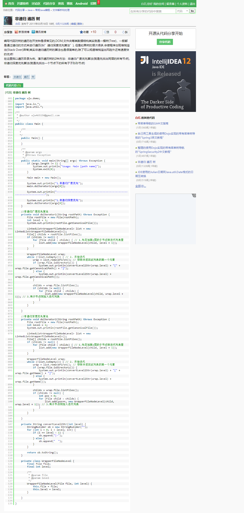

## Groovy秘诀

听说java世界里有个**Groovy**大神!java需要半天处理的事情，Groovy只需要几分钟，是的，几分钟…剩下来的时间，程序员终于有时间泡妹子了，^_^…….技术宅的兄弟，赶紧来看看吧。  

1. 首先炫技一把!找**质数**,你们先想想用Java需要多少代码?Groovy一行足以!

```groovy
def t = 1..100
(2..Math.sqrt(t.last())).each { n -> t -= ((2*n)..(t.last())).step(n) }
println t

//===>
[1, 2, 3, 5, 7, 11, 13, 17, 19, 23, 29, 31, 37, 41, 43, 47, 53, 59, 61, 67, 71, 73, 79, 83, 89, 97]

```
2. 再来一个装逼的问题:现在手头有很多的0.5美元、0.25美元、10美分、5美分、1美分，将1美元换成这些零钱，有多少种换法?  
```groovy
def count=0 
101.times{ x1 -> 21.times{
    x2 -> 11.times{ 
        x3 -> 5.times{ 
            x4 -> 3.times{ 
                x5 -> if(x1*1+x2*5+x3*10+x4*25+x5*50 == 100){
                         count++ 
                         println "$x1*1+$x2*5+$x3*10+$x4*25+$x5*50 == 100" 
                    } 
                } 
            } 
        } 
    } 
} 
println count

//===>
0*1+0*5+0*10+0*25+2*50 == 100
0*1+0*5+0*10+2*25+1*50 == 100
0*1+0*5+0*10+4*25+0*50 == 100
0*1+0*5+5*10+0*25+1*50 == 100
0*1+0*5+5*10+2*25+0*50 == 100
0*1+0*5+10*10+0*25+0*50 == 100
0*1+1*5+2*10+1*25+1*50 == 100
0*1+1*5+2*10+3*25+0*50 == 100
0*1+1*5+7*10+1*25+0*50 == 100
0*1+2*5+4*10+0*25+1*50 == 100
0*1+2*5+4*10+2*25+0*50 == 100
0*1+2*5+9*10+0*25+0*50 == 100
0*1+3*5+1*10+1*25+1*50 == 100
0*1+3*5+1*10+3*25+0*50 == 100
.............................

292

```
>  为什么是101,21,11,5,3  
>  Range的起点是0开始的
>  100个1美分=1美元  (0..100)->101
>  20个5美分=1美元  (0..20)->21
>  10个10美分=1美元  (0..10)->11
>  4个0.25美元=1美元  (0..3)->4
>  2个0.5美元=1美元  (0..2)->3  

好了,炫技装逼结束!!!   

**Java作为一种通用、静态类型的编译型语言有很多优势，但同样存在一些负担**：

+ 重新编译太费工；
+ 静态类型不够灵活，重构起来时间可能比较长；
+ 部署的动静太大；
+ java的语法天然不适用生产DSL；

**那讲讲Groovy的优点:**  

groovy类在字节码级别就是java类,所以,groovy 对象在内存中就是java对象,在源代码级别, groovy 类和对象处理几乎是 java 语法的一个超集!

+ Groovy可以兼容java
  是的，你可以用java语法来编写groovy,最后还可以生成class文件，直接用java调用。  
+ Groovy是动态的
  不需要java的反射，不需要冗长的代码，不需要各种try catch 异常，你就可以实现各种神奇的事情。  
+ 函数字面值；
+ 对集合的一等支持；
+ 对正则表达式的一等支持；
+ 对XML,JSON的一等支持；
+ Groovy是一把瑞士军刀
  java是一把基础工具，等你需要的时候，你需要到处去找jar包，来填充自己的程序，而且你需要看API去弄懂各种使用。此外，java的编写实在是太冗长了，为了打印一个HelloWorld，你需要编写class, 写一个main函数。对于Groovy来说：print “hello world!”.这一句就足够了，这只是开始…  

**来,让我们进入Groovy的神奇世界吧!**  

## Groovy具有的特性

###  自动导入
```Groovy
import java.lang.*;
import java.util.*;
import java.net.*;
import java.io.*;
import java.math.BigInteger;
import java.math.BigDecimal;
import groovy.lang.*;
import groovy.util.*;
```
> Java会自动帮你导入`java.lang`包
> Groovy会自动帮你导入上面的那些包
>

### 可选的分号`;`
```groovy
def msg = "Hello"
msg += " World"; msg += "!";
println msg;
```

### 可选的圆括号`()`
```groovy
def msg = "Hello"
msg += " World"; msg += "!";
println msg;
```
在Groovy中，方法参数的圆括号是可选的。
这通常用于`println`等简单方法。然而,**如果一个方法没有参数，就必须使用括号**。
例如:

```groovy
def s = "Hello"
println s.toUpperCase()
```

### 可选的返回语句
```groovy
String getFullName(){
  return "${firstName} ${lastName}"
}

//equivalent code
String getFullName(){
  "${firstName} ${lastName}"
}
```
Groovy中方法的**最后一行**是隐式返回语句。我们可以显式地使用return语句或安全地关闭它。

### 可选的变量类型 (Duck Typing)
```groovy
def y = "Hello"
String z = "Hello"
println y.class

//===> java.lang.String

println y.class == z.class
//===> true
```
因为Groovy是动态语言,Groovy并不强迫你显式地定义一个变量的类型。

### 可选的异常处理
```groovy
//in Groovy:
def reader = new FileReader("/foo.txt")

//in Java:
try{
  Reader reader = new FileReader("/foo.txt")
} catch(FileNotFoundException e) {
  e.printStackTrace()
}
```
在Java中，有两种类型的异常:`已检查`的和`未检查`的。
`检查异常`扩展自java.lang.Exception。我们必须包装可能在try/catch块中抛出异常的方法。  
`未经检查异常`扩展自java.lang.Error或java.lang.RuntimeException。异常，如NullPointerException，ClassCastException和IndexOutOfBoundsException可能被抛出
方法，但编译器不需要您将它们包装在一个try / catch块。  
Groovy通过将所有已检查的异常转换为未检查的异常来解决这个问题  

### 操作符重载
```groovy
def d = new Date()
//===> Sat Sep 01 13:14:20 MDT 2007

d.next()
//===> Sun Sep 02 13:14:20 MDT 2007OPERATOR OVERLOADING 51

(1..3).each{ println d++ }
//===>
Sat Sep 01 13:14:20 MDT 2007
Sun Sep 02 13:14:20 MDT 2007
Mon Sep 03 13:14:20 MDT 2007
```
在Groovy中操作符重载还活着,正如在本例中看到的，`++`操作符在幕后调用`next()`方法。下面的列表显示了运算符和对应的方法调用:  

| Operator         | Method      |
| ---------------- | ----------- |
| a == b or a != b | a.equals(b) |
|a + b |a.plus(b)|
|a - b |a.minus(b)|
|a * b |a.multiply(b)|
|a / b |a.div(b)|
|a % b |a.mod(b)|
|a++ or ++a |a.next()|
|a- - or - -a |a.previous()|
|a & b |a.and(b)|
|a | b |a.or(b)|
|a[b] |a.getAt(b)|
|a[b] = c |a.putAt(b,c)|
|a << b |a.leftShift(b)|
|a >> b |a.rightShift(b)|
|a < b or a > b or a <= b or a >= b |a.compareTo(b)|

这种语法糖在整个GDK (Groovy对JDK的增强)中都有出现  

### 安全取值`?`
```groovy
def s = "Jane"
s.size()
//===> 5

s = null
s.size()

//===>
Caught: java.lang.NullPointerException: Cannot invoke method size()
on null object at CommandLine.run(CommandLine.groovy:2)

//notice that we can call size()
//without throwing a NullPointerException
//thanks to the safe dereferencing ? operator
s?.size()
//===> null
```
Groovy的安全取值避免了空指针异常  
```groovy
//in Java:
if(person != null && person.getAddress() != null
&& person.getAddress().getPhoneNumber() != null ){
  System.out.println(person.getAddress().getPhoneNumber());
}
else{
  System.out.println("");
}

//in Groovy:
println person?.address?.phoneNumber
```

### 自动装箱`Autoboxing`
在Java中有原始类型`int, float, doubl`和包装对象`Integer, Float, Double`  
当Java 5发布时，Sun 添加了自动装箱(透明地将原始类型转换成包装对象)，但是Sun没有消除原始类型/包装对象的划分;它只是让它变得不那么明显。  
在Groovy中，**一切都是对象**。一切! 在Groovy中，原始类型就不再存在了。  
Groovy还把Java5的自动装箱又向前推进了一步——自动装箱一切都在运行。  

```groovy
def i = 2
println i.class
//===> java.lang.Integer

def d = 2.2
println d.class
//===> java.math.BigDecima

float f = (float) 2.2F
f.class
//===> class java.lang.Float
```

### 对`true`的增强
`0、NULL和""(空字符串)`都赋值为`false`。这意味着在处理用户输入时，一个简单的`if(args)`就能捕获所有您想要避免的事情。
```groovy
//true
if(1) // any non-zero value is true
if(-1)
if(!null) // any non-null value is true
if("John") // any non-empty string is trueGROOVY TRUTH 55
Map family = [dad:"John", mom:"Jane"]
if(family) // true since the map is populated
String[] sa = new String[1]
if(sa) // true since the array length is greater than 0
StringBuffer sb = new StringBuffer()
sb.append("Hi")
if(sb) // true since the StringBuffer is populated

//false
if(0) // zero is false
if(null) // null is false
if("") // empty strings are false
Map family = [:]
if(family) // false since the map is empty
String[] sa = new String[0]
if(sa) // false since the array is zero length
StringBuffer sb = new StringBuffer()
if(sb) // false since the StringBuffer is empty
```

### 嵌入的引号
```groovy
def s1 = 'My name is "Jane"'
def s2 = "My name is 'Jane'"
def s3 = "My name is \"Jane\""
```
Groovy为Java字符串添加了一些不错的新技巧。在Java中，单引号用于表示单个char。在Groovy中，我们可以使用单引号将字符串括起来。这意味着我们可以使用**单引号**来保存包含双引号的字符串，而不必转义它们。当然，包含嵌入单引号的双引号字符串也是如此。带有退格的转义字符在两种语言中都是一样的。  

### 三个引号`"""`
```groovy
String s = """This is a
multi-line String.
"You don't need to escape internal quotes", he said.
"""

def ss = '''This
That, The Other'''

def xml = """
<book id="987">
<title>Groovy Recipes</title>
<author>Scott Davis</author>
</book>"""

def html = """<body onload="init()">...</body>"""
```
许多动态语言，从Python到Perl再到Ruby都提供`heredoc`。一个`heredoc`允许您在单个变量中存储多行字符串。Groovy使用**三引号**(三个单引号或三个双引号)来定义这个文档。

### 魔力字符串`GStrings`
```groovy
def name = "John"
println "Hello ${name}. Today is ${new Date()}"

//===> Hello John. Today is Fri Dec 28 15:16:32 MDT 2007
```
对于任何使用Ant构建文件或Java服务器页面(jsp)的人来说，字符串中嵌入的美元符号和花括号都是很熟悉的。它使字符串连接比传统Java容易得多:“Hello”+ name +“.”。
Groovy以`GStrings`(当然是“Groovy字符串”的缩写)的形式将这种语法引入到语言中。任何嵌入表达式的字符串都是GString!

### 列表`List`
```groovy
def languages = ["Java", "Groovy", "JRuby"]
println languages.class

//===> java.util.ArrayList
```
Groovy为创建ArrayList提供了简洁的语法。  
虽然方括号默认会给你一个ArrayList，但你可以
在一行的末尾加一个`as`子句，以转换其他的类型。例如:

```groovy
def languages = ["Java", "Groovy", "JRuby"] as String[]
def languages = ["Java", "Groovy", "JRuby"] as Set
```
#### 创建空的列表
```groovy
def empty = []
println empty.size()

//===> 0
```
#### 添加元素
```groovy
def languages = ["Java", "Groovy", "JRuby"]
languages << "Jython"

//===> [Java, Groovy, JRuby, Jython]
```
> 神奇的`<<`  

####  获取元素

```groovy
def languages = ["Java", "Groovy", "JRuby"]
println languages[1]
println languages.getAt(1)

//==> Groovy
```
####  枚举
```groovy
def languages = ["Java", "Groovy", "JRuby"]
//using the default 'it' variable:
languages.each{println it}

//===>
Java
Groovy
JRuby

//using the named variable of your choice:
languages.each{lang ->
  println lang
}

//===>
Java
Groovy
JRuby
```

#### 带索引的枚举
```groovy
def languages = ["Java", "Groovy", "JRuby"]
languages.eachWithIndex{lang, i ->
  println "${i}: ${lang}"
}

//===>
0: Java
1: Groovy
2: JRuby
```

#### 排序
```groovy
def languages = ["Java", "Groovy", "JRuby"]
languages.sort()
//===> [Groovy, JRuby, Java]

println languages
//===> [Groovy, JRuby, Java]
```

#### 倒转
```groovy
def languages = ["Java", "Groovy", "JRuby"]
languages.reverse()
//===> [JRuby, Groovy, Java]

println languages
//===> [Java, Groovy, JRuby]
```

#### 弹出
```groovy
def languages = ["Java", "Groovy", "JRuby"]
languages.pop()
//===> "JRuby"

println languages
//===> [Java, Groovy]
```

#### 连接
```groovy
def languages = ["Java", "Groovy", "JRuby"]
def others = ["Jython", "JavaScript"]
languages += others
//===> [Java, Groovy, JRuby, Jython, JavaScript]

languages -= others
//===> [Java, Groovy, JRuby]
```

#### 结合`join`
```groovy
def languages = ["Java", "Groovy", "JRuby"]
println languages.join()
//===> JavaGroovyJRuby

//sum()的妙用
println languages.sum()
//===> JavaGroovyJRuby

println languages.join(",")
//===> Java,Groovy,JRuby
```

#### 发现所有`findAll`
```groovy
def languages = ["Java", "Groovy", "JRuby"]
languages.findAll{ it.startsWith("G") }

//===> [Groovy]
```
`findAll()`允许您查询列表。它返回一个新列表，其中包含所有符合条件的元素。  

#### 发现任何`any`
```groovy
//List中是否含有某个字符串
def wordList = ['groovy', 'akka', 'grails framework', 'spock', 'typesafe']
def tweet = 'This is an example tweet talking about groovy and spock.'
wordList.any { word -> tweet.contains(word) }

//===> true
```

#### 按条件拆分List`split`
```groovy
def (passed, failed) = [49, 58, 76, 82, 88, 90].split{ it > 60 }

//===>
 [[76, 82, 88, 90], [49, 58]]
```

#### 统计`Max, Min, Sum`
```groovy
def scores = [80, 90, 70]
println scores.max()
//===> 90

println scores.min()
//===> 70

println scores.sum()
//===> 240
```

#### 收集`Collect`
```groovy
def languages = ["Java", "Groovy", "JRuby"]
languages.collect{ it += " is cool"}

//===> [Java is cool, Groovy is cool, JRuby is cool]
```
如果要修改列表中的每个元素，可以使用`collect()`方法。注意，`collect()`不修改原始列表。它返回一个新列表。  

#### 变平`Flatten`
```groovy
def languages = ["Java", "Groovy", "JRuby"]
def others = ["Jython", "JavaScript"]
languages << others
//===> [Java, Groovy, JRuby, [Jython, JavaScript]]

languages = languages.flatten()
//===> [Java, Groovy, JRuby, Jython, JavaScript]
```

#### 蔓延`Spread Operator (*)`
```groovy
def languages = ["Java", "Groovy", "JRuby"]
println languages*.toUpperCase()
//===> [JAVA, GROOVY, JRUBY]
```
`蔓延`运算符允许您简洁地遍历一个列表，对每个元素调用相同的方法.  

### 映射`Map`
```groovy
def family = [dad:"John", mom:"Jane"]
println family.getClass()

//===> java.util.LinkedHashMap
```
Groovy为创建映射提供了简洁的语法。只需在等号右边的方括号中放入一个以逗号分隔的名称/值对列表，就可以得到一个映射。  

#### 创建空的Map
```groovy
def empty = [:]
println empty.size()
//===> 0
```

#### 获取元素
```groovy
def family = [dad:"John", mom:"Jane"]
family.get("dad")
family.dad
family["dad"]

===> John
```
问题: 为什么`. class`在其他类上都行除了Map?
```groovy
def family = [dad:"John", mom:"Jane"]
println family.class
===> null
println family.getClass()
===> java.util.LinkedHashMap
```
调用`map.clas`,类返回`null`而不是类类型。  
为什么?因为映射不包含一个名为`class`的元素类。  
对于Map,你必须使用Java形式的长方法`map.getClass()`  

#### 添加元素
```groovy
def family = [dad:"John", mom:"Jane"]
family.put("kid", "Timmy")
family.kid2 = "Susie"
family["kid3"] = "Susie3"

println family

//===> dad:John, mom:Jane, kid:Timmy, kid2:Susie, kid3:Susie3]
```

#### 枚举
```groovy
def family = [dad:"John", mom:"Jane"]
//using the default 'it' variable:
family.each{println it}
//===>
dad=John
mom=Jane

//getting the key and value from 'it'
family.each{println "${it.value} is the ${it.key}"}
//===>
John is the dad
Jane is the momMAP SHORTCUTS 64

//using named variables for the key and value
family.each{k,v ->
  println "${v} is the ${k}"
}
//===>
John is the dad
Jane is the mom
```

#### 连接`Concatenating`
```groovy
def family = [dad:"John", mom:"Jane"]
def kids = [kid:"Timmy", kid2:"Susie"]
family += kids
//===> {dad=John, kid=Timmy, kid2=Susie, mom=Jane}

//删除
kids.each{k,v->
  family.remove("${k}")
}
//===> {dad=John, mom=Jane}
```

#### 查找keys
```groovy
def family = [dad:"John", mom:"Jane"]
family.keySet()
//===> [dad, mom]

family.containsKey("dad")
//===> true
```

#### 查找Values
```groovy
def family = [dad:"John", mom:"Jane"]
family.values()
//===> [John, Jane]

family.containsValue("John")
//===> true
```

### 范围`Ranges`

Groovy为范围提`Ranges`供了一种本机数据类型。您可以将范围`Ranges`存储在变量中，也可以动态地创建和使用它们。  
```groovy
def r = 1..3
println r.class
//===> groovy.lang.IntRange

r.each{println it}
//===>
1 2 3

r.each{ println "Hi" }
//===>
Hi
Hi
Hi

(1..3).each{println "Bye"}
//===>
Bye
Bye
Bye
```

#### Size, From, To
```groovy
def r = 1..3
r.size()
//===> 3
r.from
//===> 1
r.to
//===> 3
```

#### 遍历`For`
```groovy
for(i in 1..3){ println "Attempt ${i}" }
//===>
Attempt 1
Attempt 2
Attempt 3

(1..3).each{ println "Attempt ${it}" }
//===>
Attempt 1
Attempt 2
Attempt 3

```

#### 包含`Contains`
```groovy
def r = 1..3
r.contains(1) && r.contains(3)
//===> true

r.contains(2)
//===> true

r.contains(12)
//===> false
```

#### 倒转`Reverse`
```groovy
def r = 1..3
r.reverse()
//===> [3, 2, 1]
```

### 闭包`Closures`
在Groovy里闭包无处不在!
```groovy
def hi = { println "Hi"}
hi()

//===> Hi
```
上面例子是最简单的形式`groovy.lang.Closure`,闭包是一个独立的、命名的代码块。它是没有包装类的行为。

#### 接收参数
```groovy
def hello = { println "Hi ${it}" }
hello("John")
hello "John"

//===> Hi John
```

下面是一个稍微高级一点的闭包示例。请注意
在`each`和`convertToCelsius`闭包中如何使用`it`参数
闭包。
```groovy
def convertToCelsius = {
  return (5.0/9.0) * (it.toFloat() - 32.0)
}

[0, 32, 70, 100].each{
  println "${it} degrees fahrenheit in celsius: ${convertToCelsius(it)}"
}

//===>
0 degrees fahrenheit in celsius: -17.7777777792
32 degrees fahrenheit in celsius: 0.0
70 degrees fahrenheit in celsius: 21.1111111128
100 degrees fahrenheit in celsius: 37.7777777808

```

#### 命名参数
```groovy
def calculateTax = { taxRate, amount ->
  return amount + (taxRate * amount)
}
println "Total cost: ${calculateTax(0.055, 100)}"

//===> Total cost: 105.500
```

#### 固定参数`Currying Parameters`
函数柯里化（currying）是函数式编程中常用的技术。有时候我们在复用已有函数时可能需要固定其中的部分参数.
这除了可以通过默认值参数来实现之外，还可采用固定参数的方式`Currying Parameters`:
是把多个参数放进一个接受许多参数的函数，形成一个新的函数接受余下的参数，并返回结果。  

```groovy
def calculateTax = { taxRate, amount ->
  return amount + (taxRate * amount)
}
def tax = calculateTax.curry(0.1)

[10,20,30].each{
println "Total cost: ${tax(it)}"
}

//===>
Total cost: 11.0
Total cost: 22.0
Total cost: 33.0
```

## Groovy与java集成的方式

### GroovyClassLoader
用 Groovy 的 `GroovyClassLoader` ，动态地加载一个脚本并执行它的行为。GroovyClassLoader是一个定制的类装载器，负责解释加载Java类中用到的Groovy类。
```groovy
GroovyClassLoader loader = new GroovyClassLoader();
Class groovyClass = loader.parseClass(new File(groovyFileName));
GroovyObject groovyObject = (GroovyObject) groovyClass.newInstance();
groovyObject.invokeMethod("run", "helloworld");
```
### GroovyShell
`GroovyShell`允许在Java类中（甚至Groovy类）求任意Groovy表达式的值。您可使用Binding对象输入参数给表达式，并最终通过GroovyShell返回Groovy表达式的计算结果。

```groovy
GroovyShell shell = new GroovyShell();
Script groovyScript = shell.parse(new File(groovyFileName));
Object[] args = {};
groovyScript.invokeMethod("run", args);
```

### GroovyScriptEngine
GroovyShell多用于推求对立的脚本或表达式，如果换成相互关联的多个脚本，使用GroovyScriptEngine会更好些。GroovyScriptEngine从您指定的位置（文件系统，URL，数据库，等等）加载Groovy脚本，并且随着脚本变化而重新加载它们。如同GroovyShell一样，GroovyScriptEngine也允许您传入参数值，并能返回脚本的值。  

##  GroovyBeans (aka POGOs)

### 自动生成Getters and Setters
```groovy
class Book{
  String title
}
Book book = new Book()
book.setTitle("Groovy Recipes")
println book.getTitle()

//===> Groovy Recipes
```

### Getter and Setter 的快捷方式
```groovy
class Book{
  String title
}
Book book = new Book()
book.title = "Groovy Recipes"
//book.setTitle("Groovy Recipes")

println book.title
//println book.getTitle()

//===> Groovy Recipes
```

### 禁止自动生成Getters and Setters
```groovy
class Book2{
  private String title
}
println Book2.getDeclaredField("title")
//===> private java.lang.String Book2.title

println Book2.methods.each{println it}; "DONE"
// neither getTitle() nor setTitle() should appear in the list
```
在Groovy中显式地将字段标记为private会抑制创建相应的getter和setter方法。如果您希望该字段真正隐藏在Java类中，那么这是很有帮助的。  

但是对于其他Groovy类的可见性又如何呢?好吧，这段代码片段应该会让您非常清楚地知道该字段仍然是可访问的;尽管缺少getter和setter方法:

```groovy
def b2 = new Book2()
b2.title = "Groovy Recipes"
println b2.title

//===> Groovy Recipes
```
>  Groovy在隐私方面有一些问题——简而言之，它忽略了`私有`修饰符。

如果要保护私有字段不受意外修改，您可以添加一对无所事事的`getter`和`setter`。

```groovy
class Book3{
  private String title
  private String getTitle(){}
  private void setTitle(title){}
}

def b3 = new Book3()
b3.title = "Groovy Recipes"
println b3.title

//===> null
```
> 尽管创建“不做任何事情”的getter和setter会保护您的私有字段不被偶然的用户访问，但是在字段名中添加`@`前缀是允许的,您可以直接访问任何字段——公共的、私有的或受保护的。  


### `getProperty` 和`setProperty`
```groovy
class Book{
  String title
}
Book book = new Book()
book.setProperty("title", "Groovy Recipes")
//book.title = "Groovy Recipes"
//book.setTitle("Groovy Recipes")

println book.getProperty("title")
//println book.title
//println book.getTitle()

//===> Groovy Recipes
```

### 通过`GStrings`来存取属性
```groovy
class Book{
  String title
}

def b = new Book()
def prop = "title"
def value = "Groovy Recipes"

b."${prop}" = value
println b."${prop}"

//===> Groovy Recipes
```

###  使属性事只读的
```groovy
class Book{
  final String title
  
  Book(title){
    this.title = title
  }
}

Book book = new Book()
book.title = "Groovy Recipes"
//===>
ERROR groovy.lang.ReadOnlyPropertyException:
Cannot set readonly property: title for class: Book

Book book2 = new Book("GIS for Web Developers")
println book2.title
//===>
GIS for Web Develop
```
>  在Groovy和Java中，`final`修饰符的工作方式都是一样的。  


### 构造函数的简洁用法
```groovy
class Book{
  String title
  String author
  Integer pages
}

Book book1 = new Book(title:"Groovy Recipes", author:"Scott Davis", pages:250)
Book book2 = new Book(pages:230, author:"Scott Davis", title:"GIS for eb Developers")
Book book3 = new Book(title:"Google Maps API")
Book book4 = new Book()
```
>  通过支持`命名`参数和`可变长度`参数，您可以以任何您认为合适的方式实例化类。  


### 可选参数/缺省值
```groovy
class Payment{
  BigDecimal amount
  String type
  
  public Payment(BigDecimal amount, String type="cash"){
    this.amount = amount
    this.type = type
  }
  
  String toString(){
    return "${amount} ${type}"
  }
}

def pmt1 = new Payment(10.50, "cash")
println pmt1
//===> 10.50 cash

def pmt2 = new Payment(12.75)
println pmt2
//===> 12.75 cash

def pmt3 = new Payment(15.99, "credit")
println pmt3
//===> 15.99 credit
```

### 私有方法
```groovy
class Book{
  String title
  private String getTitle(){
    return title
  }
  
  private void setTitle(String title){
    this.title = title
  }
  
  private void poke(){
    println "Ouch!"
  }
}

Book book = new Book()CALLING GROOVY FROM JAVA 79
// notice that Groovy completely ignores the private access modifier
book.title = "Groovy Recipes"
println book.title
===> Groovy Recipes

book.poke()
===> Ouch!
```
> 简单地说，Groovy不关心方法的私有访问修饰符。
> 您可以像调用公共方法一样轻松地调用私有方法。
> 那私有方法的用处何在?
> `私有方法不会出现在公共接口中`。这意味着当您调用`Book.methods.each{println it}`时，poke()不会出现。要知道poke()是可用的，唯一的方法是你面前有源代码。  

## 强大的AST注解

Groovy编译器在生成字节码前，会先将代码转换为抽象代码树（Abstract Syntax Tree）。在这个转换过程中，我们可以让机器替我们自动插入很多代码。Groovy 提供了更多的 AST 转换选项，从而进一步减少了那些重复而乏味的例行代码。  

### `@TypeChecked`静态类型检查
静态类型检查器建立在Groovy已有、强大的AST（抽象语法树）之上，不熟悉它们的开发者可以将其视为一种利用注解触发的可选编译器插件。作为可选特性，不需要它时，Groovy不会强制你使用。要触发静态类型检查，只需在方法或类上使用@TypeChecked注解就可以在你期望的粒度级别打开检查。让我们首先看一个示例：  
```groovy
import groovy.transform.TypeChecked

void someMethod() {}

@TypeChecked
void test() {
    // 编译错误：
    // 找不到匹配的sommeeMethod()
    sommeeMethod()

    def name = "Marion"

    // 编译错误：
    // 没有声明变量naaammme
    println naaammme
}

/*
2 compilation errors:

[Static type checking] - Cannot find matching method ConsoleScript56#sommeeMethod(). Please check if the declared type is correct and if the method exists.
 at line: 9, column: 5

[Static type checking] - The variable [naaammme] is undeclared.
 at line: 15, column: 13
*/
```
>  我们用`@TypeChecked`注解了test()方法，它告诉Groovy编译器在编译时对指定的方法进行静态类型检查。我们试图调用带有明显拼写错误的someMethod()，并打印另一个拼错的name变量，编译器会分别抛出2个编译错误，因为找不到对应的方法和变量声明。  

### `@CompileStatic`静态编译
Groovy 2.0支持JVM新的"invoke dynamic"指令及其相关API，它们简化了Java平台上动态语言的开发并为Groovy的动态调用带来了额外的性能提高。但是还是比不上javac生成的字节码; 而`@CompileStatic`就是允许类型检查后的代码代码可被静态编译。
```groovy
import groovy.transform.CompileStatic

@CompileStatic
int squarePlusOne(int num) {
	num * num + 1
}

assert squarePlusOne(3) == 10
/* 有@CompileStatic的,经过静态编译后的字节码
// access flags 0x1
  public squarePlusOne(I)I
   L0
    LINENUMBER 5 L0
    ILOAD 1
    ILOAD 1
    IMUL
    ICONST_1
    IADD
    IRETURN
   L1
   FRAME FULL [] [java/lang/Throwable]
    NOP
    NOP
    ATHROW
    LOCALVARIABLE this Lscript1540279088950; L0 L1 0
    LOCALVARIABLE num I L0 L1 1
    MAXSTACK = 2
    MAXLOCALS = 2

*/

/* 没有@CompileStatic的,动态调用的字节码
  // access flags 0x1
  public squarePlusOne(I)I
   L0
    LINENUMBER 2 L0
    ILOAD 1
    ILOAD 1
    INVOKEDYNAMIC invoke(II)Ljava/lang/Object; [
      // handle kind 0x6 : INVOKESTATIC
      org/codehaus/groovy/vmplugin/v7/IndyInterface.bootstrap(Ljava/lang/invoke/MethodHandles$Lookup;Ljava/lang/String;Ljava/lang/invoke/MethodType;Ljava/lang/String;I)Ljava/lang/invoke/CallSite;
      // arguments:
      "multiply", 
      0
    ]
    ICONST_1
    INVOKEDYNAMIC invoke(Ljava/lang/Object;I)Ljava/lang/Object; [
      // handle kind 0x6 : INVOKESTATIC
      org/codehaus/groovy/vmplugin/v7/IndyInterface.bootstrap(Ljava/lang/invoke/MethodHandles$Lookup;Ljava/lang/String;Ljava/lang/invoke/MethodType;Ljava/lang/String;I)Ljava/lang/invoke/CallSite;
      // arguments:
      "plus", 
      0
    ]
    INVOKESTATIC org/codehaus/groovy/runtime/typehandling/DefaultTypeTransformation.intUnbox (Ljava/lang/Object;)I
    IRETURN
   L1
   FRAME FULL [] [java/lang/Throwable]
    NOP
    NOP
    ATHROW
    LOCALVARIABLE this Lscript1540279163256; L0 L1 0
    LOCALVARIABLE num I L0 L1 1
    MAXSTACK = 2
    MAXLOCALS = 2
*/
```
>  这次使用的是`@CompileStatic`，而非`@TypeChecked`，并且你的代码会被静态编译，同时生成的字节码非常像javac的字节码，运行速度一样。就像@TypeChecked注解，@CompileStatic能注解类和方法，@CompileStatic(SKIP)可以让某个方法在其所属类被@CompileStatic标记时不被静态编译。  
>  最后一点值得注意的是，框架或库代码作者可使用静态编译，这有助于避免当代码库中多个部分使用动态元编程时的负面影响。  

### `@Log`
通过使用该注释（或使用 @Commons/@Log4j/@Slf4j 选择其它日志框架），可以在 AST 转换过程中注入日志代码。  
```groovy
import groovy.util.logging.*

@Log
class Car {
  {
    log.info 'Static Initiation'
  }
}
new Car()
```
>  以上代码执行时，会生成级别为 INFO 的日志。（很久很久以前，我们都是靠 IDE 来插入日志代码的，因为很无趣，是吧）

### `@TimedInterrupt`
这一注释将有助于扼杀那些由患有BRAIN-DAMAGE(脑残)综合症的用户所制造了巨耗时的任务，比如包含了死循环的代码
```groovy
@TimedInterrupt(5)
import groovy.transform.*

while(true) {}
```
>  这是个死循环，但是在使用注释后，运行该脚本将抛出异常： java.util.concurrent.TimeoutException: Execution timed out after 5 units.  
>  

### `@ToString`  
```groovy
import groovy.transform.*

@ToString
class T {
    int i, j
}

println new T(i: 12, j: -1)
//===> T(12, -1)

@ToString(includeNames = true)
class T2 {
	int i, j
}

println new T2(i: 12, j: -1)
//===> T2(i:12, j:-1)

```
就是这么简单!

### `@EqualsAndHashCode`  
如果你的比较逻辑是基于比较所有成员的值，那么可以使用这个注释  
```groovy
import groovy.transform.*

@EqualsAndHashCode
class T {
	int i, j
}
```

### `@TupleConstructor`  
基于元组的构造函数  
```groovy
import groovy.transform.*

@ToString
@TupleConstructor
class T {
	int i, j
}

println new T(1, -12)
//===> T(1, -12)
```

### `@Canonical`  
`ToString`，`TupleConstructor`以及`EqualsAndHashCode` 都是最常用的功能，而 `Canonical` 正是它们的组合  
```groovy
import groovy.transform.*

@Canonical
@ToString(includeNames = true)
class T {
    int i, j
}

println new T(1, -12)
//===> T(i:1, j:-12)
```

### `@Immutable `  
创建不可变对象，创建后不能更改。 这使得不可变对象在并发和函数编程中非常有用。 要将Java类定义为不可变，我们必须将所有属性定义为readonly和private。 只有构造函数可以设置属性的值。
使类不可变的Java代码很冗长，特别是因为需要重写hashCode()，equals()和toString()方法。  
Groovy有@Immutable转换为我们完成所有工作。 我们只需要在类定义中定义@Immutable，我们为这个类创建的任何对象都是一个不可变对象。 Groovy按照不可变对象的规则生成一个类文件。 所以所有属性都是只读的，创建构造函数来设置属性，生成hashCode()，equals()和toString()方法的实现.  
```groovy
@Immutable class User {
	String username, email
	Date created = new Date()
	Collection roles
}

def first = new User(username: 'mrhaki', email: 'email@host.com', roles: ['admin', 'user'])
assert 'mrhaki' == first.username
assert 'email@host.com' == first.email
assert ['admin', 'user'] == first.roles
assert new Date().after(first.created)
try {
	// Properties are readonly.
	first.username = 'new username'
} catch (ReadOnlyPropertyException e) {
	assert 'Cannot set readonly property: username for class: User' == e.message
}
try {
	// Collections are wrapped in immutable wrapper classes, so we cannot
	// change the contents of the collection.
	first.roles << 'new role'
} catch (UnsupportedOperationException e) {
	assert true
}
```

### @Builder 
我们可以使用@Builder AST转换轻松地为我们的类创建一个`fluent(流式)`的API。
```groovy
import groovy.transform.builder.Builder

@Builder
class Message {
    String from, to, subject, body
}

def message = Message
        .builder()  // New internal helper class.
        .from('mrhaki@mrhaki.com')  // Method per property.
        .to('mail@host.nl')
        .subject('Sample mail')
        .body('Groovy rocks!')
        .build()  // Create instance of Message

assert message.body == 'Groovy rocks!'
assert message.from == 'mrhaki@mrhaki.com'
assert message.subject == 'Sample mail'
assert message.to == 'mail@host.nl'
```

### @WithReadLock / @WithWriteLock  
在以下代码中，如果没有调用 refresh()，那么可以有多个线程同时调用 getResource(key)，一旦有任何线程开始调用 refresh()，那么锁就会生效，所有调用 getResource 的线程都将进入等待状态。
```groovy
import groovy.transform.*
public class ResourceProvider {

    private final Map data = new HashMap();

    @WithReadLock
    public String getResource(String key) throws Exception {
        return data.get(key);
    }

    @WithWriteLock
    public void refresh() throws Exception {
        //reload the resources into memory
    }
}
```

## Groovy和Shell

### 简单运行shell脚本
```groovy
// in Windows:
println "cmd /c dir".execute().text

//in Unix / Linux / Mac OS X:
println "ls -al".execute().text
```
>  如果在字符串上简单地调用execute()，则不会捕获得到的输出文本。
>  如果希望看到shell命令返回的输出，可以将.text追加到.execute()的末尾。  
>  

### 如何处理Shell中的通配符
```groovy
//in Windows:
println "cmd /c dir *.groovy".execute().text
def c = ["cmd", "/c", "dir *.groovy"].execute().text
println c

//in Unix / Linux / Mac OS X:
def output = ["sh", "-c", "ls -al *.groovy"].execute().text
println output

//sadly, these don't work
println "ls -al *.groovy".execute().text
println "sh -c ls -al *.groovy".execute().text
```
>  我们可以调用String数组上的execute。数组中的第一个元素是命令，下面的所有元素都作为参数传入。

### 同时运行多个Shell命令
```groovy
//in Windows:
println "cmd /c dir c:\\opt & dir c:\\tmp".execute().text

//in Unix / Linux / Mac OS X:
println "ls /opt & ls /tmp".execute().text
```

### 等待Shell命令完成
```groovy
def p = "convert -crop 256x256 full.jpg tile.jpg".execute()
p.waitFor()
```

### 获取系统属性
```groovy
println System.getProperty("java.version")
//===> 1.8.0_172

System.properties.each{println it}
//===>
java.runtime.name=Java(TM) SE Runtime Environment
sun.boot.library.path=c:\Java\jdk1.8\jre\bin
java.vm.version=25.172-b11
java.vm.vendor=Oracle Corporation
java.vendor.url=http://java.oracle.com/
path.separator=;
java.vm.name=Java HotSpot(TM) 64-Bit Server VM
file.encoding.pkg=sun.io
user.country=CN
user.script=
sun.java.launcher=SUN_STANDARD
sun.os.patch.level=
program.name=
java.vm.specification.name=Java Virtual Machine Specification
user.dir=C:\WJW_E\WJW_DATA\OpenSource\groovy\bin
java.runtime.version=1.8.0_172-b11
java.awt.graphicsenv=sun.awt.Win32GraphicsEnvironment
java.endorsed.dirs=c:\Java\jdk1.8\jre\lib\endorsed
os.arch=amd64
java.io.tmpdir=C:\temp\
line.separator=
......
```

### 获取环境变量值
```groovy
println System.getenv("JAVA_HOME")
//===> c:\Java\jdk1.8

System.env.each{println it}
//===>
configsetroot=C:\WINDOWS\ConfigSetRoot
USERDOMAIN_ROAMINGPROFILE=WJW-THINKPAD
COMMAND_COM="C:\WINDOWS\system32\cmd.exe"
PROCESSOR_LEVEL=6
SESSIONNAME=Console
ALLUSERSPROFILE=C:\ProgramData
CLASS=groovy.ui.Console
PROCESSOR_ARCHITECTURE=AMD64
PSModulePath=C:\Program Files\WindowsPowerShell\Modules;C:\WINDOWS\system32\WindowsPowerShell\v1.0\Modules
STARTER_CLASSPATH=C:\WJW_E\WJW_DATA\OpenSource\Groovy\bin\..\lib\groovy-2.5.2.jar
SystemDrive=C:
GROOVY_OPTS="-Xmx128m" -Dprogram.name="" -Dgroovy.home="C:\WJW_E\WJW_DATA\OpenSource\Groovy\bin\.." -Dtools.jar="c:\Java\jdk1.8\lib\tools.jar" -Dgroovy.starter.conf="C:\WJW_E\WJW_DATA\OpenSource\Groovy\bin\..\conf\groovy-starter.conf" -Dscript.name=""
DIRNAME=C:\WJW_E\WJW_DATA\OpenSource\Groovy\bin\
STARTER_CONF=C:\WJW_E\WJW_DATA\OpenSource\Groovy\bin\..\conf\groovy-starter.conf
USERNAME=wjw465150
TOOLS_JAR=c:\Java\jdk1.8\lib\tools.jar
ProgramFiles(x86)=C:\Program Files (x86)
PATHEXT=.COM;.EXE;.BAT;.CMD;.VBS;.VBE;.JS;.JSE;.WSF;.WSH;.MSC
DriverData=C:\Windows\System32\Drivers\DriverData
......
```

### 求值字符串`evaluate`
```groovy
def s = "Scott"
def cmdName = "size"
evaluate("println s.${cmdName}()")
//===> 5

cmdName = "toUpperCase"
evaluate "println s.${cmdName}()"
//===> SCOTT
```

## 文件技巧

### 列出目录中的所有文件(包括目录,但是不包含子目录)
```groovy
new File(".").eachFile{file ->
  println file
}
```
多简单!,再来看看Java的实现:
```java
import java.io.File;

public class DirList {
  public static void main(String[] args) {
    File dir = new File(".");
    File[] files = dir.listFiles();
    for (int i = 0; i < files.length; i++) {
      File file = files[i];
      System.out.println(file);
    }
  }
}
```

### 只列出目录
```groovy
new File(".").eachDir{dir ->
  println dir
}
```

### 只列出文件
```groovy
new File(".").eachFile{file ->
  if(file.isFile()){
    println file
  }
}
```

### 列出目录中的所有文件(包括目录以及子目录)
```groovy
new File(".").eachFileRecurse{file ->
  println file
}
```
如果是Java来实现,那就呵呵了,及其麻烦!为此早几年专门写过一个程序`怎样深度优先&广度优先来遍历目录`,见代码及附图
```java
package wjw.demo;

import java.io.*;
import java.util.*;


/**
 * @author wjw465150@gmail.com
 *
*/

public class Main {
    /**
   *
   */
    public Main() {
    }
    
    /**
     * @param args
     * @throws Exception
     */
    public static void main(String[] args) throws Exception {
        if (args.length != 1) {
            System.out.println("Usage: Main [path name]");
            System.exit(0);
        }
 
        Main main = new Main();
 
        System.out.println("1.非递归广度优先");
        main.doIterator1(args[0]);
 
        System.out.println("--------------------------------------------------------------------");
 
        System.out.println("1.非递归深度优先");
        main.doIterator2(args[0]);
    }
 
    //非递归广度优先算法
    private void doIterator1(String rootPath) throws Exception {
        File rootFile = new File(rootPath);
        int level = 1;
        System.out.println(rootFile.getCanonicalFile());
 
        LinkedList<WrapperFileNodeLevel> list = new LinkedList<WrapperFileNodeLevel>();
        File[] childs = rootFile.listFiles();
        if (childs != null) {
            for (File child : childs) { // 1.先添加第1层的子节点到迭代列表里
                list.add(new WrapperFileNodeLevel(child, level + 1));
            }
        }
 
        WrapperFileNodeLevel wrap;
        while (!list.isEmpty()) { // 2. 开始迭代
            wrap = list.removeFirst(); // 移除并返回此列表的第一个元素
            if (wrap.file.isDirectory()) {
                System.out.println(convertLevel2Str(wrap.level) + "[" + wrap.file.getCanonicalPath() + "]");
            } else {
                System.out.println(convertLevel2Str(wrap.level) + wrap.file.getCanonicalPath());
            }
 
            childs = wrap.file.listFiles();
            if (childs != null) {
                for (File child : childs) {
                    list.add(new WrapperFileNodeLevel(child, wrap.level + 1)); // 3.有子节点则加入迭代列表
                }
            }
        }
 
    }
 
    //非递归深度优先算法
    private void doIterator2(String rootPath) throws Exception {
        File rootFile = new File(rootPath);
        int level = 1;
        System.out.println(rootFile.getCanonicalFile());
 
        LinkedList<WrapperFileNodeLevel> list = new LinkedList<WrapperFileNodeLevel>();
        File[] childs = rootFile.listFiles();
        if (childs != null) {
            for (File child : childs) { // 1.先添加第1层的子节点到迭代列表里
                list.add(new WrapperFileNodeLevel(child, level + 1));
            }
        }
 
        WrapperFileNodeLevel wrap;
        while (!list.isEmpty()) { // 2. 开始迭代
            wrap = list.removeFirst(); // 移除并返回此列表的第一个元素
            if (wrap.file.isDirectory()) {
                System.out.println(convertLevel2Str(wrap.level) + "[" + wrap.file.getName() + "]");
            } else {
                System.out.println(convertLevel2Str(wrap.level) + wrap.file.getName());
            }
 
            childs = wrap.file.listFiles();
            if (childs != null) {
                int pos = 0;
                for (File child : childs) {
                    list.add(pos++, new WrapperFileNodeLevel(child, wrap.level + 1)); // 3.有子节点则加入迭代列表
                }
            }
        }
 
    }
 
    private String convertLevel2Str(int level) {
        StringBuilder sb = new StringBuilder("");
        for (int i = 0; i < level; i++) {
            if (i == level - 1) {
                sb.append("|-");
            } else {
                sb.append("  ");
            }
        }
 
        return sb.toString();
    }
 
    private class WrapperFileNodeLevel {
        final File file;
        final int level;
 
        /**
         * @param file
         * @param level
         */
        WrapperFileNodeLevel(File file, int level) {
            this.file = file;
            this.level = level;
        }
 
    }
 
}

```



### 列出目录中的指定类型的文件
```groovy
new File(".").eachFile{file ->
  if(file.name.endsWith(".jsp")){
    println file
  }
}
```
更简单的方法,通过正则表达式  
```groovy
new File(".").eachFileMatch(~/.*\.jsp/){file ->
  println file
}
```

### 读取文件内容
```groovy
new File("x.txt").eachLine{line->
  println line
}
```

### 读取文件内容到字符串变量里
```groovy
String body = new File("x.txt").text
```

### 读取文件内容到数组里
```groovy
List lines = new File("x.txt").readLines()
```

### 简单的分析文件
```groovy
// FileStats.groovy
File file = new File("juliet.txt")
List lines = file.readLines()
println "Number of lines: ${lines.size()}"

int wordCount = 0
file.splitEachLine(" "){words ->
  println words.size()
  wordCount += words.size()
}
println "Number of words: ${wordCount}"

//===>
Number of lines: 4
7 7
10
7
Number of words: 31
```

### 向文件里写内容
```groovy
File file = new File("hello.txt")
file.write("Hello World\n")
println file.text

//===>
Hello World

println file.readLines().size()

//===>
1
```
再对比一下Java的实现
```java
import java.io.*;
public class NewFile {
  public static void main(String[] args) {
    File file = new File("hello.txt");
    PrintWriter pw = null;
    try {
      pw = new PrintWriter(new BufferedWriter(new FileWriter(file)));
      pw.println("Hello World");
    } catch (IOException e) {
      e.printStackTrace();
    } finally {
      pw.flush();
      pw.close();
    }
    
    BufferedReader br = null;
    int lineCount = 0;
    try {
      br = new BufferedReader(new FileReader(file));
      String line = null;
      while ((line = br.readLine()) != null) {
        System.out.println(line);
        lineCount++;
      }
    } catch (FileNotFoundException e) {
      e.printStackTrace();
    } catch (IOException e) {
      e.printStackTrace();
    } finally {
      try {
        br.close();
      } catch (IOException e) {
        e.printStackTrace();
      }
    }
    System.out.println(lineCount);
  }
}
```

### 向文件里添加内容
```groovy
File file = new File("hello.txt")
println "${file.size()} lines"

//===> 1 lines
file.append("How's it going?\n")
file << "I'm fine, thanks.\n"
println "${file.size()} lines"

//===> 3 lines
```

### 合并几个文本文件
```groovy
// merge.groovy
File logDir = new File(".")
File mergedFile = new File("summary/merged.log")
mergedFile.write("") //empty out the existing file
logDir.eachFile { file - >
    if (file.isFile() && file.name.endsWith(".log")) {
      mergedFile << file.text
    }
}
```

### 复制文件
```groovy
//文本文件
def src = new File("src.txt")
new File("dest.txt").write(src.text)

//二进制文件
File src = new File("src.jpg")
new File("dest.jpg").withOutputStream{ out ->
  out.write src.readBytes()
}
```

### 添加自己的`copy`到File对象里
```groovy
File.metaClass.copy = { String destName - >
    if (delegate.isFile()) {
      new File(destName).withOutputStream { out - >
          out.write delegate.readBytes()
      }
    }
}
new File("src.jpg").copy("dest.jpg")
```
>  `metaClass`的威力后面会讲到!  

### 使用`AntBuilder`复制文件
Groovy内建了对Ant的支持!复杂的文件操作可以直接使用Ant的.
```groovy
//simple Copy
def ant = new AntBuilder()
ant.copy(file:"src.txt", tofile:"dest.txt")

//Copying a File to a Directory
def ant = new AntBuilder()
ant.copy(file:"src.txt", todir:"../backup")

//Overwriting the Destination File
def ant = new AntBuilder()
ant.copy(file:"src.txt", tofile:"dest.txt", overwrite:true)

//Using AntBuilder to Copy a Directory
def ant = new AntBuilder()
ant.copy(todir:"backup"){
  fileset(dir:"images")
}

//Selectively Including/Excluding Files
//NOTE: this WILL NOT copy files in subdirectories
// due to the pattern in include and exclude
def ant = new AntBuilder()
ant.copy(todir:"backup", overwrite:true){
  fileset(dir:"images"){
    include(name:"*.jpg")
    exclude(name:"*.txt")
  }
}

//NOTE: this WILL copy files in subdirectories
// due to the pattern in include and exclude
def ant = new AntBuilder()
ant.copy(todir:"backup", overwrite:true){
  fileset(dir:"images"){
    include(name:"**/*.jpg")
    exclude(name:"**/*.txt")
  }
}

//Flattening the Directory Structure on Copy
def ant = new AntBuilder()
ant.copy(todir:"backup", overwrite:true, flatten:true){
  fileset(dir:"images"){
    include(name:"**/*.jpg")
    exclude(name:"**/*.txt")
  }
}

// images (before):
images/logo.jpg
images/big_image.jpg
images/icons/button.jpg
images/icons/arrow.jpg
images/thumbnails/big_image_thumb.jpgMOVING/RENAMING FILES 112

// backup (after):
backup/logo.jpg
backup/big_image.jpg
backup/button.jpg
backup/arrow.jpg
backup/big_image_thumb.jpg
```

### 移动/重命门 文件
```groovy
// using the File method
File src = new File("src.txt")
src.renameTo(new File("dest.txt"))

// using the operating system
"mv src.txt dest.txt".execute()

// using AntBuilder
def ant = new AntBuilder()
ant.move(file:"src.txt", tofile:"dest.txt")
```

### 删除 文件
```groovy
// using the File method
new File("src.txt").delete()

// using the operating system
"rm src.txt".execute()

// using AntBuilder
def ant = new AntBuilder()
ant.delete(file:"src.txt")
```

### 删除 目录
```groovy
def ant = new AntBuilder()
ant.delete(dir:"tmp", includeemptydirs:"true")

//Deleting Selected Files from a Directory
def ant = new AntBuilder()
ant.delete{
  fileset(dir:"tmp", includes:"**/*.bak")
}

```

### 创建压缩文件
```groovy
def ant = new AntBuilder()

// zip files
ant.zip(basedir:"images", destfile:"../backup.zip")

// tar files
ant.tar(basedir:"images", destfile:"../backup.tar")
ant.gzip(zipfile:"../backup.tar.gz", src:"../backup.tar")
ant.bzip2(zipfile:"../backup.tar.bz2", src:"../backup.tar")


//Zipping Up Selected Files
def ant = new AntBuilder()
ant.zip(destfile:"../backup.zip"){
  fileset(dir:"images"){
    include(name:"**/*.jpg")
    exclude(name:"**/*.txt")
  }
}
```


### 解压缩 压缩文件
```groovy
def ant = new AntBuilder()

// unzip files
ant.unzip(src:"../backup.zip", dest:"/dest")

// untar files
ant.gunzip(src:"../backup.tar.gz")
ant.bunzip2(src:"../backup.tar.bz2")
ant.untar(src:"../backup.tar", dest:"/dest")

//Unzipping Selected Files
def ant = new AntBuilder()
ant.unzip(src:"../backup.zip", dest:"/dest"){
  patternset{
    include(name:"**/*.jpg")
    exclude(name:"**/*.txt")
  }
}
```

## 解析XML

### Parsing XML
```groovy
def p2 = """
<person id="100">
  <firstname>Jane</firstname>
  <lastname>Doe</lastname>
  <address type="home">
    <street>123 Main St</street>
    <city>Denver</city>
    <state>CO</state>
    <zip>80020</zip>
  </address>
</person>"""

def person = new XmlSlurper().parseText(p2)
println person.firstname
//===> Jane

println person.address.city
//===> Denver

println person.address.@type
//===> home
```

### `XmlParser`与`XmlSlurper`的异同

先来看看他们的相同之处。

- 构造方法都是一模一样的，从缺省的构造到自定义的reader，parser等完全的一样
- 解析XML的parse/parseText方法参数也完全的一致，当然了返回结果类型是不一样的
- 返回结果类型虽然不一样，但是他们处理GPath的语法却是那么一致  

其实，处理XML我们比较关注的还是处理Xml的过程，也就是parser的返回结果，可喜的是groovy.util.Node(XmlParser)和GPathResult(XmlSlurper)对GPath的支持都很好，以下简单罗 列一下他们常用的共同的方法：  
- name() 返回值：Node->Object,GPathResult->String
- text() 返回值：String
- toString() 返回值：String
- parent() 返回值：Node->Node,GPathResult->GPathResult，快捷方式：'**..**'
- children() 返回值：Node->List,GPathResult->GPathResult，快捷方式：'*****'
- attributes() 返回值：Map，在GPathResult中并不存在此方法，但是当是节点类型时候会有此方法（实际上还是调用Node的attributes）
- iterator() 返回值：Iterator
- depthFirst() 返回值：Node->List,GPathResult->Iterator，快捷方式：'***\***'
- breadthFirst() 返回值：Node->List,GPathResult->Iterator

此外对XML元素和属性的操作也是同样的一致，如下：  
- ['elementName']或.elementName，通过名称访问子元素
- [index]，通过下标访问子元素
- ['@attributeName']或.'@attributeName'，访问属性，GPathResult也可以将 引号去掉，直接用.@attributeName访问  

```groovy
def CAR_RECORDS = '''  
    <records>  
      <car name='HSV Maloo' make='Holden' year='2006'>  
        <country>Australia</country>  
        <record type='speed'>Production Pickup Truck with speed of 271kph</record>  
      </car>  
      <car name='P50' make='Peel' year='1962'>  
        <country>Isle of Man</country>  
        <record type='size'>Smallest Street-Legal Car at 99cm wide and 59 kg in weight</record>  
      </car>  
    </records>  
  '''  
def parserRoot = new XmlParser().parseText(CAR_RECORDS)  
def slurperRoot = new XmlSlurper().parseText(CAR_RECORDS)  
assert 'records'==parserRoot.name()  
assert 'records'==slurperRoot.name()  
assert 2==parserRoot.car.size()  
assert 2==slurperRoot.car.size()  

assert 'P50'==parserRoot.car[1].'@name'  
assert 'P50'==parserRoot.car[1].attribute('name')  
println parserRoot.car[1].@name.getClass()
println parserRoot.car[1].@name.size()
println parserRoot.car[1].@name.toString()

assert 'P50'==slurperRoot.car[1].@name.toString() //不能这样: assert 'P50'==slurperRoot.car[1].@name 
assert 'P50'==slurperRoot.car[1].@name.text()
assert slurperRoot.car[1].@name=='P50'

println slurperRoot.car[1].@name.getClass()
println slurperRoot.car[1].@name.size()
println slurperRoot.car[1].@name.toString()

assert slurperRoot.car.any{ it.@name == 'P50' }  

//===>
class java.lang.String
3
P50
class groovy.util.slurpersupport.Attributes
1
P50

```

说了那么多行同点，不禁要问既生“XmlParser”又生“XmlSlurper”，何必呢， 马上我们来看不同之处。前面也可以看到，它们最大的不同就是parse的返回类型不同，因此主要是groovy.util.Node(XmlParser)和GPathResult(XmlSlurper)的不同。  

`groovy.util.Node`是以list的形式来表述GPath的，因此Node在可显性有着明显的优势，比如toString可以直接看到结果，可以直接print，可以在原处修改等等。那缺点呢？显而易见，因为用list来表述，因 此也需要额外的内存空间来存储，这在Xml内容小的时候，没啥问题，可一旦处理大量的Xml时，要慎之！慎之！罗列一些Node特有的方法  
- Object value()
- void setValue(Object value)
- Object attribute(Object key)
- NodeList getAt(QName name)
- void print(PrintWriter out)

再来看看`GPathResult`，它没有使用list来处理GPath，而是采用iterators方式，因此没有了额外空间消耗，可是如果要访问最后一个node时候，可要费点时间了  

罗列一些GPathResult特有的方法  
- GPathResult parents()
- GPathResult declareNamespace(Map newNamespaceMapping)
- List list()
- int size()
- GPathResult find(Closure closure)
- GPathResult findAll(Closure closure)

总之，两种方式各有优缺点，每个人可以根据实际的情况灵活应用。

### 命名空间`Namespaces`的处理
```groovy
//Parsing an XML Document with Namespaces
def p_xml = """
<p:person
xmlns:p="http://somewhere.org/person"
xmlns:xsi="http://www.w3.org/2001/XMLSchema-instance"
xsi:schemaLocation="http://somewhere.org/person
http://somewhere.org/person.xsd"
id="99">
<p:firstname>John</p:firstname>
<p:last-name>Smith</p:last-name>
</p:person>
"""
def person = new XmlParser().parseText(p_xml)
//the firstname element cannot be found without its namespace
println person.firstname.text()
===> []
def p = new groovy.xml.Namespace("http://somewhere.org/person")
println person[p.firstname].text()
===> John
println person[p.'last-name'].text()
===> Smith

//Namespaces in XmlSlurper
//XmlSlurper缺省是忽略命名空间的
def p = """
<p:person
xmlns:p="http://somewhere.org/person"
xmlns:xsi="http://www.w3.org/2001/XMLSchema-instance"
xsi:schemaLocation="http://somewhere.org/person
http://somewhere.org/person.xsd"
id="99">
<p:firstname>John</p:firstname>
<p:last-name>Smith</p:last-name>
</p:person>
"""

def person = new XmlSlurper().parseText(p)
println person.firstname
println person.'last-name'
===>
John
Smith

//GPathResult是支持命名空间的,通过declareNamespace()方法
def itemXml = """
<item
xmlns:product="urn:somecompany:products"
xmlns:vendor="urn:somecompany:vendors">
<product:name>iPhone</product:name>POPULATING A GROOVYBEAN FROM XML 134
<vendor:name>Apple</vendor:name>
<quantity>1</quantity>
</item>
"""

def item = new XmlSlurper().parseText(itemXml)
println item.name
===> iPhoneApple

def ns = [:]
ns.product = "urn:somecompany:products"
ns.vendor = "urn:somecompany:vendors"
item.declareNamespace(ns)

println item.'product:name'
===> iPhone
```

### 把XML转换成POJO对象
```groovy
import groovy.transform.*

def p = """
<person>
  <firstname>Jane</firstname>
  <lastname>Doe</lastname>
</person>
"""

@ToString(includeNames = true)
class Person {
  String firstname
  String lastname
}

def pxml = new XmlParser().parseText(p)
def person = new Person()

pxml.children().each { child ->
    person.setProperty(child.name(), child.text())
}
println person

def sxml = new XmlSlurper().parseText(p)
def person2 = new Person()

sxml.children().each { child ->
    person2.setProperty(child.name(), child.text())
}

println person2

```

## 构建XML

### 使用`MarkupBuilder`简单的创建XML
```groovy
def xml = new groovy.xml.MarkupBuilder()
xml.person(id: 99) {
  firstname("John")
  lastname("Smith")
}

//===>
<person id='99'>
  <firstname>John</firstname>
  <lastname>Smith</lastname>
</person>
```
>  就像魔术一样，XML文档无缝的融合在Groovy中。  

### 使用`MarkupBuilder`捕获输出
```groovy
def sw = new StringWriter()
def xml = new groovy.xml.MarkupBuilder(sw);
xml.PERSON(id:100){
	firstName("Jane")
	LastName("Doe")
}
println sw.toString()
// ===>
<PERSON id='100'>
  <firstName>Jane</firstName>
  <LastName>Doe</LastName>
</PERSON>

def fw = new FileWriter("/path/to/some/file.xml")
def xml2 = new groovy.xml.MarkupBuilder(fw)
xml2.PERSON(id:100){
	firstName("Jane")
	LastName("Doe")
}
```

### 使用`MarkupBuilder`创建带命名空间的XML
```groovy
def xml = new groovy.xml.MarkupBuilder()
def params = [:]
params."xmlns:product" = "urn:somecompany:products"
params."xmlns:vendor" = "urn:somecompany:vendors"
params.id = 99
xml.person(params) {
  "product:name" ("iPhone")
  "vendor:name" ("Apple")
  quantity(1)
}

//===>
<person xmlns:product='urn:somecompany:products' xmlns:vendor='urn:somecompany:vendors' id='99'>
  <product:name>iPhone</product:name>
  <vendor:name>Apple</vendor:name>
  <quantity>1</quantity>
</person> 
```

### `MarkupBuilder`与`StreamingMarkupBuilder`的不同之处
```groovy
// MarkupBuilder
def xml = new groovy.xml.MarkupBuilder()
xml.person(id:100){
	firstname("Jane")
	lastname("Doe")
}
//===>
<person id='100'>
<firstname>Jane</firstname>
<lastname>Doe</lastname>
</person>

// StreamingMarkupBuilder
def xml = new groovy.xml.StreamingMarkupBuilder().bind{
  person(id:100){
		firstname("Jane")
		lastname("Doe")
	}
}

println xml
//===>
<person id='100'><firstname>Jane</firstname><lastname>Doe</lastname></person>

```
像前面的`XmlParser`和`XmlSlurper`一样,Groovy也提供2中方式来输出XML.
MarkupBuilder是两者中比较简单的一个,当您的需求超出MarkupBuilder所能提供的范围时，您可以使用StreamingMarkupBuilder。  

MarkupBuilder和StreamingMarkupBuilder有三个关键区别:  
+ MarkupBuilder将输出发送给`System.out`。默认情况下StreamingMarkupBuilder是静默的，直到您明确地将它交给一个Writer。   
+ MarkupBuilder是同步的;StreamingMarkupBuilder是异步的。换句话说，MarkupBuilder立即将XML文档写出来。StreamingMarkupBuilder允许单独定义闭包。在StreamingMarkupBuilder被传递给Writer之前，不会生成文档。  
+ 最后，MarkupBuilder会格式化它的输出，而StreamingMarkupBuilder并没有。  

后面专门介绍`StreamingMarkupBuilder`,以及他的高级功能!   
### 使用`StreamingMarkupBuilder`通过单独的闭包来创建XML
```groovy
def builder = new groovy.xml.StreamingMarkupBuilder()
def person = {
	person(id:99){
		firstname("John")
		lastname("Smith")
	}
}
println builder.bind(person)

//===>
<person id='99'><firstname>John</firstname><lastname>Smith</lastname>/person>
```
StreamingMarkupBuilder允许定义一个闭包，并将其传递给bind()方法。这意味着您可以独立的创建两个闭包，并将其绑定到StreamingMarkupBuilder来创建XML文档。  

```groovy
def builder = new groovy.xml.StreamingMarkupBuilder(encoding: "UTF-8")
def person1 = {
	person(id:99){
		firstname("John")
		lastname("Smith")
	}
}
def person2 = {
	person(id:100){
		firstname("Jane")
		lastname("Doe")
	}
}
def personList = {
  mkp.xmlDeclaration()   //会输出: <?xml version='1.0' encoding='UTF-8'?>
	"person-list"{
		out << person1
		out << person2
	}
}
println builder.bind(personList)

//===>
<person-list><person id='99'><firstname>John</firstname><lastname>Smith</lastname></person><person id='100'><firstname>Jane</firstname><lastname>Doe</lastname></person></person-list>

```
### 格式化输出XML
```groovy
def builder = new groovy.xml.StreamingMarkupBuilder()
def person = {
	person(id:99){
		firstname("John")
		lastname("Smith")
	}
}

println groovy.xml.XmlUtil.serialize(builder.bind(person))

//===>
<?xml version="1.0" encoding="UTF-8"?><person id="99">
  <firstname>John</firstname>
  <lastname>Smith</lastname>
</person>

```

### 使用`StreamingMarkupBuilder`创建带命名空间的XML
```groovy
def builder = new groovy.xml.StreamingMarkupBuilder().bind{
	mkp.declareNamespace('':'http://myDefaultNamespace')
	mkp.declareNamespace('location':'http://someOtherNamespace')
	person(id:100){
		firstname("Jane")
		lastname("Doe")
		location.address("123 Main St")
	}
}
println builder

//===>
<person id='100' xmlns='http://myDefaultNamespace' xmlns:location='http://someOtherNamespace'><firstname>Jane</firstname><lastname xmlns='http://myDefaultNamespace' xmlns:location='http://someOtherNamespace'>Doe</lastname><location:address>123 Main St</location:address></person>

```

### 输出XML的`Declaration`
```groovy
//setting the encoding
def builder2 = new groovy.xml.StreamingMarkupBuilder()
builder2.encoding = "UTF-8"
println builder2.bind{
  mkp.xmlDeclaration()
}
//===>
<?xml version="1.0" encoding="UTF-8"?>
```

### 输出XML的`Processing Instructions`
```groovy
def builder = new groovy.xml.StreamingMarkupBuilder()
def person = {
  mkp.pi("xml-stylesheet": "type='text/xsl' href='myfile.xslt'")
}
println builder.bind(person)
//===>
<?xml-stylesheet type='text/xsl' href='myfile.xslt'?>
```

### 输出XML里的任意字符串 (Comments, CDATA)
```groovy
def comment = "<!-- address is optional -->"
def cdata = " >< & Look 'at' me & >< "
def builder = new groovy.xml.StreamingMarkupBuilder().bind{
	person(id:99){
		firstname("John")
		lastname("Smith")
		
		mkp.yieldUnescaped(comment)
		unescaped << comment
		
		unescaped << "<![CDATA[" + cdata + "]]>"
		
		mkp.yield(comment)
    out << comment
	}
}
println groovy.xml.XmlUtil.serialize(builder)

//===>
<?xml version="1.0" encoding="UTF-8"?><person id="99">
  <firstname>John</firstname>
  <lastname>Smith</lastname>
  <!-- address is optional -->
  <!-- address is optional --><![CDATA[ >< & Look 'at' me & >< ]]>&lt;!-- address is optional --&gt;&lt;!-- address is optional --&gt;</person>
```

### 输出到一个文件里
```groovy
def builder = new groovy.xml.StreamingMarkupBuilder()
def person = {
	person(id:99){
		firstname("John")
		lastname("Smith")
	}
}

def writer = new FileWriter("person.xml")
writer << builder.bind(person)
writer.close()
```

### 一个完整的输出XML的例子
```groovy
def comment = "<!-- address is new to this release -->"
def builder = new groovy.xml.StreamingMarkupBuilder()
builder.encoding = "UTF-8"
def person = {
    mkp.xmlDeclaration()
    mkp.pi("xml-stylesheet": "type='text/xsl' href='myfile.xslt'" )
    mkp.declareNamespace('':'http://myDefaultNamespace')
    mkp.declareNamespace('location':'http://someOtherNamespace')
    person(id:100){
        firstname("Jane")
        lastname("Doe")
        mkp.yieldUnescaped(comment)
        location.address("123 Main")
    }
}
System.out << builder.bind(person)

//===>
<?xml version='1.0' encoding='UTF-8'?>
<?xml-stylesheet type='text/xsl' href='myfile.xslt'?><person id='100' xmlns='http://myDefaultNamespace' xmlns:location='http://someOtherNamespace'><firstname>Jane</firstname><lastname xmlns='http://myDefaultNamespace' xmlns:location='http://someOtherNamespace'>Doe</lastname><!-- address is new to this release --><location:address>123 Main</location:address></person> 
```

### 动态创建HTML
```groovy
def h = {
    head{
        title("Search Results")
        link(rel:"stylesheet", type:"text/css", href:"http://main.css")
        script(type:"text/javascript", src:"http://main.js")
    }
}
def b = {
    body{
        h1("Search Results")
        div(id:"results", class:"simple"){
            table(border:1){
                tr{
                    th("Name")
                    th("Address")
                }
                tr{
                    td{
                        a(href:"http://abc.org?id=100","Jane Doe")
                    }
                    td("123 Main St")
                }
            }
        }
    }
}
def html = new groovy.xml.StreamingMarkupBuilder().bind{
    unescaped << '<!DOCTYPE HTML PUBLIC "-//W3C//DTD HTML 4.01//EN"' +
    '"http://www.w3.org/TR/html4/strict.dtd">'
    html{
        out << h
        out << b
    }
}
println html.toString()

//===>
<!DOCTYPE HTML PUBLIC "-//W3C//DTD HTML 4.01//EN""http://www.w3.org/TR/html4/strict.dtd"><html><head><title>Search Results</title><link rel='stylesheet' type='text/css' href='http://main.css'/><script type='text/javascript' src='http://main.js'/></head><body><h1>Search Results</h1><div id='results' class='simple'><table border='1'><tr><th>Name</th><th>Address</th></tr><tr><td><a href='http://abc.org?id=100'>Jane Doe</a></td><td>123 Main St</td></tr></table></div></body></html>

```

### 转换`CSV`到`XML`
```groovy
// input file (addresses.csv):
99,John Smith,456 Fleet St,Denver,CO,80021
100,Jane Doe,123 Main St,Denver,CO,80020
101,Frank Jones,345 Center Blvd,Omaha,NE,68124

// groovy file:
def fileIn = new File("addresses.csv")
def fileOut = new FileWriter("addresses.xml")
def xml = new groovy.xml.MarkupBuilder(fileOut)
xml.addressBook{
	fileIn.splitEachLine(","){ tokens ->
		entry(id:tokens[0]){
			name(tokens[1])
			addresss(tokens[2])
			city(tokens[3])
			state(tokens[4])
			zipcode(tokens[5])
		}
	}
}

// output file (addresses.xml):
<addressBook>
  <entry id='99'>
    <name>John Smith</name>
    <addresss>456 Fleet St</addresss>
    <city>Denver</city>
    <state>CO</state>
    <zipcode>80021</zipcode>
  </entry>
  <entry id='100'>
    <name>Jane Doe</name>
    <addresss>123 Main St</addresss>
    <city>Denver</city>
    <state>CO</state>
    <zipcode>80020</zipcode>
  </entry>
  <entry id='101'>
    <name>Frank Jones</name>
    <addresss>345 Center Blvd</addresss>
    <city>Omaha</city>
    <state>NE</state>
    <zipcode>68124</zipcode>
  </entry>
</addressBook>

```

### 转换JDBC的ResultSets到XML
```
//table addressbook:
|name |address |city |st |zipcode
+------------+----------------+-------+---+-------
|John Smith |456 Fleet St |Denver |CO |80021
|Jane Doe |123 Main St |Denver |CO |80020
|Frank Jones |345 Center Blvd |Omaha |NE |68124

//groovy:
def sql = groovy.sql.Sql.newInstance(
"jdbc:derby://localhost:1527/MyDbTest;create=true" ,
"testUser",
"testPassword",
"org.apache.derby.jdbc.ClientDriver")

def xml = new groovy.xml.MarkupBuilder()
xml.addressBook{
	sql.eachRow("select * from addressbook"){ row ->
		entry{
			name(row.name)
			addresss(row.address)
			city(row.city)
			state(row.st)
			zipcode(row.zipcode)
		}
	}
}
```

## 处理JSON

### 解析JSON
`JsonSlurper`处理json文本，并可以将json内容转换成Groovy数据结构，比如：maps, lists, Integer, Double, Boolean, String等.
```groovy
import groovy.json.*;

def slurper = new JsonSlurper()
def result = slurper.parseText('{"person":{"name":"Guillaume","age":33,"pets":["dog","cat"]}}')

assert result.person.name == "Guillaume"
assert result.person.age == 33
assert result.person.pets.size() == 2
assert result.person.pets[0] == "dog"
assert result.person.pets[1] == "cat"

assert result instanceof java.util.Map;
assert result.person.pets instanceof java.util.List;

println JsonOutput.toJson(result);  //原始输出
println JsonOutput.prettyPrint(JsonOutput.toJson(result));  //格式化输出

//===>
{"person":{"name":"Guillaume","age":33,"pets":["dog","cat"]}}
{
    "person": {
        "name": "Guillaume",
        "age": 33,
        "pets": [
            "dog",
            "cat"
        ]
    }
}

```

###构建JSON
使用`JsonBuilder`和`StreamingJsonBuilder`可以很容易地使用Groovy创建JSON输出  
```groovy
//JsonBuilder
def builder = new groovy.json.JsonBuilder()
def root = builder.people {
	person {
		firstName 'Guillame'
		lastName 'Laforge'
		// Named arguments are valid values for objects too
		address(
		city: 'Paris',
		country: 'France',
		zip: 12345,
		)
		married true
		// a list of values
		conferences 'JavaOne', 'Gr8conf'
	}
}

// creates a data structure made of maps (Json object) and lists (Json array)
assert root instanceof Map

println builder.toString()
//===>
{"people":{"person":{"firstName":"Guillame","lastName":"Laforge","address":{"city":"Paris","country":"France","zip":12345},"married":true,"conferences":["JavaOne","Gr8conf"]}}}

//StreamingJsonBuilder
new StringWriter().with { w ->
	def builder = new groovy.json.StreamingJsonBuilder(w)
	builder.people {
		person {
			firstName 'Tim'
			lastName 'Yates'
			// Named arguments are valid values for objects too
			address(
			city: 'Manchester',
			country: 'UK',
			zip: 'M1 2AB',
			)
			living true
			eyes 'left', 'right'
		}
	}

	assert w.toString() == '{"people":{"person":{"firstName":"Tim","lastName":"Yates","address":{"city":"Manchester","country":"UK","zip":"M1 2AB"},"living":true,"eyes":["left","right"]}}}'
}
```

## JDBC
程序猿怎能少的了同数据库打交道呢?!下面看看Groovy的神奇之处!

####  使用Sql对象查询

```groovy
import groovy.sql.*;
 
Sql sql = new Sql(dataSource)
//或者
Sql sql = Sql.newInstance("jdbc:mysql://localhost:3306/test", "root",  "xxxxxxx", "com.mysql.jdbc.Driver");
```

####  处理每一行

```groovy
sql.eachRow("select * from user", { println it.id + " -- ${it.username} --"});
```

####  取第一行

```groovy
row = sql.firstRow("select username, password from user")
println "Row: columnA = ${row.username} and columnB = ${row.password}"
```

####  获得所有行的集合

```groovy
def rows = sql.rows("select * from PROJECT where name like 'Gra%'")
assert rows.size() == 2
println rows.join('\n')
```

输出结果:

> [ID:20, NAME:Grails, URL:[http://grails.org](http://grails.org/)]
> [ID:40, NAME:Gradle, URL:[http://gradle.org](http://gradle.org/)]

####  插入操作

```groovy
username = "yue"
password = "O'shea"
 
sql.execute("insert into user (username, password) values (${username}, ${password})")
 
//another insert demo use prepareStatment
username = "yue"
password = "wu"
 
sql.execute("insert into user (username, password) values (?,?)", [username, password])
```

####  更新操作

```groovy
comment = "test"
 
sql.executeUpdate("update user set password = ? where id=?", [comment,4])
```

> 也可以用`sql.execute("update user set password = ? where id=?", [comment,4])`

####  删除操作

```groovy
sql.execute("delete from word where word_id = ?" , [5])
```

####  executeUpdate(),更新,删除或插入操作

```groovy
new File( "foo.csv" ). splitEachLine ( "," ) { params ->
result = sql.executeUpdate("INSERT INTO cities(CITY_ID,CITY_NAME,/
            COUNTRY,COUNTRY_ISO_CODE) values(?,?,?,?)",params);
println "${result} line has been added." ;
 
 
//foo.csv 文件的内容如下:
88,ShenZhen,China,CN
89,Ji'an,China,CN
 
//executeUpdate() 返回受影响的行数,每次 insert 只影会一行,所以执行后控制台输出为:
1 lines has been added
1 lines has been added
 
//execute(),可用来执行所有的 Sql 语句.它用来执行更新,删除或插入语句后,可用 sql.getUpdateCount() 得到受影响的行数.可惜的是执行查询时没法直接获得查得记录的行数.
//最后,对 GroovySQL 使用的延伸还是必须去看 groovy.sql.Sql 的 API 说明(http://groovy.codehaus.org/gapi/groovy/sql/Sql.html ),还需去关注其他一些方法如:
//executeInsert(),firstRow(),query(),queryEach(), rows(),等各方法的使用,还有 GroovySQL 是如何处理 Blob 类型的.
```

####  POJO映射

如果类的属性和表的字段名一致的话就可以这么做

```groovy
class Person {  //注意:要没有任何构造函数
  String name,product;
  int age;
}
 
//在业务逻辑层就可以这么用直接返回list
def getPersons() {
  def persons = []
  sql.eachRow("Select * from user") {
    persons << new Person(it.toRowResult())
  }
  return persons
}
```

> 注意: 属性名一定要跟数据库表里的字段名一模一样(包括大小写)!

####  调用存储过程

```groovy
sql.call("call PA_PPRM_PivotCar.P_Tran(?,?,?)",['3','cheng','m'])
```

####  事务处理

在对数据库进行增加,更新或者删除时,需要考虑事务性,以保证数据的完整性.
对于此,Groovy同样提供了一个非常方便的用法.对于需要在同一个事务中完成的代码,
可以使用Sql或者DataSet的withTransaction(Closure)方法实现,参见如下代码:

```groovy
db.withTransaction{ 
    for (int i=0;i<5;i++){ 
 
        blogs.add( 
 
        content:"dateset using"+i, 
 
        author_id:3, 
 
        date_created:new Date()) 
 
    } 
 
    db.execute ("delete from iblog where i>20")     //第8行
 
}
```

> 上述代码中,由于在第8行代码会出错,所以整段代码不会在blog表中插入新的纪录的.读者可以将withTransaction方法去掉,再看看程序运行的结果.

####  控制事务的另一种方法

```groovy
def conn = dataSource.getConnection()
 
//要对事务进行控制,首先要获取数据源的 Connection 对象,不能直接控制 dataSource 对象的 autoCommit 方法,我还没有搞清楚为什么.
//然后是设置 Connection 对象的 autoCommit 为 false ,即由我们自己来控制事务.
     conn.setAutoCommit( false )
 
//使用 Connection 对象来初始化 Sql 对象.
       Sql sql = new Sql(conn)
 
//然后是我们属性的事务控制方法, try…catch 语句.
       try{
 
//然后调用多个存储过程.
            sql. call ( "call PA_PPRM_PivotCar.P_Tran(?,?,?)" ,[ '3' , 'cheng' , 'm' ])
            sql. call ( "call PA_PPRM_PivotCar.P_Tran(?,?,?)" ,[ '1' , 'feng' , 'm' ])
 
//commit 事务.
           conn.commit()
       catch (java.sql.SQLException e){
//如果失败,则回滚.
          conn.rollback()
          throw e;
      }finally{
//最后,记得关闭 Connection 对象,因为 dataSource 对象会为你自动关闭 Connection 对象,但是你从 dataSource 对象中获取了 Connection 对象的话,就需要你自己关闭 Connection 对象.
        sql.close()
        conn.close()
      }
```

####  DataSet

DataSet将SQL语句隐藏,将数据集放入到一个Map中.可以对这个Map中内容进行查询,增加.请看如下代码:

```groovy
def blogs=db.dataSet('blog') /*new DataSet(db, 'blog')或者db.dataSet(Blog)*/ 
blogs.each{ println it } 
blogs.add(      
    content:'dateset using', 
    author_id:3, 
    date_created:new Date()
) 
blogs.findAll {it.id>1 }.sort{it.version desc}.each { println it }
```

> 从上述代码中可以看到,创建DateSet实例后,就能够获得一个Map,
> 可以对这个Map执行findAll(whereClosure)以及 sort(sortClosure).而这里增加数据使用的是add(Map)方法.
> DataSet是不是简化了代码?但是DataSet不能取代SQL,DataSet只适用于单一的表,
> 对于更复杂一些的结构比如JOIN返回的结果,就要使用SQL了.比如使用SQL将复杂的结果生成一个视图,之后用DataSet来访问这个视图.

## 元数据编程

**Metaprogramming**是编写具有动态能力的代码,在运行时更改其行为。  
它为您的代码提供了流动性和灵活性，如果您沉浸在静态编程语言(如C或Java)中，这种灵活性和灵活性就会显得非常陌生。  
动态语言如Smalltalk和Ruby具有这种功能，现在Groovy允许您在Java环境中做同样的事情。  

### 探索 Class
```groovy
String.constructors.each{println it}
//===>
public java.lang.String()
public java.lang.String(char[])
public java.lang.String(byte[])
public java.lang.String(java.lang.StringBuffer)
public java.lang.String(java.lang.StringBuilder)
public java.lang.String(java.lang.String)
...

String.interfaces.each{println it}
//===>
interface java.io.Serializable
interface java.lang.Comparable
interface java.lang.CharSequence

def d = new Date()
println d.properties
//===>
[time:1540265432527, date:23, timezoneOffset:-480, hours:11, seconds:32, month:9, day:2, calendarDate:2018-10-23T11:30:32.527+0800, class:class java.util.Date, timeImpl:1540265432527, minutes:30, year:118, julianCalendar:sun.util.calendar.JulianCalendar@184d8f75]


d.properties.each{println it}
//===>
time=1540265507634
date=23
timezoneOffset=-480
hours=11
seconds=47
month=9
day=2
calendarDate=2018-10-23T11:31:47.634+0800
class=class java.util.Date
timeImpl=1540265507634
minutes=31
year=118
julianCalendar=sun.util.calendar.JulianCalendar@184d8f75

d.class.declaredFields.each{println it}
//===>
private static final sun.util.calendar.BaseCalendar java.util.Date.gcal
private static sun.util.calendar.BaseCalendar java.util.Date.jcal
private transient long java.util.Date.fastTime
private transient sun.util.calendar.BaseCalendar$Date java.util.Date.cdate
private static int java.util.Date.defaultCenturyStart
private static final long java.util.Date.serialVersionUID
private static final java.lang.String[] java.util.Date.wtb
private static final int[] java.util.Date.ttb

```

### Groovy的`MetaClass`
所有Groovy类都实现了`groovy.lang.GroovyObject`接口。这个接口上的getMetaClass()方法就是能让Groovy变魔术的根源。  
元类`MetaClass`使Groovy成为一种动态语言。它允许在运行时而不是编译时向类添加新的字段和方法。它允许您将execute()和toURL()等方法添加到java.lang.String中，即使它是一个Final类。  

```groovy
class Person{
  String firstname
  String lastname
}
def p = new Person(firstname:"John", lastname:"Smith")

if(p.metaClass.hasProperty(p, "firstname")){
  p.firstname = "Jane"
}
println p.firstname

//===>
Jane
```
来看看`Person`实际翻译成的Java代码
```java
public class Person implements groovy.lang.GroovyObject extends java.lang.Object { 

    private java.lang.String firstname 
    private java.lang.String lastname 
    private static org.codehaus.groovy.reflection.ClassInfo $staticClassInfo 
    public static transient boolean __$stMC 
    private transient groovy.lang.MetaClass metaClass 

    public Person() {
        metaClass = /*BytecodeExpression*/
    }

    protected groovy.lang.MetaClass $getStaticMetaClass() {
    }

    @groovy.transform.Generated
    public groovy.lang.MetaClass getMetaClass() {
    }

    @groovy.transform.Generated
    public void setMetaClass(groovy.lang.MetaClass mc) {
    }

    @groovy.transform.Generated
    public java.lang.Object invokeMethod(java.lang.String method, java.lang.Object arguments) {
    }

    @groovy.transform.Generated
    public java.lang.Object getProperty(java.lang.String property) {
    }

    @groovy.transform.Generated
    public void setProperty(java.lang.String property, java.lang.Object value) {
    }

    public java.lang.String getFirstname() {
    }

    public void setFirstname(java.lang.String value) {
    }

    public java.lang.String getLastname() {
    }

    public void setLastname(java.lang.String value) {
    }

}
```

### 来看一段例子
```groovy
When Would You Use This?
// url to test this code:
http://localhost:8080/groovlets/person.groovy?
firstname=Scott&lastname=Davis&title=Bench+Warmer

// person.groovy
class Person{
  String firstname
  String lastname
  String toString(){"${firstname} ${lastname}"}
}

def person = new Person()
request.parameterMap.each{name, value->
  if(person.metaClass.hasProperty(person, name)){
    person.setProperty(name, value[0])
  }
}

println "QueryString: ${request.queryString}"
println "<br/>"
println "Incoming parameters: ${request.parameterMap}"
println "<br/>"
println "Resulting Person: ${person}
```

### 探索类的方法
```groovy
def d = new Date()
d.class.methods.each{println it}
//===>
...
public void java.util.Date.setTime(long)
public long java.util.Date.getTime()
public int java.util.Date.getYear()
public int java.util.Date.getMonth()
public int java.util.Date.getDate()
public int java.util.Date.getHours()
public int java.util.Date.getMinutes()
public int java.util.Date.getSeconds()
...
```

### 通过`Evaluate`动态调用类里的方法
```groovy
def d = new Date()
d.class.methods.each{method ->
	if(method.name.startsWith("get")){
		print "${method.name}: "
		evaluate("dd = new Date(); println dd.${method.name}()")
	}
}

//===>
getTime: 1540273337267
getDate: 23
getHours: 13
getMinutes: 42
getMonth: 9
getSeconds: 17
getYear: 118
getDay: 2
getTimezoneOffset: -480
getClass: class java.util.Date

```

### 通过`GString`动态调用类里的方法
```groovy
def d = new Date()
d.class.methods.each{method ->
	if(method.name.startsWith("get")){
		print "${method.name}: "
		println d."${method.name}"()
	}
}

//===>
getTime: 1540273415308
getDate: 23
getHours: 13
getMinutes: 43
getMonth: 9
getSeconds: 35
getYear: 118
getDay: 2
getTimezoneOffset: -480
getClass: class java.util.Date


```

### Groovy的类里的附加方法
```groovy
class Person{
	String firstname
	String lastname
}
def p = new Person()
p.class.methods.name

//===>
Result: [setProperty, getProperty, getMetaClass, setMetaClass, invokeMethod, getLastname, getFirstname, setFirstname, setLastname, wait, wait, wait, equals, toString, hashCode, getClass, notify, notifyAll]
```

让我们评估一下在Groovy对象上找到的方法列表。字段的getter和setter并不奇怪:  
```getFirstname, setFirstname, getLastname, setLastname```  

java.lang.Object和java.lang.Class中的方法：  
```hashCode, getClass, equals, toString, wait, wait, wait, notify, notifyAll```  

剩下的是groovy.lang.GroovyObject的补充：  
```getMetaClass, setMetaClass, invokeMethod, setProperty, getProperty```  

### 检查某个方法是否存在
```groovy
class Person{
	String firstname
	String lastname
}
def p = new Person()
if(p.metaClass.respondsTo(p, "getFirstname")){
	println p.getFirstname()
}
p.foo()

//===>
null
Exception thrown

groovy.lang.MissingMethodException: No signature of method: Person.foo() is applicable for argument types: () values: []
Possible solutions: any(), find(), use([Ljava.lang.Object;), any(groovy.lang.Closure), tap(groovy.lang.Closure), is(java.lang.Object)

	at ConsoleScript47.run(ConsoleScript47:9)
	
	
//检查重载方法
class Greeting{
	def sayHello(){
		println "Hello, Stranger"
	}

	def sayHello(String name){
		println "Hello, ${name}"
	}
}

def g = new Greeting()
if(g.metaClass.respondsTo(g, "sayHello", null)){
	g.sayHello()
}
//===> Hello, Stranger

if(g.metaClass.respondsTo(g, "sayHello", String)){
	g.sayHello("Jane")
}
//===> Hello, Jane

println "Number of sayHello() methods: " +
g.metaClass.respondsTo(g, "sayHello").size()
//===> Number of sayHello() methods: 2

g.metaClass.respondsTo(g, "sayHello").each{m ->
	println "${m.name} ${m.nativeParameterTypes}"
}
//===>
sayHello {class java.lang.String}
sayHello {}

```

### Field指针
```groovy
class Person{
    String name
    String getName(){
        "My name is ${name}"
    }
}
def p = new Person()
p.name = "Jane"
println p.name
//===> My name is Jane

println p.@name
//===> Jane
```
>  当你写p.name时，你正在调用p.getName(）。 如果你想绕过封装并直接访问该字段（即使它是私有的！），只需在字段名称前加上@。 例如：p.@ name。  

### Method指针
```groovy
def list = []
def insert = list.&add
insert "Java"
insert "Groovy"
println list
//===> ["Java", "Groovy"]
```
>  Groovy允许您使用＆前缀创建指向方法的指针。 在此示例中，insert是list.＆add()的别名。  
>  这允许您创建自己的特定于领域的语言(DSL),例如最著名的Gradle。  

### 调用不存在的方法(invokeMethod)
```groovy
class Person{
    String name
    Map relationships = [:]
    Object invokeMethod(String what, Object who){
        if(relationships.containsKey(what)){
            who.each{thisPerson ->
                relationships.get(what).add(thisPerson)
            }
        }
        else{
            relationships.put(what,who as List)
        }
    }
}

def scott = new Person(name:"Scott")
scott.married "Kim"
scott.knows "Neal"
scott.workedWith "Brian"
scott.knows "Venkat"
scott.workedWith "Jared"
scott.knows "Ted", "Ben", "David"
println scott.relationships

//===>
[married:[Kim], knows:[Neal, Venkat, Ted, Ben, David], workedWith:[Brian, Jared]]

```
>  使用invokeMethod()，您可以看到动态语言的强大功能。无中生有!

### 动态添加方法到String类
```groovy
String.metaClass.get = {->
	return delegate.toURL().text
}
String.metaClass.get = {String queryString ->
	def url = delegate + "?" + queryString
	return url.get()
}
String.metaClass.get = {Map params ->
	def list = []
	params.each{k,v->
		list << "$k=" + URLEncoder.encode(v)
	}
	def url = delegate + "?" + list.join("&")
	return url.get()
}

println "http://localhost:8080/".get()

println "http://dict.youdao.com/search".get("keyfrom=dict.index&q=for")

def params = [:]
params.n = "10"
params.vl = "lang_eng"
params.p = "groovy"
println "http://search.yahoo.com/search".get(params)
```

## 结尾
Groovy天生而且永远都是动态语言。但Groovy也常被当作"Java脚本语言"，或是“更好的Java”（即限制更少且功能更强的Java）。实际上，许多Java开发者也是将Groovy作为一种扩展语言使用或嵌入到自己的Java应用中，如编写表现力更强的业务规则、为不同客户进一步定制应用等。

