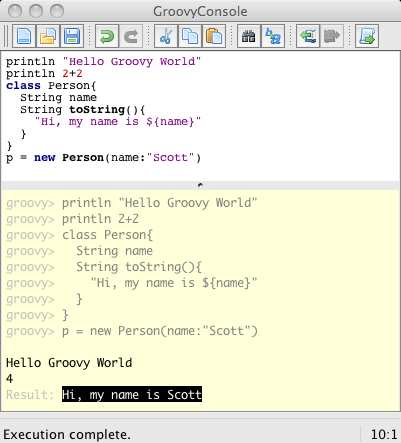
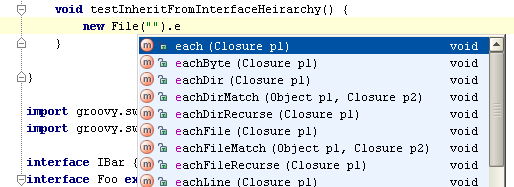
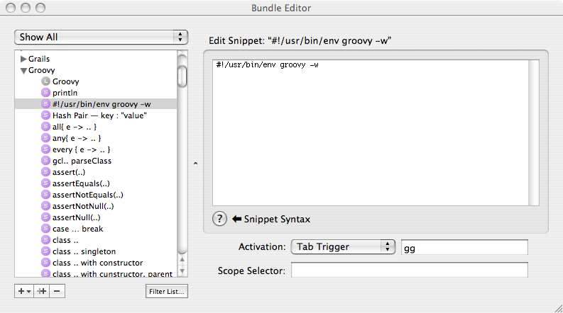

# Groovy_Recipes(Groovy食谱)

## 写在前面 {#Preface}
Groovy是一种成功的、强大的、成熟的语言，所有优秀的Java开发人员都应该在他们的工具箱中拥有它。它可以用于使单元测试更富有表现力,脚本任务,比如XML解析或倒入数据,提供扩展点在您的应用程序中,最终用户可以自定义行为与自己的脚本,用于定义特定于域的语言表达可读的和简洁的业务规则,甚至作为一个成熟的通用语言编写应用程序的端到端基于groovy的Grails web框架。

Groovy的主要目标一直是通过提供一种优雅的语言来简化开发人员的工作，这种语言由于其类似java的语法而易于学习，但是它也为所有常见的编程任务提供了有用的特性和API。 Groovy还试图通过将Java推进到21世纪来解决Java的缺点。您现在就可以使用Groovy—无需等待Java 7、8或9—并且可以从闭包中获益;属性;列表、映射和正则表达式的本机语法;和更多。

关于Groovy的书籍已经有好几本了-这是Groovy受欢迎和成熟的又一个很好的标志-但Groovy Recipes的独特之处在于，它是最快掌握语言并在任何时间查找特定语言功能信息的最快方法 ，由于其结构清晰。 但它不仅仅是一堆技巧，因为如果你真的想学习Groovy，有一个故事可以读，一个引导之手，通过以一种非常自然和友好的方式逐步地教授你更多关于这门语言的知识，从而引导你获得启迪。说实话，我甚至发现了一些我自己都不知道的技巧!

我，Groovy项目经理！

我相信您会像我一样喜欢这本书，并且将其放在桌子上，以帮助您解决日常的开发工作。 借助Groovy Recipes，您将立即完成工作。

Guillaume Laforge (Groovy项目经理)
January 3, 2008

## 第1章 介绍 {#1_Introduction}
曾几何时，Java是您编写过一次并在任何地方运行的语言。能够在一个操作系统(比如OS X)上编写代码，然后不加修改地将代码放到另一个操作系统(Windows、Solaris或Linux)上，对于习惯于等待在自己机器上运行的版本的用户来说，这是一个巨大的胜利。在使用Java之前，您的操作系统似乎总是最不受支持的，不是吗?

随着我们对Java的进一步了解，平台(Java虚拟机，或JVM)提供了WORA的魔力，而不是语言。因此, 我们正处于第二次Java革命中——Java语言与150多种其他语言共享平台[^11]。 矛盾的是，随着Java语言失去其垄断地位，Java平台变得比以往任何时候都更加重要。

作为开发人员，我们有如此多的选择，是什么让Groovy从人群中脱颖而出呢?就这一点而言，为什么首先要超越古老的Java语言呢?我可以用一句话来概括:如果Java是在21世纪编写的，Groovy就是它的样子。

Groovy是一种新的语言。与其说它取代了旧技术，不如说它加强了旧技术。它是由Java开发人员创建的，他们希望代码编写的日常体验更简单。您不再需要费力地阅读所有这些样板代码。

然而，更重要的是，这不是“嘿，伙计们，让我们从头开始重写整个应用程序，以利用这种新的语言”的软件开发方法。不，这是一种“让我们使用一种与现有代码库无缝集成的语言”的方法。

Groovy在已经安装的JVM(1.4、1.5或1.6)上运行。您可以在用于Java开发的IDE中编写Groovy。您将其部署到生产中已有的相同应用程序服务器上。实际上，在类路径中放入一个groovy.jar，就可以“启用groovy”整个应用程序。

在本书中，我希望向经验丰富的Java资深人士展示将Groovy集成到现有代码库中有多么容易。 我希望通过展示一些可以立即解决日常问题的快速Groovy代码片段来吸引繁忙的Java开发人员。(“如何解析带有名称空间的XML文档？”) 但是最重要的是，我希望吸引希望将新生命注入一个拥有十几年历史的平台的Java开发人员。 闭包，特定于领域的语言和元编程等功能现在都可以在一个平台上使用，酷炫的孩子们似乎已经抛弃了那些落后于时代的平台。

一些技术书籍仅被阅读一次。 然后，在您学习了这些材料之后，这本书就坐在架子上，集尘。 如果我的预感是正确的，那么这将是您收藏中阅读的众多书籍之一， 在您成为Groovy大师之后，对您也还是很有帮助，就像您第一次阅读它一样。

我认为您会继续读这本书的原因是，为顺序访问而编写的书中，大多数人都会阅读，也就是说，除非您已阅读第1-6章，否则第7章没有意义。 本书针对随机访问进行了优化。 我试图以一种可以一遍又一遍地达到目的的方式来进行布局，因为您知道可以快速扫描目录以找到所需的代码片段。 每个部分都是一个独立的实体，包含大量面包屑，可为您指明相关主题。

在我写这本书的过程中，在我的笔记本电脑上保存一份PDF文档已经不止一次地证明了它的价值。如果一个PDF文件可以折角，那么我的文档就几乎是破旧不堪了。能够以电子方式搜索代码片段或短语(就在文本编辑器旁边的窗口中)绝对是无价的。它改变了我编写Groovy的方式，在我开始写这本书之前，我已经有多年的Groovy经验了!

### 1.1 Groovy, Java应该是这样的 {#1_1_Groovy__the_Way_Java_Should_Be}
Groovy的设计旨在吸引Java开发人员。 Groovy最终是Java。 在JVM上运行的其他语言就是其他语言。 JRuby [^12]的重点是使现有的Ruby代码在JVM上运行。 Jython [^13]的重点是使现有的Python代码在JVM上运行。 Groovy的重点是与您现有的Java代码集成。

我并不是要减少其他语言的价值。 如果您已经有使用另一种语言实现的现有代码库，那么好处是无可否认的。 但是，它们如何使现有Java代码库的Java开发人员受益呢？ Groovy和Java非常兼容，因此在大多数情况下，您可以获取Java文件`foo.java`，并将其重命名为`foo.groovy`。 您将拥有一个完全有效（和可执行）的Groovy文件。 该技巧不适用于JVM上的任何其他邻居。

但是，除了语言级别的兼容性之外，Groovy还使您可以大大减少通常用Java编写的代码量。 例如，让我们从一个名为`Person.java`的简单Java类开始，它具有两个属性firstName和lastName。 作为Java开发人员，我们从小就受过培训，可以创建具有私有属性的公共类。 所有对属性的外部访问都通过公共获取程序和设置程序进行路由。

```java
/** Java Code */
public class Person {
  private String firstName;
  private String lastName;

  public String getFirstName() {
    return firstName;
  }

  public void setFirstName(String firstName) {
    this.firstName = firstName;
  }

  public String getLastName() {
    return lastName;
  }

  public void setLastName(String lastName) {
    this.lastName = lastName;
  }
}
```

我并不反对现有的Java实践。封装提供了许多好处。不幸的是，它带来了沉重的啰嗦税。

我们花费了二十多行代码来定义一个具有两个属性的类。 每个新属性将使我们花六行代码来获取样板获取器和设置器。 现代IDE将为我们生成必需的getter和setter的事实并不能解决问题。 它使症状仅略微减轻痛苦。

相应的Groovy类是什么样的？ 您可以将`Person.java`重命名为`Person.groovy`，然后该文件将被编译，但是这并不是Groovy的习惯用法。

Java开发人员首先注意到Groovy是它的简洁。 好的Groovy代码是Java的精髓。 您可以在Person类的Groovy版本中立即看到以下内容：
```groovy
/** Groovy Code */
class Person {
  String firstName
  String lastName
}
```

是的，仅此而已。 更好的是，它是Java类的直接替代。 将其编译为字节码，并且Groovy版本与Java版本没有区别。 您需要具有常规知识。 jar放在您的类路径中，但是就这样，您的Java代码可以无缝调用任何普通的旧Groovy对象（POGO）来代替具有相同名称和字段的POJO。

默认情况下，所有POGO都是公开的。 所有属性都是私有的。 每个字段都有getter和setter，但是这些方法是在字节码而不是源代码中自动生成的。 这会将新字段的6：1编码比率降低到正好1：1。 与Java类相比，看一下这个POGO，没有什么可以忽略的了。 它是POJO的核心，消除了所有语法噪声。

::: alert-info
**翻译者-白石-加注**
**下面代码是用Groovy编译前生成的中间java源代码**
```java
public class Person extends java.lang.Object implements groovy.lang.GroovyObject {

    private java.lang.String firstName
    private java.lang.String lastName
    private static org.codehaus.groovy.reflection.ClassInfo $staticClassInfo
    public static transient boolean __$stMC
    private transient groovy.lang.MetaClass metaClass

    @groovy.transform.Generated
    public Person() {
        metaClass = /*BytecodeExpression*/
    }

    protected groovy.lang.MetaClass $getStaticMetaClass() {
    }

    @groovy.transform.Generated
    @groovy.transform.Internal
    public groovy.lang.MetaClass getMetaClass() {
    }

    @groovy.transform.Generated
    @groovy.transform.Internal
    public void setMetaClass(groovy.lang.MetaClass mc) {
    }

    @groovy.transform.Generated
    @groovy.transform.Internal
    public java.lang.Object invokeMethod(java.lang.String method, java.lang.Object arguments) {
    }

    @groovy.transform.Generated
    @groovy.transform.Internal
    public java.lang.Object getProperty(java.lang.String property) {
    }

    @groovy.transform.Generated
    @groovy.transform.Internal
    public void setProperty(java.lang.String property, java.lang.Object value) {
    }

    @groovy.transform.Generated
    public java.lang.String getFirstName() {
    }

    @groovy.transform.Generated
    public void setFirstName(java.lang.String value) {
    }

    @groovy.transform.Generated
    public java.lang.String getLastName() {
    }

    @groovy.transform.Generated
    public void setLastName(java.lang.String value) {
    }

}
```
:::

当然，您可以慢慢地开始一个接一个地添加Java语言特性。

如果您愿意，当然可以使用分号。您可以显式地说公共类Person和私有字符串firstName。没有什么可以阻止您在源代码中使用`getter`和`setter`。

回想一下，您可以将`Person.java`从字面上重命名为`Person.groovy`，并且在语法上仍然可以正确使用Groovy。 但是，当您看到Groovy版本的简单优雅之后，为什么还要增加所有这些复杂性呢？

### 1.2 避免冗长 {#1_2_Stripping_Away_the_Verbosity}
让我们进一步探讨这个冗长的问题。考虑Java中规范的“Hello World”示例:
```java
public class HelloWorld {
  public static void main(String[] args) {
    System.out.println("Hello World");
  }
}
```

Groovy脚本隐式创建了`公共类行`以及公共静态`void main()`行，剩下的就是用于替换的代码：
```groovy
println "Hello World"
```
同样，两者都是字节码兼容和完全可互换的。Groovy示例所做的工作与Java代码完全相同，只是使用了一小部分代码行。

最后一个例子是，打开一个简单的文本文件，逐行遍历它，然后打印结果，需要多少行Java代码?根据我的计算，大约有35行代码:
```java
import java.io.BufferedReader;
import java.io.FileNotFoundException;
import java.io.FileReader;
import java.io.IOException;

public class WalkFile {
  public static void main(String[] args) {
    BufferedReader br = null;
    try {
      br = new BufferedReader(new FileReader("../simpleFile.txt"));
      String line = null;
      while ((line = br.readLine()) != null) {
        System.out.println(line);
      }
    } catch (FileNotFoundException e) {
      e.printStackTrace();
    } catch (IOException e) {
      e.printStackTrace();
    }

    finally {
      if (br != null) {
        try {
          br.close();
        } catch (IOException e) {
          e.printStackTrace();
        }
      }
    }
  }
}
```

我并不是在建议您仅考虑行数。 如果仅是您所关心的问题，则可以通过导入`java.io.*`而不是显式地导入每个类来简化此示例。 为了简洁起见，您可以将一些较短的捕获块上移到一行。 不，您对此代码应有的关注是固有的冗长性。 这是相应的Groovy代码：
```groovy
new File("../simpleFile.txt" ).eachLine{ line ->
  println line
}
```

如果您想轻松快速地处理样式规则，您可以使用一个单行程序来替代Java示例中的35行。行数只是我喜欢Groovy的一个例子—我可以看到森林就是树木，这是一个真正的好处。 我编写的Groovy代码可以直接替代Java，这是另一个事实。 由于这些原因，我喜欢将Groovy视为“可执行伪代码”。

### 1.3 Groovy:蓝色药丸还是红色药丸? {#1_3_Groovy__The_Blue_Pill_or_the_Red_Pill_}
在科幻电影《黑客帝国》中，主角neo有两种选择。如果他吃了蓝色药丸，他将回到他的日常生活。没有什么变化。然而，如果他选择了红色药丸，他将获得一个全新的世界观。他会得到超级英雄的能力。(当然，他选择了红色药丸。如果他不这么做，那就算不上一部电影。)

Groovy同时提供了两个选择。

Groovy的“蓝色药丸”使Java更容易使用。正如所示的Person类示例，Groovy可以作为Java的替代，而不需要更改Java语言的任何语义。这应该会吸引保守组织。

在“红色药丸”下，Groovy引入了与Java不同的新语言构造。 `File.eachLine`是一个闭包-这是一种无需使用`java.util.Iterator`即可迭代文件的全新方法。 考虑将闭包包含在Java 1.8中，但是现在就在这里。 这应该使那些羡慕其他语言的炫酷功能的人们所希望，他们希望Java可以做类似的事情。

也许James Strachan在2003年8月29日说得最好，当时他向全世界介绍了他一直在做的一个小型开源项目。在一篇名为“Groovy: Java平台新动态语言的诞生”的博客中，他这样写道:

像Ruby和Python这样的动态类型语言似乎越来越受欢迎。我仍然不相信我们应该在不久的将来都转向动态类型语言——但是，我认为没有理由不能同时使用动态和静态类型语言，并选择最适合这项工作的工具。

“我一直想使用一种很酷的动态类型脚本语言，专门针对Java平台。有很多选择，但是没有一个是完全正确的，特别是从一个顽固的Java程序员的角度来看。Python和Ruby都很酷——尽管它们本身就是平台。我更喜欢一种动态语言，它构建在所有groovy Java代码和JVM之上。

因此，我一直在思考，Java平台是否应该从头开始设计自己的动态语言，以便更好地处理现有代码，创建/扩展普通Java可以使用的对象，反之亦然。Python/Jython[是]一个非常好的基础——添加Ruby中的一些好东西，可能还会添加一些AOP特性，这样我们就可以有一种真正groovy的新语言来编写Java对象脚本、编写测试用例，谁知道呢，甚至可以用它进行真正的开发。”

这就是Groovy的名字和世界观的由来。Groovy是一种具有您希望它具有的特性的语言。传统的Java开发变得更容易了，还是一种将其他语言的所有这些令人兴奋的新特性都放到JVM上的方法?答案是两者皆有。

### 1.4 路线图 {#1_4_Road_Map}
您可以通过多种方式阅读这本书。 每章都专注于特定主题，例如`XML`，`文件I/O`，`Web服务`或`元编程`。 要全面了解该主题以及Groovy如何为您提供帮助，只需像阅读其他任何书籍一样，从头至尾阅读本章即可。

但是，如果您急着需要解决某个特定问题，那么目录就是您的朋友。 每章分为解决特定问题或描述特定语言功能的部分：“列出目录中的所有文件”，“读取文件的内容”，“将文本写入文件”等等。 每个部分都以一个代码块开头，您可以键入它来开始您的业务。 如果您需要更多说明，请继续阅读。 我试图使每个部分尽可能独立。 如果它使用其他地方描述的功能，则应以合理的方式明智地交叉引用各节
无论您在哪里潜水，都感到舒适。

第2章，入门，第24页，介绍了如何安装Groovy，如何编译Groovy代码以及如何启用Groovy启用文本编辑器或IDE。

第3章，Groovy的新知识，第41页是“红色药丸”一章，向有经验的Java开发人员展示Groovy带给聚会的所有有趣的新功能：鸭子类型，Groovy真值和闭包。

第4章Java和Groovy集成是一个“蓝色药丸”章节，第69页演示了如何将Groovy与现有Java基础结构集成。

第5章，从命令行获取Groovy。在第86页上，您将看到一个您可能认为Java不适合的地方：命令行。 Groovy对shell脚本进行了替换，使您可以利用所有熟悉的Java习惯用法和库来执行系统管理任务。

第6章，文件技巧。第100页，展示了使用Groovy处理文件系统的不同方法：列出目录中的文件，读取文件，进行复制等等。

第7章，XML解析。第116页，展示了在Groovy中使用XML是多么容易。您可以解析XML文档，轻松获取元素和属性。

第8章，编写XML。 第136页上的“显示XML硬币的另一面：写出XML文档”。 您将学到所有内容，从简单的XML封送处理到创建带有声明，处理指令，CDATA块等的复杂XML文档。

第9章，Web服务，第152页，使用远程系统。我们将探讨如何进行SOAP调用、RESTful调用、XML-RPC调用等等。

第10章，元编程，181页，探索了在JVM上编程的一种新思路。动态地发现现有类、字段和方法可以快速地动态地创建新类和方法，并在运行时向现有类添加新功能。

第11章，Grails的使用，第200页介绍了一个功能全面的web框架，它构建在熟悉的Java库(如Spring和Hibernate)之上，但是它使用Groovy作为动态粘合剂将所有东西粘在一起。

Chapter 12, Grails and Web Services, on page 233 shows how to use Grails for more than returning simple HTML. We'll look at RESTful web services, JSON web services, Atom feeds, podcast feeds, and more.

### 1.5 致谢 {#1_5_Acknowledgments}
再次感谢Dave Thomas和Andy Hunt创建了实用书架。 这是我第二本与他们在一起的书，作为作者和书名的狂热读者，我对他们将开发者与出版公司友好的组合在一起感到惊喜。

这也是我第二次与Daniel Steinberg担任编辑。 他采用了我半透明的观点，即编写代码优先的Groovy书，并且千方百计地哄骗了您现在所掌握的东西。 他用一句话对“嗯？”，“为什么？”和“真的？”的评论温和地推动了我，在我太简洁的地方上扩大想法，在太过临床的地方给散文加热，并提供了理由和我的真实观点。 大括号和分号还不够的世界经验。 和他一起工作真是一种快乐，我真的很期待我们的下一个项目。

衷心感谢您对我的技术评审无所畏惧。 他们敏锐的眼睛和敏锐的舌头使我保持谦卑，我的代码紧绷。 Groovy项目负责人Guillaume Laforge和Grails项目负责人Graeme Rocher的评论如您所期望的那样精明和及时。 项目提交者Jeff Brown，Dierk Koenig和Jason Rudolph慷慨地分享了他们的内部知识，而David Geary，Ken Kousen，Joe McTee和Greg Ostravich确保我的示例对于那些不懂该语言的人来说是可理解的。 特别要感谢我的好朋友Venkat Subramaniam，我们开始一起编写这本书，然后很快意识到两本书比一本书要好。 他在《学习Groovy》中对语言的战略理解是对我在这里采取的战术方法的完美补充。

非常感谢No Fluff，Just Stuff研讨会研讨会的创始人Jay Zimmerman。 他很早就意识到Groovy对Java开发社区是什么，并且从那时起就一直积极支持它。 在Graeme，Guillaume和Alex Tkachman接管G2One之前，他为该语言的专业开发付费。 Groovy和Grails的演讲在NFJS阵容中得到了突出体现，而2G体验（第一个专门针对Groovy和Grails的北美会议）则继续表明他坚定地致力于扩大该语言的吸引力。 自2003年以来，我一直与杰伊密切合作，从来没有一个沉闷的时刻。

最后，我的家人应该得到我最深的谢意。 尽管他们常常首当其冲地受到我奇怪的写作时间表和永远存在的截止日期的困扰，但他们却很少抱怨它-至少对我来说不是。 我的妻子金（Kim）付出了看似毫无底线的耐心和鼓励，但也并没有引起人们的注意。 在《 Groovy Recipes》写作期间，她最常问的两个问题是“您是否已经完成这本书了？”和“您什么时候打算写一些我想阅读的东西？”我可以对一个人回答“是……最终”。 对方则表示“很快...我希望”。 年轻的克里斯托弗（Christopher）十分支持写作过程，只要它不妨碍我们诺曼·洛克威尔（Norman Rockwellian）往返幼儿园或我们在任天堂Wii上的时间。 （我确定没有这样做。）年轻的伊丽莎白现在步步高大，够到家里爸爸的门把手，要确保我走得太久没有灿烂的笑容和一两个传染性的傻笑。。 你们每个人都很爱。

## 第2章 开始 {#2_Getting_Started}
安装Groovy与安装Ant、Tomcat或Java本身一样简单——解压缩发行版，创建环境变量，并确保二进制文件位于您的路径中。Groovy就绪后，您可以以任何方式运行它——编译或未编译，从shell或GUI控制台，或从命令行或web服务器。如果您有两分钟(或者更少)的时间，那么您就有足够的时间开始尝试Groovy。在您说“下一代Java开发”之前，本章将让您启动并运行。

### 2.1 安装Groovy {#2_1_Installing_Groovy}
1. 从`http://groovy.codehaus.org`下载并解压groovy.zip。
2. 创建`GROOVY_HOME`环境变量。
3. 将`$GROOVY_HOME/bin`添加到`PATH`中。

运行Groovy所需的所有东西都包含在一个ZIP文件中—好吧，除了JDK之外的所有东西。Groovy 1.x运行在java 1.4、1.5和1.6的所有现代版本上。如果您正在运行较老版本的Java，可以通过`http://java.sun.com`获得更新。如果不知道安装了哪个版本的Java，请在命令提示符中键入`java -version`:
```bash
$ java -version
===>
java version "1.5.0_13"
Java(TM) 2 Runtime Environment, Standard Edition (build 1.5.0_13-b05-237)
Java HotSpot(TM) Client VM (build 1.5.0_13-119, mixed mode, sharing)
```

要利用Java 1.5语言的特性，比如Groovy中的注释和泛型，可能不需要说，您至少需要一个1.5 JDK。

Groovy在每一代JVM上运行的速度都明显更快，因此，除非有其他原因阻碍您，否则我建议您尽可能在最新的、最好的Java版本上运行Groovy。

同样，我建议您尽可能运行Groovy的最新版本。Groovy 1.0于2007年1月发布。下一个主要版本Groovy 1.5于2007年12月发布。稍后您将看到如何确定正在运行的Groovy版本。

Groovy开发团队煞费苦心地确保基本语法和接口在Groovy 1.0和1.5之间保持一致。版本号的增加意味着两件事:Java 5语言特性的增加，以及稳定性和原始性能的巨大飞跃。如果您仍然在运行Groovy 1.0，那么本书中的大多数示例将保持不变。`ExpandoMetaClass`类是在Groovy 1.5中添加的，但是元编程从一开始就是该语言不可或缺的一部分。在第10章元编程(第181页)中，没有特别使用`ExpandoMetaClass`类的例子在Groovy的任何一个版本中都将以相同的方式运行。底线是所有的Groovy1.x的版本应该可以合理地互换。打破语法的更改保留给Groovy 2.x。

我已经包含了关于如何安装Groovy的信息，其中有一节是关于Windows的细节，另一节是关于Unix、Linux、Mac OS X家族的细节。

**检查Groovy版本**
```bash
$ groovy -version
Groovy Version: 1.5.0 JVM: 1.5.0_13-119
```
您可以通过在命令提示符中键入`groovy -version`来判断已经安装了哪个版本的Groovy。如这里所示，这个命令还显示了Java版本。

**在Unix、Linux和Mac OS X上安装Groovy**
从`http://groovy.codehaus.org`下载最新的Groovy ZIP文件。 将其解压缩到您选择的目录。 我更喜欢`/opt`。 您将最终得到一个groovy目录，该目录的末尾带有版本号，例如`groovy-1.5`。 我喜欢创建一个不包含特定版本号的符号链接：`ln -s groovy-1.5 groovy`。 这使我可以轻松便捷地在Groovy的版本之间切换。

由于ZIP文件无法保留Unix文件的权限，因此请确保在bin目录中切换并使其可执行：
```bash
$ chmod a+x *
```
目录到位后，下一步需要创建GROOVY_HOME环境变量。 这样做的步骤因SHELL而异。 对于Bash，您可以在主目录中编辑`.bash_profile`或`.bash_rc`文件。 添加以下内容：
```bash
### Groovy
GROOVY_HOME=/opt/groovy
PATH=$PATH:$GROOVY_HOME/bin
export GROOVY_HOME PATH
```

为了使这些更改生效，您需要重新启动终端会话。 或者，您可以键入`source .bash_profile`以将更改加载到当前会话中。 您可以键入`echo $GROOVY_HOME`确认您的更改已生效：
```bash
$ echo $GROOVY_HOME
/opt/groovy
```

要验证Groovy命令是否在路径中，请键入`groovy -version`。 如果看到类似的消息，则说明您已经成功安装了Groovy：
```bash
Groovy Version: 1.5.0 JVM: 1.5.0_13-119
```
**在Windows上安装Groovy**
从`http://groovy.codehaus.org`下载最新的Groovy ZIP文件。 将其解压缩到您选择的目录。 我更喜欢`c:\opt`。 您将最终得到一个groovy目录，该目录的末尾带有版本号，例如`groovy-1.5`。 尽管您可以将其重命名为更简单的名称，例如groovy，但我发现将版本号保留在目录名称上有助于减少将来的升级。

目录到位后，下一步需要创建`GROOVY_HOM`E环境变量。 对于Windows XP，请转到“控制面板”，然后双击“系统”。 单击高级选项卡，然后单击窗口底部的环境变量。 在新窗口中，单击“系统变量”下的“新建”。 使用`GROOVY_HOME`作为变量名称，并使用`c:\opt\groovy-1.5`作为变量值。

要将Groovy添加到路径，请找到`PATH`变量，然后双击它。 将`;%GROOVY_HOME%\bin`添加到变量的末尾。 （不要忘记前导的分号。）单击“确定”以退出所有对话框。 为了使这些更改生效，您需要退出或重新启动已打开的所有命令提示符。 打开一个新的命令提示符，然后键入set以显示所有环境变量的列表。 确保出现`GROOVY_HOME`。

要验证Groovy命令是否在路径中，请键入`groovy -version`。 如果看到类似的消息，则说明您已经成功安装了Groovy：
```bash
Groovy Version: 1.5.0 JVM: 1.5.0_13-119
```

### 2.2 运行Groovy脚本 {#2_2_Running_a_Groovy_Script}
```bash
// hello.groovy
println "Hello Groovy World"
$ groovy hello.groovy
$ groovy hello
===> Hello Groovy World
```

有经验的Java开发人员注意到Groovy的第一件事就是他们可以运行代码而无需先编译。 您只需键入即可—与Java类相比，更像是编写JSP页面。 这可能会使您相信Groovy是一种解释语言。 实际上，Groovy就像Java一样被编译成字节码。 groovy命令既编译又运行您的代码。 但是，您不会在任何地方找到生成的.class文件。 该字节码在内存中创建，并在运行结束时被丢弃。 （如果要保留这些类文件，请参阅下一页的2.3节，编译Groovy（groovyc）。）

动态字节码编译意味着Groovy可以提供交互式shell。 键入命令并立即执行命令是尝试该语言的最快方法。 有关更多信息，请参见下一页第2.4节，运行Groovy Shell（groovysh）。 缺点当然是shell关闭后代码就消失了。 该shell非常适合进行实验，但是如果您想做些除`quick-and-dirty快速和肮脏`的操作以外的其他方法，则需要创建Groovy脚本。

要创建Groovy脚本，请创建一个名为`hello.groovy`的新文本文件。 添加以下行：

保存文件，然后在命令提示符下键入`groovy hello.groovy`。 由于给了它一个`.groovy`文件扩展名，因此您也可以只键入`groovy hello`。恭喜！ 您现在正式是Groovy开发人员。 欢迎来到俱乐部。

有关运行未编译Groovy的更多信息，请参见第5章，第86页命令行中的Groovy。

### 2.3 编译Groovy {#2_3_Compiling_Groovy}

```bash
$ groovyc hello.groovy

// on Unix, Linux, and Mac OS X
$ java -cp $GROOVY_HOME/embeddable/groovy-all-1.5.0.jar:. hello
===> Hello Groovy World

// on Windows
$ java -cp %GROOVY_HOME%/embeddable/groovy-all-1.5.0.jar;. hello
===> Hello Groovy World
```

如果您只想运行一个快速脚本，让groovy命令动态地编译您的代码是很有意义的。 但是，如果您试图将Groovy类与旧版Java类混合在一起，则groovyc编译器是唯一的选择。 只要Groovy JAR位于类路径上，您的Java类就可以像Groovy类可以调用Java一样容易地调用Groovy。

有关编译Groovy和与Java类集成的更多信息，请参阅第69页第4章，Java和Groovy集成。

### 2.4 运行Groovy Shell (groovysh) {#2_4_Running_the_Groovy_Shell}

```bash
$ groovysh
Groovy Shell (1.5.0, JVM: 1.5.0_13-119)
Type 'help' or '\h' for help.
----------------------------------------
groovy:000> println "Hello Groovy World"
Hello Groovy World
===> null
```

Groovy shell允许您交互式地使用Groovy。不需要创建文件或编译任何东西—只需在命令提示符中键入`groovysh`，并开始键入诸如`println "Hello Groovy World"`之类的Groovy语句。每次按回车键，结果都会出现。要退出Groovy shell，键入`exit`。

`null(空)`消息没有什么好担心的。这只是意味着您键入的最后一个命令没有返回值。如果您键入类似于`2+2`的内容，则消息将是语句4的结果。Groovy中的方法的最后一行是一个隐式的返回语句，Groovy shell的行为也是一样的:
```bash
groovy:000> 2+2
===> 4
groovy:000> s = "John"
===> John
groovy:000> s.toUpperCase()
===> JOHN
groovy:000> s.each{println it}
J o h n
===> John
```

`toUpperCase()`方法直接来自`java.lang.String`类。有关每个闭包的更多信息，请参见第59页第3.14节“迭代”。

Groovy shell存储您键入的所有内容的历史记录—即使在您退出shell之后也是如此。您可以使用向上和向下箭头键快速地重新输入命令或纠正胖手指语法错误。

提示符处的`:000`表示在不运行的情况下输入了多少行Groovy代码。例如，您可以在Groovy shell中动态定义一个类并立即使用它。(当然，一旦您退出shell，类就会消失。)
```bash
groovy:000> class Person{
groovy:001> String name
groovy:002> String toString(){
groovy:003> "Hi! My name is ${name}"
groovy:004> }
groovy:005> }
===> true
groovy:000> p = new Person(name:"John")
===> Hi! My name is John
```

你注意到两次都没有看到null吗?第一次得到true时——这是Groovy shell的一种说法，“好的，我可以为您定义这个类。第二次看到类的toString输出。冒着听起来有点厚颜无耻的风险，您将很快学会只在关心Groovy shell必须要说什么的时候才关注它的结果……

::: alert-info
**问题:为什么Groovy Shell会忘记变量?**
```bash
groovy:000> String s = "Jane"
groovy:000> println s
===>
ERROR groovy.lang.MissingPropertyException:
No such property: s for class: groovysh_evaluate
groovy:000> s = "Jane"
groovy:000> println s
===> Jane
```

Groovy shell在类型变量方面有一个奇怪的失忆案例。使用数据类型或def声明的变量会立即被忘记。在shell会话期间，将记住一个非类型化变量。当将代码从脚本复制到shell时，这可能会引起很大的混淆——在脚本中代码是正常的，而在shell中代码是错误的。

要理解这种明显的差异，您需要更好地理解Groovy shell是如何实现的。(如果您觉得您的眼睛开始变得呆滞，请将类型声明从shell变量中去掉，然后继续……)

Groovy shell是`groovy.lang.Groovyshell`的一个交互式实例。这个类还支持第5.10节中讨论的`evaluate`命令，即第95页上的求值字符串。每个GroovyShell都在`groovy.lang.Binding`中存储本地声明的变量(比如s="Jane")。

这个绑定对象本质上是“天空中的大hashmap”。当您键入`println s`时，shell会在后台调用`binding.getVariable("s")`。使用数据类型声明的变量(String s ="Jane")不会存储在绑定中，因此在您下一次请求它们时将无法找到它们。

有关GroovyShell和绑定对象的更多信息，请参见第188页第10.4节，发现类的方法。
:::
**图2.1: Groovy控制台**


**动态查找类方法**
```groovy
groovy:000> String.methods.each{println it}
public int java.lang.String.hashCode()
public volatile int java.lang.String.compareTo(java.lang.Object)
public int java.lang.String.compareTo(java.lang.String)
public boolean java.lang.String.equals(java.lang.Object)
public int java.lang.String.length()
```

您可以使用Groovy shell快速发现给定类上的所有方法。例如，假设您想查看所有的String方法。前面的例子很有用。

直接向类询问方法的好处是它始终是最新的-另一方面，Javadocs可能与实时代码不同步。 有关类自省的更多信息，请参阅第181页第10章，元编程。

在本节的开头，我们讨论了null消息，如果命令没有输出，则可以安全地忽略该null消息。 不幸的是，这是shell输出的另一个例子，它的噪声大于信息。

成功显示类中的所有方法后，命令`String.methods.each{println it}`返回错误：
```groovy
groovy:000> String.methods.each{println it}
...
public final native void java.lang.Object.notify()
public final native void java.lang.Object.notifyAll()
ERROR groovy.lang.MissingMethodException:
No signature of method:
org.codehaus.groovy.tools.shell.Groovysh$_closure1.call()
is applicable for argument types:
...
```

还记得我说过的，只有当您关心Groovy shell的内容时，您才会很快学会关注它的结果吗？ 在显示所有方法之后，shell尝试执行`String.methods`调用的结果（并且可能会失败，我可能会添加）。 由于我已经习惯了，所以这个错误不会让我感到困扰。 我无视它，因为我知道它将要发生，而且毕竟这是临时代码。 如果错误消息使您感到困扰，则可以在调用末尾添加一条语句，该语句可以正确求值，例如`String.methods.each{println it}; "DONE"`。 您将输入一些额外的字符，但同时也避免了shel的一些杂音。

**获取帮助**
```bash
groovy:000> help
For information about Groovy, visit:
http://groovy.codehaus.org
Available commands:
help (\h) Display this help message
? (\?) Alias to: help
exit (\x) Exit the shell
quit (\q) Alias to: exit
import (\i) Import a class into the namespace
display (\d) Display the current buffer
clear (\c) Clear the buffer
show (\S) Show variables, classes or imports
inspect (\n) Inspect a variable or the last result
with the GUI object browser
purge (\p) Purge variables, classes, imports or preferences
edit (\e) Edit the current buffer
load (\l) Load a file or URL into the buffer
. (\.) Alias to: load
save (\s) Save the current buffer to a file
record (\r) Record the current session to a file
history (\H) Display, manage and recall edit-line history
alias (\a) Create an alias
set (\=) Set (or list) preferences
For help on a specific command type:
help command
```
在Groovy shell中键入`help`时，会显示一些隐藏的好东西。`import`的行为与它在Java源代码中的行为一样，允许您使用其他包中的类。如果您正在定义一个很长的类，并且搞砸了，`clear`将返回到一个:000状态。要清除整个会话，输入`purge`可以使您回到最初启动shell时的状态。`record`将您键入的所有内容保存到一个文件中，允许您稍后“回放”。`history`显示了shell记住您输入的内容。

### 2.5 运行Groovy控制台（groovyConsole） {#2_5_Running_the_Groovy_Console}
```bash
$ groovyConsole
```

除了基于文本的Groovy Shell，Groovy还提供了图形控制台。 （请参阅第31页的图2.1。）在窗口的上半部分键入命令。 选择`Script > Run`，然后在下半部分查找结果。 （选择`Script > Run Selection`，可以将焦点缩小到突出显示的代码行。）

在第28页运行Groovy Shell (groovysh)的第2.4节中讨论的Groovy Shell吸引了命令行牛仔。 Groovy控制台旨在吸引更精细的GUI用户——那些已经习惯了`剪切/复制/粘贴`,`撤消/重做`等细节的用户。 控制台不能替代真正的文本编辑器，但是它比shell提供了更多的便利。例如，如果您有一个现有的Groovy脚本，您可以在控制台中通过选择`File > Open`来打开它。您还可以通过选择`File > Save`保存Shell会话。

您甚至有一个图形对象浏览器来更深入地查看给定类上可用的字段和方法。控制台运行的最后一个对象是Person的实例。在下面的页面中，选择`Script > Inspect Last to snoop`，如图2.2所示。

### 2.6 在Web服务器上运行Groovy (groovlet) {#2_6_Running_Groovy_on_a_Web_Server}
```bash
1. Copy $GROOVY_HOME/embeddable/groovy.jar to WEB-INF/lib.
2. Add groovy.servlet.GroovyServlet to WEB-INF/web.xml.
3. Place your Groovy scripts wherever you'd normally place your JSP files.
4. Create hyperlinks to your Groovy scripts.
```

在web应用程序中添加一个Groovy servlet可以让您在服务器上运行未编译的Groovy脚本。

**图2.2: Groovy对象浏览器**


Groovy servlet的行为类似于命令行上的groovy命令-它可以动态编译您的`.groovy`脚本。

首先，将groovy.jar从`$GROOVY_HOME/embedded`复制到JEE应用程序的`WEB-INF/lib`目录中。 Groovy启用了整个Web应用程序。 要动态运行Groovlets，请将`groovy.servlet.GroovyServlet`条目添加到`WEB-INF/web.xml`部署描述符中。 您可以映射所需的任何URL模式，但是通常使用`*.groovy`进行映射。
```xml
<web-app version="2.4"
         xmlns="http://java.sun.com/xml/ns/j2ee"
         xmlns:xsi="http://www.w3.org/2001/XMLSchema-instance"
         xsi:schemaLocation="http://java.sun.com/xml/ns/j2ee web-app_2_4.xsd">
  <servlet>
    <servlet-name>Groovy</servlet-name>
    <servlet-class>groovy.servlet.GroovyServlet</servlet-class>
  </servlet>
  <servlet-mapping>
    <servlet-name>Groovy</servlet-name>
    <url-pattern>*.groovy</url-pattern>
  </servlet-mapping>
  <!-- The Welcome File List -->
  <welcome-file-list>
    <welcome-file>index.jsp</welcome-file>
  </welcome-file-list>
</web-app>
```

**图2.3：友好的Groovlet**


现在，您可以将任何未编译的Groovy脚本拖放到您的Web目录中，它将运行。 例如，在Web应用程序目录的根目录中创建一个名为`hello.groovy`的文件。 添加以下行：
```groovy
println "Hello ${request.getParameter('name')}"
```

这个Groovlet回显了您通过name参数传递的任何内容。 要进行测试，请在网络浏览器中访问`http://localhost:8080/g2/hello.groovy?name=Scott`。 友好的Groovlet应该以个性化的方式说“Hello”。(参见图2.3。)

您可以像创建任何其他文件类型一样轻松地创建指向Groovlets的超链接：
```xml
<a href="http://localhost:8080/g2/hello.groovy?name=Scott" >Say Hello</a>
```

Groovlet还可以处理表单提交。注意，表单方法是GET，字段名是name。这将创建您手动输入并在前面放入超链接的相同URL。对于稍微高级一点的Groovlet，请参阅第185页的第10.3节，检查字段是否存在。
```xml
<html>
  <body>
    <form method="get" action="hello.groovy">
      Name: <input type="text" name="name" />
      <input type="submit" value="Say Hi" />
    </form>
  </body>
</html>
```

**Web服务器状态检查Groovlet**
```groovy
// stats.groovy
html.h1("Disk Free (df -h)")
html.pre('df -h'.execute().text)
html.hr()
html.h1("IP Config (ifconfig)" )
html.pre('ifconfig'.execute().text)
html.hr()
html.h1("Top (top -l 1)")
html.pre('top -l 1'.execute().text)
```

这是我已部署到许多Web服务器的常见Groovlet。 它使我一眼就能看到一些关键统计数据，这些统计数据可帮助我判断服务器的运行状况-可用磁盘空间量，网络设置，服务器上正在运行的当前进程等。

通常我会ssh到机器中，并在命令提示符中输入这些不同的命令。相反，我可以访问`http://localhost:8080/stats`。然后得到相同的结果。 任何通常手工输入的命令都可以用引号括起来，并由Groovy代表我执行。(有关这方面的更多信息，请参见第89页第5.4节，运行Shell命令。)接下来，我可以使用每个Groovlet都可用的名为`html `的MarkupBuilder将这些结果封装到HTML片段中。(有关这方面的更多信息，请参见第146页第8.13节，动态创建HTML)。

下面是生成的HTML的样子……

```xml
<h1>Disk Free (df -h)</h1>
<pre>Filesystem Size Used Avail Capacity Mounted on
/dev/disk0s2 149Gi 113Gi 36Gi 76% /
devfs 107Ki 107Ki 0Bi 100% /dev
fdesc 1.0Ki 1.0Ki 0Bi 100% /dev
map -hosts 0Bi 0Bi 0Bi 100% /net
map auto_home 0Bi 0Bi 0Bi 100% /home
</pre>
<hr />
<h1>IP Config (ifconfig)</h1>
<pre>lo0: flags=8049&lt;UP,LOOPBACK,RUNNING,MULTICAST&gt; mtu 16384
inet6 fe80::1%lo0 prefixlen 64 scopeid 0x1
inet 127.0.0.1 netmask 0xff000000
inet6 ::1 prefixlen 128
gif0: flags=8010&lt;POINTOPOINT,MULTICAST&gt; mtu 1280
stf0: flags=0&lt;&gt; mtu 1280
en0: flags=8863&lt;UP,BROADCAST,SMART,RUNNING,SIMPLEX,MULTICAST&gt; mtu 1500
```

…但是，更重要的是，在下一页的图2.4中，您可以看到它在浏览器中是什么样子的。

groovlet并不意味着可以替代功能齐全的web框架。它们只是一些脚本，您可以通过命令行在web服务器上轻松地运行它们。有关在web框架中使用Groovy的示例，请参阅Grails和Gorm两章。

**图2.4：显示服务器统计信息的Groovlet**


### 2.7 Groovy结合Eclipse {#2_7_Groovy___Eclipse}
```
http://groovy.codehaus.org/Eclipse+Plugin
```
如果您使用的是Eclipse 3.2或更高版本，则有一个Groovy插件提供与Java相同的IDE支持（代码完成，语法突出显示，调试）。

**安装插件**

要安装`Groovy/Eclipse`插件，请遵循以下步骤：

1. 选择 `Help > Software Updates > Find and Install > Search for New Features`.
2. 点击 `New Remote Site`.
3. 在名称字段中输入`Groovy`。
4. 在URL字段中输入`http://dist.codehaus.org/groovy/distributions/update/`，然后单击“确定”。
5. 检查Groovy存储库，然后单击Finish。
6. 在“选择要安装的功能”下选择Groovy，然后单击“Next”。
7. 阅读协议，然后单击“Next”。
8. 设置默认位置，然后单击完成。
9. 如果您收到有关该插件未签名的警告，请不要担心。 单击安装。

重新启动Eclipse，您应该已经准备好使用Groovy。

**开始一个新的Groovy项目**
要开始一个新的Groovy项目，请按照下列步骤操作：

1. 选择 `File > New > Project`.
2. 选择 `Java Project`, 然后点击 `Next`.
3. 在项目名称字段中输入您选择的名称。
4. 选择“Create Separate Source and Output Folders”，然后单击“Finish”。
5. 在包资源管理器中，右键单击您的项目，然后选择 `Groovy > Add Groovy Nature`.

最后，您将需要更改已编译的Groovy代码的输出文件夹：

1. 在包资源管理器中，右键单击您的项目，然后选择 `Build Path > Configure Build Path`.
2. 将默认输出文件夹从`bin`更改为`bin-groovy`。

### 2.8 Groovy结合IntelliJ IDEA {#2_8_Groovy___IntelliJ-IDEA}
```
http://www.jetbrains.com/idea/
```
"IntelliJ IDEA 7.x"提供了对Groovy和Grails的本机支持。代码完成、语法突出显示、重构支持等等都是标准特性。(参见下面页面的图2.5)。如果默认情况下没有安装JetGroovy插件，请查找它。

如果你有“IntelliJ IDEA 6.x”。GroovyJ插件至少会给您提供基本的语法高亮显示。要安装它，打开`Preferences`屏幕，然后单击`Plugins`按钮。从列表中选择`GroovyJ`，然后单击OK。

**图2.5：IntelliJ IDEA 7.x中的代码完成**


### 2.9 Groovy结合TextMate {#2_9_Groovy___TextMate}
```
http://macromates.com/
http://macromates.com/wiki/Main/SubversionCheckout
http://groovy.codehaus.org/TextMate
http://www.e-texteditor.com/
```

TextMate是Mac上流行的文本编辑器。 它通过其插件系统提供可插拔语言支持。

从Macromates Subversion存储库中检出Groovy包(Groovy.tmbundle)。将文件复制到`~/Library/Application Support/TextMate/bundle`。重启TextMate, Groovy应该出现在Bundles菜单下。

Groovy TextMate wiki页面列出了其他与Groovy相关的包，包括Grails和GANT (Ant的Groovy实现)的包。

您还可以使用Bundle Editor从零开始创建自己的包。选择`Bundle > Bundle Editor > Show Bundle Editor`。(参见下一页的图2.6)。

Windows用户可能想要签出` E Text Editor`。它承诺“TextMate在Windows上的强大功能”。TextMate捆绑包也应该在` E Text Editor`中工作。

**图2.6：TextMate的套件编辑器**



### 2.10 Groovy在此处插入您的IDE或文本编辑器 {#2_10_Groovy____Insert_Your_IDE_or_Text_Editor_Here_}

```
http://groovy.codehaus.org/Other+Plugins
```

几乎所有现代IDE和文本编辑器都具有Groovy支持。 有关NetBeans，XCode，TextPad，SubEthaEdit，Vim，Emacs等的详细信息，请查看Groovy Wiki上的Other Plugins页面。

另一个很好的信息来源是您友好的社区搜索引擎。 例如，在搜索引擎中输入`groovy xcode`，`groovy vi`或`groovy [您的IDE]`会产生很多来自成功博客（当然，也包括失败）的人们的点击量。

[^11]: http://www.robert-tolksdorf.de/vmlanguages.html
[^12]: http://jruby.codehaus.org/
[^13]: http://www.jython.org/
[^14]: http://radio.weblogs.com/0112098/2003/08/29.html
